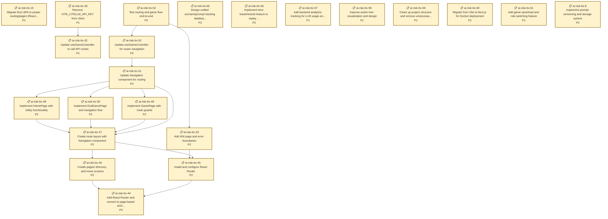

```mermaid
graph TD;
    ai-risk-ttx-15["📋 ai-risk-ttx-15<br/>Migrate from SPA to proper routing/pages (React...<br/>P1"]
    style ai-risk-ttx-15 fill:#fff3cd,stroke:#856404,stroke-width:2px
    ai-risk-ttx-32["📋 ai-risk-ttx-32<br/>Update useGameController to call API routes<br/>P1"]
    style ai-risk-ttx-32 fill:#fff3cd,stroke:#856404,stroke-width:2px
    ai-risk-ttx-33["📋 ai-risk-ttx-33<br/>Remove VITE_LITELLM_API_KEY from client<br/>P1"]
    style ai-risk-ttx-33 fill:#fff3cd,stroke:#856404,stroke-width:2px
    ai-risk-ttx-44["📋 ai-risk-ttx-44<br/>Add React Router and convert to page-based arch...<br/>P2"]
    style ai-risk-ttx-44 fill:#fff3cd,stroke:#856404,stroke-width:2px
    ai-risk-ttx-45["📋 ai-risk-ttx-45<br/>Install and configure React Router<br/>P2"]
    style ai-risk-ttx-45 fill:#fff3cd,stroke:#856404,stroke-width:2px
    ai-risk-ttx-46["📋 ai-risk-ttx-46<br/>Create pages/ directory and move screens<br/>P2"]
    style ai-risk-ttx-46 fill:#fff3cd,stroke:#856404,stroke-width:2px
    ai-risk-ttx-47["📋 ai-risk-ttx-47<br/>Create route layout with Navigation component<br/>P2"]
    style ai-risk-ttx-47 fill:#fff3cd,stroke:#856404,stroke-width:2px
    ai-risk-ttx-48["📋 ai-risk-ttx-48<br/>Implement HomePage with lobby functionality<br/>P2"]
    style ai-risk-ttx-48 fill:#fff3cd,stroke:#856404,stroke-width:2px
    ai-risk-ttx-49["📋 ai-risk-ttx-49<br/>Implement GamePage with route guards<br/>P2"]
    style ai-risk-ttx-49 fill:#fff3cd,stroke:#856404,stroke-width:2px
    ai-risk-ttx-50["📋 ai-risk-ttx-50<br/>Implement EndGamePage and navigation flow<br/>P2"]
    style ai-risk-ttx-50 fill:#fff3cd,stroke:#856404,stroke-width:2px
    ai-risk-ttx-51["📋 ai-risk-ttx-51<br/>Update Navigation component for routing<br/>P2"]
    style ai-risk-ttx-51 fill:#fff3cd,stroke:#856404,stroke-width:2px
    ai-risk-ttx-52["📋 ai-risk-ttx-52<br/>Update useGameController for router navigation<br/>P2"]
    style ai-risk-ttx-52 fill:#fff3cd,stroke:#856404,stroke-width:2px
    ai-risk-ttx-53["📋 ai-risk-ttx-53<br/>Add 404 page and error boundaries<br/>P2"]
    style ai-risk-ttx-53 fill:#fff3cd,stroke:#856404,stroke-width:2px
    ai-risk-ttx-54["📋 ai-risk-ttx-54<br/>Test routing and game flow end-to-end<br/>P2"]
    style ai-risk-ttx-54 fill:#fff3cd,stroke:#856404,stroke-width:2px
    ai-risk-ttx-55["📋 ai-risk-ttx-55<br/>Design unified scenario/prompt tracking databas...<br/>P2"]
    style ai-risk-ttx-55 fill:#fff3cd,stroke:#856404,stroke-width:2px
    ai-risk-ttx-56["📋 ai-risk-ttx-56<br/>Implement time-travel/rewind feature to replay ...<br/>P2"]
    style ai-risk-ttx-56 fill:#fff3cd,stroke:#856404,stroke-width:2px
    ai-risk-ttx-57["📋 ai-risk-ttx-57<br/>Add backend analytics tracking for LLM usage an...<br/>P1"]
    style ai-risk-ttx-57 fill:#fff3cd,stroke:#856404,stroke-width:2px
    ai-risk-ttx-58["📋 ai-risk-ttx-58<br/>Improve action tree visualization and design<br/>P1"]
    style ai-risk-ttx-58 fill:#fff3cd,stroke:#856404,stroke-width:2px
    ai-risk-ttx-59["📋 ai-risk-ttx-59<br/>Clean up project structure and remove unnecessa...<br/>P1"]
    style ai-risk-ttx-59 fill:#fff3cd,stroke:#856404,stroke-width:2px
    ai-risk-ttx-60["📋 ai-risk-ttx-60<br/>Migrate from Vite to Next.js for Docker deployment<br/>P1"]
    style ai-risk-ttx-60 fill:#fff3cd,stroke:#856404,stroke-width:2px
    ai-risk-ttx-61["📋 ai-risk-ttx-61<br/>Add game save/load and role switching feature<br/>P1"]
    style ai-risk-ttx-61 fill:#fff3cd,stroke:#856404,stroke-width:2px
    ai-risk-ttx-8["📋 ai-risk-ttx-8<br/>Implement prompt versioning and storage system<br/>P2"]
    style ai-risk-ttx-8 fill:#fff3cd,stroke:#856404,stroke-width:2px

    ai-risk-ttx-48 --> ai-risk-ttx-47
    ai-risk-ttx-33 --> ai-risk-ttx-32
    ai-risk-ttx-46 --> ai-risk-ttx-44
    ai-risk-ttx-52 --> ai-risk-ttx-51
    ai-risk-ttx-50 --> ai-risk-ttx-47
    ai-risk-ttx-54 --> ai-risk-ttx-52
    ai-risk-ttx-54 --> ai-risk-ttx-53
    ai-risk-ttx-45 --> ai-risk-ttx-44
    ai-risk-ttx-49 --> ai-risk-ttx-47
    ai-risk-ttx-53 --> ai-risk-ttx-45
    ai-risk-ttx-47 --> ai-risk-ttx-45
    ai-risk-ttx-47 --> ai-risk-ttx-46
    ai-risk-ttx-51 --> ai-risk-ttx-47
    ai-risk-ttx-51 --> ai-risk-ttx-48
    ai-risk-ttx-51 --> ai-risk-ttx-49
    ai-risk-ttx-51 --> ai-risk-ttx-50
```