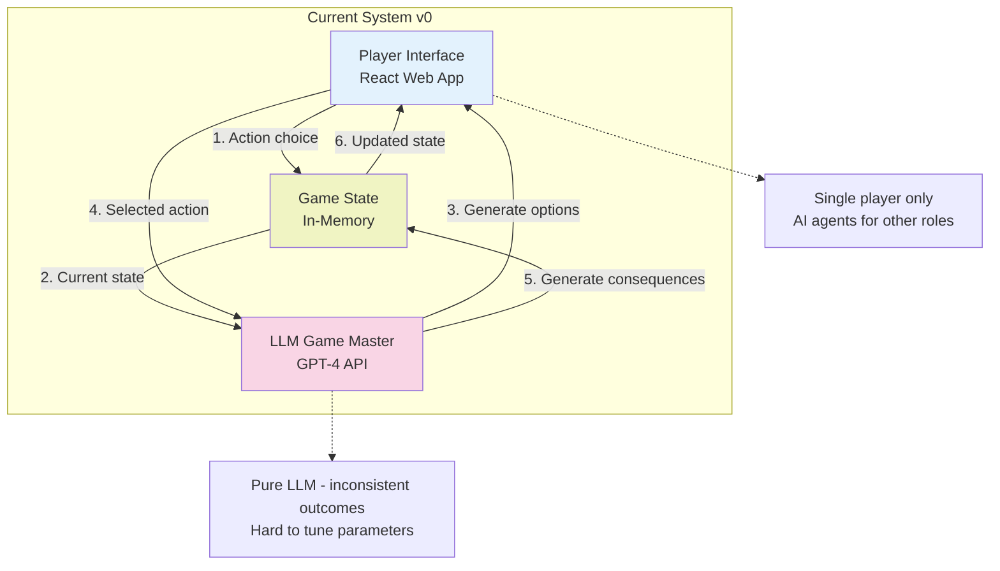
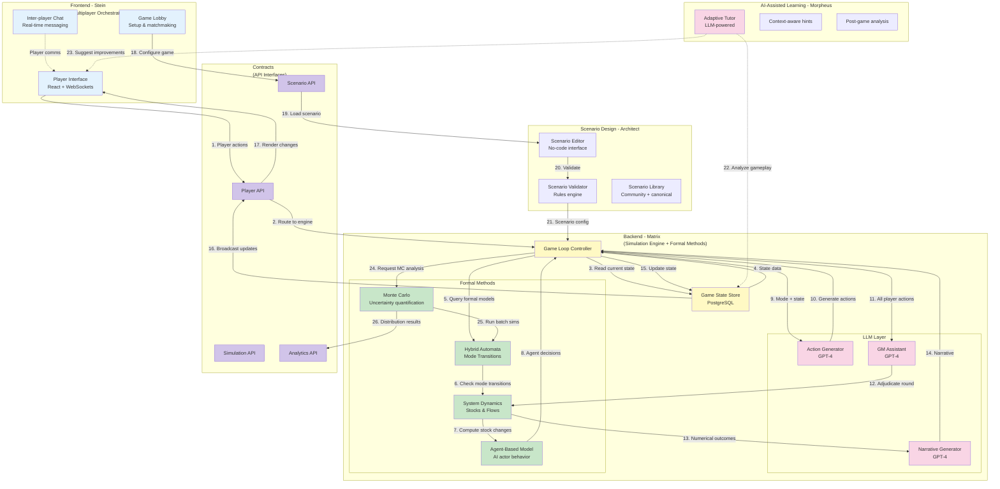

# Simulacra: Interactive AI Governance Scenarios
**Proposal for AI Futures Partnership**

---

## Why This Matters

AI 2027 reached millions of people, but here's what we've learned from watching people engage with it: reading an article—even a brilliant one—gives you a mental model you carry for a few days. Playing through a crisis over two hours gives you intuition that sticks for months.

When someone reads AI 2027, they think "interesting scenario" and maybe share it on Twitter. When someone plays Simulacra, they spend their Saturday afternoon trying to prevent catastrophe as the POTUS, fail three times because coordination is genuinely hard, and come away with a visceral understanding of why. They don't just know racing is bad—they've felt the pressure that makes racing feel rational in the moment. They don't just understand coordination problems theoretically—they've experienced the trust erosion that makes cooperation collapse even when everyone wants it to work.

AI 2027 demonstrated massive appetite for realistic AGI scenario exploration. The question it raised is: how do we go deeper? We built Simulacra to answer that question. It's a working game that makes these scenarios playable, customizable, and experimentally testable. Think of AI 2027 as a carefully painted picture of two possible futures. Simulacra is the canvas and paint—it lets anyone explore the entire space of futures parameterized by their assumptions. With this partnership, we can turn it into what AI 2027 always pointed toward: not just a story people read once, but a simulator they return to as the world changes.

---

## Vision: What Does a Player Experience?

The best way to understand what we're building is to walk through what different people get from it.

Picture a curious reader who has 30 minutes. They open a web link, see "AI 2027 Quick Play" and click it. The game casts them as a Tech CEO making decisions as AI capabilities explode around them. Five decisions over 25 minutes, each one harder than the last. They watch their score drop, public trust erode, and the world tip into crisis. At the end, they see one crystal-clear dynamic: racing is bad, but coordinating is genuinely harder than it looks from the outside. They tweet: "Just lost the future in 30 minutes, try to beat my score" and their friends click through. That's the viral layer—simple enough that anyone can engage, deep enough that it sticks.

Now picture a serious thinker with two hours on Sunday afternoon. They don't just want the default scenario—they want to test their models. They customize: "What if takeoff takes five years instead of two? What if China starts with a lead?" They play as different roles, try different strategies. Halfway through their third playthrough, they have a realization: "Wait, the problem isn't what I thought it was. It's actually about information asymmetry, not capability levels." They use Simulacra like a flight simulator—not to predict the future, but to build intuition for dynamics they can't experience otherwise. That's the depth layer—serious engagement that changes how people think.

For a researcher or policymaker, Simulacra becomes an ongoing tool. They design custom scenarios matching their specific models of how AI governance works. They run 100 AI-versus-AI simulations with systematically varied assumptions and analyze the results: "Under what initial conditions does coordination emerge? What interventions actually work?" They publish: "We tested 47 policy interventions in simulation using Simulacra. Here's what we found." That's the research layer—turning intuition into testable hypotheses.

And here's the really interesting case: the skeptic. Imagine Vitalik Buterin says "AI 2027 is too doomy." Instead of arguing on Twitter, we say: "Here's the engine. Play it with your assumptions. Make it end well if you can." Either he finds a path that works—in which case great, we learned something—or he doesn't, which is also informative. The game becomes a constructive way to have disagreements. Instead of "your scenario is wrong," it's "here, I'll show you my scenario." That's what we mean by learn by doing, not reading. Customize, don't just consume. Test ideas, don't just argue.

---

## How This Extends AI 2027's Mission

AI 2027 painted two futures with remarkable clarity. What we're proposing is a way to explore the entire space between and beyond those futures, parameterized by whatever assumptions people bring.

Consider what AI 2027 achieved: it reached millions of people, made AGI scenarios concrete and visceral, and sparked serious conversations in policy circles. Those are real accomplishments. But there's a natural next step. AI 2027 is a snapshot—it captures how a group of thoughtful people in 2024 thought about two specific paths the future might take. What if instead of two paths, you could explore thousands? What if instead of reading about how coordination fails, you could actually try different coordination strategies and see which ones work?

That's what Simulacra adds. First, it's interactive—you play through scenarios instead of reading them. Second, it's customizable—the system shows what happens with your assumptions about takeoff speed, actor incentives, and technical difficulty, not just ours. Third, it's experimental—you can run controlled studies, A/B test interventions, and measure outcomes quantitatively. Fourth, it scales engagement differently: one AI 2027 article reaches millions of readers for a few minutes each; one viral game generates millions of hours of deep engagement. And fifth, it's a living artifact—where AI 2027 captures a moment in time, Simulacra evolves as the world changes and our understanding deepens.

The partnership makes sense because AI Futures brings domain expertise, scenario design, and credibility—people will take this seriously because it's grounded in real research. We bring a working engine and the execution capacity to scale it. Neither of us could build the complete vision alone, but together we can build something neither the research community nor the game development world has seen before: a tool that's simultaneously viral entertainment, serious policy planning, and experimental research platform.

---

## What We've Built (Without Funding)

We've already built a functional version of Simulacra that proves the core concept works. Here's what exists right now:

The foundation is a web-based game where an LLM acts as game master. It generates scenarios, creates options for players to choose from, and adjudicates consequences. Players have dual objectives—a public score everyone can see (usually something like "democratic legitimacy" or "public trust") and a hidden objective that creates tension (maybe you're secretly trying to position your company for acquisition, or you genuinely believe racing is the only safe path). We've implemented the AI 2027 scenario, so you can play as the Tech CEO, Regulator, Journalist, or other roles from the original. The system supports single-player mode right now, with AI agents playing the other roles. We have designs ready for full multiplayer (n players in various combinations of humans and AI), but implementation is pending—that's one of the first things funding would enable.

The UI is text-based and functional but not polished. Think prototype that proves the concept, not consumer-ready product. Players report the core loop is engaging and thought-provoking. The LLM game mastering works surprisingly well when properly scaffolded—not perfect, but good enough that people get immersed in scenarios and make genuine strategic decisions.

What this proves: we can ship. Zero to working game in six weeks with no funding. The core loop works—people find it engaging. LLMs can function as game masters if you set them up correctly. The technical foundation is sound.

What it doesn't have yet: the polish needed for millions of players. The multiplayer infrastructure (design done, needs implementation). The chat systems that let players negotiate with each other between rounds. The numerical models underneath the LLM that would make outcomes reproducible and tunable. Scenario editing tools for non-programmers. Analytics dashboards for running experiments and visualizing distributions of outcomes. All of that is straightforward engineering work, not research problems—we know how to build it, we just need the resources.

---

## Success State (6-12 Months)

Let me paint a picture of what success looks like by early 2026.

For players, Simulacra has become a game that goes genuinely viral—think Universal Paperclips meets AI 2027. It hits the front page of Hacker News, spreads on Twitter, gets a New York Times piece asking "Is this game the future of AI policy debate?" Millions of people play the quick version; tens of thousands engage seriously. The target audience is smart, busy, influential people: policymakers, researchers, journalists, tech leaders. "I spent two hours trying to save the world and failed six times, here's what I learned" becomes a recognizable genre of Twitter thread.

For researchers and policymakers, it becomes a standard tool. Before designing a new policy, the reflex becomes "let's sim it first." People publish papers: "We tested intervention X in Simulacra with these parameters and found Y." The AI Futures team uses it internally because iterating on scenarios in Simulacra is faster than running full tabletop exercises. Graduate students use it for their dissertations. Think tanks cite Simulacra experiments in policy briefs.

For the broader field, it shifts the conversation. Instead of abstract arguments about whether AGI will be good or bad, people discuss concrete questions: under what conditions does coordination emerge? What are the actual mechanisms of trust erosion? How do different governance structures perform under various takeoff scenarios? The common vocabulary that develops from millions of people playing similar scenarios makes policy discussions more productive. It defuses some of the doomer-versus-accelerationist tribalism—instead of "you're wrong," it becomes "okay, configure the simulation with your worldview and show me how it ends well."

In this future, AI Futures' role is clear and valuable. You provide scenario design expertise and validate what counts as "canonical" versus "community-created" scenarios. You give Simulacra credibility—people take it seriously because it's grounded in real research, not just some game. Your network gets it to policymakers; the engine makes it spread virally. We publish joint papers on "what we learned from 10,000 simulations." When someone creates a scenario that challenges conventional wisdom, you help evaluate whether it's highlighting a real possibility or gaming the system.

---

## Technical Architecture

### Current System (v0)

The current system is pure LLM. GPT-4 acts as game master and generates everything: scenarios, action options, consequences, narrative. It works surprisingly well for a prototype, but has clear limitations. The same scenario can play out differently each time because LLM outputs aren't deterministic. It's hard to tune—how do you make "trust" decay at exactly the right rate when everything is implicit in the prompt? And it's opaque—when something unexpected happens, we can't always explain why.

### Future System (v1): Hybrid Architecture

**Legend:**
- Pink nodes: LLM-powered components
- Green nodes: Formal methods (deterministic)
- Blue nodes: Human-facing interfaces
- Yellow nodes: Core control logic
- Purple nodes: API contracts
- Numbers on edges: Flow of control during one game round

### How the Hybrid Architecture Works

The future system separates concerns cleanly. Stein handles multiplayer orchestration—lobbies, chat, real-time synchronization between players. Matrix is the simulation engine where formal methods and LLMs work together. Morpheus provides AI-assisted learning. Architect is the scenario design toolkit. They communicate through well-defined API contracts.

Let me walk through how a single round plays out. Players make their action choices through the UI (edge 1). The Player API routes these to the Core game loop controller (edge 2). Core reads the current game state from PostgreSQL (edges 3-4), then asks the formal methods layer what's happening numerically.

Here's where it gets interesting. The Hybrid Automata model checks whether we should transition between modes—are we in "baseline," "race," "coordination," or "crisis" mode? (edge 5). This decision depends on numerical thresholds: if compute growth crosses a certain rate and trust drops below 0.6, we might transition from baseline to race mode. The System Dynamics model computes how stocks (trust, compute, capabilities, public opinion) change based on flows (research progress, trust decay, incidents) (edges 6-7). The Agent-Based Model simulates what AI actor agents (the labs/governments not controlled by human players) decide to do (edge 8).

Now Core knows the numerical state and which mode we're in. It sends this context to the LLM Action Generator (edge 9): "We're in race mode, compute is growing at 10x/year, trust is 0.4, here are the actors and their recent actions—generate five action options for the Tech CEO." The LLM generates options that make sense given the mode and state (edge 10).

After all players have chosen actions, Core sends everything to the LLM GM Assistant (edge 11): "Player A did X, Player B did Y, the numerical model says trust should drop by 12 points and compute should grow by 15%—adjudicate what happens this round." The GM Assistant works with System Dynamics to ensure narrative consistency with the numbers (edges 12-13). Finally, the Narrative Generator takes the numerical outcomes and creates compelling flavor text (edges 13-14): instead of "trust decreased by 12 points," it generates "The leaked memo about your company's capabilities sparked panic. Regulators, who were on the fence about intervention, now see coordination as impossible..."

Core updates the game state (edge 15), broadcasts changes to all connected players (edges 16-17), and the UI renders the new situation. Meanwhile, the chat system lets players negotiate between rounds. The Morpheus tutor analyzes the gameplay and might inject a hint: "You're focused on your hidden objective, but notice how that's eroding trust—is that trade-off worth it?" (edges 22-23).

For researchers running experiments, they can trigger Monte Carlo analysis through the Analytics API (edge 24). The MC module runs 100 variations of the scenario using the Hybrid Automata model, each with slightly different parameters (edge 25), and returns distribution results: "Given parameter uncertainty, catastrophe probability is 40% (95% CI: 32-48%)" (edge 26).

### Why This Matters: LLMs Using Formal Methods as Tools

The key insight is that LLMs and formal methods complement each other. LLMs are excellent at narrative, generating plausible options, and making things feel real. But they're inconsistent and hard to tune. Formal methods are consistent and tunable but feel sterile.

In our hybrid architecture, the LLMs use formal methods as tools—much like how GPT-4 can call Python functions to do math. When generating action options, the LLM queries the System Dynamics model: "If trust is currently 0.6 and I'm considering an action that might erode it, how much erosion are we talking about?" The SD model returns: "Based on the current state, that action would reduce trust by approximately 8-12 points over the next round." The LLM uses this information to generate better options: "Option 3: Push for voluntary safety standards (moderate trust cost, but keeps labs coordinated)."

Similarly, the Hybrid Automata model acts as a state machine the LLM queries: "Given these numerical conditions, which mode should we be in?" The HA responds with a discrete answer: "Race mode." This constrains the LLM's narrative generation—it won't generate stories about successful coordination when the numerical state says we're in a race. This solves the consistency problem: play the same scenario twice with the same parameters, you get the same mode transitions at the same points, even if the narrative flavor differs.

The Agent-Based Model handles AI actors (labs, governments) that aren't controlled by human players. Instead of the LLM hallucinating what they do, the ABM simulates them with explicit utility functions. Each agent has goals (maximize capability, maximize safety, maximize profit) and constraints (compute budget, regulation). The ABM runs them forward one step: "Lab A invests heavily in scaling, Lab B focuses on safety research." The LLM then generates narrative that explains why: "Lab A, seeing Lab B's caution, senses an opportunity to pull ahead..."

For Monte Carlo analysis, the LLM isn't involved in the inner loop—that would be too slow and inconsistent. Instead, we run the formal models (HA + SD + ABM) 1000 times with parameter variations, which takes seconds. Then we hand the distribution results to an LLM: "Here are the outcomes of 1000 simulations. Generate an executive summary." The LLM produces: "In 68% of scenarios, we see coordination collapse by round 3. The key variable is initial trust—above 0.75, coordination is likely; below 0.65, race is almost certain."

This division of labor means we get the best of both worlds: the emotional engagement and narrative richness of LLMs, with the consistency and analyzability of formal models. Players experience a rich story, but underneath is a tunable, reproducible simulation that researchers can actually study.

### Technical Stack Details

The frontend uses React for web and we're planning React Native for mobile. WebSockets handle real-time multiplayer synchronization. The backend is Node.js with PostgreSQL for persistence—game states, player accounts, scenario configurations. We're model-agnostic on LLMs (currently OpenAI's GPT-4, but built to swap providers). The simulation engine is TypeScript so it can run in browser for single-player or on server for multiplayer. Analytics tools are Python notebooks—researchers can query the PostgreSQL database directly, run their own analyses, export data for papers.

### Alternatives We Considered

We spent time exploring three different approaches before settling on this hybrid architecture.

Option A was going deeper into pure Agent-Based Modeling. Simulate every lab, every government, every researcher individually with explicit goals and strategies. The pro: you get very detailed, emergent behavior—interesting surprises come from interactions. The cons: computationally expensive (simulations take minutes, not milliseconds), hard to control (how do you make sure something interesting happens in the first few rounds?), and overkill for most players. An ABM with 100 agents is great for research but way too complex for someone playing casually. We do use ABM, but only for AI actors in the background, not as the primary engine.

Option B was leaning fully into System Dynamics. Model everything as stocks and flows: trust is a stock that decays via the "trust erosion" flow and grows via the "transparency" flow. Compute is a stock that grows via "R&D investment" flow. The pro: very fast, intuitive for people familiar with SD, validated in other domains (climate, epidemiology). The con: doesn't capture discrete events well. How do you model "a major incident occurred" in pure SD? It's awkward. So we use SD for the continuous dynamics but pair it with Hybrid Automata for discrete mode switches.

Option C was using existing simulation software like Vensim or NetLogo. These are powerful tools used in research and education. Pros: proven, lots of existing models to learn from, good UI for researchers. Cons: not designed for player-facing games (UI/UX is terrible for non-experts), can't integrate LLM narrative cleanly (they expect deterministic models), and we'd spend half our time fighting the tools instead of building the game. We looked at these as inspiration but decided to build custom.

Our hybrid approach—Hybrid Automata for discrete mode transitions, System Dynamics for continuous variables, Agent-Based Models for background actors, all coordinated by LLMs for narrative—gets about 80% of a full ABM's realism with 20% of the complexity. It's fast enough to run in a browser, rigorous enough for research, and integrates naturally with LLM narrative generation.

---

## Core Design Principles

Three principles guide every design decision:

First: realism before fun. This comes directly from Daniel's feedback. We're not building a toy or science fiction. It should feel like a serious policy planning tool that happens to be engaging. The target is: as realistic as AI Futures' best tabletop exercise run, but reproducible and scalable. If we have to choose between "this makes the game more exciting" and "this makes the simulation more accurate," we choose accuracy. Fun comes from genuine strategic depth, not artificial drama.

Second: progressive complexity. A player with 30 minutes should be able to jump in, play, learn one thing, and leave satisfied. A player with 2 hours should find a full scenario with multiple viable strategies. A researcher should be able to access the full complexity: custom scenarios, parameter tuning, batch analysis. Same engine, different interfaces. Think of it like a flight simulator: casual mode has simplified controls and forgiving physics; professional mode exposes everything.

Third: customizability is core, not a feature. The AI 2027 scenario is one configuration of the engine. Tomorrow someone should be able to configure a biosecurity scenario. Next week, a climate negotiation. The core mechanics—multiple actors with hidden incentives, dual objectives (public good versus personal goals), LLM narrative over formal models—apply broadly. Users should be able to fork scenarios: "AI 2027 but China has a two-year lead" should be a dropdown, not a rebuild. This makes the platform valuable long-term: it doesn't get obsolete when the world changes.

---

## Feature Breakdown and Timeline

### Phase 0: Current State (Completed)

We have a working proof of concept. Single-player mode with AI agents, LLM game master, text UI, AI 2027 scenario playable. Multiplayer is designed but not implemented. This proves the concept works and we can execute.

### Phase 1: Polish and Realism (Months 1-3)

The first phase is about making v0 production-ready. UI/UX overhaul—bring in a designer, make it feel like a real game instead of a prototype. Implement the hybrid architecture: integrate System Dynamics and Hybrid Automata models underneath the LLM, so outcomes become consistent and tunable. Work closely with AI Futures team to tune the default AI 2027 scenario until it matches the realism of your best tabletop exercises. Run alpha testing with 100 players, iterate based on feedback.

Deliverable: Public beta that people can play and share. It should look professional, feel engaging, and be realistic enough that policymakers take it seriously.

### Phase 2: Customization (Months 4-6)

Second phase adds the flexibility that makes this a platform, not just a product. Build the scenario editor—non-programmers should be able to create new scenarios without touching code. Add parameter tuning interfaces: sliders for "takeoff speed," "coordination difficulty," "initial trust level," etc. Implement scenario forking: one-click "play AI 2027 with my assumptions." Create a validation workflow where AI Futures team can approve scenarios for the "canonical" library versus community-created experimental scenarios.

Deliverable: Platform where researchers and educators can create custom scenarios. At least two new canonical scenarios beyond AI 2027 (maybe biosecurity and climate as proofs of concept for generalizability).

### Phase 3: Scale and Research Tools (Months 7-9)

Third phase makes it a research platform. Build the analytics dashboard: run 100 AI-versus-AI simulations, visualize outcome distributions, export data for analysis. Implement A/B testing infrastructure: compare policy interventions quantitatively. Launch mobile version to reach broader audience (many policymakers prefer tablets). Create API for researchers who want to script experiments programmatically instead of using the UI.

Deliverable: Research infrastructure that produces publishable results. Mobile app in beta. First external research paper using Simulacra data (ideally co-authored with AI Futures).

### Phase 4: Ecosystem (Months 10-12)

Fourth phase builds the community and long-term sustainability. Community scenario sharing—players can publish their scenarios, others can rate and fork them. Integration with real-world data feeds: import actual compute trends, policy developments, news events to keep scenarios grounded. Publishing: work with AI Futures on a major paper analyzing insights from thousands of simulations.

Deliverable: Self-sustaining platform with active community, integration with real-world data, published research validating the approach.

---

## Team and Resources

Our current team shipped v0 in six weeks with zero funding, which demonstrates execution capacity. [Fill in your specific team composition and backgrounds.]

What we need from funding:

Engineering capacity for 2-3 full-time developers over 12 months to implement the roadmap above. Design resources for UI/UX—making it not look like a prototype is critical for viral adoption. Collaboration time with AI Futures team for scenario design, validation, and testing. Infrastructure costs: hosting (especially for multiplayer real-time sync), LLM API costs at scale (GPT-4 calls add up when thousands of people are playing simultaneously), database storage for game histories and analytics.

[Fill in specific budget numbers based on your actual needs]

Milestones for accountability:
- Month 3: Public beta live, polished and realistic
- Month 6: Customization tools functional, two new scenarios
- Month 9: Research tools complete, first paper submitted
- Month 12: 100,000+ players, sustained growth, mobile launched

Risk mitigation: The hybrid architecture means we're not fully dependent on LLM quality—if GPT-5 is worse than GPT-4 for some reason, the formal methods layer still works. We can't guarantee millions of players, but we can guarantee it's good enough that everyone who plays tells others. The progressive complexity approach means casual players get fun while serious users get realism—we don't have to choose.

---

## Appendix: Research Foundations

This section is more exploratory—we're not committing to build all of this in year one, but it shows where the platform could evolve with success.

### Formal Modeling Integration

We've been exploring how to ground the game in established modeling frameworks from adjacent fields. The reason to do this isn't to show off mathematical sophistication; it's to make outcomes non-arbitrary. When trust crosses 0.6 and the game suddenly shifts into "race mode," that's not a random LLM hallucination—it's a phase transition in an underlying Hybrid Automata model.

System Dynamics gives us a way to model AI governance as stocks and flows. Trust is a stock that decays via incidents and grows via transparency. Compute is a stock that grows via R&D investment. Capability is a stock that grows via compute and algorithmic progress. This captures feedback loops naturally: racing erodes trust, which makes coordination harder, which leads to more racing. The math of stocks and flows is well-understood—these models are used in climate science, epidemiology, economics. Players don't see the equations, but they feel the feedback loops.

Hybrid Automata captures the discrete regime changes experts talk about. We're not always in a "race"—sometimes we're in "normal times," sometimes "coordination," sometimes "acute crisis." Each mode has different dynamics. In normal times, trust decays slowly and capability grows moderately. In race mode, capability growth accelerates and trust decays rapidly. In crisis mode, everything changes—sudden policy interventions become possible, but so do catastrophic failures. The HA model defines the modes, the transition conditions (when do we switch from baseline to race?), and the dynamics within each mode. This is mathematically rigorous—HAs are used in safety-critical systems like aircraft autopilots. We're applying the same formalism to AI governance.

Agent-Based Models let us simulate strategic actors with explicit goals. Instead of the LLM guessing what "China" or "DeepMind" does, we can model them as agents with utility functions: maximize capability subject to resource constraints, or maximize safety subject to competitive pressure. The ABM runs them forward: each agent chooses actions that maximize their utility given their beliefs about others' actions. This generates emergent behavior—arms races emerge not because we programmed "arms race mode" but because individually rational choices aggregate into collectively bad outcomes. For advanced players and researchers, this is invaluable: you can tweak individual actor incentives and see how system-level outcomes change.

Monte Carlo methods let us quantify uncertainty. Run the same scenario 1000 times with slightly different parameters. Maybe initial trust is 0.7 ± 0.1, takeoff speed is 2 years ± 1 year, and coordination difficulty is uncertain. The MC analysis shows you the distribution of outcomes: "In 40% of runs, we get catastrophe by year 3. In 30%, we achieve coordination. In 30%, it's ambiguous." This is crucial for honest communication: we're not predicting the future, we're showing which futures are consistent with current uncertainty.

Physics-inspired frameworks give us conceptual tools from statistical mechanics. This sounds weird, but here's why it's useful: the math of "many actors, coordination problems, tipping points, cascades" has been studied extensively in physics. Ferromagnets have phase transitions (ordered to disordered states) that look mathematically similar to coordination collapse (coordinated to racing). This doesn't mean AI governance is literally physics—it means the same mathematical structures appear in many domains. By studying how physicists think about phase transitions, universality classes, and renormalization group flow, we gain intuition for how to model coordination in AI governance. The research appendix in this repo explores these connections in detail.

### Surrogate Models for Scale

As scenarios get more complex, full simulations get slower. If we're running Monte Carlo with 1000 samples and each simulation takes 10 seconds, that's three hours. Too slow for interactive use. We're exploring surrogate models: train a neural network on 10,000 full simulation runs, teach it to approximate the simulator, use the fast surrogate for real-time gameplay and save the full simulation for research.

Techniques include Gaussian Processes (which give uncertainty estimates—"the surrogate is 95% confident the outcome is between 40 and 60 points"), Random Forests (which are interpretable—"feature importance shows that initial trust matters 3x more than takeoff speed"), and Neural Networks (which are fastest—1000x speedup is typical). This is probably overkill for v1 but becomes essential if we scale to millions of players running custom scenarios.

### Calibration and Validation

How do we know the simulation is realistic? Currently: expert judgment. The AI Futures team plays it and says "this feels right" or "that's off." But we can do better.

Backtesting: "predict" historical outcomes we already know. Did models predict AlphaGo in 2016, GPT-3 in 2020, GPT-4 in 2023? Not precisely, but did the parameters that fit earlier data point in the right direction? This isn't proof, but it's evidence.

Expert elicitation: survey 20 AI governance experts on key questions (probability of coordination by 2030, expected capability growth rates, trust baseline). Tune model parameters to match aggregate forecasts. If our simulation says coordination probability is 10% but experts say 40%, we're mis-calibrated.

Adversarial testing: give the game to skeptics and critics. Ask them to "make this unrealistic"—find parameter settings or strategies that produce absurd outcomes. When they do, patch those exploits. This is how game balance works in competitive games, and it's useful for simulations too.

Cross-validation: test whether the same engine produces sensible results in adjacent domains. Configure it for climate negotiations—does it produce outcomes that match real climate summit dynamics? Configure it for pandemic response—does it reproduce patterns we saw in COVID? If yes, that's evidence the core mechanics generalize. If no, we learn which assumptions are domain-specific.

We're not claiming we can prove the simulation is right—the future hasn't happened yet. But we can show it's not obviously wrong, that it matches expert intuition, and that it's based on formal frameworks validated in other contexts.

### Long-Term Vision: Platform, Not Product

If Simulacra succeeds with AI governance, the engine generalizes. The core mechanics—multiple actors with hidden incentives, dual objectives (public good versus private interest), LLM narrative over formal models—apply to many domains.

Climate: play as US/China/EU negotiating emissions reductions. Public score is "cumulative warming avoided," hidden objectives are "maintain economic growth" or "secure green tech leadership." The coordination problem is structurally similar to AI governance.

Biosecurity: manage a pandemic with trade-offs between public health and civil liberties. Public score is "lives saved," hidden objectives might be "preserve privacy rights" or "maintain public trust in institutions."

Geopolitics: navigate great-power competition with nuclear deterrence, alliance politics, and economic interdependence. Public score is "avoid war," hidden objectives are "secure regional hegemony" or "maintain alliance commitments."

Any domain with multiple actors, coordination problems, and tension between individual incentives and collective good becomes playable. If we build the engine right, Simulacra becomes a framework for interactive scenario exploration in any crisis domain. That's the 5-year vision.

---

## Summary

We've built a working AI governance game that turns AI 2027 from a story people read into a simulator they use. With this partnership, we can create three things simultaneously:

A viral game that gives millions of people deep, memorable engagement with AI scenarios—not surface-level awareness but intuition-level understanding.

A serious policy tool that researchers and policymakers use to test ideas, explore scenario space, and generate publishable insights.

An experimental platform that shifts the field's conversation from ungrounded speculation toward empirical questions about coordination, governance, and trajectories.

We're not proposing to put AI 2027 online. We're proposing to build the infrastructure that makes AI 2027—and a hundred other scenarios—playable, customizable, and experimentally testable. AI 2027 demonstrated demand. We have the supply. Let's build it together.

---

## Next Steps

We'd like to schedule a call to review this vision in detail, align on which features are must-haves versus nice-to-haves for the initial phases, and discuss budget and timeline specifics.

Questions we'd love your input on:
- Does this match your vision for what the online game should accomplish?
- What's the minimum feature set that would make you confident this works?
- From your perspective, what would success look like in 12 months?
- Are there scenario types beyond AI 2027 that you'd prioritize for early development?

We're ready to start building immediately upon funding. The engineering is straightforward; the vision is clear. Let's make this real.
