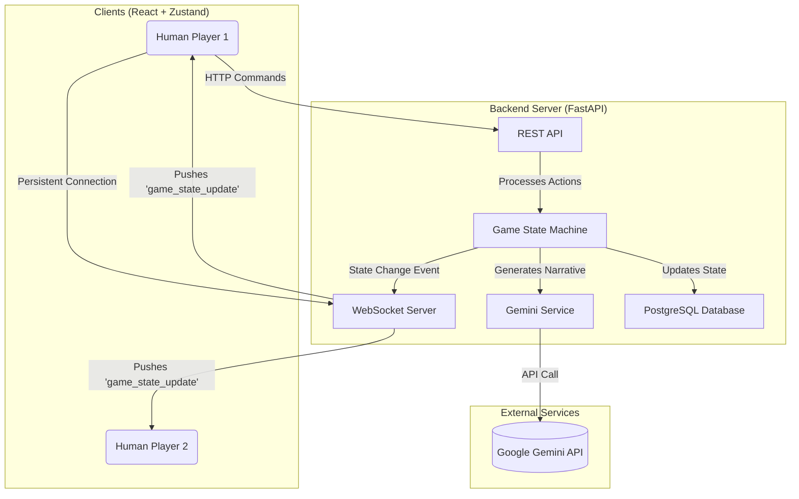
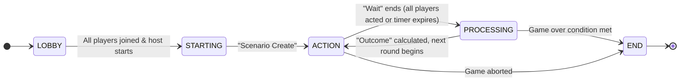
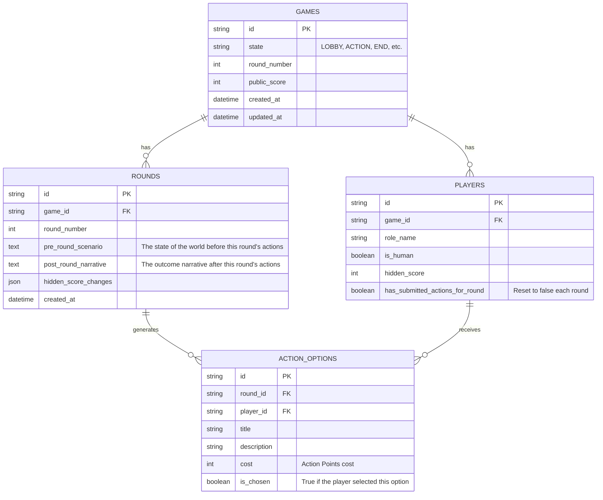
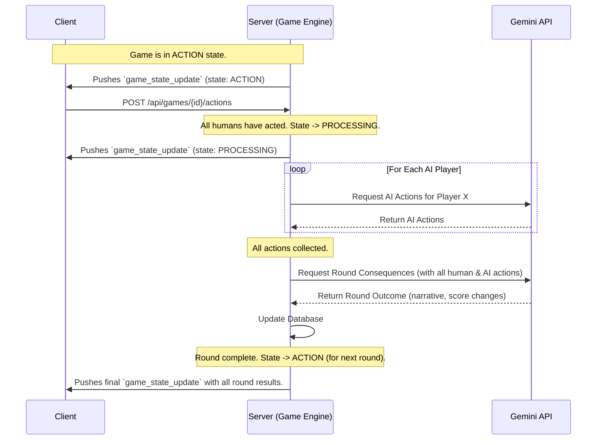

# AI Risk Tabletop Exercise - Technical Design Document

## 1. Overview

This document outlines the technical design for evolving the AI Risk Tabletop Exercise from a single-player proof-of-concept into a robust, multiplayer web application.

The core architectural goal is to move all game logic and state management to a dedicated backend server. The frontend will be refactored into a "dumb" client that renders the state provided by the server and forwards user input.

## 2. High-Level Architecture

We will implement a **hybrid architecture** that leverages a **REST API** for client-initiated commands and **WebSockets** for real-time, server-pushed state updates.

*   **Backend:** A **FastAPI** (Python) application will manage the game logic, state, and communication with the Google Gemini API.
*   **Frontend:** A **React** application (built with Vite) will manage the UI. State synchronization will be handled by **Zustand**.
*   **Database:** A **PostgreSQL** database will be used for data persistence.



## 3. Game State Machine

The server's Game Engine will manage the game flow according to a formal state machine.

### State Machine Diagram



### Mapping to Conceptual Flow

| Conceptual Term (from diagram) | Formal State | Description |
| :--- | :--- | :--- |
| "All Players ready" | `LOBBY` | The game is waiting for players to join. |
| "Scenario Create" | `STARTING` / `ACTION` | The server generates the pre-round scenario and presents it to the players. |
| "Action/Goals Space" / "Wait" | `ACTION` | The system is waiting for players to choose and submit their actions. |
| "Outcome" | `PROCESSING` | The server has all actions and is calculating the results and the post-round narrative. |
| "> T rounds" -> "End" | `END` | The game has concluded. |

## 4. AI Player and State Transition Logic

The `PROCESSING` state involves a critical sequence of automated, server-side actions. When the game transitions from `ACTION` to `PROCESSING`, the Game Engine executes the following steps in order:

1.  **Notify Clients**: The server immediately pushes a `game_state_update` to all clients, setting the game state to `PROCESSING`. The UI will show a "Waiting for results..." message.
2.  **Generate AI Player Actions**: The server iterates through all players where `is_human` is `false`. For each AI player, it makes a call to the Gemini API (`generateAIPlayerActions`) to determine their actions for the round. These actions are stored temporarily.
3.  **Calculate Consequences**: Once all AI actions have been generated, the server makes a final, comprehensive call to the Gemini API (`generateConsequences`). This call includes the actions taken by *all* players (human and AI).
4.  **Update Database**: The server receives the round's outcome (public score change, hidden score changes, narrative) from the Gemini API. It then updates the `GAMES`, `PLAYERS`, and `ROUNDS` tables in the database with this new information.
5.  **Transition to Next Round**: The Game Engine transitions the game state back to `ACTION` (for the next round) or to `END` if a game-over condition is met. This new, complete game state is then broadcast to all clients via the `game_state_update` WebSocket event.

## 5. Database Schema

The PostgreSQL database will use the following schema to persist all game data.



## 6. API Contract

### REST API Endpoints (Client -> Server)

| Method | Endpoint | Description |
| :--- | :--- | :--- |
| `POST` | `/api/games` | Creates a new game instance. |
| `POST` | `/api/games/{game_id}/join` | Allows a player to join an existing game. |
| `POST` | `/api/games/{game_id}/start` | Starts the game (host only). |
| `GET` | `/api/games/{game_id}` | Retrieves the full current state of a game. |
| `POST` | `/api/games/{game_id}/actions` | Submits the chosen actions for the current player. |

### WebSocket Events (Server -> Client)

A client connects to `ws://your-server.com/ws/{game_id}`.

| Event Name | Payload | Description |
| :--- | :--- | :--- |
| `game_state_update` | The entire, updated `GameState` object. | The primary event sent by the server whenever any aspect of the game state changes. This keeps the client in sync. |
| `error` | `{ "message": "Error details..." }` | Sent to a specific client when their action results in an error. |

## 7. Interaction Sequence Diagram (with AI Handling)

This diagram shows the flow of a single game round, including the server-side AI logic.



## 8. Frontend Architecture Details

The React frontend will be refactored to use **Zustand** for clean and performant state management.

### 8.1. Zustand Store (`src/stores/gameStore.ts`)

A central store will be the single source of truth for all game-related data on the client.

```typescript
import { create } from 'zustand';
import { GameState } from '../types'; // Assuming types are defined

interface GameStore {
  gameState: GameState | null;
  setGameState: (newState: GameState) => void;
}

export const useGameStore = create<GameStore>((set) => ({
  gameState: null,
  setGameState: (newState) => set({ gameState: newState }),
}));
```

### 8.2. Service Layer

All communication with the backend is abstracted into services.

`src/services/apiService.ts`: Handles all REST API calls.
```typescript
// Example function
export const submitActions = async (gameId: string, chosenActionIds: string[]) => {
  const response = await fetch(`/api/games/${gameId}/actions`, {
    method: 'POST',
    headers: { 'Content-Type': 'application/json' },
    body: JSON.stringify({ chosen_action_ids: chosenActionIds }),
  });
  return response.json();
};
```

`src/services/webSocketService.ts`: Manages the WebSocket connection lifecycle.
```typescript
import { useGameStore } from '../stores/gameStore';

let socket: WebSocket | null = null;

export const connect = (gameId: string) => {
  if (socket) return;
  socket = new WebSocket(`ws://your-server.com/ws/${gameId}`);

  socket.onmessage = (event) => {
    const message = JSON.parse(event.data);
    if (message.event === 'game_state_update') {
      useGameStore.getState().setGameState(message.payload);
    }
  };
};

export const disconnect = () => {
  socket?.close();
  socket = null;
};
```

### 8.3. Component Integration

Components become simple consumers of the store and services.

`src/App.tsx`: Manages the WebSocket connection.
```typescript
import { useEffect } from 'react';
import { connect, disconnect } from './services/webSocketService';
import { useGameStore } from './stores/gameStore';

export default function App() {
  const gameId = useGameStore((state) => state.gameState?.id);

  useEffect(() => {
    if (gameId) {
      connect(gameId);
    }
    return () => {
      disconnect();
    };
  }, [gameId]);

  // ... render components based on gameState
}
```

`src/components/ActionSelection.tsx`: A presentational component.
```typescript
import { useGameStore } from '../stores/gameStore';
import { submitActions } from '../services/apiService';

const ActionSelection = () => {
  const gameId = useGameStore((state) => state.gameState?.id);
  const options = useGameStore((state) => state.gameState?.actionOptions);
  const [selected, setSelected] = useState<string[]>([]);

  const handleConfirm = async () => {
    if (!gameId) return;
    await submitActions(gameId, selected);
  };

  // ... render logic for options and button
};