# Crisis Command - AI Tabletop Exercise

A web-based crisis simulation game where you role-play as a key decision-maker during an AI-driven global emergency. Make strategic choices that affect public trust and your secret objectives while an AI Game Master generates dynamic scenarios and consequences.

## What is a Tabletop Exercise (TTX)?

A **Tabletop Exercise (TTX)** is a simulated crisis where participants role-play decision-makers to test strategic thinking and understand how systems respond under pressure. This AI-powered version generates unique scenarios each playthrough, with AI-controlled opponents making their own strategic choices.

## Features

**Core Gameplay:**
- **Multiple Scenario Types** - Choose from Classic (election crisis), AI Safety, community-submitted scenarios, or create your own custom crisis
- **Role-Playing** - Each scenario defines 6 unique roles with public and hidden objectives (e.g., Election Commissioner, Tech CEO, Journalist for election crisis)
- **Dynamic AI Generation** - LLM generates unique opening crisis and evolving events based on your chosen scenario
- **Strategic Action System** - Limited action points per round force tough prioritization decisions
- **AI Opponents** - Five AI players using a two-step decision process (generate options, then choose based on secret goals)
- **Action Tree Visualization** - React Flow graphs showing all players' available options and final choices
- **Counterfactual Analysis** - Compare actual outcomes against "if no one acted" baseline

**Community & Feedback:**
- **Scenario Library** - Browse and play community-submitted custom scenarios
- **Scenario Submission** - Share your custom scenarios with the community (with "Make Public" button in-game)
- **Upvoting System** - Vote for your favorite scenarios (uses anonymous fingerprinting to prevent duplicate votes)
- **Feedback Collection** - Submit feedback after playing to help improve the game

**Tech Stack:**
- React 19 + TypeScript + Vite
- OpenAI SDK for LLM calls (via LiteLLM proxy)
- Zod for schema validation and structured outputs
- React Flow for action tree visualization
- Prisma + PostgreSQL for data persistence
- Vercel serverless functions for API routes

---

## Quick Start

### Prerequisites
- Node.js 20+
- PostgreSQL (for local development)
- LiteLLM API key (or compatible LLM provider)

### Setup

1. **Install dependencies:**
   ```bash
   npm ci
   ```

2. **Set up database:**
   ```bash
   npm run db:setup
   ```

3. **Configure environment** (`.env`):
   ```bash
   DATABASE_URL="postgresql://yourusername@localhost:5432/ttx-prisma-postgres-local?schema=public"
   VITE_LITELLM_API_KEY="your-api-key"
   VITE_LLM_MODEL="gpt-4o-mini"
   ```

4. **Start development server:**
   ```bash
   npm run dev
   ```

### Available Commands

```bash
npm run dev              # Start Vercel dev server
npm run build            # Production build
npm run db:studio        # Open Prisma Studio
npm run analyze          # Analyze feedback data
npm run scenarios        # Manage community scenarios
npm run test:api         # Test feedback API
```

## Deployment

### Vercel Configuration

**Build Settings:**
- Install Command: `npm ci`
- Build Command: `npm run build`
- Output Directory: `dist`
- Node.js Version: `20.x`

**Environment Variables:**
- `DATABASE_URL` - PostgreSQL connection string
- `VITE_LITELLM_API_KEY` - LiteLLM proxy API key
- `VITE_LLM_MODEL` - Model name (e.g., `gemini-2.5-flash`, `gpt-4o-mini`)

---

## Project Status & Issue Tracking

We use [Beads](https://github.com/steveyegge/beads) for dependency-aware issue tracking.

<!-- BEADS_STATS_START -->

## Beads Issue Statistics

**Total Issues:** 55


### By Status
- closed: 31
- open: 24

### By Priority
- P0: 10
- P1: 21
- P2: 24

### By Type
- unknown: 55

<!-- BEADS_STATS_END -->

<!-- BEADS_READY_START -->

## Ready to Work

Issues with no blocking dependencies:

- 📋 **ai-risk-ttx-15** (P1): Migrate from SPA to proper routing/pages (React Router)
- 📋 **ai-risk-ttx-24** (P1): Migrate LLM service to API for server-side calls
- 📋 **ai-risk-ttx-44** (P2): Add React Router and convert to page-based architecture
- 📋 **ai-risk-ttx-55** (P2): Design unified scenario/prompt tracking database schema
- 📋 **ai-risk-ttx-8** (P2): Implement prompt versioning and storage system

<!-- BEADS_READY_END -->

<!-- BEADS_ISSUES_START -->

### Open Issues Dependency Graph

```mermaid
graph TD;
    ai-risk-ttx-15["📋 ai-risk-ttx-15<br/>Migrate from SPA to proper routing/pa...<br/>P1"]
    style ai-risk-ttx-15 fill:#fff3cd,stroke:#856404,stroke-width:2px
    ai-risk-ttx-24["📋 ai-risk-ttx-24<br/>Migrate LLM service to API for server...<br/>P1"]
    style ai-risk-ttx-24 fill:#fff3cd,stroke:#856404,stroke-width:2px
    ai-risk-ttx-25["📋 ai-risk-ttx-25<br/>Copy geminiService.ts to api/services/<br/>P1"]
    style ai-risk-ttx-25 fill:#fff3cd,stroke:#856404,stroke-width:2px
    ai-risk-ttx-26["📋 ai-risk-ttx-26<br/>Create API route for generateInitialS...<br/>P1"]
    style ai-risk-ttx-26 fill:#fff3cd,stroke:#856404,stroke-width:2px
    ai-risk-ttx-27["📋 ai-risk-ttx-27<br/>Create API route for generateActionOp...<br/>P1"]
    style ai-risk-ttx-27 fill:#fff3cd,stroke:#856404,stroke-width:2px
    ai-risk-ttx-28["📋 ai-risk-ttx-28<br/>Create API route for generateAIPlayer...<br/>P1"]
    style ai-risk-ttx-28 fill:#fff3cd,stroke:#856404,stroke-width:2px
    ai-risk-ttx-29["📋 ai-risk-ttx-29<br/>Create API route for generateConseque...<br/>P1"]
    style ai-risk-ttx-29 fill:#fff3cd,stroke:#856404,stroke-width:2px
    ai-risk-ttx-30["📋 ai-risk-ttx-30<br/>Create API route for generateCounterf...<br/>P1"]
    style ai-risk-ttx-30 fill:#fff3cd,stroke:#856404,stroke-width:2px
    ai-risk-ttx-31["📋 ai-risk-ttx-31<br/>Create API route for generateCustomSc...<br/>P1"]
    style ai-risk-ttx-31 fill:#fff3cd,stroke:#856404,stroke-width:2px
    ai-risk-ttx-32["📋 ai-risk-ttx-32<br/>Update useGameController to call API ...<br/>P1"]
    style ai-risk-ttx-32 fill:#fff3cd,stroke:#856404,stroke-width:2px
    ai-risk-ttx-33["📋 ai-risk-ttx-33<br/>Remove VITE_LITELLM_API_KEY from client<br/>P1"]
    style ai-risk-ttx-33 fill:#fff3cd,stroke:#856404,stroke-width:2px
    ai-risk-ttx-44["📋 ai-risk-ttx-44<br/>Add React Router and convert to page-...<br/>P2"]
    style ai-risk-ttx-44 fill:#fff3cd,stroke:#856404,stroke-width:2px
    ai-risk-ttx-45["📋 ai-risk-ttx-45<br/>Install and configure React Router<br/>P2"]
    style ai-risk-ttx-45 fill:#fff3cd,stroke:#856404,stroke-width:2px
    ai-risk-ttx-46["📋 ai-risk-ttx-46<br/>Create pages/ directory and move screens<br/>P2"]
    style ai-risk-ttx-46 fill:#fff3cd,stroke:#856404,stroke-width:2px
    ai-risk-ttx-47["📋 ai-risk-ttx-47<br/>Create route layout with Navigation c...<br/>P2"]
    style ai-risk-ttx-47 fill:#fff3cd,stroke:#856404,stroke-width:2px
    ai-risk-ttx-48["📋 ai-risk-ttx-48<br/>Implement HomePage with lobby functio...<br/>P2"]
    style ai-risk-ttx-48 fill:#fff3cd,stroke:#856404,stroke-width:2px
    ai-risk-ttx-49["📋 ai-risk-ttx-49<br/>Implement GamePage with route guards<br/>P2"]
    style ai-risk-ttx-49 fill:#fff3cd,stroke:#856404,stroke-width:2px
    ai-risk-ttx-50["📋 ai-risk-ttx-50<br/>Implement EndGamePage and navigation ...<br/>P2"]
    style ai-risk-ttx-50 fill:#fff3cd,stroke:#856404,stroke-width:2px
    ai-risk-ttx-51["📋 ai-risk-ttx-51<br/>Update Navigation component for routing<br/>P2"]
    style ai-risk-ttx-51 fill:#fff3cd,stroke:#856404,stroke-width:2px
    ai-risk-ttx-52["📋 ai-risk-ttx-52<br/>Update useGameController for router n...<br/>P2"]
    style ai-risk-ttx-52 fill:#fff3cd,stroke:#856404,stroke-width:2px
    ai-risk-ttx-53["📋 ai-risk-ttx-53<br/>Add 404 page and error boundaries<br/>P2"]
    style ai-risk-ttx-53 fill:#fff3cd,stroke:#856404,stroke-width:2px
    ai-risk-ttx-54["📋 ai-risk-ttx-54<br/>Test routing and game flow end-to-end<br/>P2"]
    style ai-risk-ttx-54 fill:#fff3cd,stroke:#856404,stroke-width:2px
    ai-risk-ttx-55["📋 ai-risk-ttx-55<br/>Design unified scenario/prompt tracki...<br/>P2"]
    style ai-risk-ttx-55 fill:#fff3cd,stroke:#856404,stroke-width:2px
    ai-risk-ttx-8["📋 ai-risk-ttx-8<br/>Implement prompt versioning and stora...<br/>P2"]
    style ai-risk-ttx-8 fill:#fff3cd,stroke:#856404,stroke-width:2px

    ai-risk-ttx-53 --> ai-risk-ttx-45
    ai-risk-ttx-47 --> ai-risk-ttx-45
    ai-risk-ttx-47 --> ai-risk-ttx-46
    ai-risk-ttx-33 --> ai-risk-ttx-32
    ai-risk-ttx-46 --> ai-risk-ttx-44
    ai-risk-ttx-52 --> ai-risk-ttx-51
    ai-risk-ttx-45 --> ai-risk-ttx-44
    ai-risk-ttx-29 --> ai-risk-ttx-24
    ai-risk-ttx-29 --> ai-risk-ttx-25
    ai-risk-ttx-51 --> ai-risk-ttx-47
    ai-risk-ttx-51 --> ai-risk-ttx-48
    ai-risk-ttx-51 --> ai-risk-ttx-49
    ai-risk-ttx-51 --> ai-risk-ttx-50
    ai-risk-ttx-31 --> ai-risk-ttx-24
    ai-risk-ttx-31 --> ai-risk-ttx-25
    ai-risk-ttx-54 --> ai-risk-ttx-52
    ai-risk-ttx-54 --> ai-risk-ttx-53
    ai-risk-ttx-26 --> ai-risk-ttx-24
    ai-risk-ttx-26 --> ai-risk-ttx-25
    ai-risk-ttx-30 --> ai-risk-ttx-24
    ai-risk-ttx-30 --> ai-risk-ttx-25
    ai-risk-ttx-48 --> ai-risk-ttx-47
    ai-risk-ttx-25 --> ai-risk-ttx-24
    ai-risk-ttx-28 --> ai-risk-ttx-24
    ai-risk-ttx-28 --> ai-risk-ttx-25
    ai-risk-ttx-32 --> ai-risk-ttx-26
    ai-risk-ttx-32 --> ai-risk-ttx-27
    ai-risk-ttx-32 --> ai-risk-ttx-28
    ai-risk-ttx-32 --> ai-risk-ttx-29
    ai-risk-ttx-32 --> ai-risk-ttx-30
    ai-risk-ttx-32 --> ai-risk-ttx-31
    ai-risk-ttx-49 --> ai-risk-ttx-47
    ai-risk-ttx-27 --> ai-risk-ttx-24
    ai-risk-ttx-27 --> ai-risk-ttx-25
    ai-risk-ttx-50 --> ai-risk-ttx-47
```



<!-- BEADS_ISSUES_END -->

**Note:** These sections are auto-updated by the pre-commit hook via `scripts/update_readme.py`.
