# Crisis Command - AI Tabletop Exercise

This is a web-based, single-player crisis simulation game where you assume a critical role during an AI-driven global emergency. Your strategic decisions affect public trust, national security, and your own secret objectives. The game is driven by the Google Gemini API (or LiteLLM proxy), which acts as the Game Master, creating dynamic scenarios, consequences, and AI opponents.

## What is a Tabletop Exercise (TTX)?

This simulation is a **Tabletop Exercise (TTX)**: a simulated crisis where you role-play as a key decision-maker. Think of it as a serious game designed to test your strategic thinking and reveal how complex systems respond to pressure.

In this AI-powered simulation, you'll choose a role and face an escalating scenario. You must make tough choices with limited resources to advance your secret objectives while maintaining public trust. An **AI Game Master** generates the story, controls the other characters, and shapes the consequences of your actions, ensuring a unique challenge every time. Your goal is to navigate the crisis and learn about high-stakes, multi-stakeholder decision-making.


## Core Features

- **Dynamic Scenarios:** The Gemini API generates a unique opening crisis and evolving events each time you play.
- **Role-Playing:** Choose from one of six unique roles, each with public and hidden objectives.
- **Sophisticated AI Opponents:** The other five roles are controlled by AI that use a two-step process: first generating a unique set of strategic options based on the situation, then choosing from them based on their secret goals.
- **Strategic Decision-Making:** Use a limited pool of action points each round to respond to the crisis.
- **Structured Consequences:** The AI Game Master analyzes all player actions and returns a clear round summary, a short timeline of key beats, and precise changes to public trust and personal scores.
- **Action Space Visualization:** Each round's summary includes a dynamic graph visualizing every player's available action options and highlighting their final choices.
- **Counterfactual Analysis:** Each round includes an "If no one acted" note so you can compare the real outcome against the projected baseline.

---

## Current State Management

The application currently manages its state using core React hooks (`useState`, `useEffect`).

### State Flow:

1.  **LOBBY:** The game starts in the `LOBBY` phase. The user selects a role.
2.  **STARTING:** Upon starting, the phase changes to `STARTING`. An `useEffect` hook triggers an API call (`generateInitialScenario`) to get the opening summary timeline and event.
3.  **ACTION:** On success, the phase becomes `ACTION`. The round counter starts at 1.
    - An `useEffect` triggers to fetch player-specific `actionOptions`.
    - A timer starts, counting down the action phase.
    - The player selects their actions and clicks "Confirm".
4.  **CONSEQUENCE (Internal):** When the player confirms actions, the `runConsequencePhase` function is called.
    - This complex function orchestrates multiple parallel API calls:
        1. It generates action *options* for all AI players.
        2. It generates action *choices* for all AI players based on their options.
        3. It calculates the *counterfactual* outcome (what would happen if no one acted).
    - It then makes a final call to `generateConsequences` with all player actions and the counterfactual data.
    - On receiving the consequences, it updates all state variables (scores, logs, round number) and sets the phase back to `ACTION` for the next round.
5.  **END:** The game moves to the `END` phase if the round limit is exceeded or the public score drops to zero.

This hook-based flow is effective but has grown in complexity, making a future migration to a dedicated state management library like Zustand advisable.

---

## Future Architecture: Migrating to Zustand

To improve state management, predictability, and scalability, a future version will migrate to **Zustand**. Zustand is a small, fast, and scalable bearbones state-management solution.

Here is the proposed state machine model using a Zustand store:

```
(LOBBY) --- startGame() ---> (STARTING)
   |                             |
   |                             | initializeGame()
   |                             V
(END) <------ endGame() ----- (ACTION)
   ^                             |
   |                             | submitActions()
   |                             |
   +------------------------- (CONSEQUENCE)
```

### Zustand Store and Actions

A central store would manage the entire game state, replacing multiple `useState` calls.

**State Slice (`GameState`):**
- `phase`: `GamePhase`
- `round`: `number`
- `publicScore`: `number`
- `players`: `Player[]`
- `currentEvent`: `GameEvent`
- `eventLog`: `GameLogEntry[]`
- `isLoading`: `boolean`
- `error`: `string | null`

**Actions:**

- `startGame(selectedRole: RoleName)`:
    - Sets phase to `STARTING`.
    - Initializes players.
    - Calls `initializeGame()`.
- `initializeGame()`:
    - Calls the Gemini API for the initial scenario.
    - On success: updates state with scenario data, sets phase to `ACTION`.
    - On failure: sets an error, reverts phase to `LOBBY`.
- `submitActions(humanActions: ActionOption[])`:
    - Sets phase to `CONSEQUENCE`.
    - Orchestrates the parallel API calls for AI actions and counterfactuals.
    - Calls the Gemini API to get consequences.
    - On success: updates scores, logs, and event; increments round; checks for end condition. If not ended, sets phase to `ACTION`.
    - On failure: sets an error.
- `endGame()`:
    - Sets phase to `END`.
- `resetGame()`:
    - Resets the entire state slice to its initial values, returning to `LOBBY`.

This model centralizes logic, making it easier to test, debug, and expand.

---

## Future Features Roadmap

- **Multiplayer Mode:** Implement WebSocket (e.g., via `partykit`) to allow multiple human players to join a single game session.
- **Advanced AI Personas:** Give the AI players more distinct personalities and long-term strategies that persist across rounds.
- **Media Feed:** Add a dedicated UI panel that simulates a social media or news feed, showing public reactions to events and player actions.
- **Resource Management:** Introduce role-specific resources (e.g., budget, personnel) that players must manage.
- **Saved Games:** Allow users to save their game state and resume a session later.
- **Tutorial Mode:** An interactive tutorial to guide new players through their first round.
- **Enhanced End-Game Summary:** Provide a more detailed breakdown of the game's events and how key decisions led to the final outcome.

---

## Commit/Push Workflow (Important)

Before committing and pushing, run the helper script to guarantee a clean lockfile and a reproducible build. This avoids CI/CD issues on Vercel.

1) Ensure Node 20+ is installed (the project targets Node >= 20).
2) Run the script:

```
chmod +x ./git-push.sh
./git-push.sh
```

- This will:
  - Regenerate `package-lock.json` deterministically
  - Validate install with `npm ci`
  - Build the app with safe defaults
  - Stage an updated `package-lock.json` if needed

3) Commit and push manually, or pass a commit message to auto-commit/push:

```
./git-push.sh -c "Your commit message"
```

Vercel build settings (recommended):
- Install Command: `npm ci`
- Build Command: `npm run build`
- Output Directory: `dist`
- Node.js Version: `20.x`

Set env vars in Vercel:
- `VITE_LITELLM_API_KEY` — LiteLLM proxy key (virtual/master)
- `VITE_LLM_MODEL` — e.g., `gemini-2.5-flash`

---

## Local Development Setup

### Quick Start

1. **Install dependencies:**
   ```bash
   npm ci
   ```

2. **Set up local database:**
   ```bash
   npm run db:setup
   ```
   This creates `ttx-prisma-postgres-local` database and runs migrations.

3. **Configure environment:**
   Make sure `.env` has:
   ```bash
   DATABASE_URL="postgresql://yourusername@localhost:5432/ttx-prisma-postgres-local?schema=public"
   VITE_LITELLM_API_KEY="your-api-key"
   VITE_LLM_MODEL="gpt-4o-mini"
   ```

4. **Start development server:**
   ```bash
   npm run dev
   ```

   **Important:** This uses **Vercel CLI** (not Vite) to enable API routes locally. The feedback system requires serverless functions in `/api` that only work with Vercel's dev server.

5. **View database:**
   ```bash
   npm run db:studio
   ```

### Testing the Feedback API

In a separate terminal:
```bash
npm run test:api
```

### Analyze Feedback Data

```bash
npm run analyze              # Basic stats
npm run analyze -- --export feedback.csv  # Export to CSV
```

See [docs/local-development.md](docs/local-development.md) for full guide.

---

## Project Status & Issue Tracking

We use [Beads](https://github.com/steveyegge/beads) for dependency-aware issue tracking.

<!-- BEADS_STATS_START -->

## Beads Issue Statistics

**Total Issues:** 55


### By Status
- closed: 31
- open: 24

### By Priority
- P0: 10
- P1: 21
- P2: 24

### By Type
- unknown: 55

<!-- BEADS_STATS_END -->

<!-- BEADS_READY_START -->

## Ready to Work

Issues with no blocking dependencies:

- 📋 **ai-risk-ttx-15** (P1): Migrate from SPA to proper routing/pages (React Router)
- 📋 **ai-risk-ttx-24** (P1): Migrate LLM service to API for server-side calls
- 📋 **ai-risk-ttx-44** (P2): Add React Router and convert to page-based architecture
- 📋 **ai-risk-ttx-55** (P2): Design unified scenario/prompt tracking database schema
- 📋 **ai-risk-ttx-8** (P2): Implement prompt versioning and storage system

<!-- BEADS_READY_END -->

<!-- BEADS_ISSUES_START -->

### Open Issues Dependency Graph

```mermaid
graph TD;
    ai-risk-ttx-15["📋 ai-risk-ttx-15<br/>Migrate from SPA to proper routing/pa...<br/>P1"]
    style ai-risk-ttx-15 fill:#fff3cd,stroke:#856404,stroke-width:2px
    ai-risk-ttx-24["📋 ai-risk-ttx-24<br/>Migrate LLM service to API for server...<br/>P1"]
    style ai-risk-ttx-24 fill:#fff3cd,stroke:#856404,stroke-width:2px
    ai-risk-ttx-25["📋 ai-risk-ttx-25<br/>Copy geminiService.ts to api/services/<br/>P1"]
    style ai-risk-ttx-25 fill:#fff3cd,stroke:#856404,stroke-width:2px
    ai-risk-ttx-26["📋 ai-risk-ttx-26<br/>Create API route for generateInitialS...<br/>P1"]
    style ai-risk-ttx-26 fill:#fff3cd,stroke:#856404,stroke-width:2px
    ai-risk-ttx-27["📋 ai-risk-ttx-27<br/>Create API route for generateActionOp...<br/>P1"]
    style ai-risk-ttx-27 fill:#fff3cd,stroke:#856404,stroke-width:2px
    ai-risk-ttx-28["📋 ai-risk-ttx-28<br/>Create API route for generateAIPlayer...<br/>P1"]
    style ai-risk-ttx-28 fill:#fff3cd,stroke:#856404,stroke-width:2px
    ai-risk-ttx-29["📋 ai-risk-ttx-29<br/>Create API route for generateConseque...<br/>P1"]
    style ai-risk-ttx-29 fill:#fff3cd,stroke:#856404,stroke-width:2px
    ai-risk-ttx-30["📋 ai-risk-ttx-30<br/>Create API route for generateCounterf...<br/>P1"]
    style ai-risk-ttx-30 fill:#fff3cd,stroke:#856404,stroke-width:2px
    ai-risk-ttx-31["📋 ai-risk-ttx-31<br/>Create API route for generateCustomSc...<br/>P1"]
    style ai-risk-ttx-31 fill:#fff3cd,stroke:#856404,stroke-width:2px
    ai-risk-ttx-32["📋 ai-risk-ttx-32<br/>Update useGameController to call API ...<br/>P1"]
    style ai-risk-ttx-32 fill:#fff3cd,stroke:#856404,stroke-width:2px
    ai-risk-ttx-33["📋 ai-risk-ttx-33<br/>Remove VITE_LITELLM_API_KEY from client<br/>P1"]
    style ai-risk-ttx-33 fill:#fff3cd,stroke:#856404,stroke-width:2px
    ai-risk-ttx-44["📋 ai-risk-ttx-44<br/>Add React Router and convert to page-...<br/>P2"]
    style ai-risk-ttx-44 fill:#fff3cd,stroke:#856404,stroke-width:2px
    ai-risk-ttx-45["📋 ai-risk-ttx-45<br/>Install and configure React Router<br/>P2"]
    style ai-risk-ttx-45 fill:#fff3cd,stroke:#856404,stroke-width:2px
    ai-risk-ttx-46["📋 ai-risk-ttx-46<br/>Create pages/ directory and move screens<br/>P2"]
    style ai-risk-ttx-46 fill:#fff3cd,stroke:#856404,stroke-width:2px
    ai-risk-ttx-47["📋 ai-risk-ttx-47<br/>Create route layout with Navigation c...<br/>P2"]
    style ai-risk-ttx-47 fill:#fff3cd,stroke:#856404,stroke-width:2px
    ai-risk-ttx-48["📋 ai-risk-ttx-48<br/>Implement HomePage with lobby functio...<br/>P2"]
    style ai-risk-ttx-48 fill:#fff3cd,stroke:#856404,stroke-width:2px
    ai-risk-ttx-49["📋 ai-risk-ttx-49<br/>Implement GamePage with route guards<br/>P2"]
    style ai-risk-ttx-49 fill:#fff3cd,stroke:#856404,stroke-width:2px
    ai-risk-ttx-50["📋 ai-risk-ttx-50<br/>Implement EndGamePage and navigation ...<br/>P2"]
    style ai-risk-ttx-50 fill:#fff3cd,stroke:#856404,stroke-width:2px
    ai-risk-ttx-51["📋 ai-risk-ttx-51<br/>Update Navigation component for routing<br/>P2"]
    style ai-risk-ttx-51 fill:#fff3cd,stroke:#856404,stroke-width:2px
    ai-risk-ttx-52["📋 ai-risk-ttx-52<br/>Update useGameController for router n...<br/>P2"]
    style ai-risk-ttx-52 fill:#fff3cd,stroke:#856404,stroke-width:2px
    ai-risk-ttx-53["📋 ai-risk-ttx-53<br/>Add 404 page and error boundaries<br/>P2"]
    style ai-risk-ttx-53 fill:#fff3cd,stroke:#856404,stroke-width:2px
    ai-risk-ttx-54["📋 ai-risk-ttx-54<br/>Test routing and game flow end-to-end<br/>P2"]
    style ai-risk-ttx-54 fill:#fff3cd,stroke:#856404,stroke-width:2px
    ai-risk-ttx-55["📋 ai-risk-ttx-55<br/>Design unified scenario/prompt tracki...<br/>P2"]
    style ai-risk-ttx-55 fill:#fff3cd,stroke:#856404,stroke-width:2px
    ai-risk-ttx-8["📋 ai-risk-ttx-8<br/>Implement prompt versioning and stora...<br/>P2"]
    style ai-risk-ttx-8 fill:#fff3cd,stroke:#856404,stroke-width:2px

    ai-risk-ttx-52 --> ai-risk-ttx-51
    ai-risk-ttx-54 --> ai-risk-ttx-52
    ai-risk-ttx-54 --> ai-risk-ttx-53
    ai-risk-ttx-50 --> ai-risk-ttx-47
    ai-risk-ttx-33 --> ai-risk-ttx-32
    ai-risk-ttx-25 --> ai-risk-ttx-24
    ai-risk-ttx-26 --> ai-risk-ttx-24
    ai-risk-ttx-26 --> ai-risk-ttx-25
    ai-risk-ttx-31 --> ai-risk-ttx-24
    ai-risk-ttx-31 --> ai-risk-ttx-25
    ai-risk-ttx-32 --> ai-risk-ttx-26
    ai-risk-ttx-32 --> ai-risk-ttx-27
    ai-risk-ttx-32 --> ai-risk-ttx-28
    ai-risk-ttx-32 --> ai-risk-ttx-29
    ai-risk-ttx-32 --> ai-risk-ttx-30
    ai-risk-ttx-32 --> ai-risk-ttx-31
    ai-risk-ttx-49 --> ai-risk-ttx-47
    ai-risk-ttx-30 --> ai-risk-ttx-24
    ai-risk-ttx-30 --> ai-risk-ttx-25
    ai-risk-ttx-27 --> ai-risk-ttx-24
    ai-risk-ttx-27 --> ai-risk-ttx-25
    ai-risk-ttx-47 --> ai-risk-ttx-45
    ai-risk-ttx-47 --> ai-risk-ttx-46
    ai-risk-ttx-48 --> ai-risk-ttx-47
    ai-risk-ttx-28 --> ai-risk-ttx-24
    ai-risk-ttx-28 --> ai-risk-ttx-25
    ai-risk-ttx-29 --> ai-risk-ttx-24
    ai-risk-ttx-29 --> ai-risk-ttx-25
    ai-risk-ttx-46 --> ai-risk-ttx-44
    ai-risk-ttx-51 --> ai-risk-ttx-47
    ai-risk-ttx-51 --> ai-risk-ttx-48
    ai-risk-ttx-51 --> ai-risk-ttx-49
    ai-risk-ttx-51 --> ai-risk-ttx-50
    ai-risk-ttx-53 --> ai-risk-ttx-45
    ai-risk-ttx-45 --> ai-risk-ttx-44
```



<!-- BEADS_ISSUES_END -->

**Note:** These sections are auto-updated by the pre-commit hook via `scripts/update_readme.py`.
