# Simulacra – AI Tabletop Exercise (Next.js)

A web-based crisis simulation game where you role‑play as a key decision‑maker during an AI‑driven emergency. Make strategic choices that affect public trust and your hidden objectives while an AI Game Master generates dynamic scenarios and consequences.

This repository has been migrated to Next.js (App Router). If you used the earlier Vite/SPA variant, see Migration Notes below.

## What is a Tabletop Exercise (TTX)?

A **Tabletop Exercise (TTX)** is a simulated crisis where participants role-play decision-makers to test strategic thinking and understand how systems respond under pressure. This AI-powered version generates unique scenarios each playthrough, with AI-controlled opponents making their own strategic choices.

## Features

**Core Gameplay:**
- **Multiple Scenario Types** - Choose from Classic (election crisis), AI Safety, community-submitted scenarios, or create your own custom crisis
- **Role-Playing** - Each scenario defines 6 unique roles with public and hidden objectives (e.g., Election Commissioner, Tech CEO, Journalist for election crisis)
- **Dynamic AI Generation** - LLM generates unique opening crisis and evolving events based on your chosen scenario
- **Strategic Action System** - Limited action points per round force tough prioritization decisions
- **AI Opponents** - Five AI players using a two-step decision process (generate options, then choose based on secret goals)
- **Action Tree Visualization** - React Flow graphs showing all players' available options and final choices
- **Counterfactual Analysis** - Compare actual outcomes against "if no one acted" baseline
- **End‑Screen Debrief** - One‑click AI debrief summarizes decisive events and your impactful actions

**Community & Feedback:**
- **Scenario Library** - Browse and play community-submitted custom scenarios
- **Scenario Submission** - Share your custom scenarios with the community (with "Make Public" button in-game)
- **Upvoting System** - Vote for your favorite scenarios (uses anonymous fingerprinting to prevent duplicate votes)
- **Feedback Collection** - Submit feedback after playing to help improve the game

**Tech Stack:**
- Next.js 15 (App Router, Node runtime) + React 19 + TypeScript
- OpenAI SDK via LiteLLM proxy (server‑side)
- Zod for schema validation and structured outputs
- React Flow for action tree visualization
- Prisma + PostgreSQL for persistence
- Vercel for deployment

---

## Quick Start (Next.js)

### Prerequisites
- Node.js 20+
- PostgreSQL (for local development)
- LiteLLM API key (or compatible LLM provider)

### Setup

1. **Install dependencies:**
   ```bash
   npm ci
   ```

2. **Set up database:**
   ```bash
   npm run db:setup
   ```

3. **Configure environment** (`.env.local`):
   ```bash
   # Database (required for DB‑backed APIs)
   DATABASE_URL="postgresql://user@localhost:5432/ttx-prisma-postgres-local?schema=public"

   # LLM (server‑side only)
   LITELLM_API_KEY="your-litellm-api-key"
   LITELLM_BASE_URL="https://asgard.bhishmaraj.org"   # or your proxy URL
   LLM_MODEL="gpt-4o-mini"

   # Client‑safe (optional, display only)
   NEXT_PUBLIC_LLM_MODEL="gpt-4o-mini"
   ```

   Notes:
   - We fail fast (503) if `LITELLM_API_KEY` is missing on LLM routes, or if `DATABASE_URL` is missing on DB routes (see API Health below).
   - Migrating from Vite? Replace `VITE_LITELLM_API_KEY`/`VITE_LLM_MODEL` with `LITELLM_API_KEY`/`LLM_MODEL`. Keep `NEXT_PUBLIC_LLM_MODEL` if you want to show the model name in the UI.

4. **Start development server:**
   ```bash
   npm run dev                 # http://localhost:3000
   npm run dev -- --port 4000  # Forwarded to Next.js
   ```

## Documentation

- Docs live in the `docs/` folder.
- Advanced analytics (ADA + CDT + Shapley) design: `docs/ada-cdt-shapley.md`.

---

### Available Commands

```bash
npm run dev               # Start Next dev server
npm run build             # Production build
npm run start             # Start built app
npm run db:migrate        # Prisma migrate in dev
npm run db:studio         # Prisma Studio
npm run analyze           # Analyze feedback (scripts/analyze-feedback.ts)
npm run scenarios         # Manage scenarios (scripts/manage-scenarios.ts)
```

### API Health / Fail‑Fast

- LLM health: `GET /api/llm/health` →
  - 200 when `LITELLM_API_KEY` loaded, or when mock mode is enabled (see Mock LLM below)
  - 503 JSON with `{ service: "llm", missing: [...] }` when misconfigured and not in mock mode
- DB routes (`/api/scenarios`, `/api/feedback`) return 503 when `DATABASE_URL` is not set. On Vercel, `PRISMA_DATABASE_URL` is accepted as a fallback.

---

## Admin Tools

### Environment Setup

Admin scripts support multiple environments via environment-specific `.env` files:

```bash
.env                          # Local development database
.env.development.preview      # Preview/staging database
.env.production               # Production database
```

**Required environment variables:**
- Local dev: `DATABASE_URL`
- Preview/Production: `PRISMA_DATABASE_URL` (Accelerate) or `DATABASE_URL`

### Scenario Moderation

Manage community-submitted scenarios:

```bash
# List scenarios (defaults to pending)
npm run scenarios

# Query different environments
npm run scenarios -- --env preview
npm run scenarios -- --env production

# Filter by status
npm run scenarios -- --status pending
npm run scenarios -- --status approved
npm run scenarios -- --status rejected

# View detailed scenario info
npm run scenarios -- --view <scenario-id>

# Approve a scenario
npm run scenarios -- --approve <scenario-id>

# Reject with reason
npm run scenarios -- --reject <scenario-id> "reason text"

# Show help
npm run scenarios -- --help
```

### Feedback Analysis

Analyze user feedback with powerful filtering:

```bash
# View all feedback (local database)
npm run analyze

# Query remote environments
npm run analyze -- --env preview
npm run analyze -- --env production

# Filter options
npm run analyze -- --model gpt-4o-mini           # Filter by LLM model
npm run analyze -- --scenario classic            # Filter by scenario type
npm run analyze -- --completed true              # Only completed games
npm run analyze -- --from 2025-01-01            # Date range
npm run analyze -- --to 2025-12-31
npm run analyze -- --limit 50                    # Limit results

# Statistics only (no individual entries)
npm run analyze -- --stats

# Export data
npm run analyze -- --export feedback.csv         # Export to CSV
npm run analyze -- --export feedback.json        # Export to JSON

# Combine filters (preview environment example)
npm run analyze -- --env preview --model gpt-4o-mini --scenario ai_safety --stats

# Show help
npm run analyze -- --help
```

---

## Deployment

### Live Deployments

- **Production:** [https://ai-risk-ttx.vercel.app](https://ai-risk-ttx.vercel.app)
- **Preview Branch:** [https://ai-risk-ttx-git-preview-bhi5hmarajs-projects.vercel.app](https://ai-risk-ttx-git-preview-bhi5hmarajs-projects.vercel.app)
- **Vercel Dashboard:** [View all deployments](https://vercel.com/bhi5hmarajs-projects/ai-risk-ttx/deployments)

### Vercel Configuration

**Build Settings:**
- Install Command: `npm ci`
- Build Command: `npx prisma migrate deploy && npm run build`
- Output Directory: (Next.js default; no custom output directory)
- Node.js Version: `20.x`

**Environment Variables (Preview/Production):**
- `DATABASE_URL` or `PRISMA_DATABASE_URL` (Accelerate)
- `LITELLM_API_KEY`
- `LITELLM_BASE_URL` (if not using the default)
- `LLM_MODEL`
- `NEXT_PUBLIC_LLM_MODEL` (optional, display only)

If any required variable is missing, impacted routes will return 503 with a descriptive JSON error.

---

<!-- COVERAGE_START -->

## Test Coverage

Last updated: 2025-11-01 20:57Z

| Metric | Percent |
| - | - |
| Statements | 37.0% |
| Branches | 22.9% |
| Functions | 23.4% |
| Lines | 39.5% |

Run npm run metrics to regenerate.

<!-- COVERAGE_END -->

---

## Migration Notes (from Vite/SPA)

- Replaced Vite dev server with Next.js App Router. The game’s main UI now lives in `app/page.tsx`.
- API endpoints are Next.js Route Handlers under `app/api/**`.
- Server‑side LLM config moved to `LITELLM_*` and `LLM_MODEL` (server only). The only client‑exposed var is `NEXT_PUBLIC_LLM_MODEL`.
- Legacy files removed: Vite entrypoints and Node function handlers under `/api/*`.
- Added centralized env guard (`server/lib/env.ts`); routes fail fast if misconfigured.

---

## Mock LLM Mode (Local Testing)

You can run the app without making real LLM calls. The mock mode returns fast, deterministic dummy data that exercises the UI flows without cost or latency.

Enable via CLI flag (recommended):

```bash
npm run dev -- --mock-llm
# or
npm run dev:mock
```

Alternatively, enable in `.env.local`:

```
# Option A
LLM_MOCK=1

# Option B
LLM_MODE=mock
```

Behavior:
- No `LITELLM_API_KEY` required; API health passes.
- All `/api/llm/**` endpoints return structured mock data:
  - Initial scenario, consequences, action options, counterfactuals, and AI turns are generated locally.
  - Chat‑based routes also short‑circuit to mock responses.
- Toggle off mock mode to use the real LLM service (requires `LITELLM_API_KEY`).

Implementation:
- Interface: `server/services/llm/types.ts` defines the LLM surface.
- Real impl: `server/services/llm/openaiService.ts` (OpenAI via LiteLLM).
- Mock impl: `server/services/llm/mockService.ts`.
- Facade: `server/services/llmService.ts` selects implementation based on env and exports the same functions used by API routes.

### Dev Speed Flags (Rounds/AI Players)

You can reduce rounds and AI players for faster iteration in development (CLI flags):

```bash
# 2 rounds, 2 AI players (plus you)
npm run dev -- --rounds 2 --ai 2

# or explicit
npm run dev -- --rounds 3 --ai-players 1
```

This sets env vars for the current dev run only:
- `GAME_MAX_ROUNDS` / `NEXT_PUBLIC_GAME_MAX_ROUNDS`
- `GAME_AI_PLAYERS` / `NEXT_PUBLIC_GAME_AI_PLAYERS`

Game config reads these at runtime; AI players are chosen from the available roles (your selected role + N AI).

---

## Project Status & Issue Tracking

We use [Beads](https://github.com/steveyegge/beads) for dependency-aware issue tracking.

<!-- BEADS_STATS_START -->

## Beads Issue Statistics

**Total Issues:** 61


### By Status
- closed: 38
- in_progress: 1
- open: 22

### By Priority
- P0: 10
- P1: 26
- P2: 25

### By Type
- unknown: 61

<!-- BEADS_STATS_END -->

<!-- BEADS_READY_START -->

## Ready to Work

Issues with no blocking dependencies:

- 📋 **ai-risk-ttx-15** (P1): Migrate to Next.js App Router (multi-page)
- 📋 **ai-risk-ttx-32** (P1): Update useGameController to call API routes
- 📋 **ai-risk-ttx-57** (P1): Add backend analytics tracking for LLM usage and game metrics
- 📋 **ai-risk-ttx-58** (P1): Improve action tree visualization and design
- 📋 **ai-risk-ttx-61** (P1): Add game save/load and role switching feature
- 📋 **ai-risk-ttx-44** (P2): Next.js App Router: pages and route groups
- 📋 **ai-risk-ttx-55** (P2): Design unified scenario/prompt tracking database schema
- 📋 **ai-risk-ttx-56** (P2): Implement time-travel/rewind feature to replay rounds with different actions
- 📋 **ai-risk-ttx-8** (P2): Implement prompt versioning and storage system

<!-- BEADS_READY_END -->

<!-- BEADS_ISSUES_START -->

### Open Issues Dependency Graph

```mermaid
graph TD;
    ai-risk-ttx-15["📋 ai-risk-ttx-15<br/>Migrate to Next.js App Router (multi-...<br/>P1"]
    style ai-risk-ttx-15 fill:#fff3cd,stroke:#856404,stroke-width:2px
    ai-risk-ttx-32["📋 ai-risk-ttx-32<br/>Update useGameController to call API ...<br/>P1"]
    style ai-risk-ttx-32 fill:#fff3cd,stroke:#856404,stroke-width:2px
    ai-risk-ttx-33["📋 ai-risk-ttx-33<br/>Remove VITE_LITELLM_API_KEY from client<br/>P1"]
    style ai-risk-ttx-33 fill:#fff3cd,stroke:#856404,stroke-width:2px
    ai-risk-ttx-44["📋 ai-risk-ttx-44<br/>Next.js App Router: pages and route g...<br/>P2"]
    style ai-risk-ttx-44 fill:#fff3cd,stroke:#856404,stroke-width:2px
    ai-risk-ttx-45["📋 ai-risk-ttx-45<br/>App Router: layout.tsx, metadata, and...<br/>P2"]
    style ai-risk-ttx-45 fill:#fff3cd,stroke:#856404,stroke-width:2px
    ai-risk-ttx-46["📋 ai-risk-ttx-46<br/>Move screen components to App Router ...<br/>P2"]
    style ai-risk-ttx-46 fill:#fff3cd,stroke:#856404,stroke-width:2px
    ai-risk-ttx-47["📋 ai-risk-ttx-47<br/>Route layout with Navigation (Next Link)<br/>P2"]
    style ai-risk-ttx-47 fill:#fff3cd,stroke:#856404,stroke-width:2px
    ai-risk-ttx-48["📋 ai-risk-ttx-48<br/>Home/Lobby routes (server/client split)<br/>P2"]
    style ai-risk-ttx-48 fill:#fff3cd,stroke:#856404,stroke-width:2px
    ai-risk-ttx-49["📋 ai-risk-ttx-49<br/>Game route with route guard/session a...<br/>P2"]
    style ai-risk-ttx-49 fill:#fff3cd,stroke:#856404,stroke-width:2px
    ai-risk-ttx-50["📋 ai-risk-ttx-50<br/>End route (debrief, tabs)<br/>P2"]
    style ai-risk-ttx-50 fill:#fff3cd,stroke:#856404,stroke-width:2px
    ai-risk-ttx-51["📋 ai-risk-ttx-51<br/>Navigation: Next Link + active state ...<br/>P2"]
    style ai-risk-ttx-51 fill:#fff3cd,stroke:#856404,stroke-width:2px
    ai-risk-ttx-52["📋 ai-risk-ttx-52<br/>State across routes: session store or...<br/>P2"]
    style ai-risk-ttx-52 fill:#fff3cd,stroke:#856404,stroke-width:2px
    ai-risk-ttx-53["📋 ai-risk-ttx-53<br/>App Router: error.tsx / not-found.tsx<br/>P2"]
    style ai-risk-ttx-53 fill:#fff3cd,stroke:#856404,stroke-width:2px
    ai-risk-ttx-54["📋 ai-risk-ttx-54<br/>E2E test: App Router flow (lobby→game...<br/>P2"]
    style ai-risk-ttx-54 fill:#fff3cd,stroke:#856404,stroke-width:2px
    ai-risk-ttx-55["📋 ai-risk-ttx-55<br/>Design unified scenario/prompt tracki...<br/>P2"]
    style ai-risk-ttx-55 fill:#fff3cd,stroke:#856404,stroke-width:2px
    ai-risk-ttx-56["📋 ai-risk-ttx-56<br/>Implement time-travel/rewind feature ...<br/>P2"]
    style ai-risk-ttx-56 fill:#fff3cd,stroke:#856404,stroke-width:2px
    ai-risk-ttx-57["📋 ai-risk-ttx-57<br/>Add backend analytics tracking for LL...<br/>P1"]
    style ai-risk-ttx-57 fill:#fff3cd,stroke:#856404,stroke-width:2px
    ai-risk-ttx-58["📋 ai-risk-ttx-58<br/>Improve action tree visualization and...<br/>P1"]
    style ai-risk-ttx-58 fill:#fff3cd,stroke:#856404,stroke-width:2px
    ai-risk-ttx-59["📋 ai-risk-ttx-59<br/>Clean up project structure and remove...<br/>P1"]
    style ai-risk-ttx-59 fill:#fff3cd,stroke:#856404,stroke-width:2px
    ai-risk-ttx-60["📋 ai-risk-ttx-60<br/>Migrate from Vite to Next.js for Dock...<br/>P1"]
    style ai-risk-ttx-60 fill:#fff3cd,stroke:#856404,stroke-width:2px
    ai-risk-ttx-61["📋 ai-risk-ttx-61<br/>Add game save/load and role switching...<br/>P1"]
    style ai-risk-ttx-61 fill:#fff3cd,stroke:#856404,stroke-width:2px
    ai-risk-ttx-8["📋 ai-risk-ttx-8<br/>Implement prompt versioning and stora...<br/>P2"]
    style ai-risk-ttx-8 fill:#fff3cd,stroke:#856404,stroke-width:2px

    ai-risk-ttx-46 --> ai-risk-ttx-44
    ai-risk-ttx-45 --> ai-risk-ttx-44
    ai-risk-ttx-52 --> ai-risk-ttx-51
    ai-risk-ttx-50 --> ai-risk-ttx-47
    ai-risk-ttx-47 --> ai-risk-ttx-45
    ai-risk-ttx-47 --> ai-risk-ttx-46
    ai-risk-ttx-51 --> ai-risk-ttx-47
    ai-risk-ttx-51 --> ai-risk-ttx-48
    ai-risk-ttx-51 --> ai-risk-ttx-49
    ai-risk-ttx-51 --> ai-risk-ttx-50
    ai-risk-ttx-33 --> ai-risk-ttx-32
    ai-risk-ttx-53 --> ai-risk-ttx-45
    ai-risk-ttx-54 --> ai-risk-ttx-52
    ai-risk-ttx-54 --> ai-risk-ttx-53
    ai-risk-ttx-48 --> ai-risk-ttx-47
    ai-risk-ttx-49 --> ai-risk-ttx-47
```



<!-- BEADS_ISSUES_END -->

**Note:** These sections are auto-updated by the pre-commit hook via `scripts/update_readme.py`.
