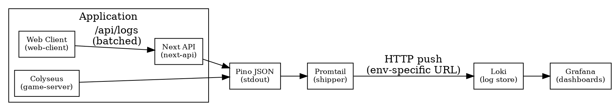

# Unified Logging Strategy

Status: Draft
Owner: Platform / Observability
Date: 2025‑11‑29

## 1) Core Principle
Single path for all logs:

App → logger → stdout → Promtail → Loki → Grafana

Dev vs Prod differs only by:
- Different `LOKI_URL`
- Different labels (`env="dev"` vs `env="prod"`)

Everything else is identical. No special “local debug path” that diverges from prod. CLI tools should read from Loki instead of raw files.

---

## 2) Components & Responsibilities

### 2.1 Application Logger (shared)
Use a single logger abstraction (Pino‑based) in all Node code:
- Colyseus game server
- Next API routes
- `/api/logs` endpoint (for browser logs)

Shape of each log (server and client):

```ts
type LogLevel = 'debug' | 'info' | 'warn' | 'error';

interface BaseLog {
  level: LogLevel;
  msg: string;
  timestamp: string; // ISO string from new Date().toISOString()

  // Common labels
  service: 'game-server' | 'next-api' | 'web-client';
  env: 'dev' | 'staging' | 'prod';

  // Domain correlation
  gameId?: string;
  roomId?: string;
  playerId?: string;
  round?: number;
  phase?: 'lobby' | 'starting' | 'action' | 'consequence' | 'end';

  // Trace / op IDs
  rid?: string;
  traceId?: string;

  // Extra data (safely truncated)
  data?: unknown;
}
```

Server logging example:
```ts
logger.info({ gameId, round, phase }, 'advanceRound:start');
```

Browser logging example:
```ts
logger.info('user_clicked_submit', { gameId, round, url: location.href });
```

### 2.2 Where logs go (identical in all envs)
Node side
- Pino writes JSON to stdout.
- No environment‑specific file logic in the app.
- If you also want local files (for backup), use Docker logging driver or `tee` at the process level — the app doesn’t care.

Browser side
- ClientLogger batches logs and POSTs them to `/api/logs`.
- `/api/logs` just calls the same Pino logger, so browser logs appear in the same stream as server logs (with `service="web-client"`).
- From Loki’s point of view, there’s one unified stream.

### 2.3 Promtail (the only shipper)
Runs next to your app (local and prod). Reads from container logs / stdout (or a single JSON log file if you prefer). Adds labels and ships to Loki.

Example snippet:
```yaml
server:
  http_listen_port: 9080
  grpc_listen_port: 0

positions:
  filename: /tmp/positions.yaml

clients:
  - url: http://loki:3100/loki/api/v1/push    # dev
    # prod example:
    # url: https://your-prod-loki/loki/api/v1/push

scrape_configs:
  - job_name: containers
    static_configs:
      - targets: [localhost]
        labels:
          job: app
          env: dev           # prod|staging in other envs
          service: game-server
          host: laptop
          __path__: /var/log/containers/*.log
```

No difference in application code between dev & prod. Only Promtail config changes.

### 2.4 Loki & Grafana
- Loki: source of truth for logs in all envs.
- Grafana: your log UI for everything.

Examples:
- All logs for a specific game:
  ```
  {gameId="ABC123"} | json
  ```
- Errors from browser during action phase in prod:
  ```
  {service="web-client", env="prod", level="error"} |= "phase=action"
  ```

### 2.5 CLI view-logs (optional, but unified)
Your current script may read local files. In the unified design, prefer querying Loki’s API.

Rough idea:
```ts
// Pseudocode: GET /loki/api/v1/query_range
// query={env="dev"} | json
// then merge, sort by timestamp, print
```
Now even your CLI view goes through the same pipeline.

---

## 3) Dev vs Prod as “Views”

### Local Dev
Run stack via docker‑compose:
- game‑server (Node, Pino → stdout)
- Next API
- Promtail (scraping container logs)
- Loki (local)
- Grafana (local)
- env="dev" in logger
- Promtail sends to `http://loki:3100`

Debug via:
- Grafana at `http://localhost:<grafana-port>`
- Optional `pnpm logs:view` that hits the local Loki

### Staging/Prod
- Same containers (or k8s pods)
- Same Pino, same Promtail, same log schema
- Only differences:
  - `env="staging"` / `env="prod"`
  - Promtail `clients.url` points at prod Loki (self‑hosted or Grafana Cloud)
- The application code doesn’t change

---

## 4) Interaction With Game State Design
This fits our multiplayer architecture nicely.

- StateManager → when advancing round, log:
  ```ts
  logger.info({
    gameId,
    roomId,
    round: nextState.round,
    phase: nextState.phase,
  }, 'advanceRound:done');
  ```

- Mail / pub‑sub infra → when an in‑game mail is sent:
  ```ts
  logger.info({
    gameId,
    roomId,
    round,
    sender: playerId,
    recipients: [...],
    channel: 'mail',
  }, 'mail:sent');
  ```

Grafana queries like:
```
{gameId="ABC123", channel="mail"} | json
```
provide mail audit trails. Agents/tools can call a “logs” API that wraps exactly those queries.

---

## 5) Diagram (Unified Logging)
Graphviz (DOT) sketch of the single pipeline:



Key points:
- Single path from app to Grafana.
- Dev vs prod is env label + Promtail destination, not separate code paths.
- Browser logs go through the same logger + stdout via `/api/logs`.

---

## 6) Action Items
- Adopt/extend a single Pino logger in server (`server/lib/logger`).
- Add `/api/logs` route in Next to accept client logs and write to the same logger.
- Provide Promtail config examples for dev/prod and document `LOKI_URL` envs.
- Add a minimal `pnpm logs:view` that queries Loki in dev.

