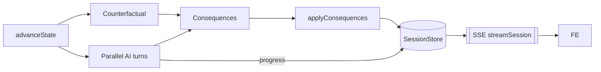

# Frontend–Backend Architecture: Zustand Stores, Endpoints, and SSE (Current State)

Owner: Platform • Status: Current • Last updated: 2025-11-05

This document describes how the React client (Zustand stores + hooks) interacts with the server-authoritative session backend, which HTTP endpoints are used, and how Server‑Sent Events (SSE) drive real‑time UI updates. It reflects the current code as of the App Router + modular controller migration.

## High‑Level Overview

- The backend exposes a single consolidated router under `/api/session/[[...parts]]` to manage session lifecycle and round progression (create, initialize, options, actions, advance, debrief, stream).
- The frontend keeps UI state in small focused Zustand stores (game, session, lobby, action, ui) and talks to the backend via `SessionService`/`sessionClient` wrappers.
- Real‑time updates are delivered via SSE. A single component (`components/SessionMonitor`) subscribes to `/api/session/:id/stream` and merges snapshots/progress into the stores.

```mermaid
flowchart TD
  subgraph FE[Frontend]
    subgraph Stores
      game[gameStore]
      session[sessionStore]
      lobby[lobbyStore]
      action[actionStore]
      ui[uiStore]
    end
    useGA[useGameActions]
    useRO[useRoundOptions]
    SM[SessionMonitor]
    svc[SessionService → sessionClient]
  end

  API[/api/session/[[...parts]]/]

  useGA --> svc
  useRO --> svc
  svc --> API
  SM --> game
  SM --> action
  SM --> ui
  SM --> lobby
  session -. id/rev/host .-> SM
```

## Zustand Stores (current)

All stores live in `stores/` and are accessed via small wrapper hooks in `hooks/` (for component ergonomics and testability).

### gameStore.ts
- State
  - `gameState: { phase, round, coreMetric, eventLog, currentEvent }`
  - `players: Player[]`
  - `gameSetup: GameSetup | null`
- Selectors
  - `humanPlayer()` → Player | null
  - `latestLogEntry()` → GameLogEntry | null
- Actions
  - `setGameState(next)` (value or updater)
  - `setPlayers(next)` (value or updater)
  - `setGameSetup(next)` (value or updater)
  - `reset()` → restore to LOBBY/empty

Used by: `useGame`, `SessionMonitor`, `GamePage`, `EndPage`.

### sessionStore.ts
- State
  - `sessionMeta: { id, revision, hostToken } | null`
  - `hasStartIntent: boolean`
  - `isBackendMode: boolean` (derived: env or presence of `sessionMeta`)
- Actions: `setSessionMeta`, `setStartIntent`, `clear`

Used by: `useSession`, `RouteOrchestrator`, `SessionMonitor`, `useGameActions`.

### lobbyStore.ts
- State: `selectedRoleName`, `gamePath` ('classic' | 'custom' | 'ai_safety'), `gameSetup`, `customScenario`
- Actions: `setSelectedRoleName`, `setGamePath`, `setGameSetup`, `setCustomScenario`, `reset`

Used by: `useLobby`, `useGameActions`, `useRoundOptions`.

### actionStore.ts
- State: `actionOptions: ActionOption[]`, `aiCompletionStatus: Record<string, boolean>`
- Actions: `setActionOptions`, `setAICompletionStatus`, `updateAICompletion(roleName, done)`

Used by: `useActions`, `useGameActions`, `useRoundOptions`, `SessionMonitor`, `ActionSelection`.

### uiStore.ts
- State: `isLoading`, `loadingMessage`, `error`, `isActionTreeOpen`, `isHistoryOpen`, `expandedRound`
- Start HUD: `startProgress` with steps (`creatingSession`, `buildingPlayers`, `generatingScenario`, `connectingStream`, `ready`) states: `'idle' | 'running' | 'done' | 'error'`
- Actions: `setLoading`, `setError`, `setActionTreeOpen`, `setHistoryOpen`, `setExpandedRound`, `setStartProgress`, `setStartStep`, `reset`

Used by: `useUI`, `SessionMonitor`, `StartProgress`, screens.

## Client–Server Interactions (HTTP)

All FE calls go through `services/SessionService.ts` → `services/sessionClient.ts` (fetch wrappers). The authoritative routes live in `app/api/session/[[...parts]]/route.ts`, which delegates pure logic to `lib/api/session-router.ts` and the store (`server/stores/sessionStore.*`).

### Endpoints

1) Create Session
- `POST /api/session`
- Body: `{ mode: 'classic' | 'custom' | 'ai_safety', setup?: GameSetup, maxRounds?: number, aiPlayers?: number }`
- Response: `201 { success: true, data: { id, revision, hostToken, state } }` + headers: `ETag: <rev>`, `x-revision`
- FE use: `SessionService.create(args)`; result goes into `sessionStore.sessionMeta`.

2) Initialize Session
- `POST /api/session/:id/initialize`
- Server sets `phase=ACTION`, `round=1`, derives initial `currentEvent` and ensures players exist (from setup).
- Response: `200 { success: true, data: { id, state, revision } }`
- FE use: `SessionService.initialize(id)`; used immediately after create.

3) Get Session (conditional)
- `GET /api/session/:id` with optional `If-None-Match: <rev>`
- Response: `200 { success: true, data: { id, state, revision, submitted?, deadlineAt?, players? } }` or `304` if unchanged.
- FE use: background refresh (rare); primary updates come via SSE.

4) Generate Human Action Options
- `POST /api/session/:id/action-options`
- Body: `{ playerId: string, playerRoleName?: string }`
- Response: `200 { success: true, data: { options: ActionOption[] } }`
- FE use: `useRoundOptions.loadHumanOptions()`; drives the round’s selection UI.

5) Submit Human Actions
- `POST /api/session/:id/actions`
- Headers: `If-Match: <revision>`
- Body: `{ playerId: string, actions: ActionOption[] }`
- Response: `200 { success: true, data: { id, state, revision, submitted } }` + `ETag`
- FE use: `SessionService.submitActions(...)` from `useGameActions.handleConfirmActions`.

6) Advance Round (server computes all consequences)
- `POST /api/session/:id/advance`
- Headers: `If-Match: <revision>`, `x-host-token: <hostToken>`
- Body: `{ humanRoleName, humanPlayerId, humanActions, humanAvailableOptions }`
- Response: `200 { success: true, data: { id, state, revision } }` + `ETag`
- FE use: `SessionService.advance(...)` (called after human actions submitted). UI also receives SSE during this call for per‑actor progress.

7) Debrief
- `POST /api/session/:id/debrief`
- Response: `200 { success: true, data: { summary, keyEvents, userActions } }`

8) Stream (SSE)
- `GET /api/session/:id/stream`
- Events: `event: session` with `data: { type: 'snapshot' | 'update' | 'progress' | 'advance', snapshot, payload? }`, and periodic `event: ping`.
- FE use: `components/SessionMonitor` is the single subscriber; merges each event into the stores.

### Round Flow (sequence)

```mermaid
sequenceDiagram
  participant FE as Frontend (stores/hooks)
  participant API as /api/session router
  participant Store as SessionStore
  participant LLM as LLM Service

  Note over FE: Start intent set; role chosen in lobbyStore
  FE->>API: POST /api/session { mode, setup }
  API->>Store: create()
  Store-->>API: snapshot {id, revision=1}
  API-->>FE: 201 { id, revision, hostToken }
  FE->>API: POST /:id/initialize
  API->>Store: update phase=ACTION, round=1, players from setup
  Store-->>FE: SSE session { type: 'snapshot' }

  FE->>API: POST /:id/action-options { playerId, role }
  API->>LLM: generateActionOptions
  LLM-->>API: { options }
  API-->>FE: 200 { options }

  FE->>API: POST /:id/actions (If-Match: rev)
  API->>Store: submitActions()
  Store-->>FE: SSE session { type: 'update', submitted }

  FE->>API: POST /:id/advance (If-Match, x-host)
  par AI turns
    API->>LLM: generateAITurn (ai1..n)
    API-->>FE: SSE session { type: 'progress', payload: { role } }
  and Counterfactual
    API->>LLM: generateCounterfactual
  end
  API->>LLM: generateConsequences(...)
  API->>Store: advance() applyConsequences
  Store-->>FE: SSE session { type: 'advance', snapshot }
  API-->>FE: 200 { state, revision }
```

## SSE in Detail

### Backend
- Stream handler: `app/api/session/[[...parts]]/route.ts → streamSession()`
  - Sends an initial `snapshot` event.
  - Subscribes to store events (`update`, `progress`, `advance`) and relays them as `event: session` with a unified payload.
  - Heartbeat `event: ping` every 15s.
- Advance pipeline: `createAdvanceState()`
  - Kicks off counterfactual; runs AI turns in parallel; emits `'progress'` per AI completion.
  - Computes consequences; applies; emits `'advance'` with the new snapshot.



### Frontend
- Subscriber: `components/SessionMonitor`
  - Opens `EventSource(/api/session/:id/stream)` when `sessionMeta.id` exists.
  - For each `session` event:
    - If `snapshot.state` present → `gameStore.setGameState`.
    - If `snapshot.setup` present → `lobbyStore.setGameSetup`.
    - Merge `snapshot.players` and `snapshot.submitted` into local `players` (id‑first, then `role.name`).
    - If `payload.role` present → `actionStore.updateAICompletion(role, true)` (turn cell goes green).
    - On `type==='advance'` → reset per‑round UI (`actionOptions`, `aiCompletionStatus`, loading/error, start step).

```mermaid
flowchart TD
  es[EventSource message]
  parse[parse payload]
  gs[gameStore.setGameState]
  ls[lobbyStore.setGameSetup]
  ps[gameStore.setPlayers (merge)]
  ac[actionStore.updateAICompletion]
  ui[uiStore resets on advance]
  es --> parse --> gs --> ps --> ui
  parse --> ls
  parse --> ac
```

## How the Client Uses Endpoints Today

- `useGameActions.handleStartGame()`
  - Ensures Start HUD steps, builds initial players in client store for UI, creates a session via `SessionService.create({ mode, setup })`, then calls `SessionService.initialize(id)`. When backend mode is on, this becomes authoritative (SSE snapshots drive state).

- `useRoundOptions.loadHumanOptions()`
  - When entering ACTION with no options loaded, requests `/action-options` for the human; stores into `actionStore.actionOptions`. If no session exists, it may create one (current behavior; see “Migration Notes”).

- `useGameActions.handleConfirmActions(actions)`
  - Marks human submitted in store, `SessionService.submitActions(...)` with `If-Match: revision`, then calls `SessionService.advance(...)`. During advance, SSE progress arrives and the UI updates per actor.

## Migration Notes / Current Limitations

- Classic mode: if `setup` is omitted on create, the server falls back to a minimal one‑stakeholder setup. The UI, however, may render more roles from constants. Always send a full canonical setup at create to avoid roster drift.
- Duplicate SSE wiring existed in `hooks/useSession` (legacy); `components/SessionMonitor` is the intended single subscriber.
- Some legacy client LLM paths exist for “chat mode” consequences; they should not run in backend mode and are being removed in the modular migration.

## Quick Reference (Files)

- FE stores/hooks
  - `stores/gameStore.ts`, `stores/sessionStore.ts`, `stores/lobbyStore.ts`, `stores/actionStore.ts`, `stores/uiStore.ts`
  - `hooks/useGame.ts`, `hooks/useSession.ts`, `hooks/useLobby.ts`, `hooks/useActions.ts`, `hooks/useUI.ts`, `hooks/useGameActions.ts`, `hooks/useRoundOptions.ts`
  - `components/SessionMonitor.tsx`, `components/RouteOrchestrator.tsx`, `components/StartProgress.tsx`
- BE router/engine
  - `app/api/session/[[...parts]]/route.ts` (Next route handler, SSE)
  - `lib/api/session-router.ts` (pure request handling)
  - `server/stores/sessionStore.*` (Memory store, events)
  - `server/services/sessionEngine.ts` (applyConsequences)
  - `server/services/llm/*.ts` (LLM adapter)

## Appendix: Minimal Payload Shapes (indicative)

```ts
// Create
type CreateReq = { mode: 'classic'|'custom'|'ai_safety'; setup?: GameSetup; maxRounds?: number; aiPlayers?: number };
type CreateRes = { id: string; revision: number; hostToken: string; state: GameState };

// Action Options
type OptionsReq = { playerId: string; playerRoleName?: string };
type OptionsRes = { options: ActionOption[] };

// Submit / Advance
type SubmitReq = { playerId: string; actions: ActionOption[] };
type AdvanceReq = { humanRoleName?: string; humanPlayerId?: string; humanActions?: ActionOption[]; humanAvailableOptions?: ActionOption[] };

// SSE event
type SessionEvent = { type: 'snapshot'|'update'|'progress'|'advance'; snapshot: { id: string; state: GameState; revision: number; submitted?: Record<string, boolean>; players?: Player[]; setup?: GameSetup }, payload?: Record<string, unknown> };
```

---

If anything diverges from the above during migration (e.g., persistence switch from memory to Prisma), update this doc and add diagrams for the new flow.

