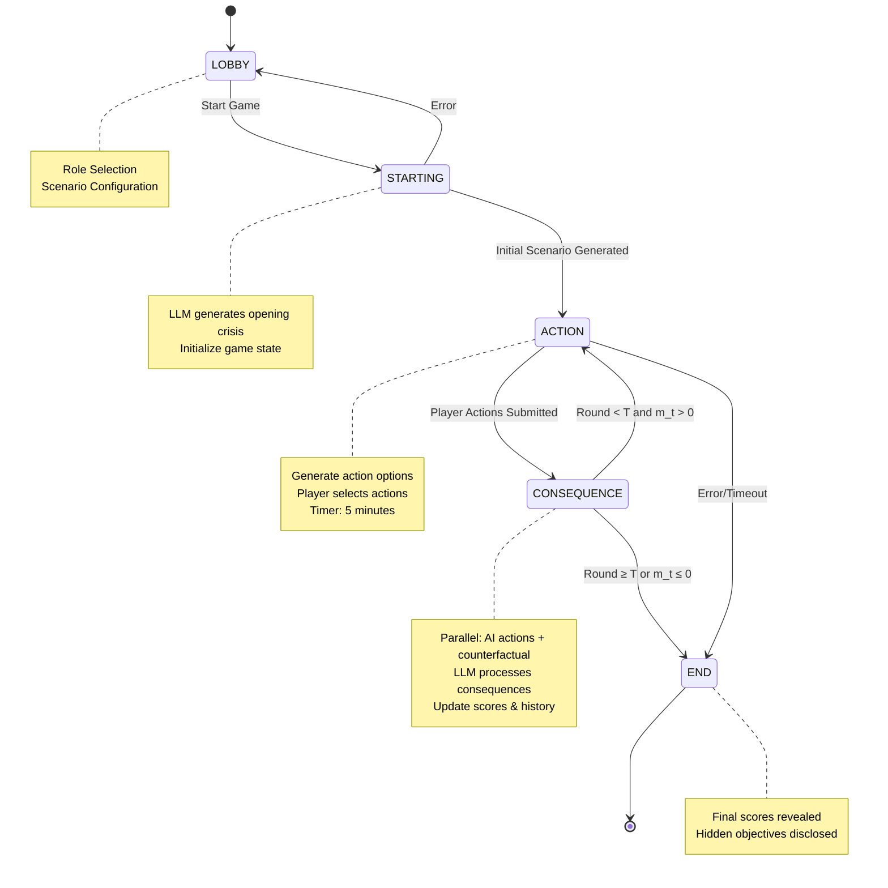
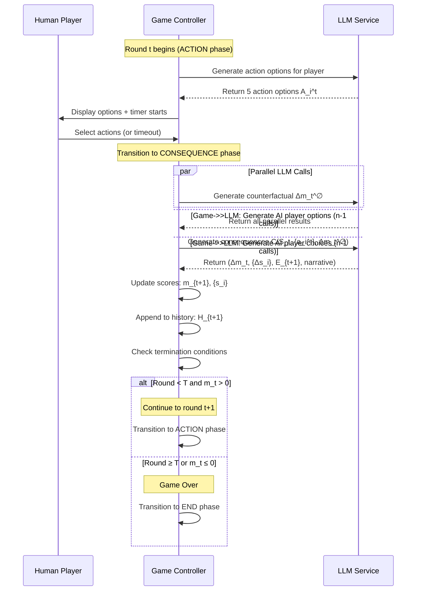
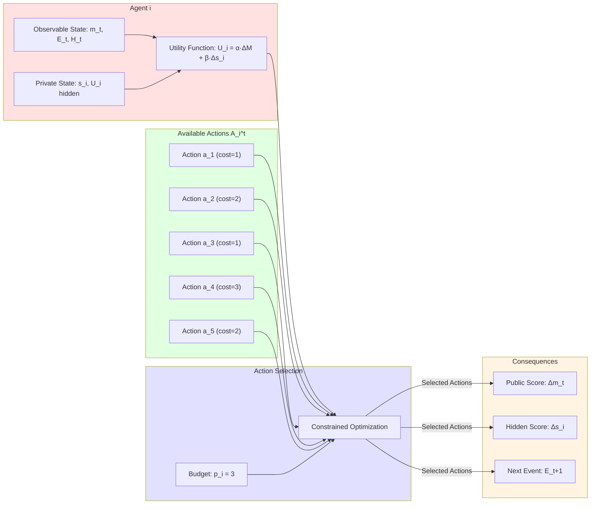
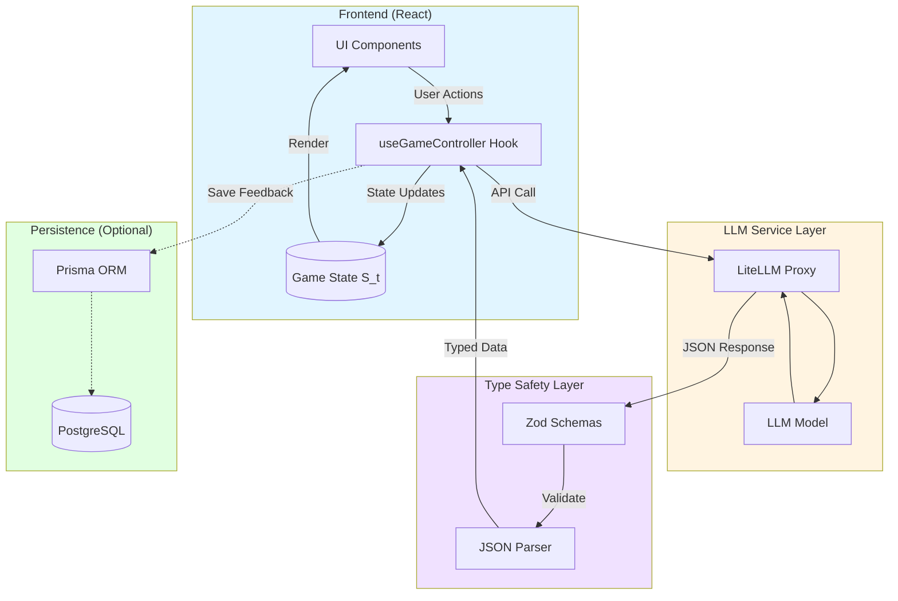

# The Mathematical Architecture of Simulacra

## Abstract

Simulacra is a multi-agent crisis simulation system where human and AI players navigate strategic dilemmas through sequential decision-making under information asymmetry. This document explores the game's technical architecture through the lens of mathematical abstractions: state machines, utility functions, stochastic processes, and computational game theory.

## 1. Introduction: Simulation as Strategic Game

At its core, Simulacra implements a **sequential multi-agent game** with the following characteristics:

- **Finite horizon**: $T = 5$ rounds maximum
- **Perfect recall**: Complete history of all actions
- **Imperfect information**: Hidden objectives create strategic uncertainty
- **Stochastic transitions**: LLM-generated consequences introduce probabilistic elements
- **Cooperative-competitive dynamics**: Shared public metric with conflicting private goals

The game exists at the intersection of cooperative game theory (shared crisis management) and non-cooperative game theory (individual hidden objectives), creating rich strategic tension.

## 2. Core Mathematical Model

### 2.1 State Space

The game state at time $t$ can be represented as a tuple:

$$S_t = (\varphi_t, r_t, m_t, E_t, H_t)$$

Where:
- $\varphi_t \in \Phi$ : Current phase in the finite state machine
- $r_t \in [0, T]$ : Round number
- $m_t \in [0, 100]$ : Core metric value (clamped)
- $E_t$ : Current event/crisis (narrative state)
- $H_t = [h_1, h_2, \ldots, h_t]$ : Complete history log

Phase space $\Phi$ is a finite set:

$$\Phi = \{\text{LOBBY}, \text{STARTING}, \text{ACTION}, \text{CONSEQUENCE}, \text{END}\}$$

Phase transitions follow a deterministic pattern (except for failure states):



### 2.2 Agents and Roles

Let $N$ be the set of agents (typically $|N| = 6$). Each agent $i \in N$ has:

$$\text{Agent}_i = (R_i, \tau_i, U_i^{\text{pub}}, U_i^{\text{hidden}}, s_i, p_i)$$

Where:
- $R_i$ : Role specification (Election Commissioner, Tech CEO, etc.)
- $\tau_i \in \{\text{human}, \text{AI}\}$ : Agent type
- $U_i^{\text{pub}}$ : Public utility function (shared, visible to all)
- $U_i^{\text{hidden}}$ : Private utility function (secret objective)
- $s_i \in \mathbb{R}$ : Hidden score (accumulated private utility)
- $p_i \in [0, P_{\max}]$ : Available action points

The **dual utility structure** is key to strategic depth:

$$\text{Total\_Utility}_i = \alpha \cdot \Delta M + \beta \cdot \Delta s_i$$

Where:
- $\Delta M$ : Change in public metric
- $\Delta s_i$ : Change in hidden score
- $\alpha, \beta$ : Implicit weights (player-determined)

This creates a **principal-agent problem**: players must decide how to balance collective good ($M$) against personal objectives ($s_i$).

### 2.3 Action Space

At each round $t$ in the ACTION phase, each agent selects actions from a finite set:

$$A_i^t = \{a_1, a_2, \ldots, a_k\} \text{ where } k = 5 \text{ (for human players)}$$

Each action has:

$$a_j = (\text{title}, \text{description}, \text{cost})$$
$$\text{cost} \in [1, 3]$$

Agents face a **constrained optimization problem**:

$$
\begin{align}
\text{maximize} \quad & U_i(a_{\text{chosen}}) \\
\text{subject to} \quad & \sum_{a \in a_{\text{chosen}}} \text{cost}(a) \leq p_i \\
& a_{\text{chosen}} \subseteq A_i^t
\end{align}
$$

This is a variant of the **knapsack problem** with utility uncertainty, as the exact payoff of actions is unknown at selection time.

```mermaid

architecture-beta
    service user(mdi:account)
    service lambda(logos:aws-lambda)

    user:R --> L:lambda

```



### 2.4 Action Generation as Function Composition

The generation of available actions is a stochastic mapping:

$$G_{\text{options}} : (\text{Agent}_i, S_t, H_{t-1}) \to A_i^t$$

Where $G_{\text{options}}$ is implemented by an LLM acting as a constrained random variable generator. The LLM produces outputs from a conditional probability distribution:

$$P(A_i^t \mid \text{Agent}_i, S_t, H_{t-1}, \text{Prompt}, \theta)$$

Where $\theta$ represents the model parameters. This function must satisfy:
- Cardinality constraint: $|A_i^t| = 5$
- Cost constraint: $\forall a \in A_i^t, \text{cost}(a) \in \{1, 2, 3\}$
- Relevance constraint: Actions must be contextually appropriate

## 3. Temporal Dynamics

### 3.1 State Transition Function

The game implements a **discrete-time dynamical system**. The transition from round $t$ to $t+1$ follows:

$$S_{t+1} = F(S_t, \{a_1^t, a_2^t, \ldots, a_n^t\}, \xi_t)$$

Where:
- $\{a_i^t\}$ : Joint action profile (all agents' chosen actions)
- $\xi_t$ : Stochastic element (LLM-generated consequences)
- $F$ : Consequence function

The consequence function decomposes into:

$$F(\cdot) = (\varphi_{t+1}, r_t + 1, M_{\text{update}}(\cdot), E_{\text{gen}}(\cdot), H_t \cup \{\text{log}_t\})$$

#### Round Flow Diagram



### 3.2 Metric Update Function

The core metric evolves according to:

$$m_{t+1} = \text{clamp}(m_t + \Delta m_t, 0, 100)$$

where $\text{clamp}(x, \min, \max) = \max(\min, \min(x, \max))$

The change $\Delta m_t$ is determined by the consequence function $C$:

$$C : (S_t, \{a_i^t\}_{i \in N}) \to (\Delta m_t, \{\Delta s_i\}_{i \in N}, E_{t+1}, \text{narrative}_t)$$

This is the **heart of the simulation**: a many-to-many mapping from joint actions to outcomes. It's stochastic (via LLM) and explicitly designed to be **interpretable** through narrative output.

### 3.3 Counterfactual Computation

A critical innovation is the parallel computation of the **counterfactual world state**:

$$\Delta m_t^{\emptyset} = C_{\text{null}}(S_t, \emptyset)$$

Where $C_{\text{null}}$ computes the metric change if *no agents acted*. This serves multiple purposes:

1. **Baseline comparison**: Shows the "cost of inaction"
2. **Narrative context**: Helps LLM calibrate action consequences
3. **Game balance**: Prevents degenerate strategies (doing nothing)

Mathematically, this creates a **parallel universe branching**:

$$
\begin{align}
\text{World}_{\text{actual}} &= (S_t, \{a_i^t\}) \to S_{t+1} \\
\text{World}_{\text{null}} &= (S_t, \emptyset) \to S_{t+1}^{\emptyset}
\end{align}
$$

The counterfactual is computed **concurrently** with actual consequences for performance.

## 4. The LLM as Stochastic Game Master

### 4.1 LLM as Probability Distribution

The LLM can be modeled as a parameterized conditional probability distribution over valid game continuations:

$$P_\theta(\text{outcome} \mid S_t, \{a_i^t\}, \text{prompt})$$

Unlike classical game theory where transition probabilities are explicitly specified, here they are:
- **Implicitly defined** by model weights $\theta$
- **Context-dependent** (influenced by entire game history)
- **Constrained** by structured output schemas

This is analogous to a **Markov Decision Process (MDP)** with a black-box transition function that we constrain through prompting and schema validation.

### 4.2 Structured Output as Type System

To ensure well-formed game states, we enforce output constraints via:

$$\text{Output}_{\text{schema}} : \text{JSON} \to \text{Result}_{\text{type}} \cup \{\bot\}$$

Where $\bot$ represents parsing failure. The schema acts as a **partial function** that maps unstructured LLM output to strongly-typed game data.

For example, the consequence generation has schema:
```
ConsequenceSchema = {
    roundSummary: String,
    outcomeTimeline: Array[TimelineItem, 3..5],
    publicScoreUpdate: Integer,
    hiddenScoreUpdates: Array[HiddenUpdate, |N|],
    nextEvent: Event
}
```

This is **runtime type checking** that bridges the gap between probabilistic text generation and deterministic game logic.

### 4.3 Parallel LLM Computation

The CONSEQUENCE phase involves multiple LLM calls that are **parallelized** to minimize latency:

$$
\begin{align}
\text{parallel} \quad & \begin{cases}
\Delta m_{\emptyset} \leftarrow C_{\text{null}}(S_t) \\
\{A_i^t\}_{i \in N \setminus \{\text{human}\}} \leftarrow \prod_{i \in \text{AI}} G_{\text{options}}(i, S_t) \\
\{a_i^t\}_{i \in N \setminus \{\text{human}\}} \leftarrow \prod_{i \in \text{AI}} G_{\text{choose}}(i, A_i^t, S_t)
\end{cases} \\
\text{then} \quad & (\Delta m_t, \ldots) \leftarrow C(S_t, \{a_i^t\}, \Delta m_{\emptyset})
\end{align}
$$

This implements a **fork-join parallelism** pattern:
1. **Fork**: Launch $n+1$ independent LLM calls
2. **Join**: Wait for all to complete
3. **Sequential**: Use results for final consequence generation

The parallelization is safe because these computations have no data dependencies (besides shared read-only state $S_t$).

## 5. Game-Theoretic Properties

### 5.1 Nash Equilibrium and Strategic Tension

In classical game theory, a **Nash equilibrium** occurs when no player can improve their payoff by unilaterally changing strategy.

In Simulacra, finding Nash equilibria is intractable because:
1. **Infinite strategy space**: Actions are generated dynamically, not from a fixed set
2. **Unknown payoff function**: $C$ is a black-box LLM
3. **Imperfect information**: Players don't know others' utility functions

This **strategic uncertainty** is a feature, not a bug. It mirrors real-world crisis scenarios where:
- Outcomes are unpredictable
- Others' motivations are unclear
- No optimal strategy exists

### 5.2 Information Asymmetry

The game implements **asymmetric information** through hidden objectives:

$$
\text{Information}_i = \begin{cases}
\text{observable:} & (m_t, E_t, H_t, \{a_j^{t-1}\}_{j \in N}, U_i^{\text{pub}}) \\
\text{private:} & (s_i, U_i^{\text{hidden}}, p_i)
\end{cases}
$$

Each agent has:
- **Complete information** about public state
- **Private information** about their hidden score and objective
- **Zero information** about others' hidden states

This creates a **signaling game**: actions may reveal information about hidden objectives, enabling opponent modeling.

### 5.3 Scoring as Multi-Objective Optimization

The dual-score system creates a **Pareto frontier** trade-off:

$$\text{Pareto}_{\text{optimal}} = \{(\Delta m, \Delta s) \mid \neg \exists (\Delta m', \Delta s') : \Delta m' > \Delta m \land \Delta s' > \Delta s\}$$

Rational agents must choose points along this frontier based on their weighting $(\alpha, \beta)$. Different roles implicitly have different $\alpha/\beta$ ratios based on their objectives:

- **Election Commissioner**: High $\alpha$ (prioritize public metric)
- **Campaign Manager**: High $\beta$ (prioritize hidden objective)
- **Others**: Mixed strategies

#### Agent Decision-Making Structure



### 5.4 Termination Conditions

The game has **two terminal states**:

$$\text{is\_terminal}(S_t) = (r_t > T) \lor (m_t \leq 0)$$

This creates **survival constraints**:
1. **Soft constraint**: Complete $T$ rounds (success condition)
2. **Hard constraint**: Keep $m_t > 0$ (failure condition)

The hard constraint forces **minimum cooperation**: if players pursue hidden objectives too aggressively and crash the public metric, everyone loses.

## 6. Computational Architecture

### 6.1 State Management as Functional Composition

Game state updates follow a **pure functional pattern**:

$$S_{t+1} = \text{reduce}(S_t, \text{action}_t)$$

Where $\text{reduce}$ is a pure function (no side effects). This ensures:
- **Reproducibility**: Same inputs → same outputs
- **Debuggability**: Complete state history for replay
- **Testability**: Easy to unit test state transitions

The React implementation uses hooks to maintain this functional purity while managing UI updates.

#### System Architecture Diagram



### 6.2 Event Log as Persistent Data Structure

The history $H_t$ is an **append-only log**:

$$H_t = H_{t-1} \cup \{\text{log}_t\}$$

where

$$
\text{log}_t = \begin{cases}
\text{round:} & r_t \\
\text{playerActions:} & \{a_i^t\}_{i \in N} \\
\text{availableOptions:} & \{A_i^t\}_{i \in N} \\
\text{consequences:} & (\Delta m_t, \{\Delta s_i\}, \text{narrative}_t) \\
\text{counterfactual:} & \Delta m_t^{\emptyset}
\end{cases}
$$

This forms a **complete causal graph** of the game, enabling:
- **Provenance tracking**: Why did the metric change?
- **Action tree visualization**: What choices were available?
- **Counterfactual analysis**: What if players acted differently?

### 6.3 Schema Validation as Contract

The Zod schemas enforce **contracts** between LLM and game engine:

$$\text{validate} : \text{LLM}_{\text{output}} \to \text{Game}_{\text{data}} \cup \{\text{Error}\}$$

This is a **defensive programming** pattern that prevents:
- **Type errors**: String where number expected
- **Constraint violations**: Array of 7 items when exactly 5 required
- **Missing fields**: Incomplete responses

If validation fails, the system has **fallback strategies**:
1. Try structured output with stricter constraints
2. Fall back to JSON mode with manual parsing
3. Return error and halt simulation

## 7. Emergent Complexity

### 7.1 Narrative Coherence as Constraint Satisfaction

Each round must produce a coherent narrative that:
1. Respects previous events ($H_t$ consistency)
2. Reflects player actions (causality)
3. Escalates tension (dramatic progression)
4. Updates all scores (bookkeeping)

This is a **constraint satisfaction problem**:

$$
\begin{align}
\text{Find } & \text{narrative} \in \text{Narrative}_{\text{space}} \text{ such that:} \\
& \text{coherent}(\text{narrative}, H_t) = \text{true} \\
& \forall i : \text{action\_reflected}(\text{narrative}, a_i^t) = \text{true} \\
& \text{tension}(\text{narrative}) > \text{tension}(E_t) \\
& \text{defines}(\text{narrative}, \Delta m_t, \{\Delta s_i\})
\end{align}
$$

The LLM solves this implicitly through its training on narrative structures.

### 7.2 Adaptive Difficulty via Dynamic Crisis Generation

The crisis event sequence $\{E_1, E_2, \ldots, E_T\}$ is **procedurally generated** based on:

$$E_{t+1} = \text{escalate}(E_t, H_t, m_t)$$

This creates **adaptive difficulty**:
- If $m_t$ is high → introduce more severe crisis
- If $m_t$ is low → crisis reflects desperate situation
- If players are passive → crisis worsens naturally

The game becomes a **co-creative storytelling process** where player actions shape the narrative trajectory.

### 7.3 Replay Value Through Stochasticity

Each playthrough generates a unique game tree:

$$\text{GameTree} = (S_0, [(a_1^1, S_1), (a_1^2, S_2), \ldots, (a_1^T, S_T)])$$

The branching factor at each node is:

$$B = \prod_{i \in N} |A_i^t|$$

For 6 players with 5 options each and 3 action points, the theoretical strategy space per round is enormous. Combined with LLM stochasticity, no two games are alike.

## 8. Future Extensions

### 8.1 Multi-Agent Reinforcement Learning

The current AI agents use single-shot LLM decisions. Future versions could implement:

$$\text{Policy}_i : (S_t, A_i^t) \to \text{Distribution}(a_i^t)$$

Where policies are learned through reinforcement learning on the hidden objective reward:

$$R_i = \sum_{t=1}^{T} \gamma^t \Delta s_i^t$$

This would enable AI agents to develop **strategic sophistication** over time.

### 8.2 Prompt Evolution as Meta-Learning

Track prompt versions and feedback ratings to optimize prompts via:

$$\theta^* = \arg\max_\theta \mathbb{E}[\text{Rating} \mid \text{Prompt}_\theta]$$

This treats prompt engineering as a **hyperparameter optimization** problem.

### 8.3 Multiplayer Coordination

Extend to true multiplayer by replacing AI agents with networked human players:

$$N = \{\text{human}_1, \text{human}_2, \ldots, \text{human}_k\}$$

This creates a **distributed system** with synchronization challenges:
- Action submission deadlines
- State consistency across clients
- Handling disconnections

The WebSocket architecture is already in place for this extension.

## 9. Conclusion

Simulacra demonstrates how LLMs can serve as **stochastic game masters** in complex multi-agent simulations. The architecture balances:

- **Flexibility**: Dynamic action generation and narrative
- **Constraint**: Structured schemas and game rules
- **Emergence**: Unpredictable outcomes from player interaction
- **Coherence**: Narrative and mechanical consistency

By modeling the game as a finite-state machine with LLM-driven transitions, we create a system that is both **deterministic** (in its structure) and **stochastic** (in its content). This hybrid approach enables rich strategic gameplay while maintaining technical robustness.

The mathematical abstractions—state machines, utility functions, constraint satisfaction, parallel computation—provide a rigorous framework for understanding and extending the system. As LLMs become more capable, games like Simulacra represent a new frontier in **computational narrative** and **procedural dramaturgy**.

---

## Appendix: Key Equations

**State Tuple**:
$$S_t = (\varphi_t, r_t, m_t, E_t, H_t)$$

**Agent Model**:
$$\text{Agent}_i = (R_i, \tau_i, U_i^{\text{pub}}, U_i^{\text{hidden}}, s_i, p_i)$$

**Transition Function**:
$$S_{t+1} = F(S_t, \{a_i^t\}_{i \in N}, \xi_t)$$

**Consequence Mapping**:
$$C : (S_t, \{a_i^t\}) \to (\Delta m_t, \{\Delta s_i\}, E_{t+1}, \text{narrative}_t)$$

**Counterfactual**:
$$\Delta m_t^{\emptyset} = C_{\text{null}}(S_t, \emptyset)$$

**LLM Probability Distribution**:
$$P_\theta(\text{outcome} \mid S_t, \{a_i^t\}, \text{prompt})$$

**Terminal Condition**:
$$\text{is\_terminal}(S_t) = (r_t > T) \lor (m_t \leq 0)$$

**Total Utility**:
$$U_i = \alpha \cdot \Delta M + \beta \cdot \Delta s_i$$

---

*This document provides a mathematical framework for understanding Simulacra's architecture. For implementation details, see the source code in `hooks/useGameController.ts` and `services/geminiService.ts`.*
