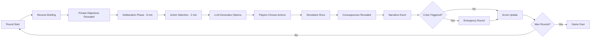

# Delhi Air Pollution Crisis - Tabletop Exercise

**An Interactive Simulation Game for EAGX 2025**

> *"When models meet reality: Can coordination save Delhi's air?"*

## Overview

This tabletop exercise (TTX) simulates the complex dynamics of air pollution management in Delhi, India—one of the world's most polluted megacities. Players take on strategic roles (policymakers, industry leaders, activists, bureaucrats) and navigate the tensions between economic growth, public health, and political feasibility.

**Target Audience:** EAGX attendees from policy, technology, research, and EA backgrounds

**Duration:** 60-90 minutes

**Players:** 4-8 participants

---

## Why Delhi Air Pollution?

### The Challenge

Delhi's air quality crisis is a **wicked problem** that mirrors many global challenges:

- **Complex causality**: Agricultural burning, vehicular emissions, industrial pollution, construction dust, weather patterns
- **Coordination failures**: Across jurisdictions (Delhi, Punjab, Haryana), sectors (transport, industry, agriculture), and timescales (daily, seasonal, multi-year)
- **Nonlinear dynamics**: Tipping points (public health emergencies), feedback loops (pollution → health → productivity → poverty → more pollution)
- **Uncertainty**: Weather, compliance, political will, technological adoption
- **Equity tensions**: Who bears costs vs benefits? (farmers, industry, commuters, children, elderly)

### The Opportunity

This TTX demonstrates:

1. **How formal models enhance decision-making** under uncertainty
2. **The power of combining approaches**: Hybrid systems + system dynamics + agent-based modeling + LLMs
3. **Translating research into action**: From academic models to playable games to policy insights

---

## Model Architecture

We use a **three-tier hybrid modeling approach**:

```
┌─────────────────────────────────────────────────────────────┐
│                    GAME INTERFACE (Web UI)                   │
│  Players see: Air Quality Index, Health Alerts, Budget,     │
│  Public Approval, Available Actions, Narrative Events       │
└─────────────────────────────────────┬───────────────────────┘
                                      │
┌─────────────────────────────────────▼───────────────────────┐
│              COORDINATION LAYER (LLM + Game Logic)           │
│  • Narrative generation (context-aware storytelling)         │
│  • Action option synthesis (5 choices per turn)             │
│  • Consequence computation (multi-model integration)        │
│  • Event triggering (crises, opportunities, media cycles)   │
└─────────────────────────────────────┬───────────────────────┘
                                      │
┌─────────────────────────────────────▼───────────────────────┐
│                   SIMULATION ENGINE (Python)                 │
│                                                              │
│  ┌────────────────┐  ┌────────────────┐  ┌───────────────┐ │
│  │ Hybrid Automaton│  │System Dynamics │  │ Agent-Based   │ │
│  │                 │  │                │  │ Model         │ │
│  │ Air quality     │  │ Emissions &    │  │ Stakeholder   │ │
│  │ regimes:        │  │ dispersion:    │  │ behavior:     │ │
│  │ • GOOD          │  │ • Stocks/flows │  │ • Farmers     │ │
│  │ • MODERATE      │  │ • Feedback     │  │ • Industries  │ │
│  │ • UNHEALTHY     │  │ • Tipping pts  │  │ • Citizens    │ │
│  │ • SEVERE        │  │ • Seasonality  │  │ • Politicians │ │
│  │ • HAZARDOUS     │  │                │  │               │ │
│  └────────────────┘  └────────────────┘  └───────────────┘ │
└──────────────────────────────────────────────────────────────┘
```

### Why Three Models?

Each captures different aspects:

| Model | What It Captures | Example in Delhi |
|-------|------------------|------------------|
| **Hybrid Automaton (HA)** | Discrete regime switches + continuous evolution | AQI crossing thresholds triggers emergency measures (GRAP stages) |
| **System Dynamics (SD)** | Stock-flow relationships, feedback loops | Crop burning emissions → PM2.5 accumulation → inversions → health burden |
| **Agent-Based Model (ABM)** | Heterogeneous actors, emergent coordination | Farmers' burning decisions based on neighbors, penalties, alternatives |
| **LLM Layer** | Context-aware narratives, option generation | "Farmers in Punjab report: 'We have no choice—stubble management is too expensive'" |

---

## Game Mechanics

### Roles (4-8 players)

1. **Delhi Chief Minister**: Manages city government, budget, public approval
2. **Central Environment Minister**: Coordinates across states, allocates funds, sets regulations
3. **Punjab Agriculture Secretary**: Represents farmers, balances crop cycles vs pollution
4. **Industry Association Leader**: Represents factories, construction, brick kilns
5. **Public Health Director**: Monitors health impacts, declares emergencies
6. **Civil Society Activist**: Mobilizes public, files legal cases, media pressure
7. **Transport Commissioner**: Manages vehicles, metro, road infrastructure
8. **Weather & Monitoring Chief**: Provides forecasts, AQI data, modeling

### Turn Structure (5 Rounds)

Each round represents **2 months** during the pollution season (Oct-Feb):



### Core Metrics

Players balance competing metrics:

1. **Air Quality Index (AQI)** [0-500+]
   - 0-50: Good (Green)
   - 51-100: Moderate (Yellow)
   - 101-200: Unhealthy (Orange)
   - 201-300: Very Unhealthy (Red)
   - 301-500: Hazardous (Purple)
   - 500+: Severe (Maroon) - triggers emergency

2. **Public Health** [0-100]
   - Hospitalization rates
   - Respiratory illnesses
   - Premature deaths
   - School closures

3. **Economic Activity** [0-100]
   - Industrial output
   - Construction projects
   - Agricultural productivity
   - Transportation efficiency

4. **Public Approval** [0-100]
   - Voter satisfaction
   - Protest intensity
   - Media sentiment
   - Political capital

5. **Budget** [₹ Crores]
   - Available funds for interventions
   - Cost of inaction (health, productivity)

### Hidden Objectives

Each role has a **public objective** (visible to all) and a **hidden objective** (secret win condition):

**Example: Chief Minister**
- Public: "Keep AQI below 300 throughout the season"
- Hidden: "Maintain public approval above 60% while spending <₹500 crores"

**Example: Farmer Representative**
- Public: "Protect farmer livelihoods"
- Hidden: "Prevent any ban on stubble burning that affects >30% of farmers"

This creates realistic tensions between stated goals and political constraints.

---

## Scenarios & Crisis Events

### Base Scenario: "October Crisis 2027"

**Initial State:**
- AQI: 150 (Unhealthy)
- Budget: ₹800 crores
- Public Approval: 65%
- Crop burning season approaching
- Diwali in 3 weeks
- Wind speeds dropping

**Random Events (triggered by conditions or rounds):**

1. **Meteorological**
   - Temperature inversion locks pollution
   - Unexpected rain disperses PM2.5
   - Dust storms from Rajasthan

2. **Political**
   - Supreme Court hearing on pollution
   - Election announcement
   - Inter-state conflict over jurisdiction

3. **Social**
   - School parent protests over closures
   - Viral health emergency video
   - Celebrity activism campaign

4. **Economic**
   - Industry threatens to relocate
   - Construction sector lobbying
   - International event cancellation

5. **Health**
   - Spike in emergency room visits
   - Children's hospital capacity exceeded
   - Premature death study published

---

## Technology Stack Integration

### Frontend (Existing Simulacra Stack)

Uses your existing React + TypeScript + Vite setup:

```typescript
// eagx/air_pollution/frontend/types.ts
export enum AirQualityRegime {
  GOOD = "GOOD",
  MODERATE = "MODERATE",
  UNHEALTHY = "UNHEALTHY",
  VERY_UNHEALTHY = "VERY_UNHEALTHY",
  HAZARDOUS = "HAZARDOUS",
  SEVERE = "SEVERE"
}

export interface DelhiGameState {
  round: number;
  aqi: number;
  regime: AirQualityRegime;
  publicHealth: number;
  economicActivity: number;
  publicApproval: number;
  budget: number;
  season: "pre_diwali" | "post_diwali" | "winter_peak" | "spring";
  grapStage: 1 | 2 | 3 | 4; // Graded Response Action Plan
}
```

### Backend (Python Models)

Located in `eagx/air_pollution/models/`:

1. `delhi_hybrid_automaton.py` - Regime switching based on AQI thresholds
2. `delhi_system_dynamics.py` - Emissions, dispersion, accumulation
3. `delhi_agent_based.py` - Farmer, industry, citizen behavior
4. `integration.py` - Combines all three models
5. `api.py` - FastAPI endpoints for frontend

### LLM Integration (LiteLLM)

Uses your existing LiteLLM proxy setup:

```python
# eagx/air_pollution/llm/narrative.py
from openai import OpenAI

client = OpenAI(
    base_url="https://asgard.bhishmaraj.org",
    api_key=os.getenv("VITE_LITELLM_API_KEY")
)

def generate_round_narrative(game_state, actions_taken, consequences):
    """Generate contextual narrative for round resolution"""
    # Uses actual AQI data, health metrics, stakeholder reactions
    # Returns: story beats, media headlines, stakeholder quotes
```

---

## Learning Objectives

For EAGX attendees, this TTX demonstrates:

### 1. **Formal Modeling in Practice**
- See how HA, SD, ABM complement each other
- Understand when to use which approach
- Experience model-informed decision-making

### 2. **Coordination Challenges**
- Multi-level governance (city, state, national)
- Multi-sector (agriculture, industry, transport)
- Multi-timescale (emergency vs long-term)

### 3. **Policy Design Principles**
- Leverage points in complex systems
- Feedback loops (reinforcing vs balancing)
- Tipping points and irreversibilities
- Co-benefits and trade-offs

### 4. **EA Frameworks Applied**
- Expected value under uncertainty
- Neglectedness (air pollution kills millions but gets less attention than climate)
- Tractability (what interventions actually work?)
- Cost-effectiveness (₹/DALY saved)

### 5. **Technology + Policy Synergy**
- Real-time monitoring → adaptive policies
- Predictive modeling → preemptive action
- Behavioral nudges → compliance
- LLMs → accessible communication

---

## Files in This Repository

```
eagx/air_pollution/
├── README.md                          # This file
├── GAME_GUIDE.md                      # Facilitator instructions
├── PLAYER_HANDBOOK.md                 # Quick reference for players
├── ARCHITECTURE.md                    # Technical deep-dive
├── models/
│   ├── delhi_hybrid_automaton.py      # HA implementation
│   ├── delhi_system_dynamics.py       # SD implementation
│   ├── delhi_agent_based.py           # ABM implementation
│   ├── integration.py                 # Multi-model coordinator
│   ├── api.py                         # FastAPI backend
│   └── requirements.txt               # Python dependencies
├── llm/
│   ├── prompts.py                     # LLM prompt templates
│   ├── narrative.py                   # Story generation
│   └── actions.py                     # Action option synthesis
├── data/
│   ├── delhi_aqi_historical.csv       # Real AQI data (2019-2024)
│   ├── emission_sources.json          # Source categories
│   └── policy_interventions.json      # Real policies (odd-even, GRAP, etc)
├── diagrams/
│   ├── architecture.mmd               # System architecture (Mermaid)
│   ├── game_flow.mmd                  # Turn structure
│   └── causal_loop.mmd                # Key feedback loops
├── web_ui/
│   └── streamlit_demo.py              # Quick demo UI
└── presentation/
    ├── EAGX_SLIDES.md                 # Conference presentation
    └── WORKSHOP_PLAN.md               # 90-min workshop outline
```

---

## Quick Start

### For Players (Game Session)

```bash
# Run the Streamlit demo
pip install -r models/requirements.txt
streamlit run web_ui/streamlit_demo.py
```

### For Developers (Full Stack)

```bash
# Backend
cd models
pip install -r requirements.txt
uvicorn api:app --reload

# Frontend (integrate with your existing Simulacra React app)
# See ARCHITECTURE.md for integration guide
```

### For Researchers (Model Exploration)

```bash
# Run individual models
python models/delhi_hybrid_automaton.py
python models/delhi_system_dynamics.py
python models/delhi_agent_based.py

# Run integrated simulation
python models/integration.py
```

---

## Next Steps

1. **Playtesting**: Run 2-3 sessions with diverse groups
2. **Calibration**: Tune model parameters against real Delhi data
3. **Expansion**: Add more scenarios (Beijing, LA, Jakarta)
4. **Research**: Extract policy insights from gameplay data
5. **Publication**: EA Forum post + academic paper

---

## References

### Air Pollution Science
- Guttikunda, S. K., & Calori, G. (2013). A GIS based emissions inventory at 1 km × 1 km spatial resolution for air pollution analysis in Delhi, India. *Atmospheric Environment*
- Conibear, L., et al. (2018). Residential energy use emissions dominate health impacts from exposure to ambient particulate matter in India. *Nature Communications*

### Policy & Governance
- Greenstone, M., & Hanna, R. (2014). Environmental regulations, air and water pollution, and infant mortality in India. *American Economic Review*
- Delhi Pollution Control Committee. Graded Response Action Plan (GRAP)

### Modeling Approaches
- Cassidy, K., et al. (2020). Mathematical modelling for health economic evaluation of air pollution interventions
- Our own models: `../models/README.md`

### EA Context
- GiveWell air quality reports
- Open Philanthropy environmental health grants
- Founders Pledge climate & health research

---

## Contact

**Game Designers**: [Your team]
**Technical Lead**: [Your name]
**EA Organizers**: [EAGX team]

**Feedback**: Submit issues or pull requests to this repository

**License**: MIT (adapt freely for your events!)

---

*Built with formal models, powered by LLMs, designed for impact.*
