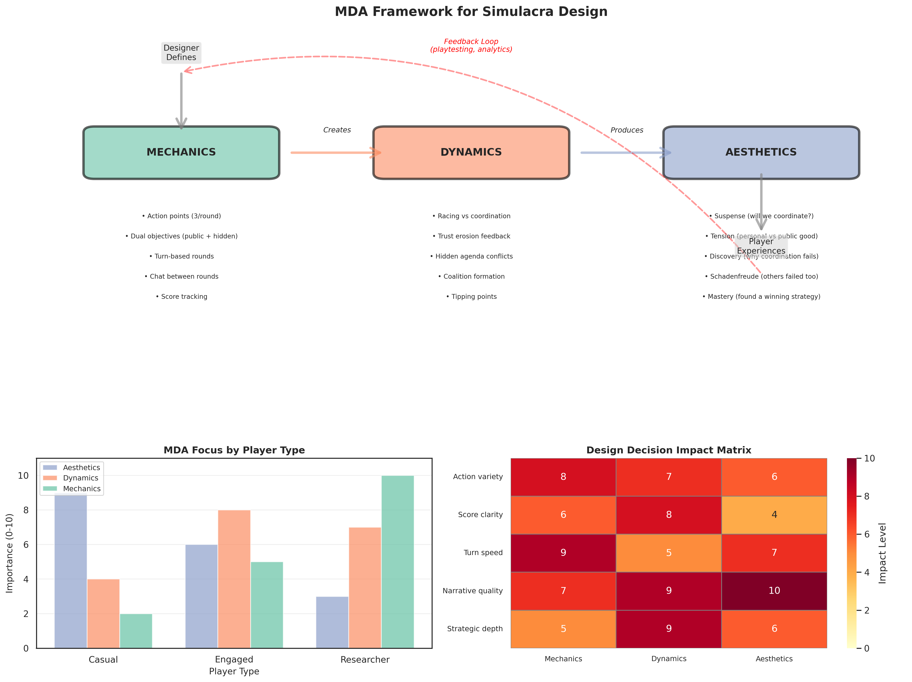
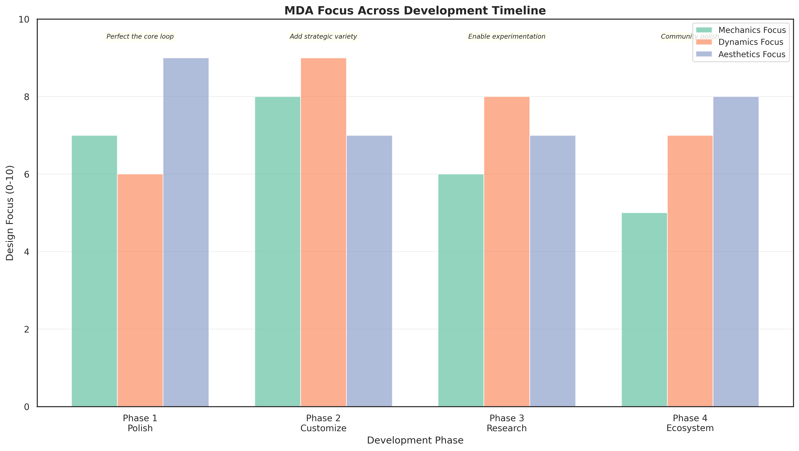
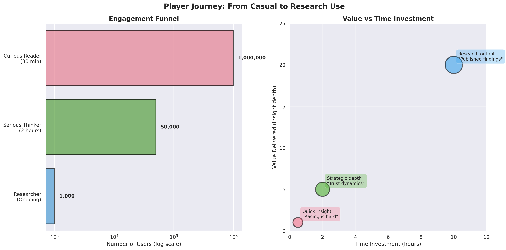
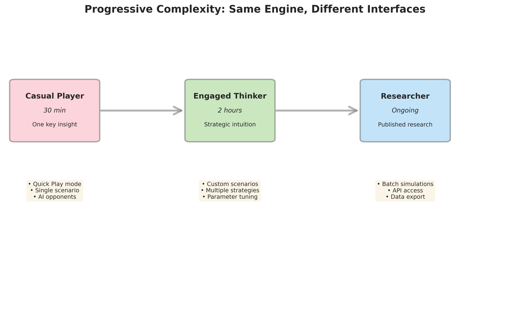
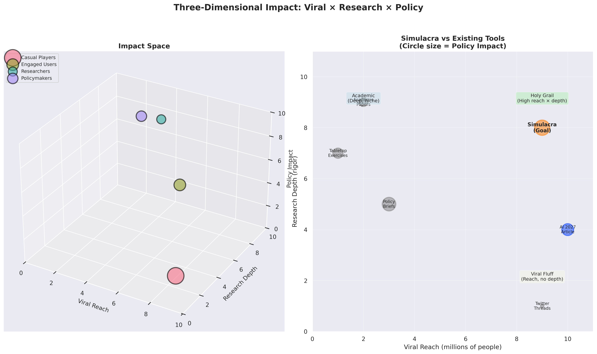
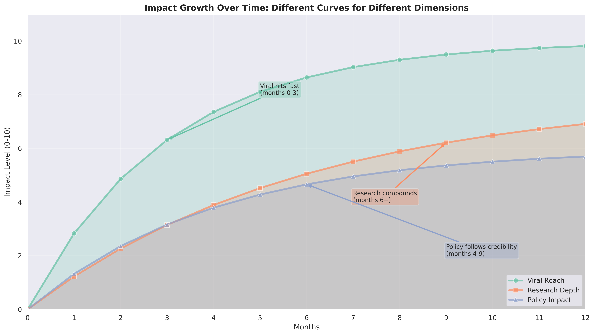
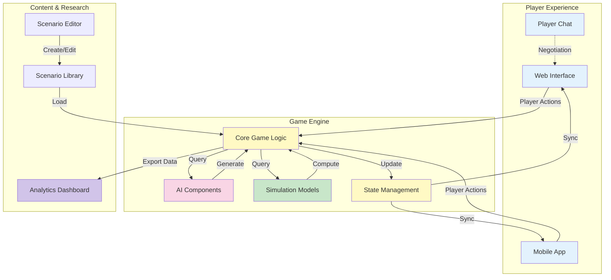
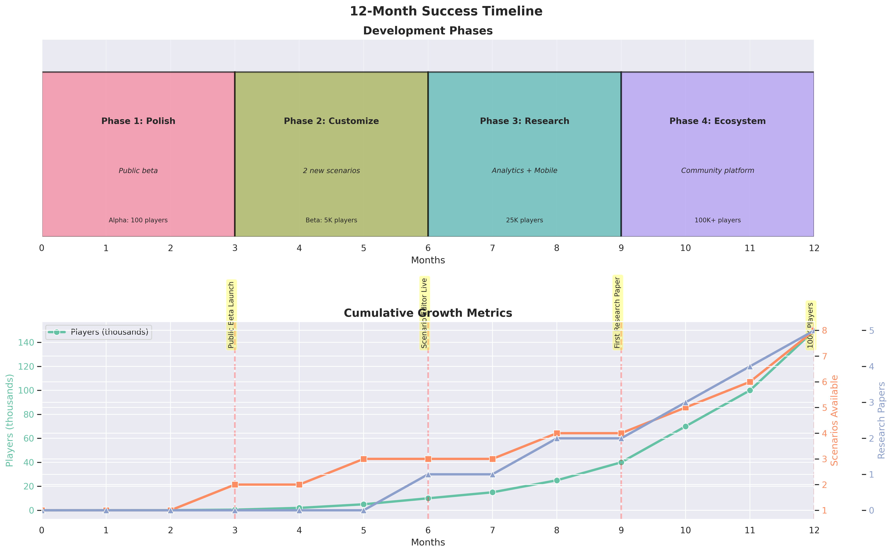
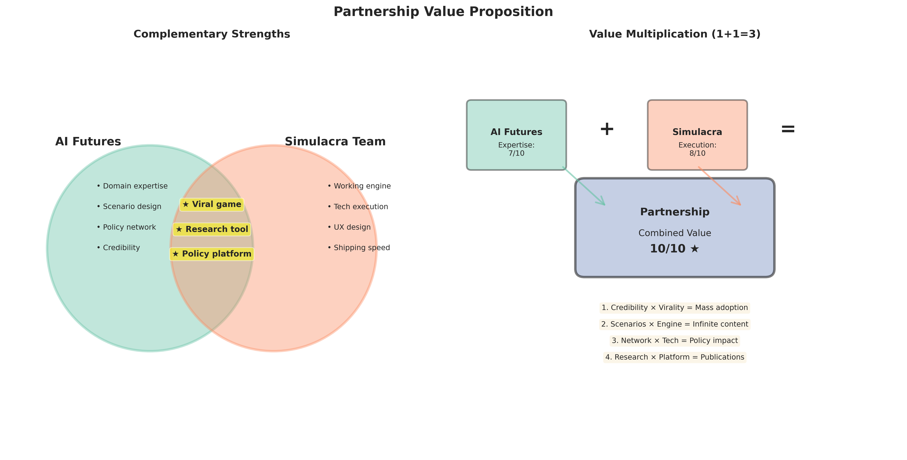
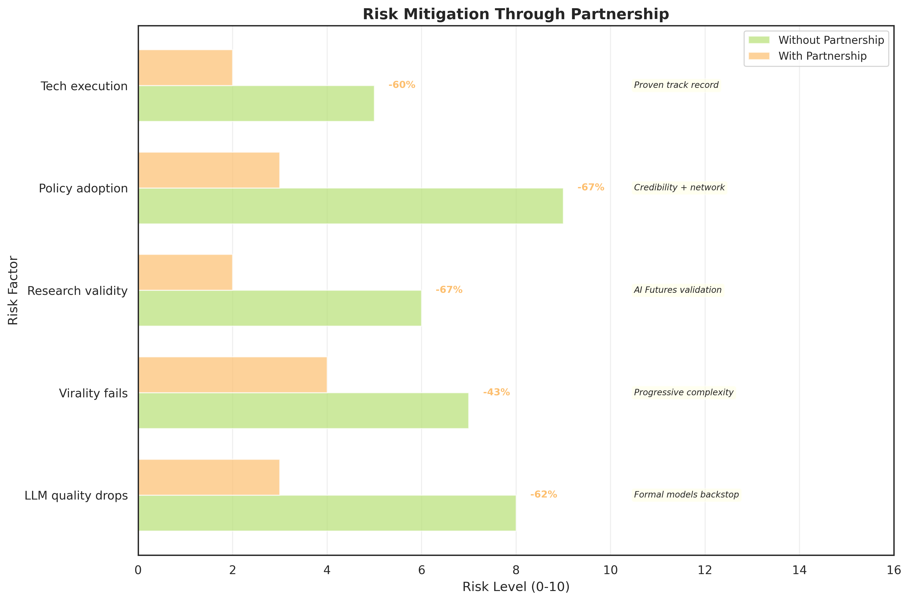

# Simulacra: Interactive AI Governance Scenarios
**Proposal for AI Futures Partnership**

---

## Why This Matters

AI 2027 reached millions of people, but here's what we've learned from watching people engage with it: reading an article—even a brilliant one—gives you a mental model you carry for a few days. Playing through a crisis over two hours gives you intuition that sticks for months.

When someone reads AI 2027, they think "interesting scenario" and maybe share it on Twitter. When someone plays Simulacra, they spend their Saturday afternoon trying to prevent catastrophe as the POTUS, fail three times because coordination is genuinely hard, and come away with a visceral understanding of why. They don't just know racing is bad—they've felt the pressure that makes racing feel rational in the moment. They don't just understand coordination problems theoretically—they've experienced the trust erosion that makes cooperation collapse even when everyone wants it to work.

AI 2027 demonstrated massive appetite for realistic AGI scenario exploration. The question it raised is: how do we go deeper? We built Simulacra to answer that question. It's a working game that makes these scenarios playable, customizable, and experimentally testable. Think of AI 2027 as a carefully painted picture of two possible futures. Simulacra is the canvas and paint—it lets anyone explore the entire space of futures parameterized by their assumptions. With this partnership, we can turn it into what AI 2027 always pointed toward: not just a story people read once, but a simulator they return to as the world changes.

---

## Vision: What Does a Player Experience?

The best way to understand what we're building is to walk through what different people get from it.

Picture a curious reader who has 30 minutes. They open a web link, see "AI 2027 Quick Play" and click it. The game casts them as a Tech CEO making decisions as AI capabilities explode around them. Five decisions over 25 minutes, each one harder than the last. They watch their score drop, public trust erode, and the world tip into crisis. At the end, they see one crystal-clear dynamic: racing is bad, but coordinating is genuinely harder than it looks from the outside. They tweet: "Just lost the future in 30 minutes, try to beat my score" and their friends click through. That's the viral layer—simple enough that anyone can engage, deep enough that it sticks.

Now picture a serious thinker with two hours on Sunday afternoon. They don't just want the default scenario—they want to test their models. They customize: "What if takeoff takes five years instead of two? What if China starts with a lead?" They play as different roles, try different strategies. Halfway through their third playthrough, they have a realization: "Wait, the problem isn't what I thought it was. It's actually about information asymmetry, not capability levels." They use Simulacra like a flight simulator—not to predict the future, but to build intuition for dynamics they can't experience otherwise. That's the depth layer—serious engagement that changes how people think.

For a researcher or policymaker, Simulacra becomes an ongoing tool. They design custom scenarios matching their specific models of how AI governance works. They run 100 AI-versus-AI simulations with systematically varied assumptions and analyze the results: "Under what initial conditions does coordination emerge? What interventions actually work?" They publish: "We tested 47 policy interventions in simulation using Simulacra. Here's what we found." That's the research layer—turning intuition into testable hypotheses.

And here's the really interesting case: the skeptic. Imagine Vitalik Buterin says "AI 2027 is too doomy." Instead of arguing on Twitter, we say: "Here's the engine. Play it with your assumptions. Make it end well if you can." Either he finds a path that works—in which case great, we learned something—or he doesn't, which is also informative. The game becomes a constructive way to have disagreements. Instead of "your scenario is wrong," it's "here, I'll show you my scenario." That's what we mean by learn by doing, not reading. Customize, don't just consume. Test ideas, don't just argue.

### Design Through the MDA Framework

We're using the MDA (Mechanics-Dynamics-Aesthetics) framework from game design to ensure Simulacra works on multiple levels simultaneously. This isn't just academic—it's how we make something that's both rigorous and engaging.

The mechanics are what players directly interact with: action points each round, dual objectives (public score everyone sees, hidden objective only you know), turn-based structure with chat between rounds, score tracking that shows consequences. These are the rules of the game—simple enough to learn in two minutes, deep enough to support genuine strategy.

The dynamics emerge from how those mechanics interact. Racing versus coordination isn't programmed explicitly—it emerges from players balancing public good against hidden objectives. Trust erosion happens because successful deception in early rounds makes cooperation harder later. Coalition formation emerges from the chat system plus score incentives. These dynamics are what make each playthrough unique even with identical mechanics.

The aesthetics are what players actually feel: Suspense—will we manage to coordinate this time? Tension—my hidden objective wants me to race, but I know that's collectively bad. Discovery—Oh, that's why coordination always fails in round 3. Schadenfreude—everyone else failed too, it's not just me being bad at this. Mastery—I found a strategy that works.

Different player types engage with different layers. Casual players mostly experience aesthetics: "That was tense, I felt the pressure to race." Serious players start understanding dynamics: "The trust erosion is a feedback loop, we need to break it early." Researchers dig into mechanics: "If I change the action point cost of transparency from 2 to 1, does coordination become more common?"

This layering is why the same engine supports 30-minute viral engagement and PhD dissertation research. We're not building different products for different audiences—we're building one system with progressive depth. The mechanics are simple enough for anyone. The dynamics are rich enough to sustain study. The aesthetics are compelling enough to spread.

*The MDA framework visualization showing how mechanics, dynamics, and aesthetics work together in Simulacra's design*

*How we prioritize different MDA elements across development phases*

---

## How This Extends AI 2027's Mission

AI 2027 painted two futures with remarkable clarity. What we're proposing is a way to explore the entire space between and beyond those futures, parameterized by whatever assumptions people bring.

Consider what AI 2027 achieved: it reached millions of people, made AGI scenarios concrete and visceral, and sparked serious conversations in policy circles. Those are real accomplishments. But there's a natural next step. AI 2027 is a snapshot—it captures how a group of thoughtful people in 2024 thought about two specific paths the future might take. What if instead of two paths, you could explore thousands? What if instead of reading about how coordination fails, you could actually try different coordination strategies and see which ones work?

That's what Simulacra adds. First, it's interactive—you play through scenarios instead of reading them. Second, it's customizable—the system shows what happens with your assumptions about takeoff speed, actor incentives, and technical difficulty, not just ours. Third, it's experimental—you can run controlled studies, A/B test interventions, and measure outcomes quantitatively. Fourth, it scales engagement differently: one AI 2027 article reaches millions of readers for a few minutes each; one viral game generates millions of hours of deep engagement. And fifth, it's a living artifact—where AI 2027 captures a moment in time, Simulacra evolves as the world changes and our understanding deepens.

The partnership makes sense because AI Futures brings domain expertise, scenario design, and credibility—people will take this seriously because it's grounded in real research. We bring a working engine and the execution capacity to scale it. Neither of us could build the complete vision alone, but together we can build something neither the research community nor the game development world has seen before: a tool that's simultaneously viral entertainment, serious policy planning, and experimental research platform.

*Engagement funnel showing how different player types derive value from Simulacra*

*The same engine supports casual players, engaged thinkers, and researchers through progressive complexity*

*Simulacra creates value across three dimensions: viral reach, research depth, and policy impact*

*How different impact dimensions grow at different rates over the first year*

---

## What We've Built (Without Funding)

We've already built a functional version of Simulacra that proves the core concept works. Here's what exists right now:

The foundation is a web-based game where an AI acts as game master. It generates scenarios, creates options for players to choose from, and adjudicates consequences. Players have dual objectives—a public score everyone can see (usually something like "democratic legitimacy" or "public trust") and a hidden objective that creates tension (maybe you're secretly trying to position your company for acquisition, or you genuinely believe racing is the only safe path). We've implemented the AI 2027 scenario, so you can play as the Tech CEO, Regulator, Journalist, or other roles from the original. The system currently supports single-player mode with AI agents playing the other roles.

The interface is functional but not polished. Think prototype that proves the concept, not consumer-ready product. Players report the core loop is engaging and thought-provoking. The AI game mastering works when properly structured—not perfect, but good enough that people get immersed in scenarios and make genuine strategic decisions.

What this proves: we can ship. Zero to working game in six weeks with no funding. The core loop works—people find it engaging. AI can function as game master if structured correctly. The foundation is sound.

What we need funding for: the polish needed for millions of players. The multiplayer infrastructure. The chat systems that let players negotiate with each other between rounds. Making outcomes more consistent and tunable. Scenario editing tools for non-programmers. Analytics dashboards for running experiments and visualizing outcomes.

---

## Success State (6-12 Months)

Let me paint a picture of what success looks like by early 2026.

For players, Simulacra has become a game that goes genuinely viral—think Universal Paperclips meets AI 2027. It hits the front page of Hacker News, spreads on Twitter, gets a New York Times piece asking "Is this game the future of AI policy debate?" Millions of people play the quick version; tens of thousands engage seriously. The target audience is smart, busy, influential people: policymakers, researchers, journalists, tech leaders. "I spent two hours trying to save the world and failed six times, here's what I learned" becomes a recognizable genre of Twitter thread.

For researchers and policymakers, it becomes a standard tool. Before designing a new policy, the reflex becomes "let's sim it first." People publish papers: "We tested intervention X in Simulacra with these parameters and found Y." The AI Futures team uses it internally because iterating on scenarios in Simulacra is faster than running full tabletop exercises. Graduate students use it for their dissertations. Think tanks cite Simulacra experiments in policy briefs.

For the broader field, it shifts the conversation. Instead of abstract arguments about whether AGI will be good or bad, people discuss concrete questions: under what conditions does coordination emerge? What are the actual mechanisms of trust erosion? How do different governance structures perform under various takeoff scenarios? The common vocabulary that develops from millions of people playing similar scenarios makes policy discussions more productive. It defuses some of the doomer-versus-accelerationist tribalism—instead of "you're wrong," it becomes "okay, configure the simulation with your worldview and show me how it ends well."

In this future, AI Futures' role is clear and valuable. You provide scenario design expertise and validate what counts as "canonical" versus "community-created" scenarios. You give Simulacra credibility—people take it seriously because it's grounded in real research, not just some game. Your network gets it to policymakers; the engine makes it spread virally. We publish joint papers on "what we learned from 10,000 simulations." When someone creates a scenario that challenges conventional wisdom, you help evaluate whether it's highlighting a real possibility or gaming the system.

---

## Architecture Overview

### Current System

Right now we have a working prototype with a simple architecture: players interact with a web interface, an AI generates scenarios and consequences, and game state is tracked. It works for demonstrating the concept but has limitations around consistency and tunability.

### Future System

**Key components:**

The player experience layer handles all user interaction—web, mobile, and player-to-player communication during games.

The game engine is where the intelligence lives. We've developed an approach that combines AI-generated narrative with more structured simulation models. This gives us the best of both worlds: the engagement and flexibility of AI storytelling, with the consistency and tunability of formal models. The specifics of how these integrate is part of our technical advantage, but the result is scenarios that feel dynamic while remaining analyzable.

The content and research layer lets people create custom scenarios, run experiments, and analyze results. This is what turns Simulacra from a game into a platform.

---

## Design Principles

Three principles guide every design decision:

First: realism before fun. This comes directly from Daniel's feedback. We're not building a toy or science fiction. It should feel like a serious policy planning tool that happens to be engaging. The target is: as realistic as AI Futures' best tabletop exercise run, but reproducible and scalable. If we have to choose between "this makes the game more exciting" and "this makes the simulation more accurate," we choose accuracy. Fun comes from genuine strategic depth, not artificial drama.

Second: progressive complexity. A player with 30 minutes should be able to jump in, play, learn one thing, and leave satisfied. A player with 2 hours should find a full scenario with multiple viable strategies. A researcher should be able to access the full complexity: custom scenarios, parameter tuning, batch analysis. Same engine, different interfaces. Think of it like a flight simulator: casual mode has simplified controls and forgiving physics; professional mode exposes everything.

Third: customizability is core, not a feature. The AI 2027 scenario is one configuration of the engine. Tomorrow someone should be able to configure a biosecurity scenario. Next week, a climate negotiation. The core mechanics—multiple actors with hidden incentives, dual objectives, tension between individual and collective good—apply broadly. Users should be able to fork scenarios: "AI 2027 but China has a two-year lead" should be a dropdown, not a rebuild. This makes the platform valuable long-term: it doesn't get obsolete when the world changes.

---

## Development Timeline

### Phase 0: Current State (Completed)

We have a working proof of concept. Single-player mode with AI agents, AI game master, basic interface, AI 2027 scenario playable. This proves the concept works and we can execute.

### Phase 1: Polish and Multiplayer (Months 1-3)

Make v0 production-ready. Professional UI/UX design. Implement full multiplayer infrastructure. Work closely with AI Futures team to tune the default AI 2027 scenario until it matches the realism of your best tabletop exercises. Alpha testing with 100 players, iterate based on feedback.

Deliverable: Public beta that people can play and share. Professional quality, engaging, realistic enough that policymakers take it seriously.

### Phase 2: Customization Platform (Months 4-6)

Build the flexibility that makes this a platform, not just a product. Scenario editor for non-programmers. Parameter tuning interfaces. One-click scenario forking. Validation workflow where AI Futures team can approve scenarios for the "canonical" library.

Deliverable: Platform where researchers and educators can create custom scenarios. At least two new canonical scenarios beyond AI 2027.

### Phase 3: Research Tools (Months 7-9)

Make it a research platform. Analytics dashboard for running batch simulations and visualizing distributions. A/B testing infrastructure. Mobile version. API for programmatic access.

Deliverable: Research infrastructure that produces publishable results. Mobile app in beta. First external research paper using Simulacra data (ideally co-authored with AI Futures).

### Phase 4: Ecosystem (Months 10-12)

Build the community and long-term sustainability. Community scenario sharing. Integration with real-world data feeds. Major paper analyzing insights from thousands of simulations.

Deliverable: Self-sustaining platform with active community, real-world data integration, published research validating the approach.

*12-month development roadmap showing phases, milestones, and cumulative growth metrics*

---

## What We Need

Engineering capacity for full-time development over 12 months. Design resources for UI/UX. Collaboration time with AI Futures team for scenario design, validation, and testing. Infrastructure for hosting and AI API costs at scale.

We can provide detailed budget breakdown and team information in follow-up conversations once we align on the vision and scope.

Milestones for accountability:
- Month 3: Public beta live, polished and realistic
- Month 6: Customization tools functional, two new scenarios
- Month 9: Research tools complete, first paper submitted
- Month 12: 100,000+ players, sustained growth, mobile launched

---

## Technical Foundation

We've spent considerable time exploring how to make AI-driven scenarios both engaging and rigorous. The challenge is that pure AI generation is inconsistent—the same scenario can play out completely differently each time. But pure deterministic models feel sterile and don't adapt to creative player strategies.

Our approach combines both. We use structured models to track key variables and ensure consistency, while AI generates the narrative and adapts to player creativity. When the simulation determines trust should drop by 15 points due to an incident, the AI generates compelling narrative explaining why—but the underlying number is deterministic and tunable. This means researchers can actually study patterns across runs, while players experience dynamic, responsive storytelling.

We've also explored several modeling frameworks from adjacent fields—system dynamics (how feedback loops drive behavior), discrete event simulation (how regime changes occur), agent-based modeling (how strategic actors interact), and uncertainty quantification (how to communicate what we don't know). The details of how we integrate these is part of our technical moat, but the result is a simulation that's both rigorous enough for research and engaging enough to go viral.

For scenarios that become very complex, we've prototyped ways to maintain real-time responsiveness without sacrificing depth. This involves some clever approximations that we're happy to discuss in detail once we're in active partnership.

---

## Why This Partnership Works

AI Futures brings:
- Deep domain expertise in AI governance scenarios
- Credibility with policymakers and researchers
- Access to expert networks for validation and distribution
- Understanding of what questions actually matter

We bring:
- A working game engine that proves the concept
- Technical execution capacity to scale it
- Experience building engaging user experiences
- Ability to ship quickly (v0 in 6 weeks with no funding)

Together we can build something neither could alone: a platform that's simultaneously viral entertainment, serious policy tool, and experimental research infrastructure.

*Complementary strengths: AI Futures brings credibility and domain expertise, we bring execution capacity*

*How partnership reduces key risks across technical execution, research validity, and policy adoption*

---

## Summary

We've built a working AI governance game that turns AI 2027 from a story people read into a simulator they use. With this partnership, we can create three things simultaneously:

A viral game that gives millions of people deep, memorable engagement with AI scenarios—not surface-level awareness but intuition-level understanding.

A serious policy tool that researchers and policymakers use to test ideas, explore scenario space, and generate publishable insights.

An experimental platform that shifts the field's conversation from ungrounded speculation toward empirical questions about coordination, governance, and trajectories.

We're not proposing to put AI 2027 online. We're proposing to build the infrastructure that makes AI 2027—and a hundred other scenarios—playable, customizable, and experimentally testable. AI 2027 demonstrated demand. We have the supply. Let's build it together.

---

## Next Steps

We'd like to schedule a call to review this vision in detail, align on which features are must-haves versus nice-to-haves for the initial phases, and discuss partnership structure and resources.

Questions we'd love your input on:
- Does this match your vision for what the online game should accomplish?
- What's the minimum feature set that would make you confident this works?
- From your perspective, what would success look like in 12 months?
- Are there scenario types beyond AI 2027 that you'd prioritize for early development?

We're ready to start building immediately upon partnership. The vision is clear; the foundation is built. Let's make this real.
