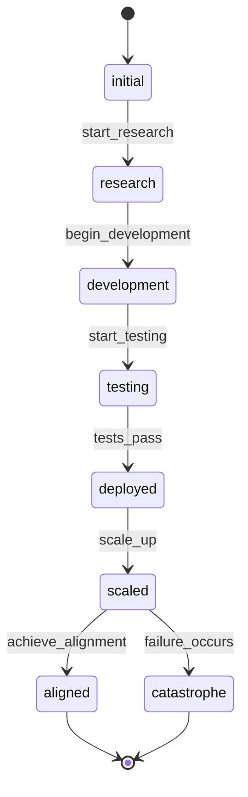
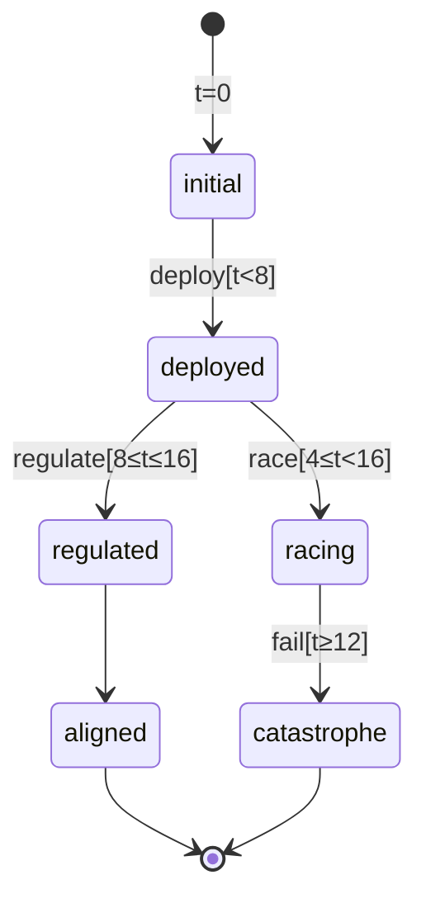

# AI2027 Formal Modeling Research

Formal methods framework for analyzing AI risk scenarios using state machines, temporal logics, and model checking.

---

## 🎯 What is This?

We're building a **modeling playground** to explore AI risk scenarios with mathematical rigor:

- **Visualize** AI timelines as state machines (e.g., "Race to AGI", "Alignment Timeline")
- **Specify** safety properties using temporal logics ("Can catastrophe be avoided?")
- **Verify** properties using model checking ("Must regulation happen by 2027?")
- **Quantify** risks with probabilistic analysis ("What's P(catastrophe)?")

**Motivation**: The Simulacra TTX game demonstrates *emergent* scenarios through LLM-driven narratives. This project explores *rigorous* analysis: proving safety properties, computing risk bounds, and finding optimal policies.

---

## 🚀 Quick Start

### I want to implement the MVP

**Start here**: [mvp_docs/impl_plan.md](mvp_docs/impl_plan.md)

Week-by-week roadmap with tasks, milestones, and success criteria.

### I want to understand the architecture

**Read**: [mvp_docs/tech_design.md](mvp_docs/tech_design.md)

Next.js + React Flow + Matrix (FastAPI) architecture with canonical graph contract.

### I want to know which models we support

**Read**: [mvp_docs/model_design.md](mvp_docs/model_design.md)

Progressive complexity: LTS → Time-Indexed Kripke → MDP

### I need library recommendations

**Read**: [TOOLS_LITERATURE_SURVEY.md](TOOLS_LITERATURE_SURVEY.md)

Comprehensive survey of JS/Python libraries for FSM, temporal logic, and model checking.

### I want examples with diagrams

**See**: [examples/DIAGRAMS.md](examples/DIAGRAMS.md)

Mermaid diagrams of LTS, Time-Indexed models, and MDP with visual comparisons.

### I want simple, non-technical explanations

**See**: [eli/ (Explain Like I'm...)](eli/)

Three levels of explanation:
- [5 years old](eli/5_years_old.md) - Traffic lights, adventure games, dice rolls
- [15 years old](eli/15_years_old.md) - Video games, speedruns, loot boxes
- [Engineering graduate](eli/engineering_graduate.md) - Process control, reliability, HAZOP

---

## 📁 Directory Structure

```
research/ai_futures/
├── mvp_docs/                           # 👈 START HERE
│   ├── README.md                       # MVP documentation guide
│   ├── impl_plan.md                    # Week-by-week implementation roadmap
│   ├── tech_design.md                  # Architecture: Next.js + React Flow + Matrix
│   └── model_design.md                 # Which formal models for MVP
│
├── eli/                                # 🎓 Explain Like I'm...
│   ├── README.md                       # Choose your level guide
│   ├── 5_years_old.md                  # Traffic lights, adventure games
│   ├── 15_years_old.md                 # Video games, speedruns, strategy
│   ├── engineering_graduate.md         # Process control, reliability, HAZOP
│   └── diagrams/                       # Mermaid diagrams (inline in docs)
│
├── examples/                           # Executable examples with visualizations
│   ├── README.md                       # How to run examples
│   ├── DIAGRAMS.md                     # Mermaid diagrams for all models
│   ├── 01_simple_lts.py                # Deterministic FSM example
│   ├── 02_time_indexed_model.py        # Time guards example
│   ├── 03_simple_mdp.py                # Probabilistic MDP example
│   └── run_all.sh                      # Run all examples
│
├── formal_models/                      # Formal model specifications
│   ├── README.md                       # Model comparison and decision guide
│   ├── current_lts_model.md            # LTS specification
│   ├── mealy_mdp_model.md              # MDP specification
│   ├── ctmdp_model.md                  # Continuous-time MDP
│   └── timed_automata_model.md         # Timed automata
│
├── logics/                             # Temporal logic specifications
│   ├── README.md                       # Logic comparison and tools
│   ├── ltl.md                          # Linear Temporal Logic (LTL)
│   ├── ctl.md                          # Computation Tree Logic (CTL)
│   ├── pctl.md                         # Probabilistic CTL (PCTL)
│   └── tctl.md                         # Timed CTL (TCTL)
│
├── kripke_models/                      # Kripke structure specs
│   ├── README.md                       # Kripke integration guide
│   └── time_indexed_kripke.md          # Time-indexed Kripke (the sweet spot)
│
├── FORMAL_MODELING_SUMMARY.md          # High-level overview
├── TOOLS_LITERATURE_SURVEY.md          # JS/Python library options
├── SIMULACRA_INTEGRATION.md            # TTX game integration design
│
└── visualizer_canvas_simple/           # (Legacy) Initial React visualizer
    └── DESIGN.md
```

---

## 🧭 Navigation Guide

### By Role

**I'm a developer implementing the MVP**:
1. Read [mvp_docs/impl_plan.md](mvp_docs/impl_plan.md)
2. Review [mvp_docs/tech_design.md](mvp_docs/tech_design.md)
3. Check [examples/DIAGRAMS.md](examples/DIAGRAMS.md) for visual intuition
4. Reference [TOOLS_LITERATURE_SURVEY.md](TOOLS_LITERATURE_SURVEY.md) for libraries

**I'm a researcher designing models**:
1. Read [FORMAL_MODELING_SUMMARY.md](FORMAL_MODELING_SUMMARY.md)
2. Explore [formal_models/README.md](formal_models/README.md)
3. Review [logics/README.md](logics/README.md)
4. See [mvp_docs/model_design.md](mvp_docs/model_design.md) for MVP scope

**I want to understand the concepts**:
1. Start with [eli/](eli/) - choose your level (5yo, 15yo, or engineering grad)
2. See [examples/DIAGRAMS.md](examples/DIAGRAMS.md) - visual diagrams
3. Run Python examples in [examples/](examples/)
4. Read [FORMAL_MODELING_SUMMARY.md](FORMAL_MODELING_SUMMARY.md)

**I'm integrating with Simulacra TTX**:
1. Read [SIMULACRA_INTEGRATION.md](SIMULACRA_INTEGRATION.md)
2. Review [mvp_docs/model_design.md](mvp_docs/model_design.md)

### By Model Type

**Deterministic state machines (LTS)**:
- Spec: [formal_models/current_lts_model.md](formal_models/current_lts_model.md)
- Example: [examples/01_simple_lts.py](examples/01_simple_lts.py)
- Diagram: [examples/DIAGRAMS.md#1-simple-lts](examples/DIAGRAMS.md#1-simple-lts-ai-development-lifecycle)

**Time-indexed models**:
- Spec: [kripke_models/time_indexed_kripke.md](kripke_models/time_indexed_kripke.md)
- Example: [examples/02_time_indexed_model.py](examples/02_time_indexed_model.py)
- Diagram: [examples/DIAGRAMS.md#2-time-indexed](examples/DIAGRAMS.md#2-time-indexed-model-ai-race-with-deadlines)

**Probabilistic models (MDP)**:
- Spec: [formal_models/mealy_mdp_model.md](formal_models/mealy_mdp_model.md)
- Example: [examples/03_simple_mdp.py](examples/03_simple_mdp.py)
- Diagram: [examples/DIAGRAMS.md#3-simple-mdp](examples/DIAGRAMS.md#3-simple-mdp-ai-safety-under-uncertainty)

### By Question

**"How do I get started implementing?"**
→ [mvp_docs/impl_plan.md](mvp_docs/impl_plan.md)

**"What technology stack should I use?"**
→ [mvp_docs/tech_design.md](mvp_docs/tech_design.md)

**"Which formal model is right for my scenario?"**
→ [examples/DIAGRAMS.md#5-model-selection-guide](examples/DIAGRAMS.md#5-model-selection-guide)

**"What libraries are available?"**
→ [TOOLS_LITERATURE_SURVEY.md](TOOLS_LITERATURE_SURVEY.md)

**"What temporal logic should I use?"**
→ [logics/README.md](logics/README.md)

**"Can I see visual examples?"**
→ [examples/DIAGRAMS.md](examples/DIAGRAMS.md)

---

## 💡 Key Concepts

### Progressive Complexity

We build models in phases, adding complexity incrementally:

```
Phase 1: LTS (Deterministic)
  ├─ States: Discrete world scenarios
  ├─ Transitions: Deterministic (one action → one outcome)
  ├─ Time: Implicit
  └─ Properties: LTL/CTL (G ¬catastrophe, F aligned)

Phase 2: Time-Indexed Kripke
  ├─ States: (world, time) pairs
  ├─ Transitions: Deterministic + time guards
  ├─ Time: Explicit discrete (quarters/years)
  └─ Properties: Bounded LTL/CTL (G_{t≤12} safe)

Phase 3: MDP
  ├─ States: Discrete
  ├─ Transitions: Probabilistic P(s'|s,a)
  ├─ Time: Implicit/discrete
  └─ Properties: PCTL (P≤0.05[F catastrophe])
```

Each phase **extends** the previous, not rewrites.

### Canonical Graph Contract

All backends (local JS or Python Matrix service) provide the same interface:

```typescript
interface GraphResponse {
  meta: ModelMeta;        // Model metadata
  nodes: NodeAP[];        // States with atomic propositions
  edges: EdgeAP[];        // Transitions with labels/probabilities
}
```

This ensures the frontend visualization works regardless of backend.

### Temporal Properties

We specify what should (or shouldn't) happen using temporal logics:

**LTL/CTL (deterministic)**:
- Safety: `G ¬catastrophe` - "Never catastrophe"
- Liveness: `F aligned` - "Eventually aligned"
- Response: `G (deploy → F scale)` - "Deploy always leads to scale"

**Bounded (time-indexed)**:
- `G_{t≤12} ¬catastrophe` - "Safe before 2027"
- `F_{t≤8} regulation` - "Regulate by 2026"

**PCTL (probabilistic)**:
- `P≤0.05[F catastrophe]` - "≤5% catastrophe risk"
- `P=?[F aligned]` - "What's probability of alignment?"

---

## 📊 Visual Examples

See [examples/DIAGRAMS.md](examples/DIAGRAMS.md) for full diagrams. Quick preview:

### Simple LTS: AI Development



### Time-Indexed: AI Race with Deadlines



### MDP: Probabilistic Outcomes

- From `initial`:
  - `deploy`: 70% deployed, 20% misaligned, 10% catastrophe
  - `deploy_safe`: 85% monitored, 15% misaligned/catastrophe

- Policy comparison:
  - Aggressive: P(catastrophe) ≈ 45%
  - Cautious: P(catastrophe) ≈ 20%

---

## 🛠️ Running Examples

### Prerequisites

```bash
# Optional: For Python examples with diagram generation
pip install transitions pygraphviz

# Requires system graphviz (for pygraphviz):
# Ubuntu: sudo apt-get install graphviz graphviz-dev
# macOS: brew install graphviz
```

### Run Examples

```bash
cd examples/

# Run all examples
./run_all.sh

# Or individually
python3 01_simple_lts.py
python3 02_time_indexed_model.py
python3 03_simple_mdp.py
```

**Output**: Terminal demonstrations + diagrams (if graphviz installed)

**Note**: Even without graphviz, the Mermaid diagrams in [examples/DIAGRAMS.md](examples/DIAGRAMS.md) render on GitHub.

---

## 📖 Documentation Overview

### MVP Documentation ([mvp_docs/](mvp_docs/))

**Purpose**: Implementation guides for building the playground

| Document | Content |
|----------|---------|
| [impl_plan.md](mvp_docs/impl_plan.md) | Week-by-week tasks, milestones, testing |
| [tech_design.md](mvp_docs/tech_design.md) | Architecture, stack choices, alternatives considered |
| [model_design.md](mvp_docs/model_design.md) | Model progression, formal definitions, TypeScript types |

### Formal Specifications

**Purpose**: Mathematical definitions and formal semantics

- [formal_models/](formal_models/) - LTS, MDP, CTMDP, Timed Automata specs
- [logics/](logics/) - LTL, CTL, PCTL, TCTL specifications
- [kripke_models/](kripke_models/) - Time-indexed Kripke structures

### Reference Documents

- [FORMAL_MODELING_SUMMARY.md](FORMAL_MODELING_SUMMARY.md) - One-page overview
- [TOOLS_LITERATURE_SURVEY.md](TOOLS_LITERATURE_SURVEY.md) - Library options
- [SIMULACRA_INTEGRATION.md](SIMULACRA_INTEGRATION.md) - Integration design

---

## 🎮 Integration with Simulacra TTX

The formal modeling framework can integrate with the Simulacra TTX game to:

1. **Record trajectories** - Capture game state transitions as Kripke traces
2. **Check properties** - Verify temporal properties during/after gameplay
3. **Analyze outcomes** - Post-game property violation reports
4. **Compare policies** - Evaluate different decision strategies

**See**: [SIMULACRA_INTEGRATION.md](SIMULACRA_INTEGRATION.md) for full design.

**Key insight**: No changes to core game logic - pure observation layer.

---

## 🎯 Implementation Roadmap

### Phase 1: Deterministic LTS (Week 1)

**Goal**: Visual state machine with basic property checking

**Tech**: Next.js + React Flow + local JS logic

**Deliverables**:
- 10-15 state AI2027 model
- Interactive visualization
- G φ, F φ property checker

**Success**: Can explore deterministic scenarios visually

### Phase 2: Time Guards (Week 2)

**Goal**: Add temporal constraints

**Tech**: Extend Phase 1 with time component

**Deliverables**:
- Time-indexed state (world, t)
- Time guards on edges
- Bounded property checking

**Success**: Can model deadlines and decision windows

### Phase 3: Matrix + MDP (Weeks 3-5)

**Goal**: Probabilistic analysis via Python backend

**Tech**: FastAPI + Python libraries (transitions, stormpy)

**Deliverables**:
- Matrix HTTP API
- MDP models with P(s'|s,a)
- PCTL property checking

**Success**: Can compute P(catastrophe) and compare policies

**See**: [mvp_docs/impl_plan.md](mvp_docs/impl_plan.md) for detailed task breakdown.

---

## 📚 Learning Path

### For Beginners

1. **Choose your level**: Read [eli/README.md](eli/README.md) and pick 5yo, 15yo, or engineering grad
2. **Simple explanations**: Start with [eli/5_years_old.md](eli/5_years_old.md) or [eli/15_years_old.md](eli/15_years_old.md)
3. **Visual intuition**: See [examples/DIAGRAMS.md](examples/DIAGRAMS.md)
4. **Run examples**: Execute [examples/01_simple_lts.py](examples/01_simple_lts.py)
5. **High-level overview**: Read [FORMAL_MODELING_SUMMARY.md](FORMAL_MODELING_SUMMARY.md)

### For Developers

1. **Architecture**: Read [mvp_docs/tech_design.md](mvp_docs/tech_design.md)
2. **Implementation**: Follow [mvp_docs/impl_plan.md](mvp_docs/impl_plan.md)
3. **Libraries**: Reference [TOOLS_LITERATURE_SURVEY.md](TOOLS_LITERATURE_SURVEY.md)
4. **Model specs**: See [formal_models/README.md](formal_models/README.md)

### For Researchers

1. **Formal definitions**: Explore [formal_models/](formal_models/)
2. **Temporal logics**: Review [logics/README.md](logics/README.md)
3. **Model comparison**: Read [formal_models/README.md](formal_models/README.md)
4. **Properties**: See [mvp_docs/model_design.md#5-property-specification-library](mvp_docs/model_design.md#5-property-specification-library)

---

## 🤝 Contributing

### Adding New Models

1. Create specification in [formal_models/](formal_models/)
2. Add example in [examples/](examples/)
3. Create Mermaid diagram in [examples/DIAGRAMS.md](examples/DIAGRAMS.md)
4. Update model comparison in [formal_models/README.md](formal_models/README.md)

### Adding Properties

1. Define formal syntax in [logics/](logics/)
2. Add examples in [mvp_docs/model_design.md](mvp_docs/model_design.md)
3. Implement checker (Phase 1/2) or use PRISM/Storm (Phase 3)

### Improving Documentation

- Fix typos/clarifications via PR
- Add real-world examples
- Improve diagrams and visualizations

---

## 📞 Questions?

- **Getting started**: [mvp_docs/README.md](mvp_docs/README.md)
- **Tech questions**: [mvp_docs/tech_design.md](mvp_docs/tech_design.md)
- **Model questions**: [mvp_docs/model_design.md](mvp_docs/model_design.md)
- **Visual examples**: [examples/DIAGRAMS.md](examples/DIAGRAMS.md)
- **Library options**: [TOOLS_LITERATURE_SURVEY.md](TOOLS_LITERATURE_SURVEY.md)

---

## 📄 License

See main repository LICENSE file.

## 🔗 References

- **AI2027**: https://ai-2027.com
- **Model Checking**: NuSMV, SPIN, PRISM, Storm
- **Temporal Logic**: LTL, CTL, PCTL specifications
- **Simulacra TTX**: Main game repository
