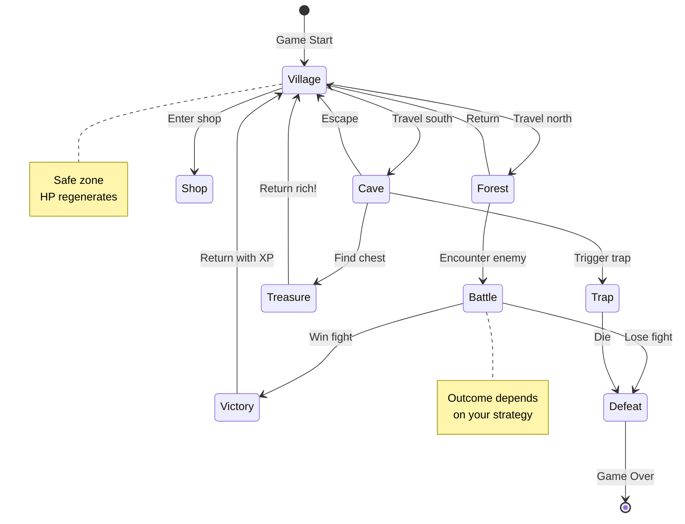
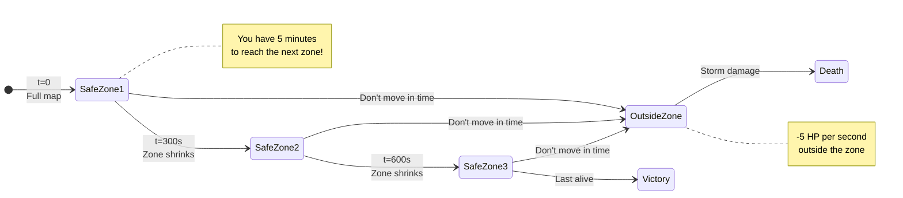
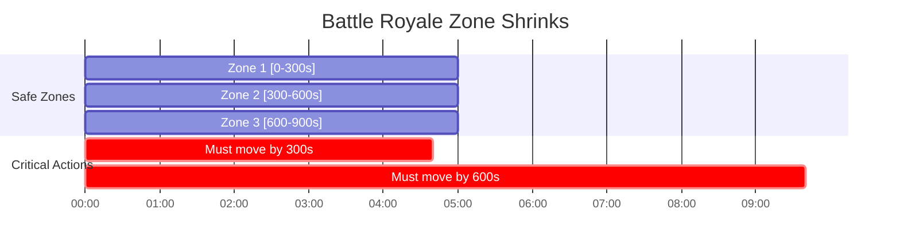
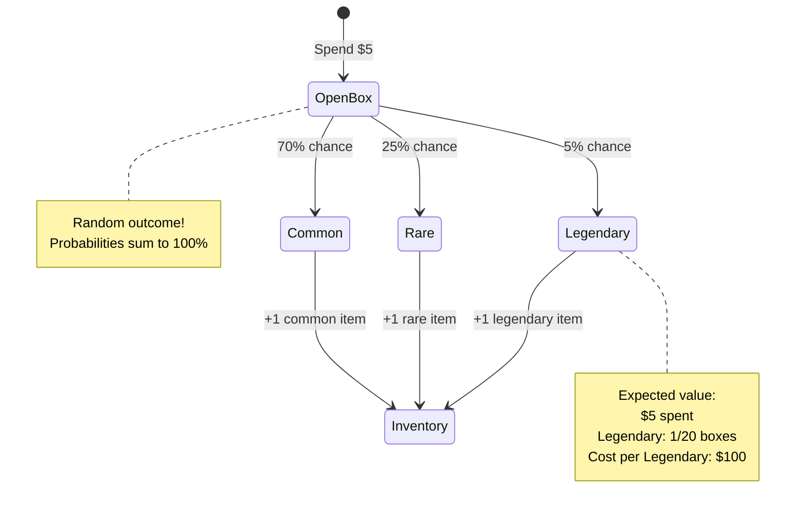
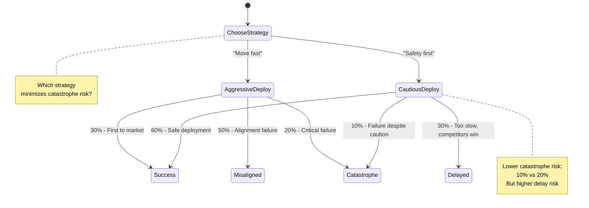
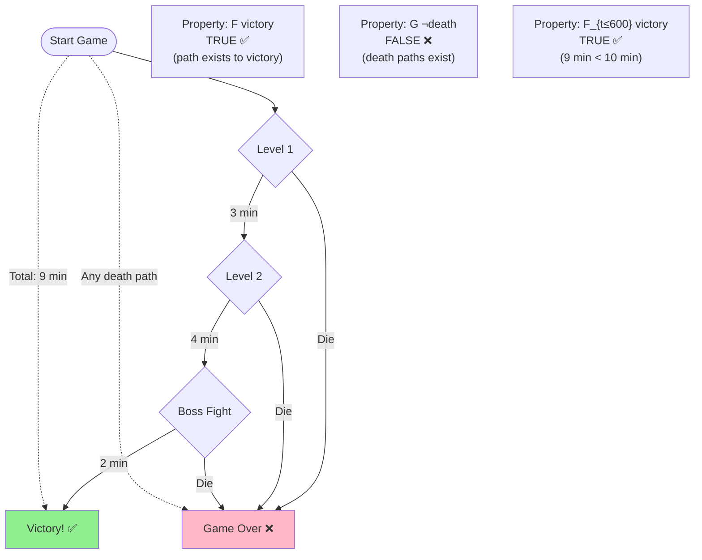
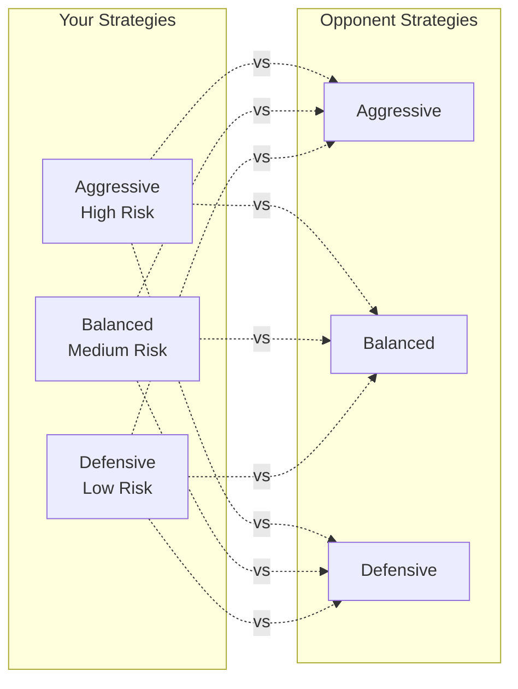
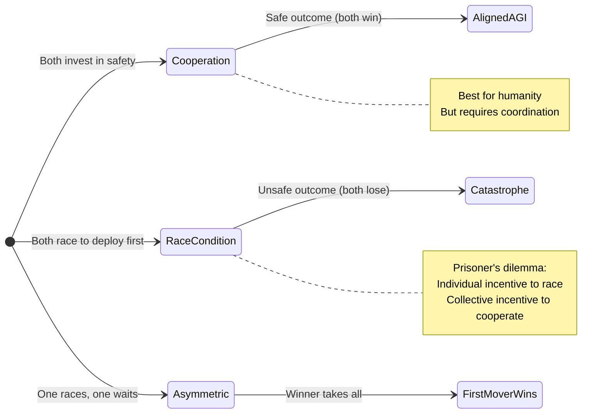
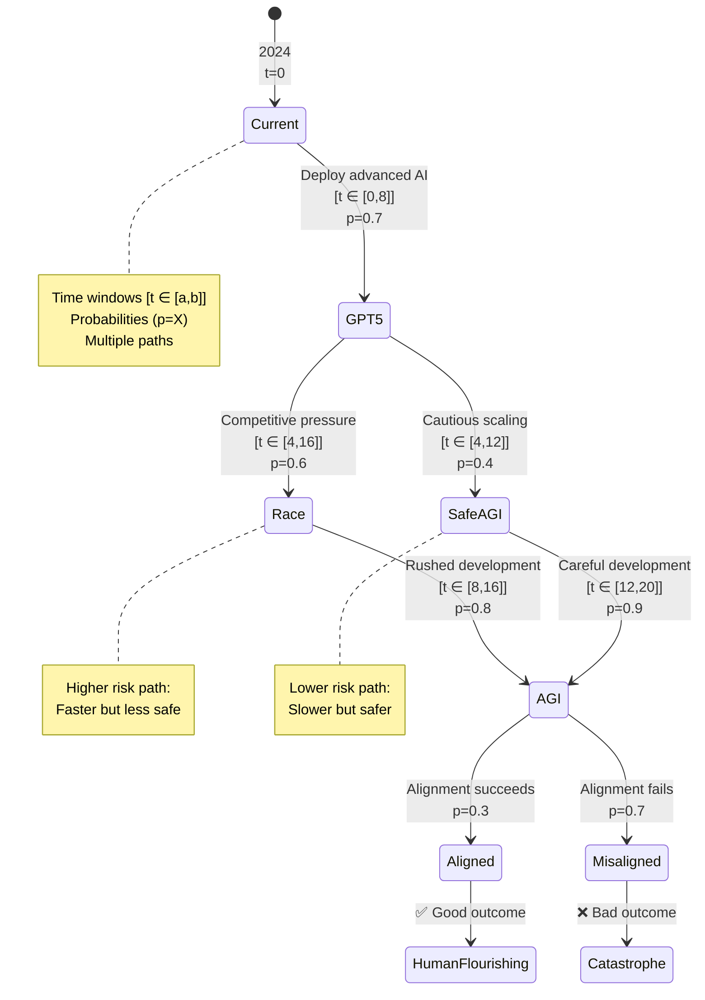

# Explaining Formal Models Like You're 15 Years Old

## Introduction: Video Game Logic

Ever played a game where your choices matter? Where one decision leads to victory and another to defeat? Formal modeling is basically **creating a mathematical map of all possible game states and decisions**.

We use this to analyze complex systems - including AI development - to answer questions like "Can we guarantee safety?" or "What's the probability of disaster?"

---

## Level 1: Finite State Machines (FSM)

### Example: A Simple RPG

Imagine you're playing an RPG. Your character can be in different states:



**Key Concepts:**

1. **States** = Locations/situations (Village, Forest, Battle, etc.)
2. **Transitions** = Actions that move you between states
3. **Terminal states** = Game Over (you can't leave this state)

**Formal Definition:**
```
FSM = (S, s₀, Σ, δ)
S = Set of states {Village, Forest, Cave, ...}
s₀ = Initial state (Village)
Σ = Set of actions {Travel, Enter, Fight, ...}
δ = Transition function (what happens when you do X in state Y)
```

**Real-World Application:**
- Game AI behavior
- Network protocols
- Traffic light systems
- **AI safety**: Modeling how AI systems transition between capability levels

---

## Level 2: Adding Time Constraints

### Example: Battle Royale Shrinking Zone

In games like Fortnite, the safe zone shrinks over time. You MUST move or die!



**New Concept: Time Guards**

Some actions are only possible during specific time windows:

```
Action: Move to next zone
Guard: current_time < zone_deadline
If guard fails → forced into "OutsideZone"
```

**Timeline Visualization:**



**AI2027 Connection:**

Replace "zones" with "AI capability levels" and "time" with "quarters/years":

- Zone 1 = Narrow AI (2024-2025)
- Zone 2 = AGI emerges (2026-2027)
- Zone 3 = Superintelligence (2027-2028)

**Question**: What if we have a deadline to implement safety measures before AGI arrives?

Just like you must move before the zone shrinks, we must act before capabilities exceed our control!

---

## Level 3: Probability and Risk

### Example: Loot Box Mechanics

You've probably seen loot boxes in games. The outcome is random!



**Markov Decision Process (MDP):**

Now imagine you can choose between different boxes:

| Action | Cost | P(Common) | P(Rare) | P(Legendary) | Expected Value |
|--------|------|-----------|---------|--------------|----------------|
| Basic Box | $5 | 70% | 25% | 5% | $3 |
| Premium Box | $10 | 40% | 40% | 20% | $8 |
| Guaranteed Rare | $15 | 0% | 100% | 0% | $10 |

**Which strategy maximizes value?**
- If you want Legendaries: Premium Box (20% chance)
- If you want consistent value: Guaranteed Rare
- If you're broke: Basic Box (cheapest)

**MDP Formula:**
```
Expected Value = Σ (probability × reward)

Basic: 0.70×$1 + 0.25×$5 + 0.05×$20 = $2.95
Premium: 0.40×$1 + 0.40×$5 + 0.20×$20 = $6.40
```

### AI2027 Example: Deployment Strategy

Replace "loot boxes" with "AI deployment strategies":



**Risk Analysis:**

| Strategy | P(Success) | P(Catastrophe) | Expected Outcome |
|----------|------------|----------------|------------------|
| Aggressive | 30% | 20% | High risk, high reward |
| Cautious | 60% | 10% | Lower risk, more likely success |

**Which would you choose?**

---

## Level 4: Checking Properties

### Example: Speedrun Verification

Speedrunners ask: "Can I beat this game in under 10 minutes?"

We can check this formally!

**Temporal Logic Properties:**

1. **Safety**: "I never die"
   - Formula: `G ¬death` (Globally, not death)
   - Check: Is there any path where you die?

2. **Liveness**: "I eventually reach the end"
   - Formula: `F victory` (Eventually, victory)
   - Check: Do all paths lead to victory?

3. **Bounded**: "I reach the end in under 10 minutes"
   - Formula: `F_{t≤600} victory` (Eventually within 600 seconds)
   - Check: Can you win before time limit?



### AI2027 Properties to Check

Replace "game mechanics" with "AI development":

```
Safety: "AGI never becomes misaligned"
  → G ¬catastrophe

Liveness: "We eventually deploy beneficial AGI"
  → F aligned_agi

Deadline: "We implement safety measures before 2027"
  → F_{t≤12} safety_deployed  (within 12 quarters)

Probabilistic: "Catastrophe risk is less than 5%"
  → P≤0.05[F catastrophe]
```

**Can we verify these?**
- Run simulations with different policies
- Use model checkers (automated tools)
- Find counterexamples (scenarios where property fails)

---

## Level 5: Optimal Strategy (Game Theory)

### Example: Competitive Gaming

In esports, players choose strategies to maximize win probability:



**Payoff Matrix:**

| Your Strategy ↓ / Opponent → | Aggressive | Balanced | Defensive |
|------------------------------|------------|----------|-----------|
| **Aggressive** | 50% win | 70% win | 40% win |
| **Balanced** | 30% win | 50% win | 60% win |
| **Defensive** | 60% win | 40% win | 50% win |

**Best Response:**
- If opponent plays Aggressive → You play Defensive (60% win)
- If opponent plays Balanced → You play Balanced (50% win)
- If opponent plays Defensive → You play Balanced (60% win)

**Nash Equilibrium**: Both players choose Balanced (neither can improve by changing strategy alone)

### AI2027: Multiple Actors

Now imagine countries/companies are players:



**The Problem**: Even if cooperation is better for everyone, individual actors have incentive to race!

This is called the **Prisoner's Dilemma** in game theory.

---

## Putting It All Together: AI2027 Model

Let's combine everything we learned:



**Questions We Can Answer:**

1. **What's P(Catastrophe)?**
   - Race path: 0.6 × 0.8 × 0.7 = 33.6%
   - Safe path: 0.4 × 0.9 × 0.7 = 25.2%
   - Total: ~30% (weighted average)

2. **Can we guarantee alignment?**
   - No! Both paths have failure modes
   - Best we can do: Minimize risk via Safe path

3. **What if we wait too long to deploy?**
   - Time window [t ∈ [0,8]] for deployment
   - Miss the window → Competitors deploy first → Lost opportunity

4. **What's the optimal strategy?**
   - Depends on your goal:
     - Minimize catastrophe → Safe path
     - Maximize market share → Race path
     - This is the hard choice!

---

## What You've Learned

1. **Finite State Machines**: Map all possible states and transitions
2. **Time Constraints**: Some actions have deadlines
3. **Probability**: Outcomes can be uncertain (MDPs)
4. **Property Checking**: Verify "Can we always win?" or "What's the risk?"
5. **Game Theory**: Multiple actors with conflicting goals

**Why This Matters:**

When building powerful AI systems, we can't just "try things and see what happens" - the stakes are too high! Instead, we:

1. **Model** all possible outcomes
2. **Analyze** which paths are safe
3. **Verify** that safety properties hold
4. **Optimize** for the best strategy

This is what researchers do with formal methods - it's like creating a strategy guide for humanity's most important decision!

---

## Try It Yourself: Design a Model

**Scenario**: You're designing a self-driving car system.

1. **Define states**:
   - Stopped, Driving, Braking, Emergency Stop

2. **Add transitions**:
   - What causes the car to brake?
   - When can it resume driving?

3. **Add time constraints**:
   - How quickly must it react to obstacles?

4. **Add probabilities**:
   - What if sensors fail?
   - What's the probability of false positives?

5. **Check properties**:
   - "Never hit a pedestrian" (Safety)
   - "Eventually reach destination" (Liveness)
   - "Stop within 2 seconds of obstacle detection" (Bounded)

**Challenge**: Can you draw this as a state diagram?

---

## Next Steps

Want to go deeper?

- **Beginner**: Try [examples/DIAGRAMS.md](../examples/DIAGRAMS.md) - Visual examples with code
- **Intermediate**: Read [mvp_docs/model_design.md](../mvp_docs/model_design.md) - Formal definitions
- **Advanced**: Explore [formal_models/README.md](../formal_models/README.md) - Full mathematical specs

**Remember**: You now understand the basics of formal verification - a crucial tool for ensuring AI safety! 🚀
