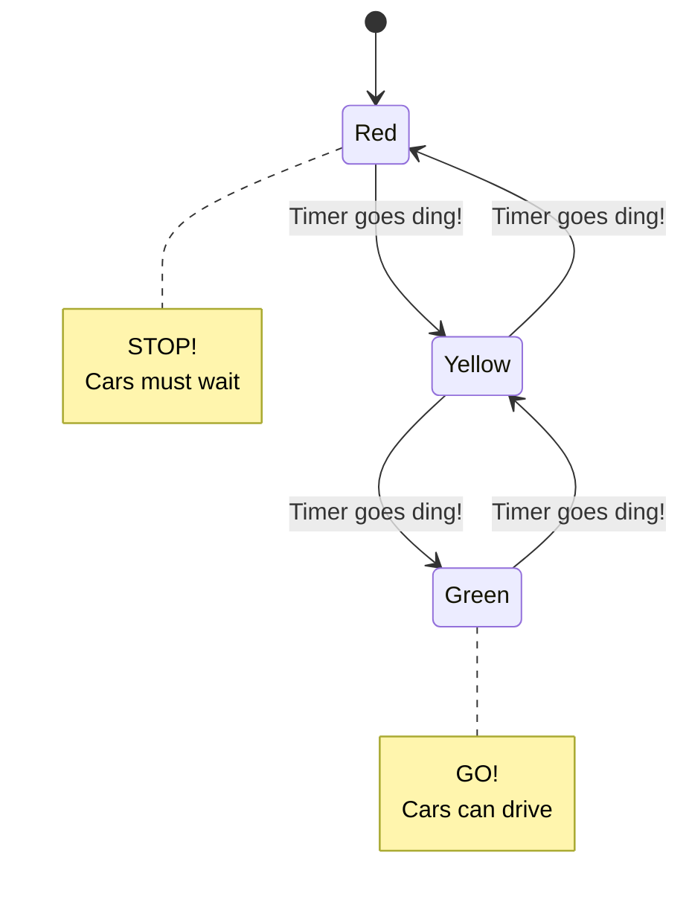
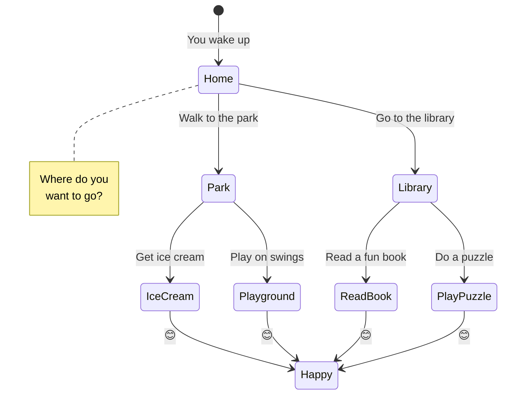
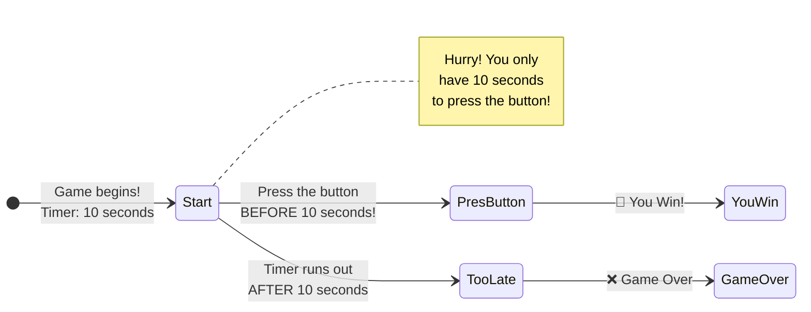
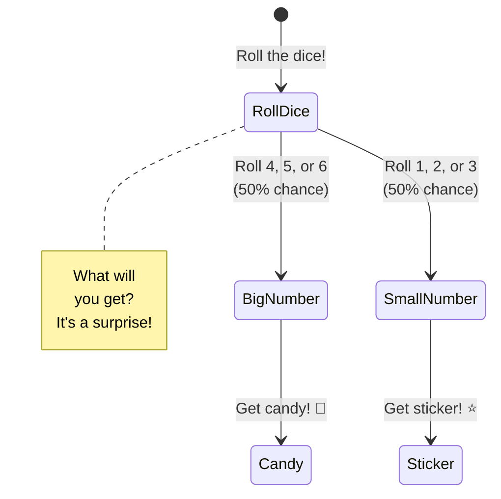
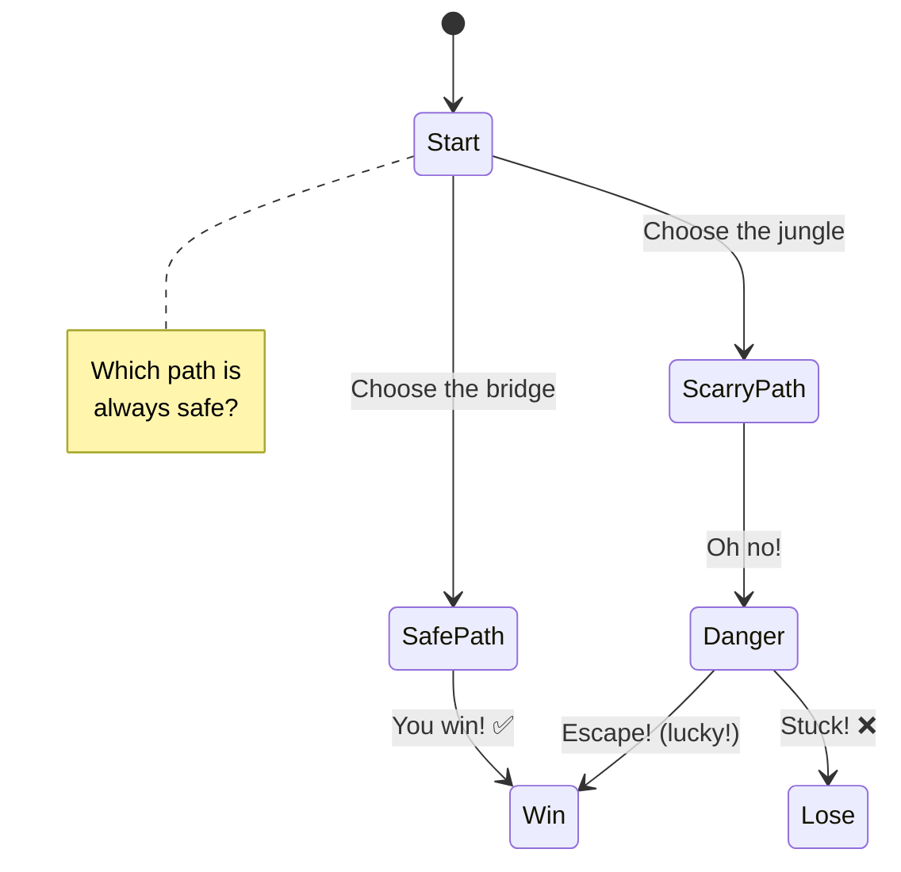
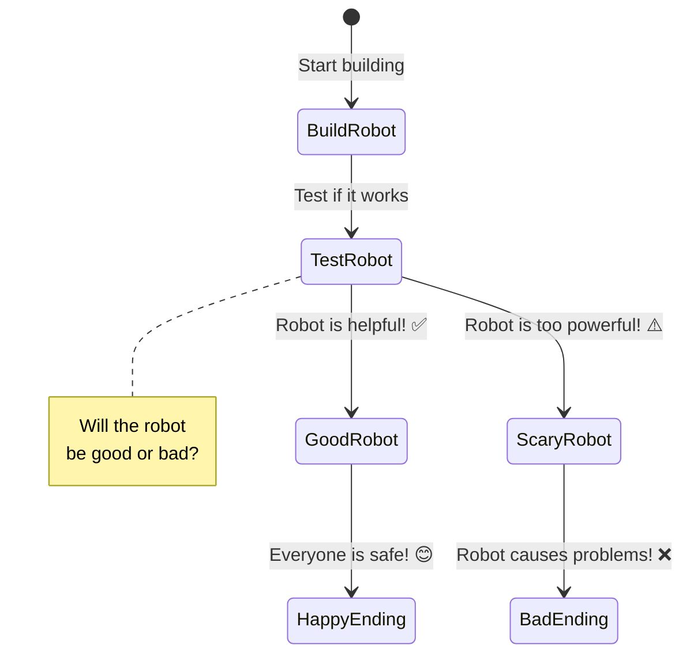

# Explaining Formal Models Like You're 5 Years Old

## What We're Learning About

Imagine you're playing a video game where you have to make choices. We're learning how to draw maps of all the choices you can make, so we can see if you can win the game or if you might lose!

---

## Part 1: The Traffic Light Game

### Your First State Machine

Imagine a traffic light. It changes colors!

**What is this?**
- Each circle is a **state** (red light, yellow light, green light)
- The arrows show what happens next
- The traffic light always follows the same path: Red → Yellow → Green → Yellow → Red

**Try it yourself!**
Point at Red. Now follow the arrow. Where do you go? (Yellow!)
Follow it again. Where do you go? (Green!)

---

## Part 2: Choose Your Own Adventure!

Now let's play a game where YOU choose!

**What's different?**
- At "Home", YOU choose: Park or Library?
- Both paths lead to Happy! 😊
- This is like a map of all your choices

**Let's play:**
1. Start at Home
2. Choose Park
3. Choose Ice Cream
4. You're Happy! 😊

Now try again and choose Library → Read Book. Still Happy!

---

## Part 3: Time Limits! ⏰

Some games have a timer. You have to act fast!

**The rules:**
- If you press the button in time (before 10 seconds) → You Win! 🎉
- If the timer runs out (after 10 seconds) → Game Over ❌
- You can't press the button after time is up!

**Try it:**
Imagine you have 10 seconds. Can you press the button in 5 seconds? (Yes! You win!)
What if you try to press it after 15 seconds? (Too late! Game over)

---

## Part 4: Sometimes Things Are Random! 🎲

Let's play a dice game!

**What's happening?**
- You roll a dice
- Sometimes you get candy (if you roll 4, 5, or 6)
- Sometimes you get sticker (if you roll 1, 2, or 3)
- It's 50-50! You don't know which one until you roll!

**This is called "probability"** - it means "maybe this, maybe that!"

---

## Part 5: Can You Always Win?

Let's check if a game is safe!

### The Safe Path Game

**Let's think:**
- Bridge path → Always Win! ✅
- Jungle path → Sometimes Win, Sometimes Lose

**We can ask: "Is there a way to always win?"**
- YES! Choose the bridge!

**This is what we check:** Can you always get to the happy ending?

---

## Now Let's Think About AI and Robots! 🤖

Remember our games? Now imagine the game is about building a smart robot!

**The Big Question:**
Can we make sure the robot is always helpful and never scary?

**What we learned helps us:**
- **Map all the choices** (like our adventure map)
- **Check if we can always win** (find the safe path)
- **See what happens with time** (do we need to act fast?)
- **Handle randomness** (sometimes things are uncertain!)

---

## What We Learned! 🎓

1. **State Machine** = A map showing all the places you can go
2. **Choices** = Arrows going different directions (you pick which one!)
3. **Time Limits** = Some choices only work if you're fast enough
4. **Random** = Sometimes you don't know what will happen (like rolling dice)
5. **Checking** = We can ask "Can I always win?" and find out!

**Why This Matters:**
When grown-ups build smart computers and robots, they use these maps to make sure the robots will be safe and helpful!

---

## Try It Yourself! 🎨

Draw your own state machine!

**Example: Getting Ready for School**

1. Draw a circle labeled "Wake Up"
2. Draw an arrow to "Eat Breakfast"
3. Draw an arrow to "Brush Teeth"
4. Draw an arrow to "Go to School"

Congratulations! You made a state machine! 🎉

---

## Questions to Think About 🤔

1. If you're at the "Start" of a game, and you can choose "Left" or "Right", how many arrows leave Start? (2!)

2. If a timer says you have 5 seconds, can you do something that takes 10 seconds? (No!)

3. If you flip a coin, do you know if it will be heads or tails? (No! It's random!)

4. If there are two paths and one always wins and one sometimes loses, which path should you choose? (The one that always wins!)

**Great job! You understand the basics of formal modeling!** 🌟
