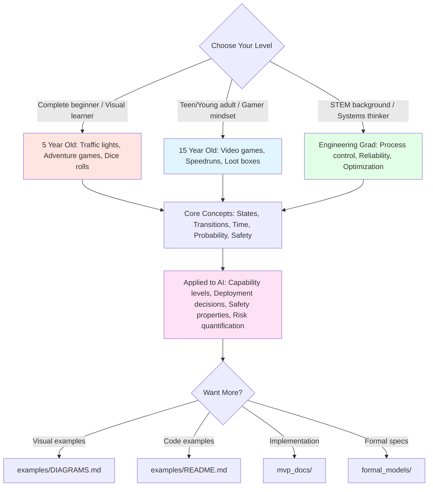

# Explain Like I'm... (ELI)

Formal modeling concepts explained at different levels, using relatable examples and lots of visuals!

---

## Choose Your Level

### 🎈 [For 5 Year Olds](5_years_old.md)

**You'll learn about:**
- Traffic lights and choose-your-own-adventure games
- Why some paths always win
- Timers and time limits
- Rolling dice (randomness!)
- Making maps of choices

**Visual approach**: Simple state diagrams with happy/sad endings

**Example**: "Imagine you're choosing which park to visit..."

**Perfect for**: Complete beginners, visual learners, teaching kids about decision-making

---

### 🎮 [For 15 Year Olds](15_years_old.md)

**You'll learn about:**
- Video game state machines (RPG mechanics)
- Battle Royale shrinking zones (time constraints)
- Loot box probabilities (MDPs)
- Speedrun optimization (property checking)
- Esports strategy (game theory)

**Visual approach**: Game-style diagrams, probability tables, strategy guides

**Example**: "Ever played Fortnite? The zone shrinks over time..."

**Perfect for**: Teens, gamers, people who think in terms of games and strategy

---

### ⚙️ [For Engineering Graduates](engineering_graduate.md)

**You'll learn about:**
- FSMs ≈ Process control logic
- Time constraints ≈ Batch process scheduling
- MDPs ≈ Reliability engineering
- Property checking ≈ HAZOP/safety analysis
- Optimization ≈ Multi-objective process design

**Visual approach**: Industrial diagrams, control systems, engineering trade-offs

**Example**: "Think of a chemical reactor with states: Idle, Heating, Reaction..."

**Perfect for**: STEM graduates, engineers (mech/chem/electrical), systems thinkers

---

## What All Levels Cover

### Core Concepts

1. **State Machines** (FSM/LTS)
   - What: Maps of all possible situations
   - Example (5yo): Traffic light colors
   - Example (15yo): Video game levels
   - Example (Eng): Reactor operating modes

2. **Time Constraints**
   - What: Deadlines and time windows
   - Example (5yo): "You have 10 seconds to press the button!"
   - Example (15yo): Battle Royale zone shrinking
   - Example (Eng): Batch process scheduling windows

3. **Probability/Uncertainty** (MDPs)
   - What: Actions with random outcomes
   - Example (5yo): Rolling dice for candy or sticker
   - Example (15yo): Loot box drop rates
   - Example (Eng): Component failure rates

4. **Property Checking**
   - What: Verifying "Can we always win?"
   - Example (5yo): "Is there a path that always leads to happy?"
   - Example (15yo): "Can I beat this game without dying?"
   - Example (Eng): "Does this system meet safety specs?"

5. **Optimization**
   - What: Finding the best strategy
   - Example (5yo): "Which path gets you ice cream fastest?"
   - Example (15yo): "Which character build maximizes DPS?"
   - Example (Eng): "Which parameters maximize yield while ensuring safety?"

### AI2027 Connection

Each level connects the relatable example to AI development:

- **5yo**: Building a robot that's helpful, not scary
- **15yo**: Modeling AI as a game with win/lose conditions
- **Eng**: AI governance as safety-critical system design

---

## How to Use This Guide

### For Self-Study

1. **Start with your level** based on background
2. **Read the examples** - they build intuition
3. **Try the exercises** at the end of each doc
4. **Move up a level** if you want more depth

### For Teaching

1. **Match to audience**:
   - Kids/beginners → 5 year old version
   - High school/college → 15 year old version
   - Technical professionals → Engineering graduate version

2. **Use the visuals**:
   - All docs have Mermaid diagrams
   - Project them or share screenshots
   - Have students draw their own

3. **Build on examples**:
   - Traffic lights → Industrial control (progression)
   - Video games → Real systems (abstraction)
   - Process engineering → AI systems (analogy)

### For Technical Readers

If you already understand formal methods:

- **5yo version**: Great for explaining to non-technical stakeholders
- **15yo version**: Good for recruiting students to AI safety
- **Eng version**: Useful for interdisciplinary collaboration

---

## Visual Summary



---

## Progression Path

```
Level 1 (5yo)          →  Intuition & Visual Understanding
      ↓
Level 2 (15yo)         →  Concrete Examples & Applications
      ↓
Level 3 (Eng)          →  Technical Analogies & Systems Thinking
      ↓
Formal Docs            →  Mathematical Foundations
      ↓
Implementation         →  Building Real Systems
```

**You don't have to go through all levels!** Pick the one that matches your background and goals.

---

## Learning Objectives by Level

### 5 Year Old Level

After reading, you should be able to:
- ✓ Recognize a state machine diagram
- ✓ Understand that choices lead to different outcomes
- ✓ Grasp that some paths are safer than others
- ✓ Know what "random" means (dice, coin flips)

### 15 Year Old Level

After reading, you should be able to:
- ✓ Draw a state machine for a simple system
- ✓ Calculate basic probabilities and expected values
- ✓ Understand time constraints and deadlines
- ✓ Identify optimal strategies given trade-offs
- ✓ Apply these concepts to game design or strategy

### Engineering Graduate Level

After reading, you should be able to:
- ✓ Map AI systems to familiar engineering systems (reactors, control loops)
- ✓ Understand formal modeling as systematic HAZOP/FMEA
- ✓ Recognize MDPs as extensions of reliability analysis
- ✓ See connections to process optimization and constraint satisfaction
- ✓ Appreciate why formal methods matter for high-stakes systems

---

## FAQ

**Q: Can I skip to the technical docs?**
A: Yes! But the ELI versions build intuition that makes the formal math easier.

**Q: Which level should I choose?**
A: Pick based on background:
- No tech background → 5yo
- Some math/science (high school+) → 15yo
- Engineering degree → Eng grad

**Q: I'm a CS person, is this for me?**
A: These are for NON-CS audiences. If you know CS, go straight to [formal_models/](../formal_models/)

**Q: Can I use these for teaching?**
A: Absolutely! That's what they're for. All diagrams are Mermaid (easy to edit).

**Q: Why AI2027 specifically?**
A: It's a concrete scenario that:
- Has real stakes (existential risk)
- Involves time windows (2024-2028)
- Has uncertainty (probability of alignment)
- Needs optimization (safety vs speed)
- Benefits from formal analysis

---

## Next Steps After ELI

Ready for more depth?

1. **See visual examples**: [../examples/DIAGRAMS.md](../examples/DIAGRAMS.md)
2. **Run code examples**: [../examples/README.md](../examples/README.md)
3. **Read implementation plan**: [../mvp_docs/impl_plan.md](../mvp_docs/impl_plan.md)
4. **Study formal specs**: [../formal_models/README.md](../formal_models/README.md)
5. **Explore temporal logics**: [../logics/README.md](../logics/README.md)

---

## Contributing

Want to add examples or improve explanations?

- **Found a typo?** Submit a PR
- **Better analogy?** Open an issue
- **New audience level?** (e.g., business executives, policymakers) Create a new .md file!

**Guidelines**:
- Use simple language
- Include lots of diagrams
- Start with relatable examples
- Connect to AI2027 at the end
- Add "Try it yourself" exercises

---

## Feedback

Which explanation worked best for you? Let us know!

- Too simple? Try the next level up
- Too complex? Try the level below
- Just right? Share with others at your level!

**Remember**: The goal is understanding, not showing off knowledge. Pick the level that makes the concepts click for YOU! 🎯
