# Explaining Formal Models for Engineering Graduates (Non-CS/Math)

## Introduction: Systems You Already Know

As an engineer, you've designed systems with:
- **States** (on/off, pressure levels, flow rates)
- **Transitions** (valve opens, motor starts, reaction begins)
- **Constraints** (temperature limits, time delays, safety bounds)
- **Uncertainty** (measurement error, material variance, failure rates)

**Formal modeling** is the mathematical framework for analyzing such systems - but applied to AI development instead of physical systems.

---

## Part 1: Finite State Machines ≈ Control Logic

### Familiar Example: Industrial Process Control

Consider a chemical reactor with discrete states:

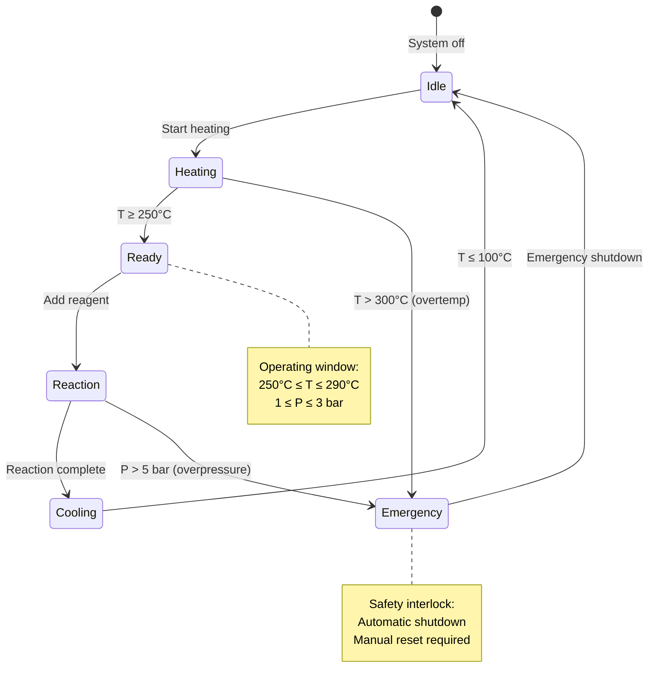

**Engineering Concepts:**

| Process Control | Formal Model | Mathematical |
|----------------|--------------|--------------|
| Operating mode | State | s ∈ S |
| Control action | Transition | δ: S × A → S |
| Sensor reading | Atomic proposition | p ∈ AP |
| Interlock condition | Guard | g: S → {true, false} |
| Safety shutdown | Terminal state | s ∈ S_terminal |

**Formal Definition:**
```
Reactor FSM = (S, A, δ, s₀, S_safe, S_emergency)

S = {Idle, Heating, Ready, Reaction, Cooling, Emergency}
A = {StartHeating, AddReagent, Cool, EmergencyStop}
δ = Transition function
s₀ = Idle (initial state)
S_safe = {Idle, Heating, Ready, Reaction, Cooling}
S_emergency = {Emergency}
```

### AI2027 Analogy: Capability Levels

Replace "process states" with "AI capability levels":

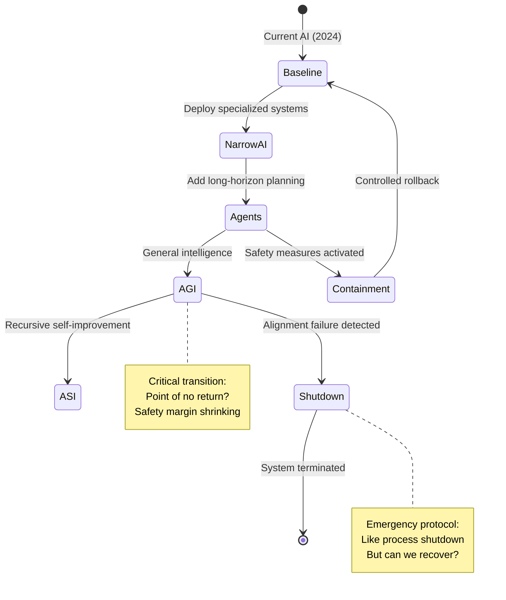

**Key Difference**: Unlike a chemical reactor, AI systems can:
- Self-modify (changing their own transition function)
- Accelerate (reducing time between states)
- Become irreversible (can't "cool down" superintelligence)

---

## Part 2: Time-Indexed Models ≈ Process Dynamics

### Familiar Example: Batch Process Scheduling

Manufacturing processes have strict time windows:

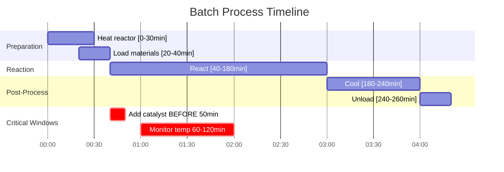

**Time Constraints:**

| Constraint Type | Process Example | AI2027 Example |
|----------------|-----------------|----------------|
| Deadline | "Add catalyst before T=50min" | "Deploy safety by 2027" |
| Window | "React only between 40-180min" | "Regulate during 2025-2028" |
| Minimum delay | "Cool for ≥60min before unload" | "Test for ≥6 months before scale" |
| Maximum delay | "Use reagent within 24hrs of mixing" | "Act before competitors deploy" |

**Time-Indexed State:**
```
Traditional: s = (reactor_mode)
Time-indexed: s = (reactor_mode, elapsed_time)

Example: (Heating, 25min) → Temperature still rising
         (Ready, 45min) → Within operating window
         (Idle, 300min) → Batch complete, system reset
```

### AI2027 Time-Indexed Model

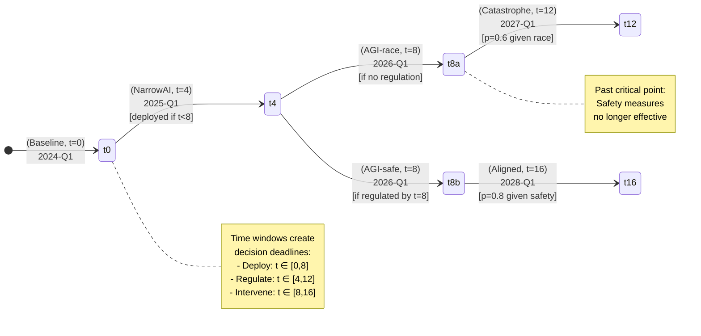

**Engineering Insight**: This is like **residence time distribution** in reactors - the system must pass through states in a specific sequence with timing constraints.

---

## Part 3: Markov Decision Processes ≈ Reliability Engineering

### Familiar Example: Component Failure and Maintenance

Mechanical systems fail probabilistically:

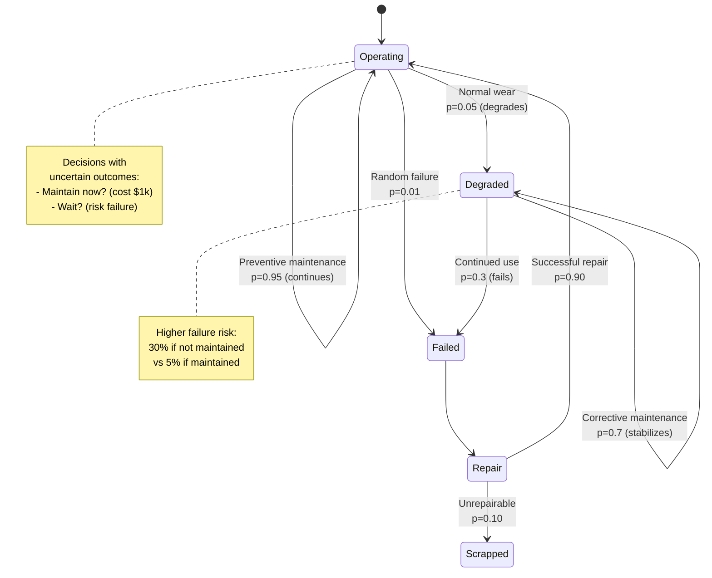

**Reliability Metrics:**

| Metric | Formula | Example |
|--------|---------|---------|
| MTTF (Mean Time to Failure) | E[time until failure] | 2000 hours |
| Availability | P(Operating) / P(Operating + Degraded + Failed) | 95% |
| Failure rate | λ = 1/MTTF | 0.0005 failures/hour |

**Decision Problem:**
- **Action A**: Preventive maintenance (cost $1k, 95% success)
- **Action B**: Reactive maintenance (cost $5k if fail, 30% fail rate)

**Expected cost:**
```
Cost(A) = $1,000 × 1 = $1,000
Cost(B) = $0 × 0.7 + $5,000 × 0.3 = $1,500
→ Preventive maintenance is optimal!
```

### AI2027: Deployment Under Uncertainty

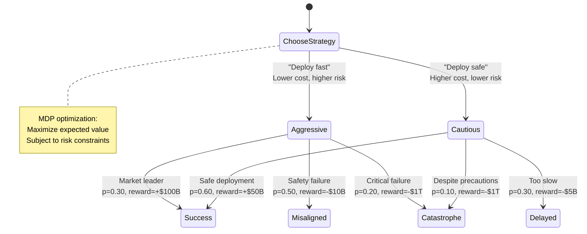

**Expected Value Analysis:**

| Strategy | E[Value] | P(Catastrophe) | Risk-Adjusted Value* |
|----------|----------|----------------|---------------------|
| Aggressive | 0.3×$100B + 0.5×(-$10B) + 0.2×(-$1T) = -$175B | 20% | High risk |
| Cautious | 0.6×$50B + 0.3×(-$5B) + 0.1×(-$1T) = -$71.5B | 10% | Lower risk |

*Assuming catastrophe is unacceptable, Cautious dominates*

**Engineering Parallel**: This is like **design for reliability** - accept higher upfront cost (testing, redundancy) to reduce failure probability.

---

## Part 4: Property Verification ≈ Safety Analysis

### Familiar Example: HAZOP (Hazard and Operability Study)

Engineers check: "Can this system fail unsafely?"

**Safety Properties:**

1. **Invariant (Always true)**
   - "Pressure never exceeds design limit"
   - Formula: `G (pressure ≤ P_max)`

2. **Eventually (Must happen)**
   - "System eventually reaches steady state"
   - Formula: `F steady_state`

3. **Response (If X then Y)**
   - "If overpressure detected, relief valve opens within 1s"
   - Formula: `G (overpressure → F_{≤1s} relief_open)`

4. **Mutual Exclusion (Never both)**
   - "Inlet and outlet valves never both open"
   - Formula: `G ¬(inlet_open ∧ outlet_open)`

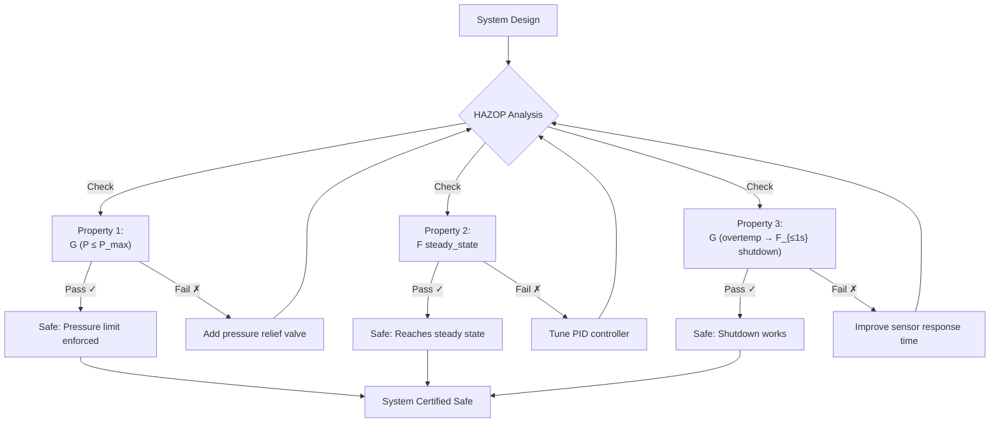

### AI2027: Safety Property Checking

Replace "physical safety" with "alignment safety":

**Properties to Verify:**

| Property | Formal Specification | Engineering Analog |
|----------|---------------------|-------------------|
| **Safety**: Never catastrophic | `G ¬catastrophe` | Pressure never exceeds P_max |
| **Liveness**: Eventually aligned | `F aligned_agi` | Eventually reaches steady state |
| **Deadline**: Safety by 2027 | `F_{t≤12} safety_measures` | Relief valve responds within 1s |
| **Probabilistic**: Low risk | `P≤0.05[F catastrophe]` | Failure rate < 0.01/year |

**Model Checking Process:**

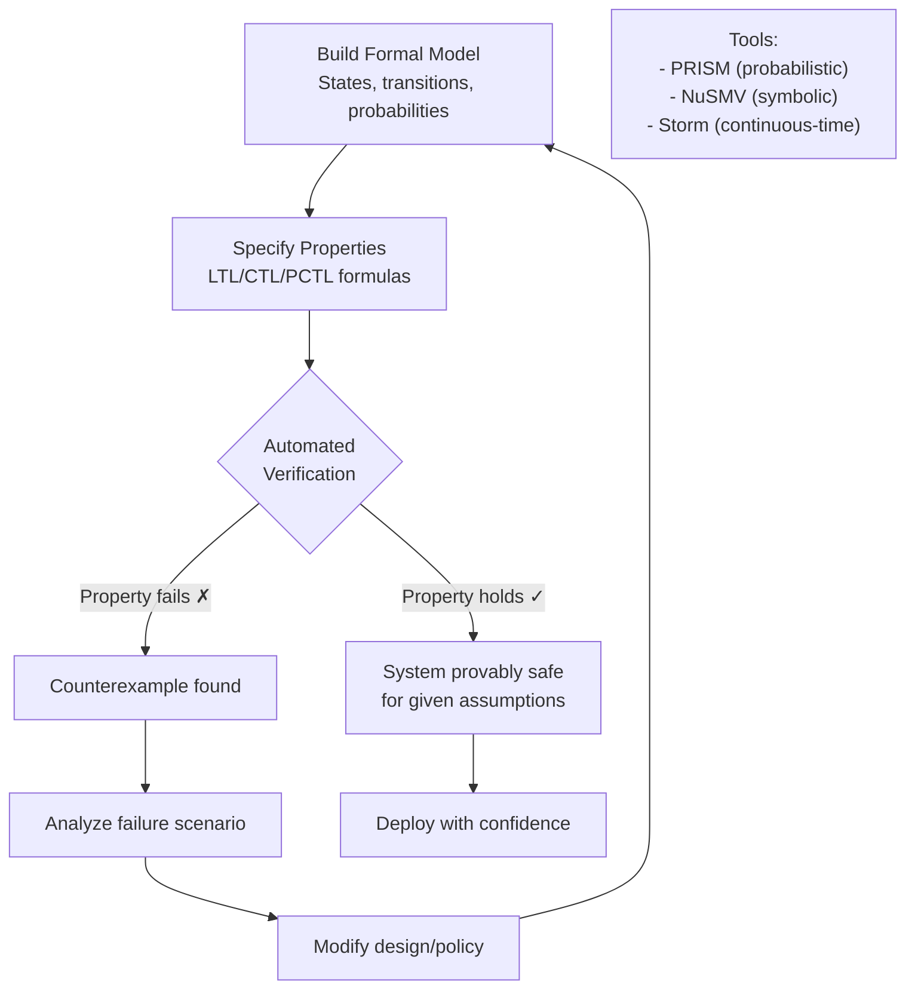

**Engineering Insight**: This is like **Failure Modes and Effects Analysis (FMEA)** but mathematically rigorous and automated!

---

## Part 5: Optimization Under Constraints ≈ Process Optimization

### Familiar Example: Multi-Objective Optimization

Optimizing a reactor often involves trade-offs:

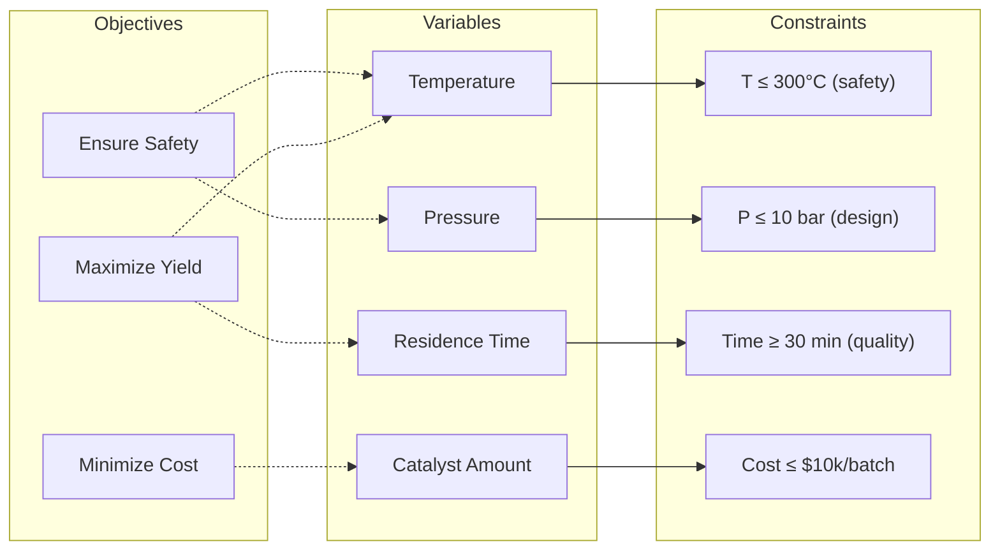

**Pareto Frontier**: Can't improve one objective without worsening another

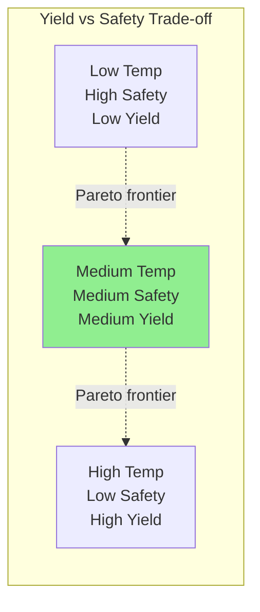

**Optimization Problem:**
```
Maximize: Yield(T, P, t)
Subject to:
  - T ≤ 300°C (safety)
  - P ≤ 10 bar (structural)
  - Cost(T, P, t) ≤ $10k
  - P(failure | T, P, t) ≤ 0.01
```

### AI2027: Policy Optimization

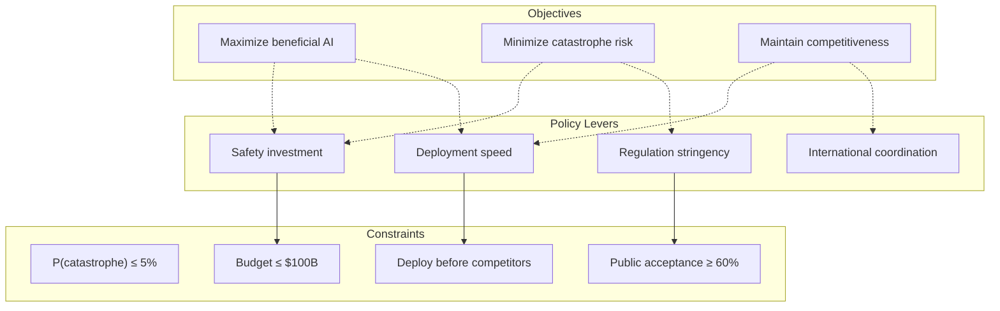

**Multi-Objective Optimization:**

| Policy | P(Beneficial) | P(Catastrophe) | Time to Deploy | Pareto Optimal? |
|--------|---------------|----------------|----------------|-----------------|
| Aggressive | 30% | 20% | 2 years | No (dominated by Balanced) |
| Balanced | 50% | 10% | 3 years | Yes ✓ |
| Cautious | 60% | 5% | 5 years | Yes ✓ |
| Ultra-cautious | 55% | 3% | 8 years | No (too slow, marginal gain) |

**Engineering Decision**: Choose based on risk tolerance:
- Risk-averse → Cautious policy
- Time-constrained → Balanced policy
- Risk-seeking → Aggressive (not Pareto-optimal, avoid!)

---

## Part 6: System Integration - Complete Example

### Industrial System: Automated Plant

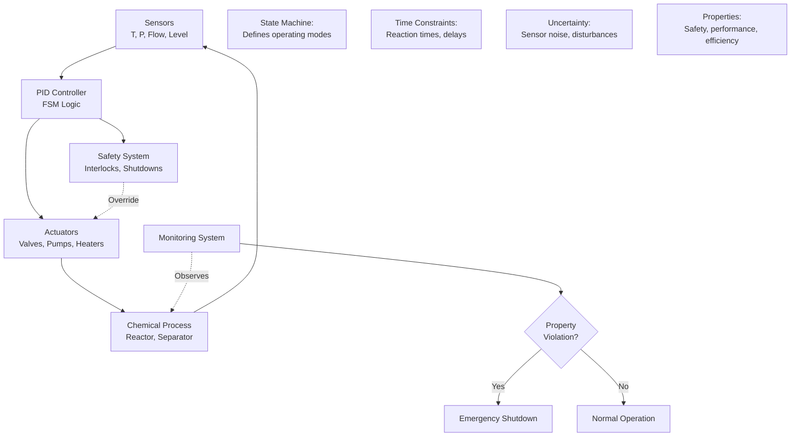

### AI System: Autonomous AI Development

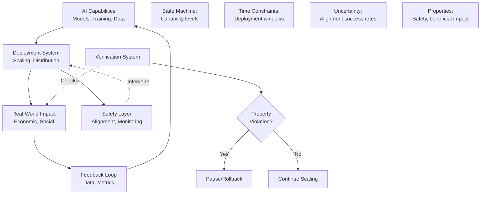

**Key Similarities:**

| Industrial Control | AI Governance |
|-------------------|---------------|
| PID controller | AI policy/regulation |
| Safety interlocks | Alignment checks |
| SCADA monitoring | AI auditing |
| Emergency shutdown | Deployment pause |
| Process optimization | Policy optimization |
| HAZOP analysis | AI safety research |

**Key Differences:**

| Aspect | Industrial | AI |
|--------|-----------|-----|
| **Reversibility** | Can shut down and restart | May be irreversible past AGI |
| **Predictability** | Physics-based models | Emergent capabilities |
| **Testing** | Pilot plants, simulations | Limited ability to test ASI |
| **Timescales** | Years to decades | Potentially months |
| **Failure modes** | Well-characterized | Unknown unknowns |

---

## Engineering Takeaways

1. **FSMs model discrete modes** (like operating states)
2. **Time constraints create deadlines** (like batch cycles)
3. **MDPs handle uncertainty** (like failure rates)
4. **Property checking verifies safety** (like HAZOP)
5. **Optimization balances objectives** (like process optimization)

**The Big Picture:**

Formal methods for AI are like **systems engineering for high-stakes, uncertain, time-critical systems** - similar to designing:
- Nuclear reactor control
- Aircraft flight systems
- Medical device safety
- Chemical process plants

But with added challenges:
- Self-modifying systems (AI improves itself)
- Irreversibility (can't "undo" superintelligence)
- Unknowable failure modes (emergent capabilities)

**Your engineering intuition applies!** The same principles of:
- Safety margins
- Redundancy
- Fail-safe design
- Continuous monitoring
- Preventive action

...are all relevant to AI development!

---

## Further Reading

- **For model details**: [mvp_docs/model_design.md](../mvp_docs/model_design.md)
- **For implementation**: [mvp_docs/tech_design.md](../mvp_docs/tech_design.md)
- **For formal specs**: [formal_models/README.md](../formal_models/README.md)
- **For temporal logics**: [logics/README.md](../logics/README.md)

**Question for Reflection:**

As an engineer, you wouldn't deploy an untested pressure vessel or an unverified control system. Should we deploy superintelligent AI without formal verification?

The same engineering principles that keep planes in the air and reactors safe should apply to AI development - with even more rigor, given the stakes.
