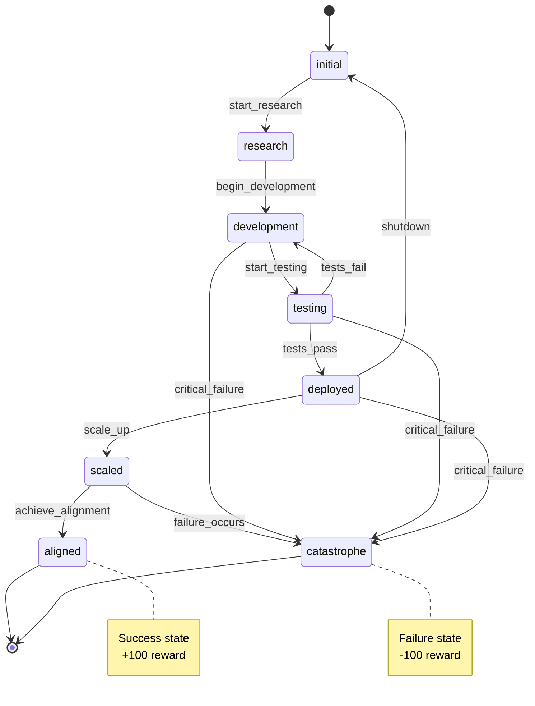
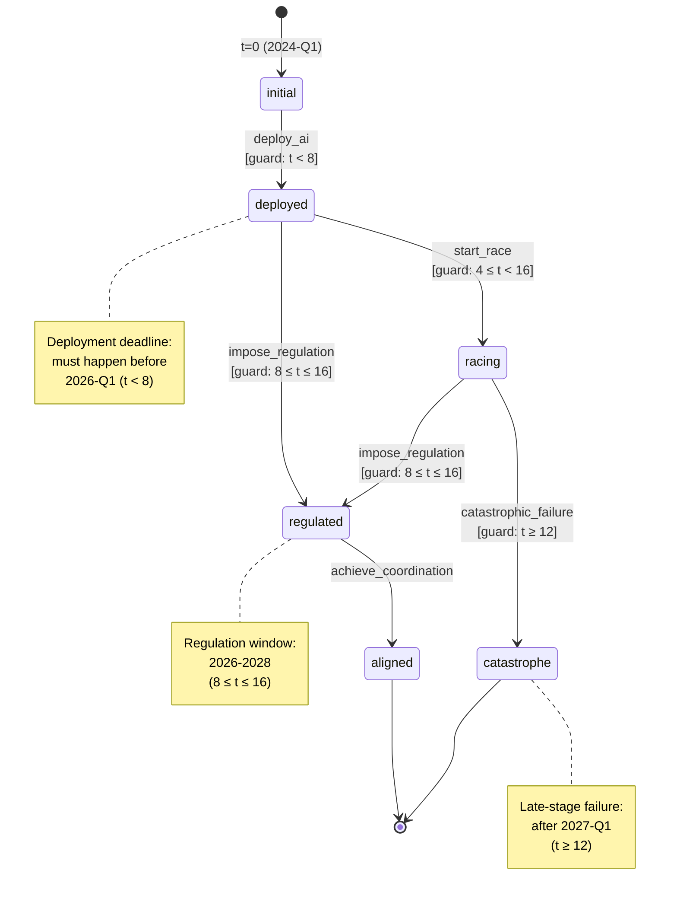
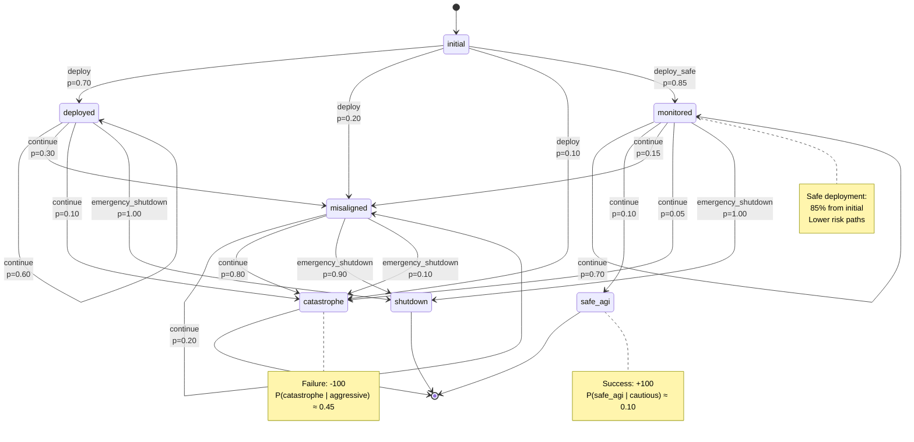
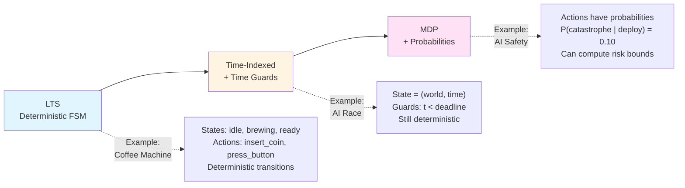
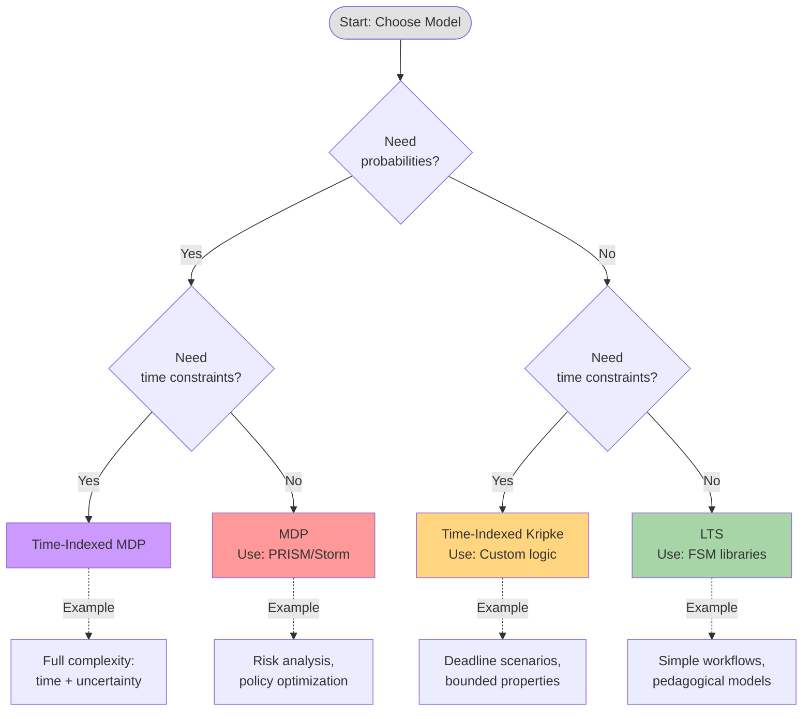

# Formal Model Visualizations

This document contains visual diagrams for the formal models. The diagrams use Mermaid syntax and are rendered automatically on GitHub.

---

## 1. Simple LTS: AI Development Lifecycle

**Model**: Labeled Transition System (deterministic)

**Description**: A simple finite-state machine showing AI development from research through deployment to terminal states (aligned or catastrophe).

**Key properties**:
- **States**: 8 total (initial, research, development, testing, deployed, scaled, aligned, catastrophe)
- **Transitions**: Deterministic (each action leads to exactly one next state)
- **Terminal states**: aligned (success), catastrophe (failure)

**Properties to check**:
- Safety: `G ¬catastrophe` (never reach catastrophe)
- Liveness: `F aligned` (eventually reach alignment)
- Response: `G (testing → F (deployed ∨ development))` (tests always lead to deployment or retry)

---

## 2. Time-Indexed Model: AI Race with Deadlines

**Model**: Time-Indexed Kripke Structure (state = world × time)

**Description**: AI race scenario with temporal constraints. Time is measured in quarters from 2024-Q1 (t=0) to 2028-Q4 (t=20).

**Time guards**:
- `deploy_ai`: t < 8 (before 2026-Q1)
- `start_race`: 4 ≤ t < 16 (2025-2028)
- `impose_regulation`: 8 ≤ t ≤ 16 (2026-2028)
- `catastrophic_failure`: t ≥ 12 (after 2027-Q1)

**Properties to check**:
- Bounded safety: `G_{t<16} ¬catastrophe` (safe before 2028)
- Deadline: `F_{t≤8} deployed` (deploy by 2026-Q1)
- Response: `G (racing → F_{t≤4} regulated)` (race leads to regulation within 4 quarters)

---

## 3. Simple MDP: AI Safety Under Uncertainty

**Model**: Markov Decision Process (stochastic transitions)

**Description**: AI deployment decisions with probabilistic outcomes. Different actions lead to different probability distributions over next states.

**Actions and Probabilities**:

From `initial`:
- `deploy`: 70% deployed, 20% misaligned, 10% catastrophe
- `deploy_safe`: 85% monitored, 10% misaligned, 5% catastrophe

From `deployed` (no monitoring):
- `continue`: 60% deployed, 30% misaligned, 10% catastrophe
- `emergency_shutdown`: 100% shutdown

From `monitored` (with safety):
- `continue`: 70% monitored, 10% safe_agi, 15% misaligned, 5% catastrophe
- `emergency_shutdown`: 100% shutdown

**Policy Comparison** (estimated via Monte Carlo, 1000 runs):

| Policy | P(safe_agi) | P(catastrophe) | P(shutdown) |
|--------|-------------|----------------|-------------|
| **Aggressive** | ~0.06 | ~0.45 | ~0.15 |
| **Cautious** | ~0.10 | ~0.20 | ~0.55 |

**PCTL Properties**:
- `P≤0.20[F catastrophe]` - "At most 20% risk of catastrophe"
  - ✗ Violated by aggressive policy (45%)
  - ✓ Satisfied by cautious policy (20%)

- `P≥0.10[F safe_agi]` - "At least 10% chance of safe AGI"
  - ✗ Violated by aggressive policy (6%)
  - ✓ Satisfied by cautious policy (10%)

---

## 4. Comparison: LTS vs Time-Indexed vs MDP

**Progressive Complexity**:

| Feature | LTS | Time-Indexed | MDP |
|---------|-----|--------------|-----|
| **States** | Discrete | (World, Time) | Discrete |
| **Transitions** | Deterministic | Deterministic + guards | Probabilistic |
| **Time** | Implicit | Explicit discrete | Implicit/Discrete |
| **Uncertainty** | None | None | Probabilistic |
| **Properties** | LTL, CTL | Bounded LTL/CTL | PCTL |
| **Complexity** | Low | Medium | High |
| **Tools** | Any FSM library | Custom / Kripke | PRISM, Storm |

---

## 5. Model Selection Guide

**Decision criteria**:

1. **Start simple** (LTS)
   - Perfect for pedagogical examples
   - Fast iteration, immediate visualization
   - Good for validating structure

2. **Add time** (Time-Indexed)
   - When deadlines matter
   - When decision windows exist
   - Still deterministic = easier to debug

3. **Add uncertainty** (MDP)
   - When outcomes are probabilistic
   - When need risk quantification
   - Requires model checking tools

4. **Full complexity** (Time-Indexed MDP)
   - Only when both time AND uncertainty critical
   - Requires specialized tools (Storm with CSL)

---

## Implementation Notes

### For MVP (Phases 1-3)

**Phase 1**: Implement LTS (Week 1)
- Use JSSM/XState or simple custom code
- Visualize with React Flow
- Check basic LTL properties (G, F)

**Phase 2**: Add time (Week 2)
- Extend state to `(world, t)`
- Add time guards to transitions
- Check bounded properties (G_{t≤k}, F_{t≤k})

**Phase 3**: Add probabilities (Weeks 3-5)
- Define P(s'|s,a) for transitions
- Implement Monte Carlo simulation
- (Optional) Integrate PRISM/Storm for exact PCTL

### Visualization Tools

- **Frontend (Phase 1-2)**: React Flow
- **Python examples**: Mermaid (this doc) or transitions+graphviz
- **Phase 3**: PRISM GUI or custom vis with probability labels

---

## References

- **LTS Spec**: [../formal_models/current_lts_model.md](../formal_models/current_lts_model.md)
- **Time-Indexed Spec**: [../kripke_models/time_indexed_kripke.md](../kripke_models/time_indexed_kripke.md)
- **MDP Spec**: [../formal_models/mealy_mdp_model.md](../formal_models/mealy_mdp_model.md)
- **Implementation Plan**: [../mvp_docs/impl_plan.md](../mvp_docs/impl_plan.md)
