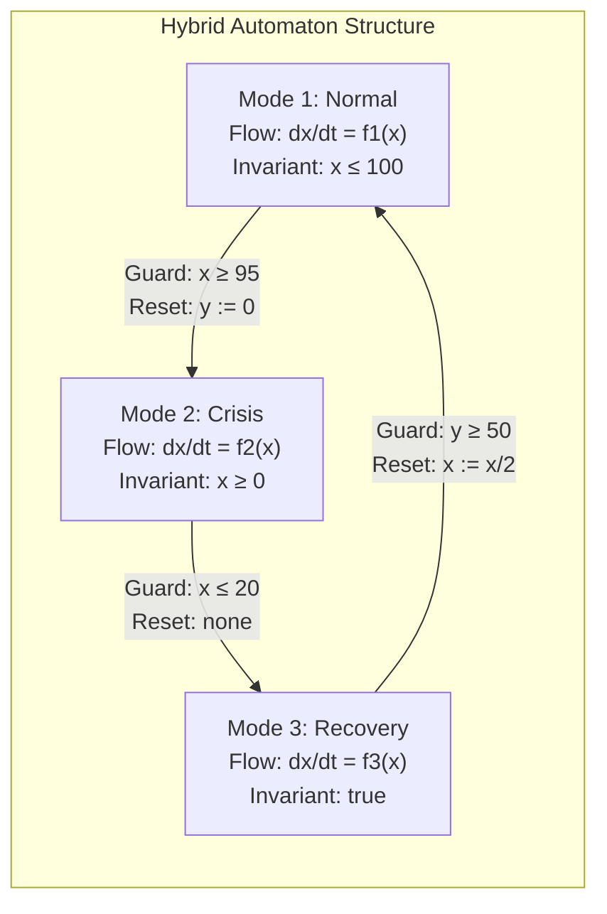
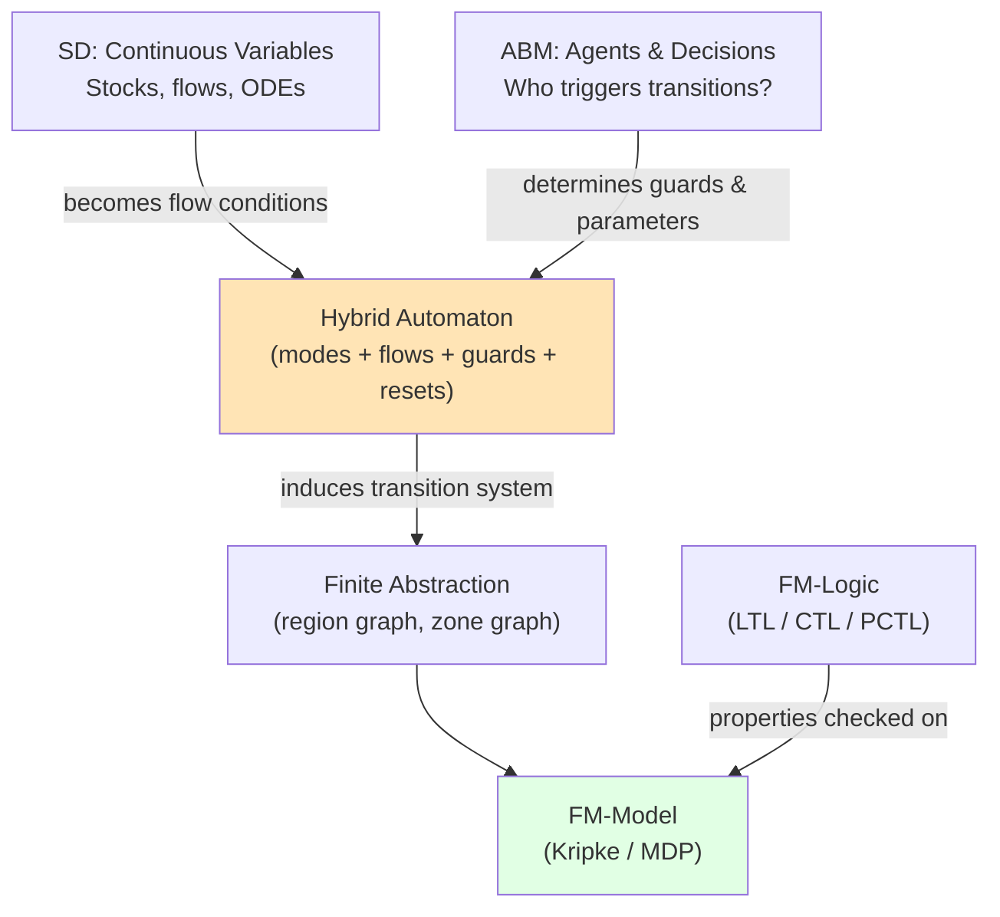
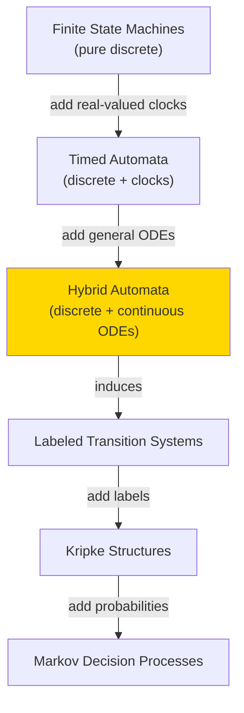

# Hybrid Automata: Unifying SD, ABM, and Formal Methods

**Status**: Research framework | Last updated: 2025-11-18

---

## Overview

This folder documents **hybrid automata** as the formal backbone that naturally unifies:
- **System Dynamics (SD)**: continuous variables, differential equations, feedback loops
- **Agent-Based Models (ABM)**: discrete agents making decisions, triggering regime changes
- **Formal Models**: transition systems, Kripke structures, MDPs
- **Formal Logic**: temporal logic properties for verification

**Key Insight**: Hybrid automata are not a competing paradigm—they're the mathematically clean framework that glues together the continuous (SD), discrete-agent (ABM), and verification (FM) worlds.

---

## What Are Hybrid Automata?

A **hybrid automaton** consists of:

1. **Finite set of modes** (discrete locations, like states in a finite automaton)
2. **Finite set of continuous variables** (real-valued state)
3. **Flow conditions** (ODEs/differential inclusions governing how variables evolve in each mode)
4. **Guards** (conditions on transitions between modes)
5. **Resets** (instantaneous updates to continuous variables when transitioning)

**Semantics**: A hybrid automaton generates an infinite-state transition system where:
- **States** are `(mode, continuous_vector)` pairs
- **Transitions** are either:
  - **Time-elapse**: stay in mode, continuous variables evolve per ODEs
  - **Discrete jumps**: switch modes when guard is satisfied, apply resets

---

## Why Hybrid Automata for Complex Systems?

### Traditional Problem
When modeling socio-technical-environmental systems, researchers often:
1. Build SD model for physics/ecology/economics (continuous)
2. Build ABM for agent behavior and politics (discrete)
3. Try to "glue them together" with ad-hoc coupling
4. Manually abstract to finite state space for verification
5. Hope the abstraction is sound

**Result**: Lots of bespoke code, unclear soundness, hard to verify.

### Hybrid Automata Solution
Instead:
1. **Formalize the system as a hybrid automaton**
   - SD equations become flow conditions in modes
   - ABM determines guard activations and parameter changes
   - Get a well-defined mathematical object

2. **Leverage existing theory**
   - Decidability results (Henzinger et al.)
   - Finite abstraction techniques (region graphs, zone graphs)
   - Tool support (HyTech, Uppaal, SpaceEx, KeYmaera X)

3. **Principled verification**
   - Write temporal logic specs
   - Use model checking or reachability analysis
   - Get formal guarantees (or counterexamples)

---

## Mapping to Our 4-Component Framework

Our original decomposition:

| Component | What it does |
|-----------|--------------|
| **SD** | Continuous dynamics, feedback loops, stocks & flows |
| **ABM** | Agent decisions, political processes, social dynamics |
| **FM-Model** | Formal transition system (Kripke, MDP, LTS) |
| **FM-Logic** | Temporal logic specifications (LTL, CTL, PCTL) |

**With hybrid automata**:

**Key point**: The hybrid automaton is the **formal spine** that:
- Contains SD as its continuous part
- Gets controlled/triggered by ABM
- Induces the FM-Model transition system
- Supports FM-Logic verification

---

## Concrete Examples

We provide detailed hybrid-automaton models for three canonical domains:

### 1. [Social-Ecological Systems (Fisheries)](examples/01_ses_fisheries.md)
- **SD**: Fish biomass, nutrient levels, fishing capital, social trust
- **ABM**: Fishers choosing effort, regulators setting quotas
- **Modes**: OpenAccess, LightRegulation, StrictRegulation, EmergencyClosure
- **Properties**: No biomass collapse under good governance, mandatory crisis response

### 2. [Epidemic Control](examples/02_epidemic_control.md)
- **SD**: SEIR dynamics, hospital capacity, vaccination rates
- **ABM**: Individuals' contact behavior, institutions' policy choices
- **Modes**: PreEpidemic, Growth, Mitigation, Suppression, Endemic
- **Properties**: ICU non-overflow, timely intervention, eventual exit from lockdown

### 3. [Smart Grids & EV Logistics](examples/03_smart_grid.md)
- **SD**: Grid frequency, voltages, battery state-of-charge
- **ABM**: Prosumers, EV owners, grid operators
- **Modes**: Normal, HighLoad, Emergency, Blackout
- **Properties**: No uncontrolled blackout, fast emergency response, critical service guarantees

### 4. [AI Governance (AI-2027)](examples/04_ai_governance.md)
- **SD**: Compute, alignment capacity, security level, public trust
- **ABM**: Labs, regulators, adversaries
- **Modes**: Baseline, Race, Slowdown, Misalignment_Evidence, Catastrophe, Aligned
- **Properties**: Probability bounds on catastrophe, mandatory safety responses

---

## Theoretical Foundations

### Decidability & Complexity
From **Henzinger et al., "What's Decidable about Hybrid Automata?"**:

| Class | Decidability | Complexity |
|-------|--------------|------------|
| **Timed automata** | Decidable | PSPACE-complete |
| **Initialized rectangular HA** | Decidable | PSPACE-complete |
| **Linear hybrid automata** | Undecidable (general), decidable fragments exist |
| **General hybrid automata** | Undecidable |

**Implication**: If you can encode your system in a decidable fragment (e.g., piecewise-constant rates, bounded clocks), you get **provable guarantees**. Otherwise, use over-approximation or statistical model checking.

### Tool Landscape

| Tool | Type | Focus |
|------|------|-------|
| **HyTech** | Symbolic reachability | Rectangular automata |
| **Uppaal** | Timed automata | Real-time systems, model checking |
| **SpaceEx** | Set-based reachability | Linear/affine dynamics |
| **Flow*** | Flowpipe construction | Nonlinear ODEs |
| **KeYmaera X** | Theorem proving | Cyber-physical systems, safety proofs |
| **PRISM** | Probabilistic model checking | Stochastic hybrid automata (via abstraction) |

**Strategy for AI-2027**:
1. Start with simplified dynamics (piecewise-linear, rectangular) → use SpaceEx or Uppaal for exact analysis
2. For full nonlinear model → use Flow* for reachability over-approximation
3. For probabilistic guarantees → abstract to finite MDP, check with PRISM

---

## Integration with Other Formal Models

Hybrid automata sit in a hierarchy of formal models:

**Our use case**: We're taking rich socio-technical systems (SD + ABM) and packaging them as **stochastic hybrid automata**, then abstracting to **finite MDPs** for probabilistic temporal logic verification.

---

## Next Steps

1. **Read [framework.md](framework.md)** for formal definitions and semantics
2. **Explore [examples/](examples/)** for concrete domain models
3. **Review [integration.md](integration.md)** for SD+ABM+HA coupling patterns
4. **Check [tools_and_verification.md](tools_and_verification.md)** for verification workflows

---

## References

**Core Theory**:
- Henzinger et al., "What's Decidable about Hybrid Automata?" (1995)
- Alur et al., "The Algorithmic Analysis of Hybrid Systems" (1995)
- Alur et al., "Hybrid Automata: An Algorithmic Approach to the Specification and Verification of Hybrid Systems" (1993)

**Applications**:
- Raskin, "An Introduction to Hybrid Automata" (CMI lecture notes)
- Navarro-López & Çabukoğlu, "A generic hybrid automaton model for multi-phase epidemic processes" (2018)
- Schlegel & Westerweel, "Model coupling approaches for social-ecological systems" (review)

**Tools**:
- Frehse et al., "SpaceEx: Scalable Verification of Hybrid Systems" (2011)
- Platzer, "Logical Analysis of Hybrid Systems" (KeYmaera X)
- Larsen et al., "Uppaal in a Nutshell" (1997)

---

**Status**: This framework is currently **conceptual**. Implementation would require:
- Choosing specific hybrid automaton fragments for tractability
- Building or adapting verification tools for AI-governance-scale models
- Validating against historical data and expert judgment
