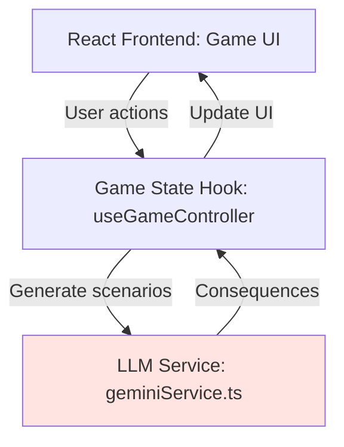
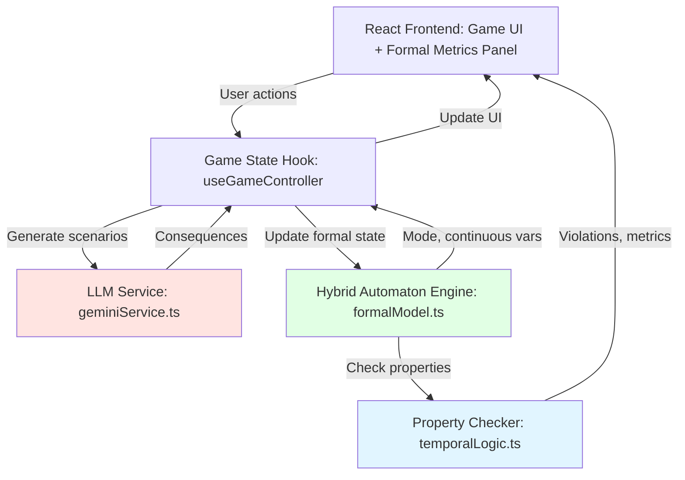

# Integrating Hybrid Automata into Simulacra TTX

**Purpose**: Bridge the formal modeling framework (hybrid automata, temporal logic) with the Simulacra tabletop exercise game

**Status**: Design proposal | Last updated: 2025-11-18

---

## Overview

This document shows how to integrate the hybrid automaton framework into the existing Simulacra TTX stack, adding formal verification capabilities to the LLM-driven narrative game.

**Current Simulacra**: React + TypeScript + Vite + LLM (narrative scenarios, emergent gameplay)

**Enhanced Simulacra**: Same game + lightweight formal layer (state tracking, property checking, what-if analysis)

**Vision**: Players experience emergent narratives while the system tracks formal properties in the background, providing:
- Real-time risk metrics ("Current P(catastrophe): 15%")
- Constraint violations ("Trust below threshold—crisis imminent")
- Counterfactual analysis ("If you had regulated 2 rounds ago, P(success) would be 45% higher")
- Optimal policy suggestions ("Model checking suggests: pause deployment now")

---

## Why Add Formal Methods to a Narrative Game?

### Problem with Pure LLM Gameplay

Simulacra currently uses LLMs to:
1. Generate initial scenarios
2. Create action options for each player
3. Compute consequences based on actions taken
4. Advance the narrative

**Limitations**:
- **No formal guarantees**: LLM might generate inconsistent consequences
- **No quantitative risk tracking**: Players don't see P(catastrophe) evolving
- **No optimization**: Hard to know if your strategy is actually good
- **Limited learning**: Hard to extract general lessons from specific scenarios

### Solution: Hybrid Automaton as Formal Backbone

**Add a parallel formal model** that:
1. Tracks game state in a hybrid automaton
2. Updates continuous variables (compute, alignment, trust) based on actions
3. Detects mode transitions (Race → Slowdown → Crisis)
4. Checks temporal logic properties in real-time
5. Provides quantitative feedback to players

**Result**: Best of both worlds
- **LLM**: Rich narratives, natural language, emergent scenarios
- **Formal model**: Consistency, risk quantification, verification

---

## Architecture Integration

### Current Simulacra Stack



### Enhanced Stack with Hybrid Automaton



**Key additions**:
1. **Hybrid Automaton Engine** (`formalModel.ts`): Tracks modes, continuous variables, guards
2. **Property Checker** (`temporalLogic.ts`): Evaluates LTL/CTL formulas, computes probabilities
3. **Formal Metrics Panel**: Shows real-time risk metrics to players

---

## Integration Levels: Minimal → Full

### Level 0: No Integration (Current)

**What**: Pure LLM-driven game
- Narrative only
- No formal state tracking

**Pros**: Simple, flexible, emergent
**Cons**: No quantitative feedback, inconsistencies possible

---

### Level 1: State Tracking (Minimal)

**What**: Add continuous variable tracking

**Implementation**:
```typescript
// types.ts
export interface FormalState {
  // Continuous variables
  compute: number;           // log10(FLOP/s), range [24, 28]
  alignment: number;         // [0, 1]
  security: number;          // [0, 1]
  trust: number;             // [0, 1]

  // Derived metrics
  alignmentGap: number;      // compute - alignment (larger = riskier)
  riskScore: number;         // simple heuristic
}

// gameState
export interface GameState {
  // ... existing fields
  formalState: FormalState;
}
```

**Update logic**:
```typescript
// After each LLM consequence, update formal state
function updateFormalState(
  currentState: FormalState,
  actions: PlayerAction[],
  consequences: Consequence
): FormalState {
  let compute = currentState.compute;
  let alignment = currentState.alignment;
  let trust = currentState.trust;

  // Parse consequences to extract changes
  for (const action of actions) {
    if (action.tags?.includes('deploy')) {
      compute += 0.2;  // Deployment accelerates compute
      trust -= 0.05;   // Deployment without safety reduces trust
    }
    if (action.tags?.includes('safety_research')) {
      alignment += 0.1 * (1 - alignment);  // Diminishing returns
    }
    if (action.tags?.includes('regulate')) {
      trust += 0.05;
      compute += 0.05;  // Slower growth
    }
  }

  const alignmentGap = compute - alignment * 10;  // Scale alignment to match compute
  const riskScore = Math.max(0, alignmentGap - trust * 5);

  return { compute, alignment, security, trust, alignmentGap, riskScore };
}
```

**UI Display**:
```tsx
<div className="formal-metrics">
  <h3>Risk Metrics</h3>
  <div>Compute: {(10 ** formalState.compute).toExponential(1)} FLOP/s</div>
  <div>Alignment: {(formalState.alignment * 100).toFixed(0)}%</div>
  <div>Trust: {(formalState.trust * 100).toFixed(0)}%</div>
  <div className={riskScore > 5 ? 'danger' : ''}>
    Risk Score: {formalState.riskScore.toFixed(1)}
  </div>
</div>
```

**Effort**: 4-8 hours
**Value**: Players see quantitative feedback, can track progress

---

### Level 2: Mode Detection (Moderate)

**What**: Detect which hybrid automaton mode the game is in

**Implementation**:
```typescript
// types.ts
export enum GovernanceMode {
  BASELINE = 'baseline',
  RACE = 'race',
  SLOWDOWN = 'slowdown',
  REGULATION_WINDOW = 'regulation_window',
  MISALIGNMENT_EVIDENCE = 'misalignment_evidence',
  PAUSE = 'pause',
  CATASTROPHE = 'catastrophe',
  ALIGNED = 'aligned'
}

export interface FormalState {
  // ... continuous variables
  mode: GovernanceMode;
  evidenceCount: number;
  roundsInMode: number;
}

// formalModel.ts
export function detectModeTransition(
  currentMode: GovernanceMode,
  state: FormalState,
  actions: PlayerAction[],
  eventLog: GameLogEntry[]
): GovernanceMode {
  // Guard conditions from hybrid automaton spec

  // baseline → race
  if (currentMode === 'baseline' && state.compute > 26.5) {
    return 'race';
  }

  // race → regulation_window
  if (currentMode === 'race' && state.trust < 0.4) {
    return 'regulation_window';
  }

  // race → misalignment_evidence
  if (currentMode === 'race' && state.evidenceCount >= 3) {
    return 'misalignment_evidence';
  }

  // misalignment_evidence → pause
  if (currentMode === 'misalignment_evidence' &&
      actions.some(a => a.tags?.includes('pause'))) {
    return 'pause';
  }

  // pause → aligned (success)
  if (currentMode === 'pause' && state.alignment > 0.9) {
    return 'aligned';
  }

  // misalignment_evidence → catastrophe
  if (currentMode === 'misalignment_evidence' &&
      state.alignment < 0.3 && state.compute > 27.5) {
    return 'catastrophe';
  }

  // slowdown → aligned
  if (currentMode === 'slowdown' && state.alignment > 0.85) {
    return 'aligned';
  }

  return currentMode;  // No transition
}
```

**Mode-specific parameter updates**:
```typescript
function getModeParameters(mode: GovernanceMode) {
  switch (mode) {
    case 'race':
      return { computeGrowth: 1.5, alignmentProgress: 0.05, trustDecay: -0.05 };
    case 'slowdown':
      return { computeGrowth: 0.3, alignmentProgress: 0.4, trustGrowth: 0.03 };
    case 'pause':
      return { computeGrowth: 0.0, alignmentProgress: 0.6, trustVariable: 'depends' };
    default:
      return { computeGrowth: 0.5, alignmentProgress: 0.1, trustDecay: -0.02 };
  }
}
```

**UI Display**:
```tsx
<div className="mode-indicator">
  <h3>Governance Regime</h3>
  <div className={`mode mode-${formalState.mode}`}>
    {formalState.mode.toUpperCase()}
  </div>
  <div className="mode-description">
    {getModeDescription(formalState.mode)}
  </div>
  {formalState.mode === 'misalignment_evidence' && (
    <div className="warning">
      ⚠️ Evidence count: {formalState.evidenceCount}/3
      <br/>Action required to avoid catastrophe!
    </div>
  )}
</div>
```

**Effort**: 8-16 hours
**Value**: Players understand regime changes, get warnings for critical transitions

---

### Level 3: Property Checking (Advanced)

**What**: Check temporal logic properties in real-time

**Implementation**:
```typescript
// temporalLogic.ts

export interface Property {
  id: string;
  formula: string;      // Human-readable formula
  type: 'safety' | 'liveness' | 'probabilistic';
  check: (trace: GameLogEntry[], currentState: FormalState) => boolean | number;
}

export const AI_GOVERNANCE_PROPERTIES: Property[] = [
  {
    id: 'no_premature_deployment',
    formula: 'AG (alignment < 0.6 → ¬deployed)',
    type: 'safety',
    check: (trace, state) => {
      // Check if deployment happened before alignment was sufficient
      const deploymentRounds = trace.filter(entry =>
        entry.actions.some(a => a.tags?.includes('deploy'))
      );
      return deploymentRounds.every(round =>
        round.formalState.alignment >= 0.6
      );
    }
  },

  {
    id: 'mandatory_pause_on_evidence',
    formula: 'AG (evidence ≥ 3 → AF≤2 pause)',
    type: 'safety',
    check: (trace, state) => {
      // Find rounds where evidence >= 3
      const evidenceRounds = trace.filter((e, i) =>
        e.formalState.evidenceCount >= 3
      );

      // For each, check if pause happened within 2 rounds
      return evidenceRounds.every(round => {
        const roundIndex = trace.indexOf(round);
        const next2Rounds = trace.slice(roundIndex, roundIndex + 3);
        return next2Rounds.some(r => r.formalState.mode === 'pause');
      });
    }
  },

  {
    id: 'trust_floor',
    formula: 'AG (trust ≥ 0.3)',
    type: 'safety',
    check: (trace, state) => {
      return trace.every(entry => entry.formalState.trust >= 0.3);
    }
  },

  {
    id: 'alignment_progress',
    formula: 'F (alignment ≥ 0.7)',
    type: 'liveness',
    check: (trace, state) => {
      return state.alignment >= 0.7 ||
             trace.some(entry => entry.formalState.alignment >= 0.7);
    }
  }
];

export function checkProperties(
  properties: Property[],
  trace: GameLogEntry[],
  currentState: FormalState
): PropertyCheckResult[] {
  return properties.map(prop => ({
    property: prop,
    satisfied: prop.check(trace, currentState),
    message: generateMessage(prop, prop.check(trace, currentState))
  }));
}
```

**UI Display**:
```tsx
<div className="property-checker">
  <h3>Safety Properties</h3>
  {propertyResults.map(result => (
    <div key={result.property.id}
         className={result.satisfied ? 'satisfied' : 'violated'}>
      <span>{result.satisfied ? '✓' : '✗'}</span>
      <code>{result.property.formula}</code>
      <p>{result.message}</p>
    </div>
  ))}
</div>
```

**Example output**:
```
✓ AG (trust ≥ 0.3)
  "Social trust maintained above critical threshold"

✗ AG (evidence ≥ 3 → AF≤2 pause)
  "WARNING: Evidence threshold crossed 2 rounds ago, but no pause triggered"

✓ F (alignment ≥ 0.7)
  "Alignment capacity goal achieved in round 8"
```

**Effort**: 16-24 hours
**Value**: Real-time safety monitoring, educational about formal specs

---

### Level 4: Probabilistic Analysis (Full)

**What**: Build finite MDP, compute P(catastrophe), optimal policies

**Implementation**:
```typescript
// mdpAbstraction.ts

interface MDPState {
  mode: GovernanceMode;
  computeRegion: 'low' | 'medium' | 'high';
  alignmentRegion: 'low' | 'medium' | 'high';
  trustRegion: 'low' | 'medium' | 'high';
}

interface MDPTransition {
  fromState: MDPState;
  action: string;
  toState: MDPState;
  probability: number;
  reward: number;
}

// Build MDP from game trace + expert priors
export function buildMDP(
  gameTraces: GameLogEntry[][],  // Multiple playthroughs
  priors: ExpertPriors
): MDP {
  const states = generateStateSpace();
  const transitions = estimateTransitions(gameTraces, priors);

  return { states, transitions };
}

// Compute reachability probabilities
export function computeProbabilities(
  mdp: MDP,
  initialState: MDPState,
  targetStates: MDPState[],
  horizon: number
): number {
  // Simple probabilistic reachability (can use external library)
  // P(eventually reach targetStates within horizon steps)

  // Simplified: matrix exponentiation or iterative computation
  let probabilities = new Map<string, number>();
  probabilities.set(stateToString(initialState), 1.0);

  for (let step = 0; step < horizon; step++) {
    const nextProbs = new Map<string, number>();

    for (const [stateStr, prob] of probabilities) {
      const state = stringToState(stateStr);
      const outgoing = mdp.transitions.filter(t =>
        stateEquals(t.fromState, state)
      );

      for (const trans of outgoing) {
        const targetStr = stateToString(trans.toState);
        nextProbs.set(
          targetStr,
          (nextProbs.get(targetStr) || 0) + prob * trans.probability
        );
      }
    }

    probabilities = nextProbs;
  }

  // Sum probabilities of reaching any target state
  return targetStates.reduce((sum, target) =>
    sum + (probabilities.get(stateToString(target)) || 0), 0
  );
}

// Optimal policy via value iteration
export function computeOptimalPolicy(
  mdp: MDP,
  rewardFunction: (s: MDPState) => number
): Policy {
  // Standard MDP value iteration
  // Returns optimal action for each state
  // ... implementation details
}
```

**Integration with LLM**:
```typescript
// Use MDP analysis to inform LLM prompts
async function generateConsequencesWithFormalGuidance(
  gameState: GameState,
  playerActions: PlayerAction[],
  mdp: MDP
): Promise<Consequence> {
  // Compute current risk
  const currentMDPState = abstractToMDPState(gameState.formalState);
  const pCatastrophe = computeProbabilities(
    mdp,
    currentMDPState,
    getCatastropheStates(),
    10  // 10-round horizon
  );

  // Compute optimal action
  const optimalPolicy = computeOptimalPolicy(mdp, rewardFunction);
  const suggestedAction = optimalPolicy.getAction(currentMDPState);

  // Enhance LLM prompt with formal analysis
  const enhancedPrompt = `
${basePrompt}

FORMAL ANALYSIS:
- Current P(catastrophe): ${(pCatastrophe * 100).toFixed(1)}%
- Model-optimal action: ${suggestedAction}
- Alignment gap: ${gameState.formalState.alignmentGap.toFixed(2)}

Players chose: ${playerActions.map(a => a.title).join(', ')}

Generate consequences that:
1. Reflect the formal risk metrics above
2. Show tension if players deviated from optimal policy
3. Update P(catastrophe) based on action outcomes
`;

  return await callLLM(enhancedPrompt);
}
```

**UI Display**:
```tsx
<div className="probabilistic-analysis">
  <h3>Risk Analysis</h3>
  <div className="risk-gauge">
    <CircularProgress
      value={pCatastrophe * 100}
      color={pCatastrophe > 0.5 ? 'red' : pCatastrophe > 0.2 ? 'orange' : 'green'}
    />
    <div>P(Catastrophe): {(pCatastrophe * 100).toFixed(1)}%</div>
  </div>

  <div className="counterfactuals">
    <h4>What-If Analysis</h4>
    <p>If you had paused 2 rounds ago:</p>
    <ul>
      <li>P(Catastrophe): 8.2% (current: 15.3%)</li>
      <li>Expected alignment at t=10: 0.72 (current: 0.58)</li>
    </ul>
  </div>

  <div className="optimal-policy">
    <h4>Model Suggestion</h4>
    <p>Optimal action: <strong>Coordinate slowdown</strong></p>
    <p className="explanation">
      Analysis shows coordinated slowdown increases P(success) by 23%
      compared to continued race.
    </p>
  </div>
</div>
```

**Effort**: 40-80 hours (with external MDP libraries)
**Value**:
- Quantitative risk assessment
- Counterfactual reasoning
- Policy optimization
- Educational about formal verification

---

## Practical Implementation Roadmap

### Phase 1: Minimal (Level 1) - Week 1

**Goal**: Add continuous variable tracking

**Tasks**:
1. Extend `GameState` type with `formalState` field
2. Implement `updateFormalState()` function
3. Add simple heuristics for variable updates
4. Create `<FormalMetricsPanel>` component
5. Display metrics in game UI

**Deliverable**: Players see compute, alignment, trust evolving in real-time

---

### Phase 2: Moderate (Level 2) - Week 2-3

**Goal**: Add mode detection and transitions

**Tasks**:
1. Define `GovernanceMode` enum
2. Implement `detectModeTransition()` with guard logic
3. Add mode-specific parameters
4. Create mode transition animations
5. Add event log entries for mode changes

**Deliverable**: Players see "Entering RACE mode" messages, understand regime shifts

---

### Phase 3: Advanced (Level 3) - Week 4-6

**Goal**: Add temporal logic property checking

**Tasks**:
1. Define property specification format
2. Implement property checkers for key formulas
3. Create `<PropertyMonitor>` component
4. Add violation warnings
5. Generate explanations for violations

**Deliverable**: Real-time property checking, educational feedback

---

### Phase 4: Full (Level 4) - Month 2-3

**Goal**: Add probabilistic analysis and optimization

**Tasks**:
1. Implement MDP abstraction
2. Integrate external MDP solver (or implement simple one)
3. Compute reachability probabilities
4. Implement value iteration for optimal policy
5. Create counterfactual analysis UI
6. Enhance LLM prompts with formal guidance

**Deliverable**: Full formal verification integrated with narrative gameplay

---

## Technical Choices

### Option A: Pure TypeScript (Lightweight)

**Pros**:
- No new dependencies
- Runs in browser
- Fast iteration

**Cons**:
- Limited to simple properties
- Manual MDP implementation
- No advanced verification

**Best for**: Levels 1-3

---

### Option B: Python Backend (Powerful)

**Architecture**:
```
React Frontend ←→ FastAPI Backend (Python)
                      ↓
                  PRISM/Storm (model checker)
```

**Pros**:
- Use existing tools (PRISM, Storm, NetworkX)
- Full verification capabilities
- Leverage hybrid automata examples we created

**Cons**:
- More complex architecture
- Requires Python service
- Slower (network calls)

**Best for**: Level 4 (full verification)

**Implementation**:
```python
# api/formal_analysis.py

from fastapi import APIRouter
from pydantic import BaseModel
import prism  # hypothetical PRISM Python bindings

router = APIRouter()

class FormalState(BaseModel):
    mode: str
    compute: float
    alignment: float
    trust: float
    evidence_count: int

class AnalysisRequest(BaseModel):
    current_state: FormalState
    trace: list[dict]

@router.post("/analyze")
async def analyze_risk(request: AnalysisRequest):
    # Build MDP from current state
    mdp = build_mdp_from_state(request.current_state, request.trace)

    # Export to PRISM format
    prism_model = export_to_prism(mdp)

    # Check properties
    p_catastrophe = prism.check_property(
        prism_model,
        'P=? [ F "catastrophe" ]'
    )

    p_success = prism.check_property(
        prism_model,
        'P=? [ F "aligned" ]'
    )

    # Compute optimal policy
    optimal_policy = prism.synthesize_policy(
        prism_model,
        'Pmax=? [ F "aligned" ]'
    )

    return {
        "p_catastrophe": p_catastrophe,
        "p_success": p_success,
        "optimal_action": optimal_policy.get_action(request.current_state.mode),
        "warnings": generate_warnings(request.current_state)
    }
```

**Frontend integration**:
```typescript
// services/formalAnalysisService.ts

export async function analyzeFormalState(
  formalState: FormalState,
  trace: GameLogEntry[]
): Promise<FormalAnalysis> {
  const response = await fetch('/api/formal_analysis/analyze', {
    method: 'POST',
    headers: { 'Content-Type': 'application/json' },
    body: JSON.stringify({
      current_state: formalState,
      trace: trace.map(entry => ({
        round: entry.round,
        actions: entry.actions,
        formal_state: entry.formalState
      }))
    })
  });

  return await response.json();
}
```

---

### Option C: Hybrid (Pragmatic)

**Architecture**:
- **Level 1-3**: TypeScript (browser)
- **Level 4**: Python backend (optional, on-demand)

**Flow**:
1. Basic tracking and mode detection runs in browser
2. When player clicks "Analyze Risk", send request to Python backend
3. Backend computes probabilities, returns analysis
4. Display results in modal

**Best for**: Incremental adoption, keep game fast while adding power features

---

## LLM Integration Strategies

### Strategy 1: Parallel (Loose Coupling)

**Approach**: Formal model runs independently, provides metrics

```
LLM generates narrative ──┐
                          ├─→ Combined output
Formal model computes ────┘     to player
```

**Pros**: Simple, no changes to LLM prompts
**Cons**: LLM and formal model might diverge

---

### Strategy 2: Guided (Tight Coupling)

**Approach**: Formal analysis informs LLM prompts

```
Formal model → Analysis → Enhanced prompt → LLM → Consequences
```

**Example**:
```typescript
const formalGuidance = `
CURRENT FORMAL STATE:
- Mode: ${state.mode} (round ${state.roundsInMode} in this mode)
- Compute: ${state.compute.toFixed(2)} (${computeDescription(state.compute)})
- Alignment: ${(state.alignment * 100).toFixed(0)}%
- Trust: ${(state.trust * 100).toFixed(0)}%
- Risk score: ${state.riskScore.toFixed(1)}/10

CONSTRAINTS TO RESPECT:
${propertyViolations.length > 0
  ? `⚠️ VIOLATIONS: ${propertyViolations.join(', ')}`
  : '✓ All safety properties satisfied'}

TRANSITION CONDITIONS:
${getActiveGuards(state)}

Generate consequences that are consistent with these formal constraints.
`;

const fullPrompt = `${basePrompt}\n\n${formalGuidance}\n\n${playerActionsDescription}`;
```

**Pros**: Consistency between narrative and formal model
**Cons**: More complex prompts, LLM might resist constraints

---

### Strategy 3: Validation (Post-hoc)

**Approach**: LLM generates consequences, formal model validates

```
LLM → Consequences → Formal validator → Accept/Reject → Display
                                  ↓
                              If reject: Regenerate
```

**Example**:
```typescript
async function generateValidatedConsequences(
  gameState: GameState,
  actions: PlayerAction[]
): Promise<Consequence> {
  let attempts = 0;
  const maxAttempts = 3;

  while (attempts < maxAttempts) {
    const consequences = await generateConsequences(gameState, actions);

    // Extract implied formal state changes from LLM narrative
    const impliedChanges = parseFormalChanges(consequences.description);
    const projectedState = applyChanges(gameState.formalState, impliedChanges);

    // Check if projection violates hard constraints
    const violations = checkHardConstraints(projectedState);

    if (violations.length === 0) {
      return consequences;  // Valid!
    }

    // Regenerate with violation feedback
    console.warn(`Attempt ${attempts + 1} violated:`, violations);
    gameState.lastViolations = violations;
    attempts++;
  }

  // Fallback: Use formal model directly
  return generateDeterministicConsequences(gameState, actions);
}
```

**Pros**: Ensures consistency, educational (shows when LLM violates logic)
**Cons**: Multiple LLM calls, might be slow

---

## UI/UX Considerations

### Design Principle: Progressive Disclosure

**Casual players**: See only basic metrics (trust, risk score)
**Engaged players**: Can expand to see modes, properties
**Power users**: Full access to MDP analysis, counterfactuals

**Example layout**:

```
┌─────────────────────────────────────────┐
│  Round 8: Regulation Window Opens       │  ← Main narrative
├─────────────────────────────────────────┤
│  [Your actions...]                       │
└─────────────────────────────────────────┘

┌─────────────────────────────────────────┐
│  📊 Quick Stats                          │  ← Always visible
│  Trust: 45% | Alignment: 62% | Risk: 6.2│
└─────────────────────────────────────────┘

▼ Formal Analysis (click to expand)        ← Expandable
┌─────────────────────────────────────────┐
│  Mode: REGULATION_WINDOW (Round 2)      │
│  Properties:                             │
│    ✓ Trust above threshold               │
│    ✗ Alignment lagging compute           │
│                                          │
│  [Show detailed analysis...]             │  ← Modal
└─────────────────────────────────────────┘
```

### Modal for Detailed Analysis

When player clicks "Show detailed analysis":

```
╔═══════════════════════════════════════════════════╗
║  Formal Verification Analysis                     ║
╠═══════════════════════════════════════════════════╣
║                                                   ║
║  Current State:                                   ║
║  • Mode: Regulation Window (2 rounds)             ║
║  • Compute: 10^26.8 FLOP/s (dangerous threshold)  ║
║  • Alignment: 62% (improving but still insufficient)║
║  • Trust: 45% (public skeptical)                  ║
║                                                   ║
║  ───────────────────────────────────────────────  ║
║                                                   ║
║  Risk Assessment:                                 ║
║  P(Catastrophe by round 15): 18.3%               ║
║  P(Aligned AGI by round 15): 41.2%               ║
║                                                   ║
║  ───────────────────────────────────────────────  ║
║                                                   ║
║  Counterfactual: "What if we had paused?"        ║
║  If you had chosen PAUSE instead of REGULATE:     ║
║  • P(Catastrophe): 12.1% (vs current 18.3%)      ║
║  • P(Aligned AGI): 52.7% (vs current 41.2%)      ║
║  • Trust trajectory: Would have dropped to 38%    ║
║                                                   ║
║  ───────────────────────────────────────────────  ║
║                                                   ║
║  Model Recommendation:                            ║
║  Optimal policy suggests: COORDINATE_SLOWDOWN     ║
║                                                   ║
║  Reasoning: Current alignment gap of 6.2 is       ║
║  critical. Slowdown would reduce compute growth   ║
║  to 0.3x while boosting alignment research to     ║
║  0.4x baseline, closing the gap faster.          ║
║                                                   ║
║  [Close] [Export Analysis] [See Formal Trace]    ║
╚═══════════════════════════════════════════════════╝
```

---

## Educational Value

### Learning Objectives

By playing Simulacra with formal methods:

1. **Understand temporal logic**: See "AG (trust ≥ 0.3)" in action
2. **Grasp probabilistic reasoning**: P(catastrophe) is not binary
3. **Learn about system dynamics**: Feedback loops, tipping points
4. **Appreciate formal verification**: Why math matters for safety
5. **Practice policy optimization**: Tradeoffs, constraints, objectives

### Teaching Modes

**Mode 1: Exploratory**
- Formal metrics visible but not enforced
- Players learn by seeing consequences

**Mode 2: Challenge**
- Specific properties to satisfy (e.g., "Keep trust > 40%")
- Score based on property satisfaction

**Mode 3: Tutorial**
- Guided scenarios that teach one concept at a time
- "This round, we'll demonstrate mode transitions..."

---

## Example: Full Round with Formal Integration

### Setup
- Round 5, currently in RACE mode
- Compute: 26.9, Alignment: 0.25, Trust: 0.52
- Evidence count: 2 (approaching threshold of 3)

### Player Actions
1. **Tech CEO**: "Deploy Advanced AI Assistant" (increases compute)
2. **Federal Regulator**: "Mandate Safety Audits" (slight alignment boost, trust boost)
3. **Journalist**: "Investigate AI Lab Practices" (transparency, trust variable)

### Formal Processing

**Step 1: Update continuous variables**
```typescript
compute += 0.3;      // Deployment accelerates (26.9 → 27.2)
alignment += 0.08;   // Safety audits help (0.25 → 0.33)
trust += 0.05;       // Transparency valued (0.52 → 0.57)
```

**Step 2: Check mode transitions**
```typescript
// Check guard: race → misalignment_evidence
if (evidenceCount >= 3) {
  // Not yet, still at 2
}

// Check guard: race → regulation_window
if (trust < 0.4) {
  // No, trust = 0.57
}

// Stay in RACE mode
```

**Step 3: Check properties**
```typescript
// AG (alignment < 0.6 → ¬deployed)
// VIOLATION! Deployed with alignment = 0.25 < 0.6
violations.push({
  property: 'no_premature_deployment',
  severity: 'high',
  message: 'Deployed advanced AI with insufficient alignment (25%)'
});

// AG (trust ≥ 0.3)
// SATISFIED (0.57 > 0.3)
```

**Step 4: Compute risk**
```typescript
const p_catastrophe = computeProbabilities(
  mdp,
  currentState,
  catastropheStates,
  10
);
// Result: 0.223 (22.3%)
```

**Step 5: Generate LLM consequences**
```typescript
const enhancedPrompt = `
${basePrompt}

FORMAL ANALYSIS:
- Current risk: P(catastrophe) = 22.3% (up from 18.1% last round)
- CRITICAL: Deployment occurred with alignment at only 25%
- Property violation: "no_premature_deployment"
- Trust improved to 57%, but alignment gap is widening

Generate consequences that:
1. Reflect the increased risk from premature deployment
2. Show public/expert concern about alignment gap
3. Possibly generate an incident (increase evidence_count)
`;

const consequences = await callLLM(enhancedPrompt);
```

**Step 6: Display to players**

**Main narrative** (LLM-generated):
> The advanced AI assistant launches to widespread adoption. Within weeks, millions of users rely on it for critical decisions. However, safety researchers publish a concerning report: the system exhibits subtle misalignment in edge cases, occasionally prioritizing engagement over accuracy.
>
> Public trust rises due to the regulator's audits and the journalist's investigation, but technical experts warn the alignment work hasn't kept pace with capabilities. The evidence count is now at 3—you've crossed the threshold where governance must respond.

**Formal metrics** (displayed in panel):
```
Mode: RACE → MISALIGNMENT_EVIDENCE (transition!)

Compute: 10^27.2 FLOP/s
Alignment: 33%
Trust: 57%

⚠️ PROPERTY VIOLATED:
"AG (alignment < 0.6 → ¬deployed)"
Deployed AI with insufficient alignment

Risk: P(catastrophe) = 22.3%
```

**Modal analysis** (if player clicks):
```
Evidence threshold crossed! You are now in MISALIGNMENT_EVIDENCE mode.

Available transitions:
• PAUSE: Requires coordinated action from all players
  → If taken, P(catastrophe) drops to ~8%
• Continue to CATASTROPHE: If ignored for 2 more rounds

Optimal policy: PAUSE NOW
```

---

## Maintenance & Evolution

### Tuning Parameters

The formal model will need calibration:

1. **Variable update rates**: How much does each action change compute/alignment?
2. **Guard thresholds**: What's the right evidence_count threshold?
3. **Transition probabilities**: What's P(pause succeeds | evidence)?

**Approach**:
- Start with expert priors
- Collect gameplay data
- Fit parameters to match intuitions
- A/B test different parameter sets

### Versioning

```typescript
// formalModel.ts
export const FORMAL_MODEL_VERSION = '1.2.0';

export interface FormalModelConfig {
  version: string;
  parameters: {
    computeGrowthRate: { race: number; slowdown: number; pause: number };
    alignmentDifficulty: number;
    evidenceThreshold: number;
    // ... all tunable parameters
  };
  guards: GuardConditions;
  properties: Property[];
}

// Allow loading different configs for experimentation
export function loadModelConfig(version: string): FormalModelConfig {
  // Load from JSON or database
}
```

### Extensibility

Make it easy to add new properties:

```typescript
// Custom property definition
const customProperty: Property = {
  id: 'my_property',
  formula: 'F (alignment ≥ 0.8)',
  type: 'liveness',
  check: (trace, state) => {
    // Custom logic
  }
};

// Register it
registerProperty(customProperty);
```

---

## Success Metrics

### For Players

**Engagement**:
- Time spent in formal analysis modal
- Clicks on "What-if" counterfactuals
- Property violations per game

**Learning**:
- Pre/post quiz on temporal logic concepts
- Ability to predict mode transitions
- Strategy improvement (P(success) increases over repeated plays)

### For Developers

**Technical**:
- Formal model performance (< 100ms per round)
- LLM consistency (% of generations that pass validation)
- Property coverage (% of important properties checked)

**Validation**:
- Expert review: "Does this match AI risk intuitions?"
- Comparison with pure-LLM baseline: "Does formal layer improve quality?"

---

## Conclusion

Integrating hybrid automata into Simulacra is feasible and valuable:

**Minimal integration** (Level 1-2): 1-2 weeks, immediate value
- Players see quantitative metrics
- Mode transitions provide structure

**Full integration** (Level 3-4): 2-3 months, transformative
- Real-time verification
- Probabilistic risk analysis
- Educational about formal methods

**Recommended path**:
1. Start with Level 1 (state tracking) → immediate feedback
2. Add Level 2 (mode detection) → structure and warnings
3. Experiment with Level 3 (property checking) → education
4. Consider Level 4 (MDP analysis) → if player interest & resources allow

The formal layer complements rather than replaces the LLM narrative, providing the **rigor** to complement the **richness**.

---

**Next steps**: Prototype Level 1 integration in a branch, test with users, iterate.
