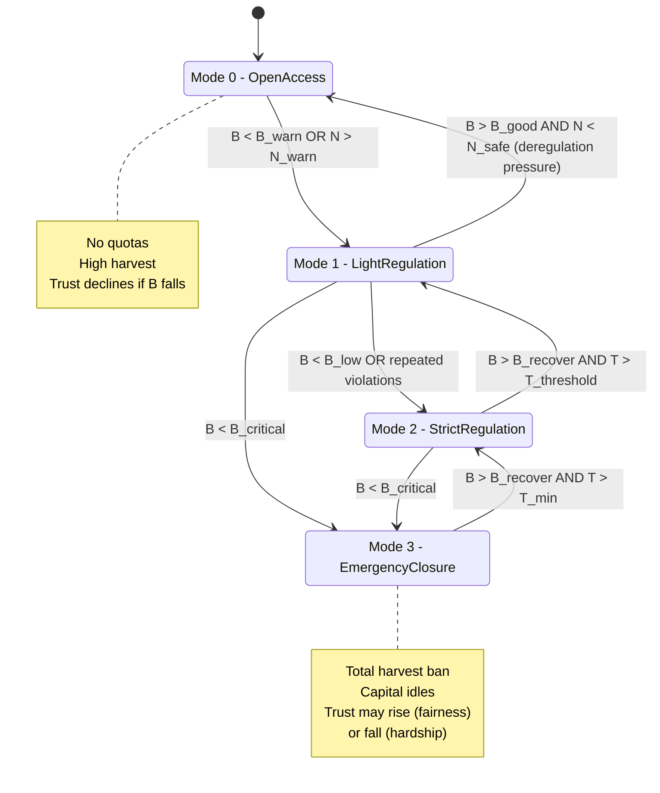
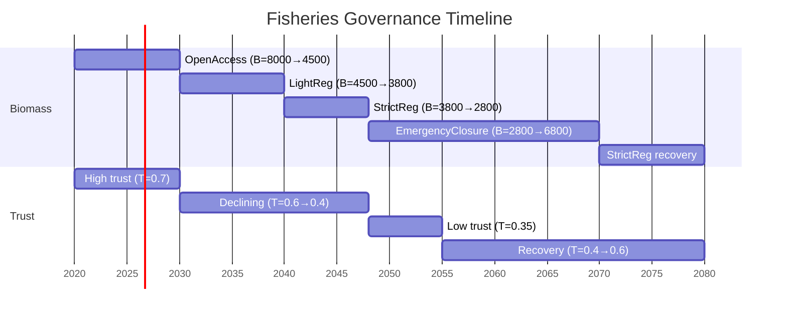

# Social-Ecological Systems: Fisheries Hybrid Automaton

**Domain**: Resource management, fisheries governance, lake eutrophication
**Canonical papers**: Schlegel & Westerweel (SD+ABM for SES), classic fisheries bioeconomics

---

## The Problem

A coastal fishing community depends on a fish stock that's vulnerable to:
- **Overfishing** (biomass collapse)
- **Nutrient pollution** (eutrophication leading to fish kills)
- **Social dynamics** (compliance with regulations, trust in governance)

**Goal**: Design governance policies that:
1. Prevent biomass collapse (B always ≥ B_safe)
2. Respond quickly to crises (mandatory closure when B < B_critical)
3. Maintain fisher livelihoods and social trust

**Challenge**: The system has:
- Continuous ecological dynamics (fish growth, nutrient cycles)
- Discrete political regimes (open access → quotas → moratorium)
- Agent behavior (fishers choosing effort, regulators responding to pressure)
- Tipping points (eutrophication, trust collapse)

This is a **perfect hybrid automaton candidate**.

---

## SD Layer: Continuous Variables & Dynamics

### State Variables

| Variable | Meaning | Units | Typical Range |
|----------|---------|-------|---------------|
| **B** | Fish biomass (stock) | tons | [0, K] where K ≈ 10,000 |
| **N** | Nutrient concentration in lake | mg/L | [0, 2] (>1 = eutrophic) |
| **K_capital** | Fishing capital (boats, gear) | $M | [0, 100] |
| **T** | Social trust/compliance | [0, 1] | [0, 1] |

### Dynamics (vary by mode)

**Fish biomass** (logistic growth with harvesting):
```
dB/dt = r * B * (1 - B/K_env) - H(E, B)
```
where:
- r = intrinsic growth rate
- K_env = environmental carrying capacity (depends on N)
- H(E, B) = harvest function (depends on total effort E and biomass B)

**Nutrient dynamics** (pollution inflow vs uptake):
```
dN/dt = I_nutrient - U(B) - λ_N * N
```
where:
- I_nutrient = nutrient inflow from agriculture, sewage
- U(B) = uptake by fish and phytoplankton (function of B)
- λ_N = outflow/settling rate

**Fishing capital** (investment vs depreciation):
```
dK_capital/dt = I_capital(π) - δ * K_capital
```
where:
- I_capital(π) = investment (function of profitability π)
- δ = depreciation rate

**Social trust** (enforcement, fairness, outcomes):
```
dT/dt = g_trust(enforcement, ecological_state, perceived_fairness)
```

**Key SD feedback loops**:
1. **Reinforcing**: High B → high catch → high profit → more capital → higher effort → lower B
2. **Balancing**: Low B → low catch → low profit → capital exits → lower effort → B recovers
3. **Tipping point**: High N → low K_env → B collapses even with low effort

---

## ABM Layer: Agents & Decision Rules

### Agents

1. **Fishers** (N_fishers ≈ 100-500 agents)
   - **State**: Owns capital k_i, has effort choice e_i
   - **Decision**: Choose effort e_i ∈ [0, e_max] to maximize expected profit
   - **Profit**: π_i = p * catch_i - c(e_i, fuel_cost)
   - **Social influence**: May comply with quotas if T is high, cheat if T is low

2. **Regulator** (1 agent or collective)
   - **State**: Observes B (with noise), N, fisher complaints
   - **Decision**: Set quota Q, enforcement level E_enforce ∈ [0, 1]
   - **Constraints**: Budget for enforcement, political pressure

3. **Community/NGOs** (optional)
   - **State**: Monitors ecological indicators
   - **Decision**: Lobby for stricter regulation or protected areas

### Aggregate Effects

- **Total effort**: E = Σ e_i (sum of individual fisher efforts)
- **Harvest function**: H(E, B) = q * E * B (Schaefer model) or more complex
- **Effective compliance**: fraction of fishers respecting quotas depends on T and E_enforce

**ABM → HA coupling**:
- Fisher effort choices → change harvest rate H → affects dB/dt
- Regulator decisions → trigger mode switches (e.g., impose moratorium)
- Trust dynamics → determine whether guards fire (e.g., low T + low B → mode switch to crisis)

---

## Hybrid Automaton: Fisheries Governance

### Modes (Discrete Locations)



### Mode Details

| Mode | Name | Harvest | Enforcement | Typical dB/dt | dT/dt |
|------|------|---------|-------------|---------------|-------|
| **M0** | OpenAccess | H = q * E * B (unregulated) | None | Negative if E high | Falls if B < B_safe |
| **M1** | LightRegulation | H ≤ Q_light (quota) | Low (E_enforce = 0.3) | Slightly positive | Stable or slight rise |
| **M2** | StrictRegulation | H ≤ Q_strict (tight quota) | High (E_enforce = 0.8) | Positive | Rises if B recovers |
| **M3** | EmergencyClosure | H = 0 (moratorium) | Total | Positive (no fishing) | Depends on perceived fairness |

### Guards (Transition Conditions)

| Transition | Guard Condition | Interpretation |
|------------|-----------------|----------------|
| M0 → M1 | `B < B_warn OR N > N_warn` | Warning threshold crossed, regulators act |
| M1 → M0 | `B > B_good AND N < N_safe AND (political_pressure > threshold)` | Deregulation after recovery (lobby pressure) |
| M1 → M2 | `B < B_low OR (violations > threshold)` | Tighten regulation due to continued decline or cheating |
| M2 → M1 | `B > B_recover AND T > T_threshold` | Relax after recovery with sufficient trust |
| {M1,M2} → M3 | `B < B_critical` | **Mandatory crisis response** (emergency closure) |
| M3 → M2 | `B > B_recover AND T > T_min` | Exit closure with caution |

### Resets (Discrete Updates on Transition)

| Transition | Reset Actions |
|------------|---------------|
| M0 → M1 | `Set quota Q := Q_light; increase I_nutrient controls (agriculture restrictions)` |
| M1 → M2 | `Q := Q_strict; E_enforce := 0.8; possibly T := T * 0.9 (trust hit from failure)` |
| Any → M3 | `H := 0; fisher_income := subsidy (if exists); T_change depends on fairness of closure` |
| M3 → M2 | `Q := Q_strict; capital K_capital may have depreciated during closure` |

### Invariants (Must Hold Within Mode)

| Mode | Invariant |
|------|-----------|
| M0 | `B ≥ 0 AND N ≥ 0` (just stay alive) |
| M1 | `B ≥ 0 AND N ≥ 0` |
| M2 | `B ≥ 0 AND E_enforce ≥ 0.5` |
| M3 | `H = 0` (harvest strictly zero) |

---

## Flow Equations in Each Mode

### Mode M0: OpenAccess
```
dB/dt = r * B * (1 - B/K_env(N)) - q * E * B
dN/dt = I_nutrient - U(B) - λ_N * N
dK_capital/dt = I(profit) - δ * K_capital
dT/dt = -α_trust * (1 - B/B_safe)   # trust falls if B low
```

**Interpretation**: Unrestricted fishing. If E is high, B declines. As B falls, trust erodes.

### Mode M1: LightRegulation
```
dB/dt = r * B * (1 - B/K_env(N)) - q * E_eff * B
  where E_eff = min(E, Q_light / (q * B))  # quota-limited effort
dN/dt = I_nutrient * (1 - α_control) - U(B) - λ_N * N  # some nutrient controls
dK_capital/dt = I(profit_with_quota) - δ * K_capital
dT/dt = β_trust * (Δ B / B)   # trust rises if biomass increases
```

**Interpretation**: Modest quotas slow harvest. If quota is respected and B rises, trust improves.

### Mode M2: StrictRegulation
```
dB/dt = r * B * (1 - B/K_env(N)) - q * E_eff * B
  where E_eff = Q_strict / (q * B)  # tight quota, strongly enforced
dN/dt = I_nutrient * (1 - α_control_high) - U(B) - λ_N * N
dK_capital/dt = I_low - δ * K_capital  # lower profit, less investment
dT/dt = γ_trust * (enforcement_fairness + Δ B / B)
```

**Interpretation**: Strong limits on fishing. Capital may shrink. Trust depends on whether enforcement is seen as fair and whether B recovers.

### Mode M3: EmergencyClosure
```
dB/dt = r * B * (1 - B/K_env(N))  # natural growth, no harvest
dN/dt = I_nutrient * (1 - α_control_high) - U(B) - λ_N * N
dK_capital/dt = -δ * K_capital  # depreciation, no new investment (fishers idle)
dT/dt = δ_trust * (subsidy_adequacy - hardship_level)
```

**Interpretation**: Complete moratorium. Biomass recovers. Capital depreciates. Trust can go either way depending on whether fishers receive subsidies.

---

## Example Trace

### Scenario: Gradual Collapse and Recovery

| Time | Mode | B | N | E | Trust T | Event |
|------|------|---|---|---|---------|-------|
| 0 | M0 (OpenAccess) | 8000 | 0.5 | 400 | 0.7 | Initial conditions |
| 5 | M0 | 6000 | 0.6 | 500 | 0.6 | Overfishing increases, B falls |
| 10 | M0 | 4500 | 0.7 | 550 | 0.5 | B crosses B_warn = 5000 |
| 10+ | **M1 (LightReg)** | 4500 | 0.7 | 400 | 0.5 | Quota imposed, E drops |
| 15 | M1 | 4200 | 0.75 | 380 | 0.48 | Still declining (quota too weak) |
| 20 | M1 | 3800 | 0.8 | 360 | 0.45 | B < B_low = 4000 |
| 20+ | **M2 (StrictReg)** | 3800 | 0.8 | 200 | 0.43 | Strict quota, E cut in half |
| 25 | M2 | 3500 | 0.85 | 180 | 0.40 | Continued decline |
| 28 | M2 | 2800 | 0.9 | 150 | 0.38 | B < B_critical = 3000 |
| 28+ | **M3 (Closure)** | 2800 | 0.9 | 0 | 0.35 | Emergency moratorium |
| 35 | M3 | 3500 | 0.85 | 0 | 0.40 | B recovers (no fishing) |
| 45 | M3 | 5500 | 0.7 | 0 | 0.50 | Further recovery |
| 50 | M3 | 6800 | 0.6 | 0 | 0.55 | B > B_recover = 6000, T > T_min |
| 50+ | **M2 (StrictReg)** | 6800 | 0.6 | 200 | 0.55 | Cautious reopening |
| 60 | M2 | 7500 | 0.55 | 200 | 0.60 | Continued recovery |

**Visual trace**:



---

## Temporal Logic Properties

### Safety Properties (CTL/LTL)

**Property 1: No biomass collapse under good governance**
```
AG (Mode ∈ {M1, M2, M3} → (B ≥ B_safe))
```
"Along all paths, if we're in any regulated mode, biomass never falls below the safe level."

**Property 2: Mandatory crisis response**
```
AG (B < B_critical → AF≤T_max (Mode = M3 ∨ Mode = M2))
```
"Whenever biomass falls below critical, we eventually (within time T_max) enter emergency closure or strict regulation."

**Property 3: Trust doesn't collapse**
```
AG (T ≥ T_collapse_threshold)
```
"Social trust never falls below the threshold where compliance breaks down."

### Liveness Properties

**Property 4: Recovery is possible**
```
AG (Mode = M3 → AF (B ≥ B_recover))
```
"In emergency closure mode, biomass eventually recovers."

**Property 5: Not stuck in closure**
```
AG (Mode = M3 → AF (Mode ≠ M3))
```
"We don't stay in emergency closure forever—eventually transition out."

### Probabilistic Properties (PCTL, on abstracted MDP)

**Property 6: Low collapse probability**
```
P_≤0.05 [ F (B < B_extinct) ]
```
"Under this governance policy, probability of biomass falling below extinction threshold is ≤ 5%."

**Property 7: Expected time to recovery**
```
R_≤T [ F (B ≥ B_target) ]
```
"Expected time to reach target biomass is ≤ T years."

---

## Model Checking Approach

### Step 1: Choose Hybrid Automaton Fragment

**Option A: Rectangular automaton**
- Approximate ODEs with piecewise-constant rates (dB/dt ∈ [r_min, r_max])
- Get decidable reachability (PSPACE-complete)
- Tools: HyTech, PHAVer

**Option B: Linear hybrid automaton**
- Use linear approximations of fish growth (dB/dt = a*B + b)
- Some fragments decidable
- Tools: SpaceEx, Uppaal (with timed-automaton abstraction)

**Option C: Nonlinear (full model)**
- Keep logistic growth, nonlinear harvest
- Reachability undecidable, use over-approximation
- Tools: Flow*, SpaceEx with template polyhedra

### Step 2: Construct Finite Abstraction

- **Partition continuous state space** into regions (e.g., B ∈ [0,1000), [1000,2000), ...)
- **Build quotient MDP**: states = (mode, region), transitions with probabilities from simulation/analysis
- **Result**: Finite MDP with ~10-50 discrete states per mode

### Step 3: Verify Properties

- Use **PRISM** or **Storm** to check PCTL properties on the finite MDP
- Get probability bounds, counterexamples, optimal policies

**Example PRISM code** (simplified):
```prism
mdp

// States: (mode, biomass_region)
module fishery
    mode : [0..3] init 0;  // 0=Open, 1=Light, 2=Strict, 3=Closure
    B_region : [0..10] init 8;  // 0=extinct, 1=[0,1k), 2=[1k,2k), ..., 10=[9k,10k]

    // Transitions (simplified)
    [] mode=0 & B_region≥5 → 0.7:(mode'=0) & (B_region'=B_region-1) + 0.3:(mode'=1);
    [] mode=0 & B_region<5  → (mode'=1);
    [] mode=1 & B_region<4  → (mode'=2);
    [] mode=2 & B_region<3  → (mode'=3);
    [] mode=3 & B_region<6  → 0.8:(B_region'=B_region+1) + 0.2:(B_region'=B_region);
    ...
endmodule

// Property: Probability of collapse
label "collapsed" = B_region ≤ 1;
```

Check: `P=? [ F "collapsed" ]` → get numerical probability.

---

## Connection to AI-2027

The fisheries hybrid automaton directly mirrors AI governance:

| Fisheries | AI-2027 |
|-----------|---------|
| Fish biomass B | Alignment capacity / safety buffer |
| Nutrient pollution N | Compute / capability growth |
| Fishing effort E | Deployment pace |
| Social trust T | Public trust / legitimacy |
| OpenAccess mode | Unregulated AI race |
| StrictRegulation mode | Coordinated slowdown |
| EmergencyClosure mode | Deployment pause |
| Guards (B < B_critical) | Misalignment evidence threshold |

**Same structure**:
- Continuous dynamics (ecological vs socio-technical)
- Discrete policy regimes (fisheries governance vs AI governance)
- Agent-driven transitions (fishers + regulators vs labs + governments)
- Tipping points and safety properties

The hybrid-automaton framework lets us port the fisheries verification techniques directly to AI risk analysis.

---

## Further Reading

- **Schlegel & Westerweel** (2020): "Hybrid modeling of socio-ecological systems: A review"
- **Ludwig et al.** (1993): "Uncertainty, resource exploitation, and conservation: Lessons from history"
- **Ostrom** (1990): *Governing the Commons* (ABM of self-governance)
- **Henzinger** (1996): *The Theory of Hybrid Automata* (formal foundations)

---

**Next**: [Epidemic Control Hybrid Automaton →](02_epidemic_control.md)
