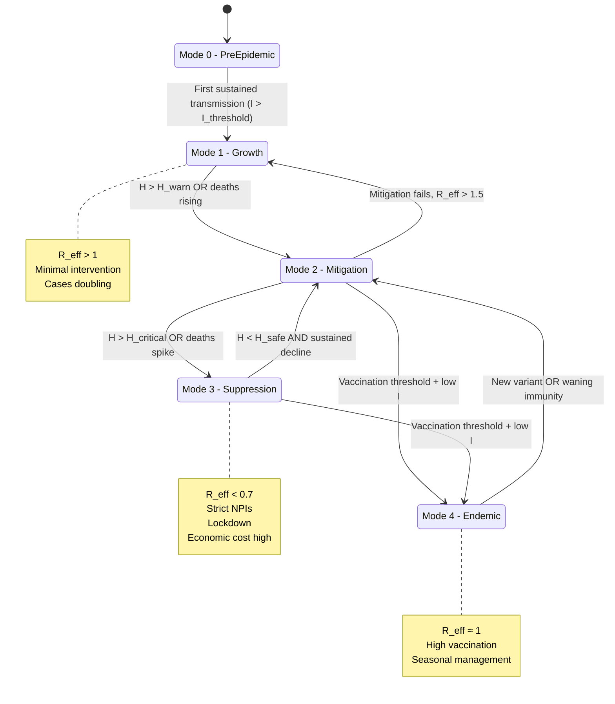
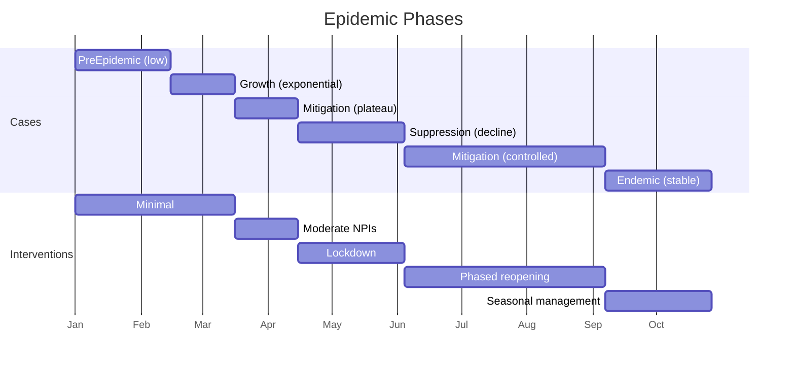

# Epidemic Control: Multi-Phase Hybrid Automaton

**Domain**: Public health, infectious disease control, pandemic response
**Canonical papers**: Navarro-López & Çabukoğlu (2018) "A generic hybrid automaton model for multi-phase epidemic processes"

---

## The Problem

A novel infectious disease emerges. Public health authorities must:
- **Prevent healthcare collapse** (ICU capacity never exceeded)
- **Minimize deaths** while preserving economic activity
- **Coordinate interventions** (testing, contact tracing, NPIs, vaccination)
- **Navigate political constraints** (fatigue, compliance, economic pressure)

**Challenge**: The system exhibits:
- Continuous epidemic dynamics (SEIR equations)
- Discrete intervention phases (lockdown, reopening, endemic management)
- Nonlinear tipping points (exponential growth, saturation)
- Stochastic shocks (new variants, vaccine effectiveness)

**Solution**: Model as a **hybrid automaton** with modes = intervention phases.

---

## SD Layer: Epidemic Dynamics

### State Variables

| Variable | Meaning | Units | Typical Range |
|----------|---------|-------|---------------|
| **S** | Susceptible population | persons | [0, N] |
| **E** | Exposed (infected but not yet infectious) | persons | [0, N] |
| **I** | Infectious | persons | [0, N] |
| **R** | Recovered (immune) | persons | [0, N] |
| **H** | Hospitalized / ICU | persons | [0, H_max] |
| **D** | Deaths (cumulative) | persons | [0, N] |
| **V** | Vaccinated | persons | [0, N] |

### Core Dynamics (SEIR + extensions)

**Standard SEIR**:
```
dS/dt = -β(t) * S * I / N - λ(t) * S
dE/dt = β(t) * S * I / N - σ * E
dI/dt = σ * E - γ * I
dR/dt = γ * (1 - α) * I + λ(t) * S
dD/dt = γ * α * I
```

**Parameters (vary by mode)**:
- β(t) = transmission rate (changes with NPIs, behavior)
- λ(t) = vaccination rate
- σ = 1 / (incubation period)
- γ = 1 / (infectious period)
- α = infection fatality rate

**Hospital dynamics**:
```
dH/dt = p_hosp * σ * E - (1/τ_hosp) * H
```
where:
- p_hosp = hospitalization rate
- τ_hosp = average hospital stay

**Key SD feedback loops**:
1. **Exponential growth**: I ↑ → more infections → E ↑ → I ↑
2. **Depletion**: I ↑ → S ↓ → fewer infections (saturation)
3. **Behavioral response**: H ↑ → fear ↑ → contacts ↓ → β ↓
4. **Intervention fatigue**: lockdown duration ↑ → compliance ↓ → β ↑

---

## ABM Layer: Agents & Decisions

### Agents

1. **Individuals** (N ≈ millions, often aggregated by type)
   - **State**: Location, health status (S/E/I/R), compliance level
   - **Decision**: Contact behavior (work, socialize, isolate), mask-wearing, vaccination
   - **Heterogeneity**: Age, occupation (healthcare, essential, remote-capable), risk perception

2. **Institutions** (workplaces, schools, hospitals)
   - **State**: Open/closed, capacity, outbreak count
   - **Decision**: Set local policies (remote work, testing protocols)

3. **Government** (local, regional, national)
   - **State**: Observed epidemic indicators (I, H, D), political capital
   - **Decision**: Set intervention level (mode switches), allocate vaccines, communicate

4. **Healthcare System**
   - **State**: ICU occupancy, testing capacity, staff burnout
   - **Decision**: Triage protocols, resource allocation

### ABM Determines

- **Contact networks**: Who meets whom → affects transmission β
- **Compliance**: Fraction following NPIs → affects effective β
- **Vaccination uptake**: Hesitancy, prioritization → affects λ(t)
- **Policy triggers**: When politicians respond to pressure (economic vs health)

**Example**: In a spatial ABM:
- Individuals move on a network (households, workplaces, public spaces)
- Infections spread via contacts
- When local I exceeds threshold, institution closes → reduces contacts → lowers β
- Aggregate β(t) emerges from micro-level contact patterns

---

## Hybrid Automaton: Multi-Phase Epidemic

### Modes

**Based on Navarro-López & Çabukoğlu's framework**:



### Mode Details

| Mode | Name | β (transmission) | λ (vaccination) | NPIs | Typical R_eff |
|------|------|------------------|-----------------|------|---------------|
| **M0** | PreEpidemic | β_0 (baseline) | 0 | None | < 1 (no sustained transmission) |
| **M1** | Growth | β_high | 0 → low | Minimal (awareness campaigns) | 2-4 |
| **M2** | Mitigation | β_mid | Moderate | Moderate (masks, distancing, some closures) | 1.2-1.5 |
| **M3** | Suppression | β_low | High (if available) | Strict (lockdown, stay-at-home) | 0.5-0.8 |
| **M4** | Endemic | β_mid | Sustained λ_endemic | Targeted (for vulnerable) | ≈ 1 |

### Guards (Transition Conditions)

| Transition | Guard | Interpretation |
|------------|-------|----------------|
| M0 → M1 | `I > I_threshold AND R_eff > 1` | Sustained community transmission detected |
| M1 → M2 | `H > H_warn OR daily_deaths > threshold` | Warning signs, moderate response |
| M2 → M3 | `H > H_critical OR death_rate_acceleration > spike` | Crisis, escalate to suppression |
| M3 → M2 | `H < H_safe AND declining_for ≥ 14 days` | Safe to partially reopen |
| M2 → M1 | `R_eff > 1.5 (mitigation insufficient)` | Failed mitigation, return to growth |
| {M2,M3} → M4 | `V/N > V_threshold AND I < I_endemic_threshold` | Vaccination reaches herd immunity level |
| M4 → M2 | `new_variant_detected OR R_eff > 1.3` | Immune escape variant or waning immunity |

### Resets

| Transition | Reset Actions |
|------------|---------------|
| M1 → M2 | `Set β := β_mid; start contact tracing (increases detection)`|
| M2 → M3 | `β := β_low; close schools, non-essential businesses; H_capacity := H_capacity * 1.2 (emergency surge)` |
| M3 → M2 | `β := β_mid; reopen with distancing; possibly vaccination_rate := λ_high` |
| Any → M4 | `β := β_endemic; λ := λ_sustain; shift to seasonal booster model` |

### Invariants

| Mode | Invariant |
|------|-----------|
| M0 | `I ≤ I_threshold` |
| M1 | `H ≤ H_warn` (else must escalate) |
| M2 | `H ≤ H_critical` |
| M3 | No strict invariant (crisis mode) |
| M4 | `R_eff ∈ [0.9, 1.1]` (endemic equilibrium) |

---

## Flow Equations by Mode

### Mode M0: PreEpidemic
```
dS/dt = -β_0 * S * I / N
dE/dt = β_0 * S * I / N - σ * E
dI/dt = σ * E - γ * I
dR/dt = γ * I
dH/dt = p_hosp * σ * E - (1/τ_hosp) * H
dV/dt = 0  (no vaccine yet)
```
**Condition**: β_0 * S/N < γ → R_eff < 1 → sporadic cases only

### Mode M1: Growth (No significant intervention)
```
dS/dt = -β_high * S * I / N
dE/dt = β_high * S * I / N - σ * E
dI/dt = σ * E - γ * I
dR/dt = γ * I
dH/dt = p_hosp * σ * E - (1/τ_hosp) * H
dV/dt = 0
```
**Key**: β_high ≈ 0.3-0.5 per day → doubling time ~5-7 days

### Mode M2: Mitigation
```
dS/dt = -β_mid * S * I / N - λ_mid * S
dE/dt = β_mid * S * I / N - σ * E
dI/dt = σ * E - γ * I
dR/dt = γ * I
dH/dt = p_hosp * σ * E - (1/τ_hosp) * H
dV/dt = λ_mid * S
```
**Key**: β_mid ≈ 0.15-0.2 (masks, distancing), λ_mid > 0 if vaccine available

### Mode M3: Suppression (Lockdown)
```
dS/dt = -β_low * S * I / N - λ_high * S
dE/dt = β_low * S * I / N - σ * E
dI/dt = σ * E - γ * I
dR/dt = γ * I
dH/dt = p_hosp * σ * E - (1/τ_hosp) * H
dV/dt = λ_high * S
```
**Key**: β_low ≈ 0.05-0.1 (strict NPIs), H declines after ~10-14 days

### Mode M4: Endemic
```
dS/dt = -β_endemic * S * I / N - λ_endemic * S + ω * R  (waning immunity)
dE/dt = β_endemic * S * I / N - σ * E
dI/dt = σ * E - γ * I
dR/dt = γ * I - ω * R
dH/dt = p_hosp * σ * E - (1/τ_hosp) * H
dV/dt = λ_endemic * S
```
**Key**: Parameters tuned so R_eff ≈ 1, seasonal fluctuations

---

## Example Trace: COVID-19-like Scenario

| Time (days) | Mode | I | H | V/N | R_eff | Event |
|-------------|------|---|---|-----|-------|-------|
| 0 | M0 | 100 | 5 | 0 | 0.8 | Sporadic cases, no sustained spread |
| 30 | M0 | 500 | 20 | 0 | 1.1 | Imported cases, clusters |
| 45 | M0 | 2000 | 80 | 0 | 2.5 | I > I_threshold → **M1 (Growth)** |
| 60 | M1 | 15000 | 600 | 0 | 2.8 | Exponential growth, doubling every week |
| 75 | M1 | 80000 | 3200 | 0 | 2.5 | H > H_warn → **M2 (Mitigation)** |
| 90 | M2 | 120000 | 5000 | 0 | 1.3 | Mitigation slows but doesn't reverse |
| 100 | M2 | 140000 | 6500 | 0 | 1.2 | H approaches H_critical |
| 105 | M2 | 150000 | 7500 | 0 | 1.15 | H > H_critical → **M3 (Suppression)** |
| 120 | M3 | 120000 | 6000 | 0.05 | 0.7 | Lockdown, cases falling |
| 135 | M3 | 60000 | 3000 | 0.10 | 0.65 | Continued decline |
| 150 | M3 | 25000 | 1200 | 0.15 | 0.6 | H < H_safe, sustained decline |
| 155 | **M2** | 22000 | 1000 | 0.18 | 0.9 | Reopen to mitigation |
| 180 | M2 | 30000 | 1400 | 0.30 | 1.1 | Slight resurgence |
| 200 | M2 | 40000 | 1800 | 0.45 | 1.0 | Vaccination accelerating |
| 240 | M2 | 20000 | 900 | 0.65 | 0.8 | V > V_threshold |
| 250 | **M4 (Endemic)** | 10000 | 400 | 0.70 | 1.0 | Transition to endemic management |
| 300 | M4 | 8000 | 350 | 0.75 | 0.95 | Seasonal fluctuations, boosters |

**Visual**:



---

## Temporal Logic Properties

### Safety Properties

**Property 1: ICU non-overflow**
```
AG (H ≤ H_max * 1.2)
```
"Hospital capacity (with surge) is never exceeded."

**Property 2: Timely intervention**
```
AG (H > H_warn → AF≤7 (Mode ∈ {M2, M3}))
```
"When ICU occupancy exceeds warning level, mitigation or suppression begins within 7 days."

**Property 3: No premature reopening**
```
AG (Mode = M3 → (H < H_safe ∧ declining ≥ 14 days) ∨ Mode' = M3)
```
"Suppression doesn't end unless hospital load is safe and declining for 2 weeks."

### Liveness Properties

**Property 4: Suppression is temporary**
```
AG (Mode = M3 → AF (Mode ≠ M3))
```
"We don't stay in lockdown forever—eventually transition out."

**Property 5: Eventual endemic or elimination**
```
AF (Mode = M4 ∨ I = 0)
```
"Eventually, we either reach endemic equilibrium or eliminate the disease."

### Probabilistic Properties (PCTL)

**Property 6: Bounded death toll**
```
P_≥0.9 [ G (D ≤ D_max) ]
```
"With at least 90% probability, cumulative deaths stay below threshold D_max."

**Property 7: Vaccination timeline**
```
P_≥0.8 [ F≤365 (V/N ≥ 0.7) ]
```
"With at least 80% probability, 70% vaccination is reached within 1 year."

**Property 8: Avoidance of overwhelm**
```
P_≤0.05 [ F (H > H_max) ]
```
"Probability of exceeding ICU capacity is ≤ 5%."

---

## Model Checking Approach

### Step 1: Hybrid Automaton Simplification

**Option A: Piecewise-affine approximation**
- Replace nonlinear βSI/N with linear segments
- Get linear hybrid automaton
- Tools: SpaceEx, PHAVer

**Option B: Timed automaton abstraction**
- Discretize (S, E, I, R, H) into regions (Low, Medium, High)
- Convert to timed automaton where clocks track time-in-mode
- Tools: Uppaal (supports timed CTL)

**Option C: Finite MDP abstraction**
- Partition state space: (Mode, I_region, H_region, V_region)
- Estimate transition probabilities from simulation
- Tools: PRISM, Storm

### Step 2: Build Finite Model

Example partitioning:
- Modes: 5 (M0-M4)
- I_regions: {Low < 10k, Medium 10k-100k, High > 100k}
- H_regions: {Safe < 0.5*H_max, Warn 0.5-0.8*H_max, Critical > 0.8*H_max}
- V_regions: {None < 30%, Partial 30%-70%, High > 70%}

→ State space: 5 modes × 3 × 3 × 3 = 135 states (tractable!)

### Step 3: Verify with PRISM

**Example PRISM model** (simplified):

```prism
mdp

module epidemic
    mode : [0..4] init 0;     // 0=Pre, 1=Growth, 2=Mit, 3=Supp, 4=Endemic
    I_region : [0..2] init 0; // 0=Low, 1=Med, 2=High
    H_region : [0..2] init 0; // 0=Safe, 1=Warn, 2=Critical
    V_region : [0..2] init 0; // 0=None, 1=Partial, 2=High

    // Transitions
    [] mode=0 & I_region=1 → (mode'=1);  // Sustained transmission
    [] mode=1 & H_region=1 → (mode'=2);  // Mitigation triggered
    [] mode=2 & H_region=2 → (mode'=3);  // Escalate to suppression
    [] mode=3 & H_region=0 → (mode'=2);  // De-escalate
    [] mode=2 & V_region=2 & I_region=0 → (mode'=4);  // Transition to endemic

    // Continuous dynamics (abstracted)
    [] mode=1 & I_region<2 → 0.7:(I_region'=I_region+1) + 0.3:(I_region'=I_region);  // Growth
    [] mode=3 & I_region>0 → 0.8:(I_region'=I_region-1) + 0.2:(I_region'=I_region);  // Suppression
    ...

endmodule

// Rewards (deaths)
rewards "deaths"
    I_region=2 : 100;  // High infections → deaths
    I_region=1 : 20;
    I_region=0 : 1;
endrewards

// Labels
label "overflow" = H_region=2;
label "lockdown" = mode=3;
```

**Queries**:
```
P=? [ F "overflow" ]                    // Probability of ICU overflow
R=? [ F mode=4 ]                        // Expected cumulative deaths to reach endemic
P=? [ F≤365 (V_region=2) ]             // Probability of high vaccination within 1 year
```

---

## Connection to AI-2027

| Epidemic | AI Governance |
|----------|---------------|
| Infectious cases I | Deployed unsafe AI capability |
| Hospital capacity H | Alignment capacity / safety buffer |
| Vaccinated V | Alignment techniques / governance strength |
| Growth mode M1 | AI capability race |
| Suppression mode M3 | Coordinated pause / slowdown |
| Endemic mode M4 | Stable beneficial AI equilibrium |
| ICU overflow | Catastrophic misalignment event |

**Same hybrid structure**:
- Continuous dynamics (epidemic vs capability growth)
- Discrete intervention phases (NPIs vs governance regimes)
- Critical thresholds (H_critical vs safety margin)
- Probabilistic verification (P[overflow] vs P[catastrophe])

The epidemic model is simpler (well-studied ODEs) but the logical structure carries over directly to AI risk.

---

## Further Reading

- **Navarro-López & Çabukoğlu** (2018): "A generic hybrid automaton model for multi-phase epidemic processes" (*Nonlinear Dynamics*)
- **Ferguson et al.** (2020): "Impact of non-pharmaceutical interventions" (Imperial College COVID-19 report)
- **Chinazzi et al.** (2020): "The effect of travel restrictions on the spread of the 2019 novel coronavirus (COVID-19) outbreak" (*Science*)
- **Kissler et al.** (2020): "Projecting the transmission dynamics of SARS-CoV-2 through the postpandemic period" (*Science*)

---

**Next**: [Smart Grid & EV Control Hybrid Automaton →](03_smart_grid.md)
