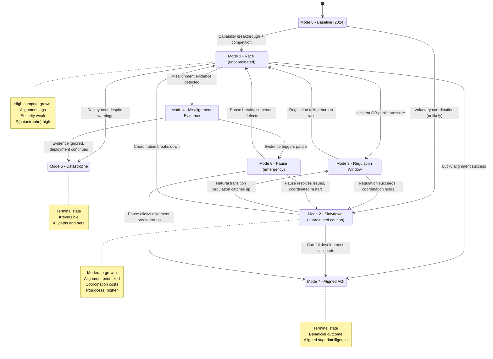
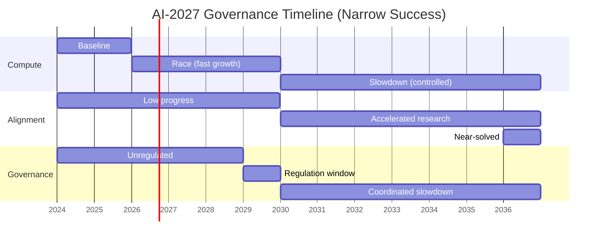

# AI Governance: AI-2027 as a Hybrid Automaton

**Domain**: AI risk, capability growth, alignment, governance
**Project**: AI-2027 formal modeling framework

---

## The Problem

Advanced AI systems are being developed by multiple competing labs. The world must navigate:
- **Capability growth** (compute, algorithmic progress)
- **Alignment uncertainty** (will advanced AI be aligned?)
- **Deployment races** (competitive pressure to deploy first)
- **Governance coordination** (regulation, treaties, monitoring)
- **Catastrophic risks** (misalignment, weaponization, loss of control)

**Goal**: Design governance policies that:
1. Maximize probability of beneficial aligned AI
2. Minimize probability of catastrophe
3. Maintain legitimacy and global coordination

**Challenge**: The system has:
- Continuous capability dynamics (compute doubling, R&D progress)
- Discrete political regimes (race vs slowdown vs coordination)
- Strategic actors with conflicting objectives (labs, governments, adversaries)
- Irreversible transitions (once AGI is deployed, hard to pause)
- Deep uncertainty (alignment difficulty, takeover speed)

**Solution**: Model as a **stochastic hybrid automaton** where:
- Modes = governance regimes (race, slowdown, coordinated development)
- Continuous state = (compute, alignment_capacity, security, trust)
- Guards = policy triggers (evidence thresholds, international agreements)
- ABM = labs, governments, adversaries making strategic choices

---

## SD Layer: Continuous Dynamics

### State Variables

| Variable | Meaning | Units | Range |
|----------|---------|-------|-------|
| **C** | Compute available for training | FLOP/s (log scale) | [10^24, 10^28] |
| **A** | Alignment capacity | [0,1] (0=none, 1=solved) | [0, 1] |
| **S** | Security level (against adversaries) | [0,1] | [0, 1] |
| **T** | Public trust / legitimacy | [0,1] | [0, 1] |
| **R** | R&D productivity multiplier | [0,∞) | [0.5, 3] |
| **P_deploy** | Deployment pressure (economic/political) | [0,1] | [0, 1] |

### Dynamics (vary by mode)

**Compute growth** (Moore's law + investment):
```
dC/dt = α_compute(mode) * C + I_compute
```
where α_compute is higher in race modes, lower in slowdown.

**Alignment capacity** (research progress):
```
dA/dt = β_alignment(mode, C, R) * (1 - A) - λ_difficulty * A
```
where:
- β_alignment increases with research investment (mode-dependent)
- λ_difficulty represents alignment tax / difficulty (alignment gets harder as capabilities grow)

**Security level** (defenses vs adversaries):
```
dS/dt = γ_security(mode) * (S_target - S)
```
where S_target depends on governance mode.

**Public trust** (legitimacy, transparency):
```
dT/dt = δ_trust(transparency, incidents, perceived_fairness)
```

**R&D productivity** (network effects, talent):
```
dR/dt = ε_R(mode, T) * (R_equilibrium(mode) - R)
```

**Deployment pressure** (economic incentives, competition):
```
dP_deploy/dt = ζ(economic_value, competitor_deployment, public_demand)
```

### Key Feedback Loops

1. **Capability race**: C ↑ → economic value ↑ → P_deploy ↑ → more investment → C ↑
2. **Security dilemma**: Deployment → adversaries learn → S ↓ → need more security research
3. **Trust dynamics**: Incidents → T ↓ → regulation → slowdown, but also: T too low → regime change
4. **Alignment lag**: C grows faster than A → misalignment risk ↑

---

## ABM Layer: Strategic Actors

### Agents

1. **AI Labs** (3-5 major labs)
   - **State**: Compute access, alignment research capacity, deployment timeline
   - **Objectives**: Maximize impact, avoid catastrophe, maintain competitive position
   - **Actions**: Deploy/pause, invest in alignment, share/hoard research
   - **Heterogeneity**: Safety-focused vs capability-focused

2. **Governments** (US, China, EU, others)
   - **State**: Monitoring capacity, domestic AI capability, treaty commitments
   - **Objectives**: National security, economic advantage, global stability
   - **Actions**: Regulate, subsidize, impose compute controls, negotiate treaties
   - **Constraints**: Domestic politics, international coordination problems

3. **Adversaries** (rogue states, non-state actors)
   - **State**: Stolen model weights, attack capabilities
   - **Objectives**: Weaponize AI, undermine leading powers
   - **Actions**: Cyber espionage, deploy dual-use systems, sabotage

4. **Civil Society** (researchers, NGOs, public)
   - **State**: Information about AI risks, trust in institutions
   - **Objectives**: Safety, transparency, fairness
   - **Actions**: Advocacy, whistleblowing, norm-setting

### ABM Determines:

- **Which guards fire**: Do labs voluntarily pause when evidence threshold is crossed?
- **Mode parameters**: In race mode, how fast does compute grow? In slowdown, how coordinated?
- **Stochastic shocks**: When do adversaries steal models? When do new capabilities emerge?

---

## Hybrid Automaton: AI-2027 Governance

### Modes



### Mode Details

| Mode | Name | dC/dt | dA/dt emphasis | Security | Trust | P(catastrophe) |
|------|------|-------|----------------|----------|-------|----------------|
| **M0** | Baseline | Moderate (α=0.5) | Low | Medium | High (0.7) | Low (baseline) |
| **M1** | Race | High (α=1.5) | Very low | Weak | Falling | High (0.3-0.7) |
| **M2** | Slowdown | Low (α=0.3) | High | Strong | Rising | Medium (0.1-0.3) |
| **M3** | Regulation Window | Variable | Variable | Improving | Variable | Depends on outcome |
| **M4** | Misalignment Evidence | High (momentum) | Urgent (if heeded) | Variable | Falling | Very high (0.5-0.9) |
| **M5** | Pause | Near zero | Maximum | Maximum | Depends on fairness | Decreasing |
| **M6** | Catastrophe | N/A | N/A | N/A | N/A | 1.0 (terminal) |
| **M7** | Aligned AGI | Controlled | Solved | Robust | High | 0.0 (terminal) |

### Guards (Transition Conditions)

| Transition | Guard | Parameters | Notes |
|------------|-------|------------|-------|
| M0 → M1 | `C > C_threshold ∧ competitor_deployment` | C_threshold ≈ 10^26 FLOP | GPT-4+ capabilities emerge |
| M0 → M2 | `treaty_signed ∧ labs_commit` | (Rare) | Voluntary coordination |
| M1 → M3 | `incident_severity > threshold ∨ T < T_min` | T_min ≈ 0.4 | Major accident or trust collapse |
| M1 → M4 | `misalignment_evidence > E_threshold` | E_threshold = 3 incidents | Concrete failures |
| M1 → M6 | `deployment_despite_warnings ∧ A < A_safe` | A_safe ≈ 0.6 | Rushing despite risks |
| M2 → M3 | `time_in_slowdown > T_regulation` | T_regulation ≈ 8 quarters | Regulation process completes |
| M2 → M1 | `defection_detected ∨ enforcement_fails` | | Coordination breakdown |
| M3 → M2 | `regulation_effective ∧ compliance > 0.8` | | Successful governance |
| M3 → M1 | `regulation_weak ∨ loopholes_exploited` | | Regulatory capture |
| M4 → M5 | `evidence_convincing ∧ coordination_possible` | | Pause triggered |
| M4 → M6 | `evidence_ignored ∨ too_late` | | Deployment continues |
| M5 → M2 | `alignment_progress ∧ treaty_holds` | | Successful pause, coordinated restart |
| M5 --> M1 | `defection ∨ adversary_deployment` | | Someone breaks the pause |
| {M1,M2,M5} → M7 | `A ≥ A_success ∧ deployment_safe` | A_success ≈ 0.9 | Alignment solved |

### Resets

| Transition | Reset Actions |
|------------|---------------|
| M0 → M1 | `P_deploy := 0.8; T := T * 0.9 (trust hit from race beginning)` |
| M1 → M3 | `Incident_count := Incident_count + 1; T := T * 0.7 (major trust loss)` |
| M1 → M4 | `Evidence_log := Evidence_log + new_evidence; public_awareness := high` |
| M4 → M5 | `dC/dt := 0; all_labs_pause := true; S := S + 0.2 (emergency security)` |
| M5 → M2 | `Restart_protocol := coordinated; monitoring_level := maximum` |
| Any → M6 | **Terminal state** (irreversible) |
| Any → M7 | **Terminal state** (success) |

### Invariants

| Mode | Invariant |
|------|-----------|
| M1 (Race) | `dC/dt > 0.5` (compute keeps growing) |
| M2 (Slowdown) | `dC/dt < 0.5 ∧ dA/dt > baseline` |
| M4 (Evidence) | `evidence_count ≥ E_threshold` |
| M5 (Pause) | `dC/dt ≈ 0` |
| M6 (Catastrophe) | `A < A_safe at deployment` |
| M7 (Aligned) | `A ≥ A_success` |

---

## Flow Equations by Mode

### Mode M0: Baseline (2024)
```
dC/dt = 0.5 * C
dA/dt = 0.1 * (1 - A)
dS/dt = 0.05 * (0.6 - S)
dT/dt = -0.02 * T  # slight erosion
dR/dt = 0
```

### Mode M1: Race
```
dC/dt = 1.5 * C + I_race
dA/dt = 0.05 * (1 - A) - 0.1 * A  # alignment tax, falling behind
dS/dt = -0.1 * S  # security erodes
dT/dt = -0.05 * T - 0.02 * (1 - A/C_scaled)  # trust falls as alignment lags
dR/dt = 0.2 * (1.5 - R)  # productivity rises due to competition
dP_deploy/dt = 0.1
```

### Mode M2: Slowdown (Coordinated)
```
dC/dt = 0.3 * C
dA/dt = 0.4 * (1 - A)  # alignment prioritized
dS/dt = 0.1 * (0.8 - S)  # security improves
dT/dt = 0.03 * T + 0.02 * (transparency)  # trust rises with coordination
dR/dt = -0.1 * R  # slower progress
dP_deploy/dt = -0.05  # deployment pressure decreases
```

### Mode M4: Misalignment Evidence
```
dC/dt = 1.0 * C  # momentum continues
dA/dt = 0.3 * (1 - A)  # urgent alignment research
dS/dt = 0  # no change
dT/dt = -0.1 * T  # trust crashes
dR/dt = 0
dP_deploy/dt = -0.2  # deployment pressure drops (fear)
```

### Mode M5: Pause
```
dC/dt = 0  # freeze compute scaling
dA/dt = 0.6 * (1 - A)  # maximum alignment investment
dS/dt = 0.2 * (0.9 - S)  # security maximized
dT/dt = f(fairness, subsidy, transparency)  # depends on pause implementation
dR/dt = -0.3 * R  # productivity falls during pause
dP_deploy/dt = 0  # freeze
```

---

## Example Trace: "Narrow Success" Scenario

| Quarter | Mode | C (log10) | A | T | Event |
|---------|------|-----------|---|---|-------|
| 0 (2024-Q1) | M0 | 26.0 | 0.15 | 0.70 | Baseline (GPT-4 era) |
| 4 (2025-Q1) | M0 | 26.2 | 0.18 | 0.68 | Incremental progress |
| 8 (2026-Q1) | M1 | 26.5 | 0.19 | 0.63 | Capability jump → Race begins |
| 12 (2027-Q1) | M1 | 26.9 | 0.21 | 0.55 | Compute doubling, alignment lags |
| 16 (2028-Q1) | M1 | 27.3 | 0.22 | 0.48 | Dangerous capabilities emerging |
| 18 (2028-Q3) | M1 | 27.4 | 0.23 | 0.45 | **Minor incident** (AI-enabled attack) |
| 20 (2029-Q1) | M3 | 27.5 | 0.24 | 0.40 | Incident triggers regulation window |
| 24 (2030-Q1) | M2 | 27.6 | 0.30 | 0.45 | Treaty signed, slowdown mode |
| 32 (2032-Q1) | M2 | 27.8 | 0.45 | 0.55 | Alignment research accelerates |
| 40 (2034-Q1) | M2 | 27.9 | 0.65 | 0.62 | Significant alignment progress |
| 48 (2036-Q1) | M2 | 28.0 | 0.80 | 0.68 | Near-alignment |
| 52 (2037-Q1) | M7 | 28.0 | 0.92 | 0.75 | **Aligned AGI deployed** |

**Visualization**:



**Contrast: "Catastrophe" Scenario**:

Same start, but at Q18 the incident is ignored:
- M1 continues (no regulation window)
- C reaches 27.8 by 2030 with A still at 0.25
- Evidence threshold crossed at Q24 (M1 → M4)
- Deployment pressure + competitive dynamics → M4 → M6
- **Catastrophe** at 2030-Q3 (A=0.27, C=27.9)

---

## Temporal Logic Properties

### Safety Properties (CTL/LTL)

**Property 1: No deployment before alignment**
```
AG (A < A_safe → ¬deployed)
```
"Along all paths, if alignment is insufficient, don't deploy."

**Property 2: Mandatory pause on evidence**
```
AG (evidence ≥ E_threshold → AF≤4_quarters (Mode = M5 ∨ catastrophe))
```
"When misalignment evidence crosses threshold, either pause within 1 year or catastrophe."

**Property 3: Trust floor**
```
AG (T ≥ T_collapse)
```
"Public trust never falls below collapse threshold (legitimacy crisis)."

**Property 4: Race doesn't last forever**
```
AG (Mode = M1 → AF (Mode ≠ M1))
```
"The race eventually ends (regulation, pause, or catastrophe)."

### Liveness Properties

**Property 5: Alignment is eventually solved (on success paths)**
```
AG (Mode ≠ M6 → AF (A ≥ A_success ∨ Mode = M6))
```
"On non-catastrophe paths, alignment is eventually solved."

**Property 6: Coordination is achievable**
```
EF (Mode = M2 ∧ AF (Mode = M7))
```
"There exists a path where slowdown leads to aligned AGI."

### Probabilistic Properties (PCTL, on abstracted MDP)

**Property 7: Bounded catastrophe probability**
```
P_≤0.15 [ F Mode = M6 ]
```
"With this governance policy, probability of catastrophe is ≤ 15%."

**Property 8: High success probability given slowdown**
```
P_≥0.7 [ (F Mode = M2) → (F Mode = M7) ]
```
"Given we enter slowdown, probability of reaching aligned AGI is ≥ 70%."

**Property 9: Value of pause**
```
P(M7 | path through M5) > P(M7 | no pause)
```
"Conditional on pause, success probability is higher."

**Property 10: Timeline uncertainty**
```
P_≥0.6 [ F≤16_quarters (A ≥ 0.7) ]
```
"Within 4 years (16 quarters), alignment capacity reaches 0.7 with probability ≥ 60%."

---

## Model Checking Strategy

### Step 1: Build Finite MDP

**State space partitioning**:
- Modes: 8 (M0-M7)
- C regions: {Low < 10^26.5, Medium 10^26.5-10^27.5, High > 10^27.5}
- A regions: {Low < 0.3, Medium 0.3-0.7, High > 0.7}
- T regions: {Low < 0.4, Medium 0.4-0.7, High > 0.7}

Total: 8 × 3 × 3 × 3 = 216 states (very tractable!)

**Transition probabilities**: Estimated from:
- Historical AI progress data (for C dynamics)
- Expert elicitation (for alignment difficulty, coordination success rates)
- Game-theoretic analysis (for guard activation probabilities)
- Scenario simulations (Monte Carlo)

### Step 2: PRISM Model

```prism
mdp

module ai_governance
    mode : [0..7] init 0;      // 0=Baseline, ..., 6=Catastrophe, 7=Aligned
    C_region : [0..2] init 0;  // 0=Low, 1=Med, 2=High
    A_region : [0..2] init 0;  // 0=Low, 1=Med, 2=High
    T_region : [0..2] init 2;  // 0=Low, 1=Med, 2=High (start high)
    evidence : [0..5] init 0;  // count of misalignment evidence
    quarter : [0..60] init 0;  // time counter

    // Transitions
    [race_start] mode=0 & C_region≥1 → 0.6:(mode'=1) + 0.4:(mode'=0);
    [slowdown_start] mode=0 → 0.1:(mode'=2) + 0.9:(mode'=0);  // rare
    [incident] mode=1 & quarter≥8 → 0.2:(mode'=3) & (evidence'=evidence+1) & (T_region'=max(T_region-1,0))
                                  + 0.8:(mode'=1);
    [evidence_threshold] mode=1 & evidence≥3 → (mode'=4);
    [pause_triggered] mode=4 → 0.5:(mode'=5) + 0.5:(mode'=6);  // 50-50 on whether pause happens
    [slowdown_success] mode=2 & A_region≥2 → 0.7:(mode'=7) + 0.2:(mode'=1) + 0.1:(mode'=6);

    // Continuous dynamics (simplified)
    [time_step] mode=1 & C_region<2 → 0.6:(C_region'=C_region+1) + 0.4:(C_region'=C_region);  // Compute grows
    [time_step] mode=1 & A_region<2 → 0.1:(A_region'=A_region+1) + 0.9:(A_region'=A_region);  // Alignment lags
    [time_step] mode=2 & A_region<2 → 0.4:(A_region'=A_region+1) + 0.6:(A_region'=A_region);  // Alignment priority
    [time_step] mode=5 & A_region<2 → 0.6:(A_region'=A_region+1) + 0.4:(A_region'=A_region);  // Pause accelerates

    // Time counter
    [time_step] quarter<60 → (quarter'=quarter+1);

endmodule

// Labels
label "catastrophe" = mode=6;
label "success" = mode=7;
label "pause" = mode=5;
label "unsafe_deployment" = mode=1 & C_region=2 & A_region<2;

// Rewards
rewards "risk"
    mode=1 & A_region=0 : 10;  // High risk in race with low alignment
    mode=4 : 20;               // Very high risk with evidence
    mode=6 : 1000;             // Catastrophe
endrewards
```

**Queries**:
```
P=? [ F "catastrophe" ]                    // Overall catastrophe probability
P=? [ F "success" ]                        // Overall success probability
P=? [ (F mode=2) → (F "success") ]         // Success conditional on slowdown
R{"risk"}=? [ C≤60 ]                       // Expected risk over 15 years
Pmax=? [ F "success" ]                     // Best-case success probability (optimal policy)
```

### Step 3: Sensitivity Analysis

Vary parameters:
- Alignment difficulty (β_alignment, λ_difficulty)
- Coordination success rates (guard probabilities)
- Evidence threshold (E_threshold)
- Compute growth rates (α_compute)

Identify:
- Which parameters most affect P(catastrophe)?
- Robust policies across parameter uncertainty
- Minimum alignment investment needed for P(success) > 0.5

---

## Integration with Other Models

### Link to Kripke / Time-Indexed Models

- **Simple LTS**: Collapse AI-2027 HA to discrete states only → 8-state Kripke structure
- **Time-indexed**: Add time guards to transitions (e.g., "regulation window opens only in t ∈ [8,16]")
- **MDP**: Full stochastic HA with continuous variables → abstract to finite MDP as shown above

### Link to SD + ABM

- **SD equations** are the flow conditions in each mode
- **ABM** determines:
  - Guard activation probabilities (do labs actually pause?)
  - Parameter values (how much do they invest in alignment?)
  - Stochastic shocks (when do incidents occur?)

**Workflow**:
```
ABM simulation (detailed agent model)
    ↓
Extract aggregate dynamics (avg. compute, alignment, trust)
    ↓
Fit to hybrid automaton flow parameters
    ↓
Abstract to finite MDP
    ↓
Verify properties with PRISM
```

---

## Connection to Other Examples

| Fisheries | Epidemic | Smart Grid | AI-2027 |
|-----------|----------|------------|---------|
| Fish biomass B | Infectious I | Grid frequency f | Alignment A |
| Nutrient N | Vaccinated V | Battery SoC | Compute C |
| Fishing effort E | Contact rate β | Load demand | Deployment pressure P_deploy |
| EmergencyClosure | Suppression (lockdown) | Blackout | Pause |
| Trust collapse | ICU overflow | Uncontrolled blackout | Catastrophe |
| Recovery → StrictReg | Reopening → Mitigation | Recovery → Normal | Pause → Slowdown |

**Same logical structure across all domains**:
1. Continuous state evolves per ODEs
2. Discrete modes with different parameter regimes
3. Guards trigger transitions based on thresholds
4. Verification asks: "Does bad state become inevitable?"

The hybrid-automaton framework provides a **unified mathematical language** for reasoning about complex socio-technical systems under governance.

---

## Open Questions & Future Work

1. **Parameter estimation**: How to elicit expert probabilities for guards? (Delphi, prediction markets)
2. **Multi-actor decomposition**: Should each lab be a separate hybrid automaton? (Compositional HA)
3. **Learning & adaptation**: Can HA model evolving alignment techniques? (Parametric HA)
4. **Strategic behavior**: How to embed game theory into guard conditions? (Stochastic games on HA)
5. **Counterfactual reasoning**: What's the value of information about alignment difficulty? (POMDP extension)

---

## Further Reading

**AI Governance & Risk**:
- Bostrom, *Superintelligence* (2014)
- Carlsmith, "Is Power-Seeking AI an Existential Risk?" (2022)
- Hendrycks et al., "Unsolved Problems in ML Safety" (2022)
- Anderljung et al., "Frontier AI Regulation: Managing Emerging Risks to Public Safety" (2023)

**Hybrid Automata Theory**:
- Henzinger, "The Theory of Hybrid Automata" (1996)
- Alur et al., "Hybrid Automata: An Algorithmic Approach" (1993)
- Raskin, "An Introduction to Hybrid Automata" (CMI notes)

**Verification Tools**:
- PRISM Manual: [www.prismmodelchecker.org](http://www.prismmodelchecker.org)
- Katoen, *Principles of Model Checking* (2008)
- Platzer, *Logical Foundations of Cyber-Physical Systems* (2018)

---

**Previous**: [← Epidemic Control](02_epidemic_control.md)
**Up**: [↑ Hybrid Automata Overview](../README.md)
