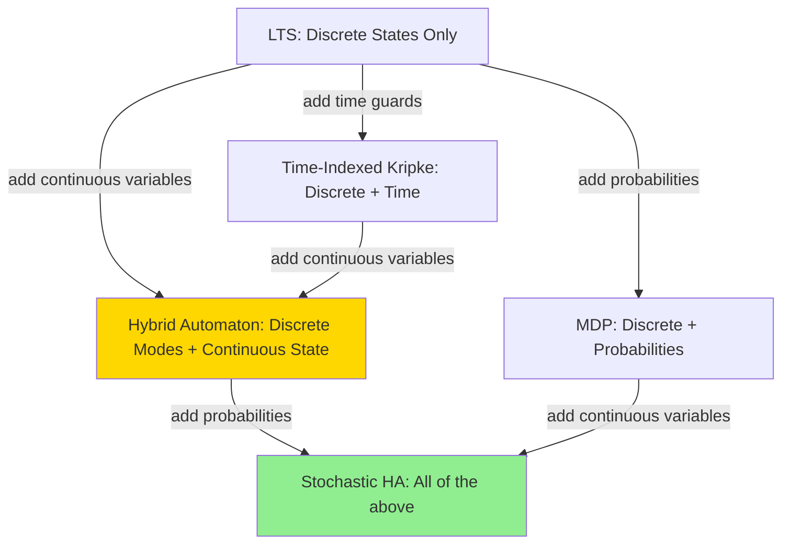

# AI-2027 MVP – Formal Model Design

**Status**: Updated for Hybrid Automata
**Owner**: TBD
**Last updated**: 2025-11-18

---

## 1. Overview

This document specifies **which formal models** the AI-2027 Modeling Playground MVP will support, and how they relate to **hybrid automata** as the unifying framework.

**Key insight**: A **hybrid automaton** combines:
- Discrete modes (like Kripke states)
- Continuous variables (compute, alignment, trust)
- Temporal guards (time windows)
- Stochastic transitions (probabilities)

This subsumes our previous discrete models (LTS, Kripke, MDP) while adding the critical **continuous dynamics** layer.

**Design principle**: Build up progressively:
1. Discrete modes only (like LTS)
2. Add continuous variables (hybrid automaton core)
3. Add time guards (timed hybrid automaton)
4. Add probabilities (stochastic hybrid automaton = MDP-like)

---

## 2. How Previous Models Map to Hybrid Automata

### Conceptual Hierarchy



### Translation Table

| Previous Model | HA Component | What It Becomes |
|----------------|--------------|-----------------|
| **Kripke state** | HA mode | Discrete location (e.g., "Race", "Slowdown") |
| **Kripke transition** | HA guard | Condition that triggers mode switch |
| **State variables** | Continuous state | (compute, alignment, trust) ∈ ℝⁿ |
| **Time in Kripke** | Time guards | Temporal windows [t ∈ [8, 16]] |
| **MDP probabilities** | Stochastic guards | P(mode transition) given state |
| **LTL/CTL properties** | Properties over HA traces | Same logic, checked on hybrid system |

**Bottom line**: Everything we designed for discrete models still works—hybrid automata just add the continuous layer on top.

---

## 3. Hybrid Automaton as Core Model

### Formal Definition

```
Hybrid Automaton = (Modes, Vars, Flow, Guards, Resets, Inv)

Where:
- Modes: Finite set of discrete locations (e.g., {Baseline, Race, Slowdown, Pause, ...})
- Vars: Continuous variables x = (compute, alignment, trust, ...) ∈ ℝⁿ
- Flow: Maps each mode to ODEs: dx/dt = f_mode(x)
- Guards: Mode → Mode × Condition (e.g., Race → Pause when evidence ≥ 3)
- Resets: Discrete updates to x on mode transition (e.g., x := x/2)
- Inv: Mode → Condition (invariants that must hold in each mode)
```

**Hybrid state**: `(mode, x)` where mode ∈ Modes, x ∈ ℝⁿ

**Transitions**:
- **Time-elapse**: Stay in mode, x evolves per dx/dt = f_mode(x)
- **Discrete jump**: Switch mode when guard fires, apply reset to x

### Example: AI-2027 Hybrid Automaton

**Modes**: {Baseline, Race, Slowdown, Misalignment_Evidence, Pause, Catastrophe, Aligned}

**Continuous variables**:
```typescript
interface ContinuousState {
  compute: number;        // log10(FLOP/s), range [24, 28]
  alignment: number;      // [0, 1]
  trust: number;          // [0, 1]
  security: number;       // [0, 1]
}
```

**Flow in Race mode**:
```
dcompute/dt = 1.5 * compute
dalignment/dt = 0.05 * (1 - alignment)
dtrust/dt = -0.05 * trust
```

**Guard**: Race → Misalignment_Evidence
```
Condition: evidence_count ≥ 3
Reset: none (continuous state unchanged)
```

**Guard**: Pause → Aligned
```
Condition: alignment ≥ 0.9
Reset: none
```

---

## 4. MVP Implementation Phases

### Phase 1: Discrete Modes Only (Week 1)

**Goal**: Implement basic hybrid automaton with **no continuous dynamics yet**.

**Simplified HA**:
- Modes: {Baseline, Race, Slowdown, Pause, Catastrophe, Aligned}
- Variables: Discrete counters (evidence_count, round_number)
- Flow: None (or trivial: dx/dt = 0)
- Guards: Simple conditions (evidence_count ≥ 3)

**Why**: Validates architecture before adding ODEs.

**State representation**:
```typescript
interface HAState {
  mode: 'baseline' | 'race' | 'slowdown' | 'pause' | 'catastrophe' | 'aligned';
  discrete: {
    evidenceCount: number;
    roundNumber: number;
  };
  continuous: {
    // Not used yet, or set to constants
    compute: 26.0;
    alignment: 0.15;
    trust: 0.70;
  };
}
```

**Deliverable**: Mode transition graph in React Flow, manual stepping through modes.

---

### Phase 2: Add Continuous Dynamics (Week 2)

**Goal**: Implement full hybrid automaton with ODEs.

**Extend Phase 1**:
- Flow: Mode-specific ODEs (see [AI-2027 HA spec](../hybrid_automata/examples/04_ai_governance.md))
- Update: Continuous state evolves between discrete jumps
- Visualization: Show continuous variables on nodes/edges

**Flow implementation**:
```typescript
// services/hybridAutomaton.ts

function flowEquations(mode: Mode, x: ContinuousState): ContinuousState {
  const dt = 1.0;  // Time step (1 quarter)

  switch (mode) {
    case 'race':
      return {
        compute: x.compute + 1.5 * x.compute * dt,
        alignment: x.alignment + 0.05 * (1 - x.alignment) * dt,
        trust: x.trust - 0.05 * x.trust * dt,
        security: x.security
      };

    case 'slowdown':
      return {
        compute: x.compute + 0.3 * x.compute * dt,
        alignment: x.alignment + 0.4 * (1 - x.alignment) * dt,
        trust: x.trust + 0.03 * dt,
        security: x.security + 0.1 * (1 - x.security) * dt
      };

    case 'pause':
      return {
        compute: x.compute,  // No growth
        alignment: x.alignment + 0.6 * (1 - x.alignment) * dt,
        trust: x.trust,
        security: x.security + 0.2 * (1 - x.security) * dt
      };

    default:
      return x;  // No change
  }
}
```

**Deliverable**: Continuous state evolution shown in real-time or step-by-step.

---

### Phase 3: Add Time Guards (Week 3)

**Goal**: Support temporal windows (e.g., "deployment only before 2026-Q1").

**Extend Phase 2**:
- Time: Add `t` to state: `(mode, x, t)`
- Time guards: Conditions like `t ∈ [8, 16]` on transitions
- Visualization: Show time constraints on edges

**Guard with time**:
```typescript
interface Guard {
  fromMode: Mode;
  toMode: Mode;
  condition: (x: ContinuousState, t: number, discrete: DiscreteState) => boolean;
}

const guards: Guard[] = [
  {
    fromMode: 'race',
    toMode: 'misalignment_evidence',
    condition: (x, t, d) => d.evidenceCount >= 3
  },
  {
    fromMode: 'baseline',
    toMode: 'race',
    condition: (x, t, d) => t >= 4 && x.compute > 26.5  // After 2025-Q1
  }
];
```

**Deliverable**: Time-indexed hybrid automaton with temporal constraints.

---

### Phase 4: Add Probabilities (Week 4-5)

**Goal**: Stochastic hybrid automaton (SHA) for probabilistic analysis.

**Extend Phase 3**:
- Stochastic guards: Transitions fire with probability
- Probabilistic resets: x := x + noise
- MDP abstraction: Discretize continuous state → finite MDP

**Stochastic guard**:
```typescript
interface StochasticGuard extends Guard {
  probability: (x: ContinuousState, t: number) => number;
}

const stochasticGuards: StochasticGuard[] = [
  {
    fromMode: 'pause',
    toMode: 'aligned',
    condition: (x, t, d) => x.alignment > 0.85,
    probability: (x, t) => 0.7 + 0.3 * (x.alignment - 0.85) / 0.15  // Higher alignment → higher P(success)
  },
  {
    fromMode: 'race',
    toMode: 'catastrophe',
    condition: (x, t, d) => x.compute > 27.5 && x.alignment < 0.3,
    probability: (x, t) => 0.2 + 0.5 * ((x.compute - 27.5) / 0.5)  // More compute → higher risk
  }
];
```

**MDP abstraction**:
```typescript
// Discretize continuous state
function abstractToMDPState(ha: HAState): MDPState {
  return {
    mode: ha.mode,
    computeRegion: ha.continuous.compute < 26.5 ? 'low' :
                   ha.continuous.compute < 27.5 ? 'medium' : 'high',
    alignmentRegion: ha.continuous.alignment < 0.3 ? 'low' :
                     ha.continuous.alignment < 0.7 ? 'medium' : 'high',
    trustRegion: ha.continuous.trust < 0.4 ? 'low' :
                 ha.continuous.trust < 0.7 ? 'medium' : 'high'
  };
}
```

**Deliverable**: Probabilistic reachability analysis, P(catastrophe), optimal policies.

---

## 5. Relationship to Temporal Logic

### LTL/CTL on Hybrid Automata

Temporal logic properties are checked on the **induced transition system** of the hybrid automaton.

**How it works**:
1. **Discretize continuous state** (or use continuous abstraction)
2. **Build finite Kripke structure** from HA
3. **Check LTL/CTL formulas** on the Kripke structure

**Example properties**:

```
Safety: AG (alignment < 0.6 → ¬deployed)
  "Along all paths, don't deploy if alignment < 60%"

Liveness: AF (alignment ≥ 0.7 ∨ catastrophe)
  "Eventually, either alignment is solved or catastrophe occurs"

Response: AG (evidence ≥ 3 → AF_{≤2} pause)
  "When evidence threshold crossed, pause within 2 quarters"
```

**Implementation**: Same `temporalLogic.ts` checker, just runs on HA traces.

---

## 6. Model Checking Strategy

### For Discrete Fragment (Phase 1)

**Direct model checking**:
- States: Modes only
- Standard CTL/LTL algorithms
- Tools: Custom TypeScript checker

---

### For Continuous HA (Phase 2-3)

**Approach 1: Discretization**
```
Hybrid Automaton
    ↓ [discretize continuous state]
Finite Kripke Structure
    ↓ [check properties]
LTL/CTL Model Checker
```

**Approach 2: Simulation-based**
- Run Monte Carlo trajectories
- Estimate satisfaction probability
- Statistical model checking

---

### For Stochastic HA (Phase 4)

**Build finite MDP**:
```
Stochastic Hybrid Automaton
    ↓ [abstract to regions]
Finite MDP (modes × regions)
    ↓ [check PCTL properties]
Probabilistic Model Checker (PRISM/Storm)
```

**State space**: ~200 states (8 modes × 3 compute × 3 alignment × 3 trust)

---

## 7. Comparison: Old Design vs New

### Old Design (Discrete Only)

```
Phase 1: LTS (just states + edges)
Phase 2: Time-Indexed Kripke (states + time)
Phase 3: MDP (states + probabilities)
```

**Problem**: No continuous dynamics! Can't model:
- Alignment capacity growing over time
- Compute scaling exponentially
- Trust eroding gradually

---

### New Design (Hybrid Automaton)

```
Phase 1: Discrete modes (validate architecture)
Phase 2: Hybrid automaton (modes + continuous state + ODEs)
Phase 3: Time guards (temporal windows)
Phase 4: Stochastic HA (probabilities)
```

**Advantage**:
- ✅ Models continuous dynamics (alignment, compute, trust)
- ✅ Captures feedback loops (trust ↓ → regulation → slowdown)
- ✅ Subsumes all previous models (Kripke, MDP as special cases)
- ✅ Matches real AI risk dynamics (not purely discrete)

---

## 8. Technical Debt & Migration

### What We Keep

- ✅ Graph visualization (React Flow)
- ✅ Temporal logic checker (works on HA traces)
- ✅ Python examples (01_simple_lts.py → becomes HA example)
- ✅ Mermaid diagrams (update to show modes + flows)

### What We Update

- 🔄 State representation (add continuous variables)
- 🔄 Transition logic (add ODEs, guards, resets)
- 🔄 Visualization (show continuous state evolution)
- 🔄 Documentation (emphasize HA as core model)

### What We Add

- ➕ Flow equations (mode-specific ODEs)
- ➕ Guard conditions (include continuous state)
- ➕ Reset maps (discrete updates to continuous vars)
- ➕ Continuous state display (line charts, gauges)

---

## 9. Deliverables by Phase

| Phase | Deliverable | Demo |
|-------|-------------|------|
| **1** | Discrete modes only | Show mode transition graph |
| **2** | Full hybrid automaton | Show continuous state evolving |
| **3** | Time guards | Show temporal constraints enforced |
| **4** | Stochastic HA + MDP | Show P(catastrophe) analysis |

---

## 10. Success Criteria

### Phase 1
- ✓ Can define 8 modes (Baseline, Race, Slowdown, ...)
- ✓ Manual transitions via button clicks
- ✓ Visualization shows mode graph

### Phase 2
- ✓ Continuous state (compute, alignment, trust) updates per mode
- ✓ ODEs integrate over time steps
- ✓ Visualization shows continuous state alongside modes

### Phase 3
- ✓ Time guards enforced (can't deploy before t=4)
- ✓ Temporal properties checkable

### Phase 4
- ✓ Stochastic guards (P(transition) computed)
- ✓ MDP abstraction built (finite state space)
- ✓ P(catastrophe) < 20% achievable with good policy

---

## 11. References

**Hybrid Automata Theory**:
- Henzinger et al., "What's Decidable about Hybrid Automata?" (1995)
- Alur et al., "Hybrid Automata: An Algorithmic Approach" (1993)

**Our Specs**:
- [Hybrid Automata Framework](../hybrid_automata/README.md)
- [AI-2027 Hybrid Automaton](../hybrid_automata/examples/04_ai_governance.md)
- [Fisheries HA Example](../hybrid_automata/examples/01_ses_fisheries.md)

**Implementation Guide**:
- [Tech Design](tech_design.md) - Architecture with HA engine
- [Implementation Plan](impl_plan.md) - Week-by-week tasks

---

**Next**: [Tech Design](tech_design.md) for architecture details with hybrid automaton engine
