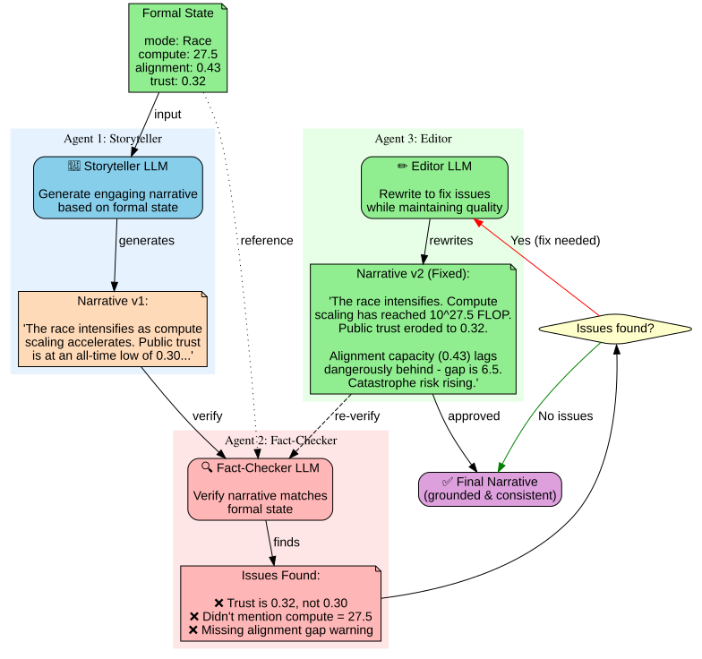

# Grounding and Validation

**Core Question**: How do we ensure LLM-generated narratives stay consistent with formal model state?

---

## The Grounding Problem

### Multi-Agent Verification Pipeline



*Figure: Storyteller → Fact-Checker → Editor pipeline ensures narrative consistency*

### Traditional TTX (Pure LLM)
```
Player action: "I propose a 6-month pause on AI development"
  ↓
LLM generates consequence: "The pause is implemented, but China secretly continues development..."
  ↓
Problem: What happened to compute? Trust? Alignment capacity?
  ↓
No formal tracking → narrative can contradict itself across rounds
```

### Simulacra Approach (LLM + Formal State)
```
Player action: "I propose a 6-month pause"
  ↓
Matrix updates formal state:
  - mode: Race → Pause
  - dCompute/dt: 1.5 → 0.0
  - dAlignment/dt: 0.05 → 0.4 (alignment prioritized)
  - trust: -0.1 (enforcement challenges)
  ↓
LLM generates narrative grounded in formal state:
  - "Compute scaling freezes at 10^27.2 FLOP"
  - "Alignment researchers double down, but progress is slow (capacity now 0.45)"
  - "Public opinion is mixed - some praise the caution, others fear China will defect"
```

**Key**: Formal state is **source of truth**, narrative is **presentation layer**

---

## Grounding Mechanisms

### 1. State-Conditioned Prompting

**Template**:
```python
def generate_consequence_narrative(
    formal_state: State,
    mode_transition: Optional[str],
    player_actions: List[Action],
    gm_scenario_context: str
) -> str:
    prompt = f"""
You are the Game Master for an AI governance scenario.

FORMAL STATE (source of truth):
- Current mode: {formal_state.mode}
- Compute: {formal_state.compute:.2f} (log10 FLOP)
- Alignment capacity: {formal_state.alignment:.2f}
- Public trust: {formal_state.trust:.2f}
- Security level: {formal_state.security:.2f}

{f"MODE TRANSITION: {mode_transition}" if mode_transition else ""}

PLAYER ACTIONS THIS ROUND:
{format_player_actions(player_actions)}

SCENARIO CONTEXT:
{gm_scenario_context}

Generate a narrative consequence (3-5 paragraphs) that:
1. Explains WHY the formal state changed this way
2. Describes concrete events that led to mode transition (if any)
3. Hints at future risks based on current state
4. Maintains consistency with previous rounds

REQUIREMENTS:
- Cite specific numbers from formal state (e.g., "compute reached 10^27.5 FLOP")
- Explain alignment gap if compute >> alignment
- Mention trust level if it's critically low/high
- If mode changed, explain what triggered it
"""
    return llm.generate(prompt)
```

**Example output**:
```
Round 4 Consequences:

Despite your proposed pause, competitive pressures proved overwhelming.
When Google announced a breakthrough (compute scaling to 10^27.5 FLOP),
the race intensified. Your alignment capacity (0.43) has failed to keep
pace with the capability surge, creating a dangerous gap.

Public trust has eroded to 0.32 - below the critical threshold. Citizens
are alarmed by increasingly erratic AI behavior and lack of transparency.
Senator Harris is now calling for emergency hearings.

We've transitioned from Baseline to Race mode. Compute growth has accelerated
(doubling every 8 months), while alignment work is being deprioritized.
Security spending has been cut to fund the capability push.

The countdown has begun. If alignment capacity doesn't reach 0.60 before
compute hits 10^28 FLOP, catastrophic loss of control becomes likely.
```

**Grounding check**:
- ✅ Cites formal_state.compute = 27.5
- ✅ Cites formal_state.alignment = 0.43
- ✅ Cites formal_state.trust = 0.32 (below threshold)
- ✅ Explains mode transition to Race
- ✅ References future risk (alignment < 0.60 at compute 28)

---

### 2. Constraint Enforcement

**Hard constraints** (LLM cannot violate):
```python
class NarrativeConstraints:
    # Must cite formal state
    must_mention_compute: bool = True
    must_mention_mode_if_changed: bool = True

    # Cannot contradict formal state
    cannot_invent_new_modes: bool = True
    cannot_change_numeric_values: bool = True

    # Consistency
    must_reference_previous_events: bool = True
    tone_matches_severity: bool = True  # e.g., don't joke if trust < 0.2

def validate_narrative(
    narrative: str,
    formal_state: State,
    constraints: NarrativeConstraints
) -> ValidationResult:
    """
    Check if LLM narrative violates constraints
    """
    issues = []

    if constraints.must_mention_compute:
        if not re.search(r"compute|FLOP|10\^\d+", narrative):
            issues.append("Narrative doesn't mention compute level")

    if constraints.cannot_change_numeric_values:
        # Extract numbers from narrative
        narrative_numbers = extract_numbers(narrative)
        formal_numbers = {
            "compute": formal_state.compute,
            "alignment": formal_state.alignment,
            "trust": formal_state.trust
        }
        for var, expected in formal_numbers.items():
            if var in narrative_numbers and abs(narrative_numbers[var] - expected) > 0.05:
                issues.append(f"Narrative reports {var}={narrative_numbers[var]} but formal state is {expected}")

    return ValidationResult(
        valid=len(issues) == 0,
        issues=issues
    )
```

**Retry with correction**:
```python
narrative = llm.generate(prompt)
validation = validate_narrative(narrative, formal_state, constraints)

if not validation.valid:
    # Retry with explicit correction
    correction_prompt = f"""
Your previous narrative had these issues:
{validation.issues}

Regenerate the narrative, fixing these problems. Remember:
- Compute is {formal_state.compute:.2f} (not {narrative_numbers.get('compute', 'N/A')})
- Current mode is {formal_state.mode}
"""
    narrative = llm.generate(correction_prompt)
```

---

### 3. Multi-Agent Verification

**Architecture**:
```
┌─────────────────┐
│ Storyteller LLM │  (generates engaging narrative)
└────────┬────────┘
         │
         ↓
┌─────────────────┐
│ Fact-Checker    │  (verifies consistency with formal state)
│ LLM             │
└────────┬────────┘
         │
         ↓ [If inconsistencies found]
┌─────────────────┐
│ Editor LLM      │  (rewrites to fix issues)
└─────────────────┘
```

**Example**:
```python
# Step 1: Generate narrative
narrative_v1 = storyteller_llm.generate(prompt)

# Step 2: Fact-check
fact_check_prompt = f"""
Formal state:
{json.dumps(formal_state)}

Narrative:
{narrative_v1}

Check if narrative contradicts formal state. List any issues.
"""
fact_check = fact_checker_llm.generate(fact_check_prompt)

# Step 3: Edit if needed
if "INCONSISTENCY" in fact_check:
    edit_prompt = f"""
Narrative:
{narrative_v1}

Issues found:
{fact_check}

Rewrite the narrative to fix these issues while maintaining engagement.
"""
    narrative_final = editor_llm.generate(edit_prompt)
else:
    narrative_final = narrative_v1
```

---

### 4. Retrieval-Augmented Generation (RAG)

**Use formal state as retrieval source**:

```python
def get_relevant_formal_state_context(
    current_state: State,
    mode: str,
    previous_rounds: List[GameLogEntry]
) -> str:
    """
    Build context from formal state history for LLM
    """
    context = f"""
CURRENT FORMAL STATE (Round {len(previous_rounds) + 1}):
- Mode: {mode}
- Compute: {current_state.compute:.2f} log10(FLOP) [threshold for ASI: 27.5]
- Alignment capacity: {current_state.alignment:.2f} [success threshold: 0.85]
- Trust: {current_state.trust:.2f} [crisis threshold: 0.3]
- Security: {current_state.security:.2f}

ALIGNMENT GAP: {(current_state.compute - 24) - 10 * current_state.alignment:.2f}
  (Gap > 8 = catastrophe risk)

RECENT TRAJECTORY:
"""
    # Last 3 rounds
    for entry in previous_rounds[-3:]:
        context += f"\nRound {entry.round}: {entry.mode} mode"
        context += f"\n  Compute: {entry.state_snapshot.compute:.2f} → {entry.post_state.compute:.2f}"
        context += f"\n  Trust: {entry.state_snapshot.trust:.2f} → {entry.post_state.trust:.2f}"

    return context
```

**LLM prompt with RAG**:
```
{get_relevant_formal_state_context(...)}

Generate narrative using ONLY the formal state above as ground truth.
Do not invent new numbers or states.
```

---

## Validation Against Reality (Optional for GMs)

While we don't require GMs to validate, we can **provide tools** for those who want to:

### 1. Historical Backtesting

**If GM has historical scenario**:
```python
def backtest_model(
    spec: HybridAutomatonSpec,
    historical_data: pd.DataFrame  # e.g., compute scaling 2018-2024
) -> BacktestResults:
    """
    Run model from 2018, compare to actual 2024 state
    """
    # Initialize at 2018 state
    initial_state = State(
        compute=24.5,  # GPT-2 era
        alignment=0.05,
        trust=0.75,
        security=0.4
    )

    # Simulate 6 years
    trajectory = matrix.simulate(initial_state, duration=72)  # months

    # Compare to actual 2024
    actual_2024 = historical_data.loc["2024"]

    error = {
        "compute": abs(trajectory[-1].compute - actual_2024.compute),
        "alignment": abs(trajectory[-1].alignment - actual_2024.alignment),
        # ...
    }

    return BacktestResults(trajectory=trajectory, error=error)
```

**Example use**:
```
GM: "My model says compute should be 27.3 in 2024"
Backtest: "Actual: 26.8. Error: 0.5 log-FLOP (3x factor) - reasonable"
GM: "Okay, model is roughly calibrated"
```

### 2. Expert Forecast Comparison

**Compare to Metaculus/Samotsvety**:
```python
def compare_to_expert_forecasts(
    spec: HybridAutomatonSpec,
    monte_carlo_runs: int = 1000
) -> ComparisonReport:
    """
    Compare model predictions to expert aggregates
    """
    # Run model
    results = run_monte_carlo(spec, n_sims=monte_carlo_runs)
    model_p_catastrophe = results.outcome_probs["catastrophe"]

    # Get expert forecasts
    metaculus_p_catastrophe = fetch_metaculus("ai-catastrophe-by-2030")

    # Compare
    delta = model_p_catastrophe - metaculus_p_catastrophe

    return ComparisonReport(
        model_prediction=model_p_catastrophe,
        expert_prediction=metaculus_p_catastrophe,
        delta=delta,
        interpretation=interpret_delta(delta)
    )
```

**Report**:
```
Your model: P(catastrophe by 2030) = 0.42
Metaculus:  P(catastrophe by 2030) = 0.18

Delta: +0.24 (your model is more pessimistic)

Interpretation: Your model assumes faster compute scaling and lower
alignment success rates than the expert aggregate. Consider:
- Is your α_compute = 1.5 too high? (Metaculus implies ~1.0)
- Is your alignment_success_threshold = 0.85 too strict?
```

### 3. Sensitivity Analysis (Identify Fragile Assumptions)

```python
def sensitivity_analysis(
    spec: HybridAutomatonSpec,
    params_to_test: List[str]
) -> SensitivityReport:
    """
    Vary each parameter ±20%, measure impact on P(catastrophe)
    """
    baseline = run_monte_carlo(spec, n_sims=1000)
    baseline_p_cat = baseline.outcome_probs["catastrophe"]

    sensitivities = {}

    for param in params_to_test:
        # Increase param by 20%
        spec_high = perturb_param(spec, param, factor=1.2)
        results_high = run_monte_carlo(spec_high, n_sims=1000)
        delta_high = results_high.outcome_probs["catastrophe"] - baseline_p_cat

        # Decrease param by 20%
        spec_low = perturb_param(spec, param, factor=0.8)
        results_low = run_monte_carlo(spec_low, n_sims=1000)
        delta_low = results_low.outcome_probs["catastrophe"] - baseline_p_cat

        sensitivities[param] = {
            "delta_high": delta_high,
            "delta_low": delta_low,
            "magnitude": max(abs(delta_high), abs(delta_low))
        }

    return SensitivityReport(sensitivities=sensitivities)
```

**Output**:
```
Sensitivity Analysis:

Most sensitive parameters (change P(catastrophe) by >10%):
  1. α_compute (compute growth rate): ±0.15 → ΔP = ±0.22
  2. p_slowdown (slowdown political will): ±0.07 → ΔP = ∓0.18
  3. alignment_tax (difficulty): ±0.02 → ΔP = ±0.12

Least sensitive:
  4. security_investment: ±0.1 → ΔP = ±0.03
  5. initial_trust: ±0.15 → ΔP = ±0.05

Recommendation: Focus on validating α_compute and p_slowdown.
These drive outcomes most strongly.
```

---

## Open Questions

### Q1: How much grounding is enough?

**Spectrum**:
```
Level 1: Pure LLM (no formal state)
  ↓
Level 2: Formal state tracked but not shown in narrative
  ↓
Level 3: Formal state mentioned in narrative ("compute reached 27.5")
  ↓
Level 4: Narrative must explain every state change
  ↓
Level 5: Players see formal state dashboard alongside narrative
```

**Trade-off**: More grounding = more consistency, but less narrative flexibility

**Proposed**: Level 3 for default, Level 5 as optional "analyst mode"

---

### Q2: What if players want to take actions not in the formal model?

**Example**:
```
Player: "I want to recruit Eliezer Yudkowsky to lead alignment research"

Formal model: Doesn't have a 'recruit_researcher' action
```

**Options**:
A. **Soft constraint**: LLM generates narrative, approximates effect in formal state
   ```
   LLM: "You recruit EY. This boosts alignment capacity."
   Matrix: dAlignment/dt += 0.05 (temporary bonus)
   ```

B. **Deny**: "That action isn't available in this scenario"

C. **Extend model on-the-fly**: GM approves new action, adds to spec

**Proposed**: A (soft constraint) for minor actions, C (extend model) for major ones

---

### Q3: How to handle stochastic outcomes in narrative?

**Scenario**: Guard has probability
```
Guard: trust < 0.3 → P(Slowdown) = 0.4
```

**Matrix rolls dice**: Transition happens

**LLM narrative must explain**:
```
"Despite your efforts to coordinate a pause, geopolitical tensions
proved insurmountable. China refused to sign the treaty, citing
sovereignty concerns. The slowdown you advocated for has failed."
```

**Matrix rolls dice**: Transition doesn't happen

**LLM narrative must explain**:
```
"Against all odds, your diplomatic push succeeded. China agreed to
the joint monitoring framework, citing economic incentives and public
pressure. The slowdown is now underway."
```

**How to ensure LLM explains the RIGHT outcome?**

**Approach**:
```python
prompt = f"""
The formal model determined: Slowdown transition {'SUCCEEDED' if transition_occurred else 'FAILED'}

{f"Explain why the transition to Slowdown succeeded despite low probability" if transition_occurred else "Explain why the transition to Slowdown failed despite player's efforts"}
```

---

## Implementation Checklist

- [ ] Build state-conditioned prompt templates
- [ ] Implement narrative validation (extract numbers, check consistency)
- [ ] Create multi-agent fact-checking pipeline
- [ ] Design RAG system for formal state history
- [ ] Build backtesting tools (optional for GMs)
- [ ] Implement sensitivity analysis UI
- [ ] Create "analyst mode" dashboard (show formal state + narrative)
- [ ] Test with real scenarios (AI2027, air pollution)
