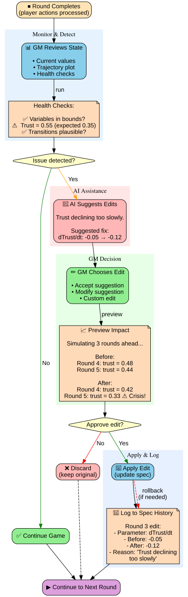

# Runtime Dynamics and Spec Tweaking

**Core Question**: How does the GM adjust the formal spec during gameplay to keep the scenario stable and meaningful?

---

## GM Control Panel Workflow



*Figure: Complete workflow for runtime spec adjustment with AI assistance*

---

## Why Runtime Tweaking is Essential

### The Reality of Live Games

**Problem**: No model survives contact with players

**Scenario**:
```
Round 1: GM expects trust to decline slowly
Actual: Players make surprising choice → trust crashes to 0.1 in one round

Round 2: Guard condition (trust < 0.3 → Crisis) triggers
Actual: Now we're in Crisis mode 4 rounds earlier than GM intended

Round 3: Game spirals into Catastrophe
Players: "That felt unfair and abrupt"
```

**Root cause**: GM's initial model had wrong parameters or missing transitions

---

## Types of Runtime Adjustments

### 1. Parameter Tuning

**When**: State variable evolves unexpectedly

**Example**:
```python
# GM's initial spec
dTrust/dt = -0.05 * trust  # (in Race mode)

# Reality: Trust falls too slowly (players notice no consequences)
# Round 3: trust = 0.55 (GM expected 0.35)

# GM adjusts mid-game:
dTrust/dt = -0.12 * trust  # (increased decay rate)
```

**UI**:
```
GM Dashboard:

Warning: Trust is 0.55 but expected 0.35 based on trajectory

Suggested adjustments:
  [Slider] Trust decay rate: -0.05 → -0.12
  [Preview] "This will bring trust to 0.40 by Round 5"

[Apply] [Cancel]
```

---

### 2. Guard Threshold Adjustment

**When**: Transition triggers too early/late

**Example**:
```python
# Initial spec
Guard: compute >= 27.5 → Catastrophe

# Reality: Compute hits 27.5 in Round 4, game would end
# GM: "Too early! I wanted 6-8 rounds"

# Adjust:
Guard: compute >= 28.2 → Catastrophe
```

**UI**:
```
GM Dashboard:

Alert: Catastrophe transition will trigger next round (compute = 27.4)

Options:
  ○ Let it happen (game ends early)
  ● Delay threshold
      New threshold: [27.5] → [28.2]
  ○ Add additional condition (AND alignment < 0.4)

[Apply]
```

---

### 3. Adding Emergency Transitions

**When**: Players discover a path GM didn't anticipate

**Example**:
```
Players: "We'll leak the dangerous model weights to force a global pause"

GM's model: No transition for "leak_weights" action

GM adds on-the-fly:
  New mode: "Leak Crisis"
  New transition: Current mode → Leak Crisis (if player_leaks_weights)
  New guard: leak_crisis → Emergency Pause (if international_coordination)
```

**UI**:
```
GM Dashboard:

Player action detected: "Leak model weights"
This action is not in the formal model.

Options:
  ○ Ignore (LLM handles narratively, no formal effect)
  ● Add new transition
      From: [Race]
      To: [New Mode: Leak Crisis]
      Guard: [player_leaks_weights]

[Add Mode] [Skip]
```

---

### 4. Tweaking Mode Dynamics

**When**: Mode behavior doesn't match intent

**Example**:
```python
# Slowdown mode
# GM intended: "Alignment research accelerates"
# Actual: Alignment only grows 0.05 per round → too slow

# Before:
dAlignment/dt = 0.3 * (1 - alignment)

# After (GM tweaks):
dAlignment/dt = 0.5 * (1 - alignment)  # Faster progress
```

---

## Design Principles for Runtime Tweaking

### 1. Version Control (Track All Edits)

**Every change is logged**:
```python
@dataclass
class SpecEdit:
    timestamp: datetime
    round_number: int
    edit_type: Literal["param_tune", "guard_adjust", "new_transition", "mode_dynamics"]
    before: str  # JSON of old value
    after: str   # JSON of new value
    reason: str  # GM's explanation

spec_history: List[SpecEdit] = []

def apply_edit(edit: SpecEdit):
    spec_history.append(edit)
    # Apply change to active spec
    active_spec.update(edit)
```

**Benefits**:
- Can rollback if needed
- Post-game analysis: "GM made 7 edits, mostly to trust decay rate"
- Transparency: Players can see what was changed (optional)

---

### 2. Impact Preview

**Before applying change, show consequences**:

```python
def preview_change(
    current_spec: HybridAutomatonSpec,
    proposed_edit: SpecEdit,
    current_state: State
) -> ChangePreview:
    """
    Simulate next 3 rounds with proposed change
    """
    # Clone spec with proposed edit
    spec_with_edit = apply_edit_to_spec(current_spec, proposed_edit)

    # Run short simulation
    trajectory_before = matrix.simulate(current_spec, current_state, rounds=3)
    trajectory_after = matrix.simulate(spec_with_edit, current_state, rounds=3)

    return ChangePreview(
        before=trajectory_before,
        after=trajectory_after,
        affected_transitions=find_affected_transitions(proposed_edit),
        warning_flags=check_for_issues(trajectory_after)
    )
```

**UI**:
```
Preview of Change: "Trust decay rate -0.05 → -0.12"

Before:
  Round 4: trust = 0.48
  Round 5: trust = 0.44
  Round 6: trust = 0.41

After:
  Round 4: trust = 0.42
  Round 5: trust = 0.33  ← Will trigger Crisis transition!
  Round 6: trust = 0.26

⚠️  Warning: This change will trigger "Race → Crisis" transition in Round 5

[Still Apply] [Cancel]
```

---

### 3. Limit Retroactive Changes

**Principle**: Can't change what already happened

**Rule**:
```python
def validate_edit(edit: SpecEdit, current_round: int) -> bool:
    """
    Edits can only affect future, not past
    """
    if edit.affects_past_rounds:
        return False  # Reject
    return True
```

**Example**:
```
Round 5:
  ❌ Cannot change "Round 2 should have transitioned to Crisis" (past)
  ✅ Can change "Crisis threshold for future rounds" (forward-looking)
```

---

### 4. Magnitude Limits

**Prevent drastic changes**:

```python
def check_edit_magnitude(edit: SpecEdit) -> ValidationResult:
    """
    Warn if change is >50% from original value
    """
    if edit.type == "param_tune":
        before_val = float(edit.before)
        after_val = float(edit.after)
        change_pct = abs(after_val - before_val) / before_val

        if change_pct > 0.5:
            return ValidationResult(
                warning=True,
                message=f"Large change ({change_pct:.0%}). Are you sure?"
            )

    return ValidationResult(warning=False)
```

**UI**:
```
⚠️  Warning: You're changing trust decay rate by 140% (-0.05 → -0.12)

This is a large adjustment. Consider:
  - Is the model fundamentally wrong?
  - Should you reset the scenario?

[Yes, Apply Anyway] [Reconsider]
```

---

## GM Intervention Patterns

### Pattern 1: Reactive Stabilization

**Trigger**: State goes out of expected bounds

**Example**:
```
Round 3: Compute = 29.0 (way higher than expected 27.0)
GM: "This will end the game too fast"
Action: Increase ASI threshold from 27.5 → 29.5
```

**Best Practice**: Preview to ensure it doesn't create other issues

---

### Pattern 2: Proactive Path Correction

**Trigger**: GM sees trajectory heading toward uninteresting outcome

**Example**:
```
Round 4: P(Catastrophe) = 0.95 (almost certain)
GM: "Players will just give up, no drama"
Action: Add new transition "Last-Ditch Coordination Attempt" with P=0.3
```

**Best Practice**: Add options, don't remove risk entirely

---

### Pattern 3: Narrative Consistency Fix

**Trigger**: Formal state contradicts narrative

**Example**:
```
Round 2 narrative: "China has committed to the pause"
Round 3: Formal model has China defecting (probabilistic guard fired)

GM: "This contradicts the narrative I just established"
Action: Override guard for this round, manually set "China cooperates"
```

**Best Practice**: Use sparingly, prefer forward-looking edits

---

## Implementation Architecture

### GM Control Panel

```python
class GMControlPanel:
    """
    Live monitoring + editing interface for active games
    """

    def __init__(self, game_id: str):
        self.game = load_game(game_id)
        self.spec = self.game.formal_spec
        self.current_state = self.game.get_current_state()

    def monitor_state(self) -> StateHealth:
        """
        Check if state is within expected bounds
        """
        health_checks = [
            check_variable_bounds(self.current_state, self.spec),
            check_transition_timing(self.game.round, self.spec),
            check_trajectory_plausibility(self.game.history)
        ]
        return aggregate_health(health_checks)

    def suggest_edits(self) -> List[SuggestedEdit]:
        """
        AI assistant suggests fixes for detected issues
        """
        issues = self.monitor_state().issues

        suggestions = []
        for issue in issues:
            if issue.type == "variable_out_of_bounds":
                suggestions.append(suggest_parameter_adjustment(issue))
            elif issue.type == "premature_transition":
                suggestions.append(suggest_guard_adjustment(issue))

        return suggestions

    def apply_edit(self, edit: SpecEdit):
        """
        Apply edit with validation and preview
        """
        # Validate
        if not validate_edit(edit, self.game.round):
            raise ValueError("Invalid edit (affects past)")

        # Preview
        preview = preview_change(self.spec, edit, self.current_state)
        log_preview(preview)

        # Apply
        self.spec.update(edit)
        self.game.spec_history.append(edit)
        save_spec(self.spec)

    def rollback_edit(self, edit_id: str):
        """
        Undo a previous edit
        """
        edit = self.game.spec_history.get(edit_id)
        inverse_edit = create_inverse_edit(edit)
        self.apply_edit(inverse_edit)
```

### Edit Workflow

```
┌───────────────────────┐
│ Round Completes       │
│ (player actions done) │
└──────────┬────────────┘
           │
           ↓
┌───────────────────────┐
│ GM Reviews State      │
│ - Current values      │
│ - Trajectory plot     │
│ - Health checks       │
└──────────┬────────────┘
           │
           ↓
     ╔═════════════╗
     ║ Issue found?║
     ╚═════════════╝
           │
     Yes   │   No
    ┌──────┴──────┐
    ↓             ↓
┌───────────┐ ┌──────────┐
│ Suggest   │ │ Continue │
│ Edits     │ │ Game     │
└──────┬────┘ └──────────┘
       │
       ↓
┌───────────────────────┐
│ GM Chooses Edit       │
│ (or enters custom)    │
└──────────┬────────────┘
           │
           ↓
┌───────────────────────┐
│ Preview Impact        │
│ (simulate 3 rounds)   │
└──────────┬────────────┘
           │
           ↓
     ╔═════════════╗
     ║ Approve?    ║
     ╚═════════════╝
           │
     Yes   │   No
    ┌──────┴──────┐
    ↓             ↓
┌───────────┐ ┌──────────┐
│ Apply     │ │ Discard  │
│ Edit      │ │          │
└──────┬────┘ └──────────┘
       │
       ↓
┌───────────────────────┐
│ Log to Spec History   │
└──────────┬────────────┘
           │
           ↓
┌───────────────────────┐
│ Continue to Next Rd   │
└───────────────────────┘
```

---

## Player Transparency Options

**Spectrum of visibility**:

### Option 1: Invisible (Default)
- Players never see spec edits
- Narrative smooths over changes
- Pro: Maintains immersion
- Con: Players might feel railroaded

### Option 2: Notification Only
```
System message: "The Game Master has adjusted scenario parameters."
```
- Pro: Players know something changed, but not details
- Con: Might break trust ("are you making this up as we go?")

### Option 3: Full Transparency
```
GM Edit Log (visible to players):

Round 3:
  - Trust decay rate: -0.05 → -0.08 (faster erosion)
  - Reason: "Trust was declining too slowly to match narrative"

Round 5:
  - Added transition: Crisis → Last-Ditch Summit
  - Reason: "Give players one more chance to coordinate"
```
- Pro: Total honesty, players understand the design process
- Con: Ruins "reality" illusion

**Recommendation**: Option 2 by default, Option 3 for research/educational games

---

## Open Questions

### Q1: How much tweaking is too much?

**Metrics**:
- \# of edits per round?
- % of parameters changed?
- Magnitude of changes?

**Proposed threshold**: >3 edits per round = model is fundamentally wrong, should restart

---

### Q2: Should spec edits be automatic or manual?

**Automatic** (AI suggests + auto-applies):
```
System detects: "Trust is 0.55, expected 0.35"
System automatically adjusts: dTrust/dt = -0.05 → -0.09
GM sees notification, can undo
```

**Manual** (GM must approve):
```
System detects: "Trust is 0.55, expected 0.35"
System suggests: "Increase decay rate to -0.09?"
GM clicks [Apply] or [Ignore]
```

**Proposed**: Manual for beta, automatic (with undo) for v2

---

### Q3: Can players request spec changes?

**Scenario**:
```
Player: "This feels unfair. We tried to coordinate but the model made China defect."

GM: "That was a probabilistic transition. Do you want me to adjust it?"

Player: "Yes, please make coordination more likely."

GM: [Increases P(cooperation) from 0.3 → 0.5]
```

**Trade-off**: More player agency vs. less realism

**Proposed**: GM's choice (configurable setting)

---

## Testing and Validation

### Unit Tests for Edits

```python
def test_parameter_edit():
    spec = load_test_spec()
    state = State(trust=0.5, compute=27.0)

    edit = SpecEdit(
        type="param_tune",
        parameter="dTrust_dt",
        before=-0.05,
        after=-0.10
    )

    preview = preview_change(spec, edit, state)

    # After edit, trust should decline faster
    assert preview.after[0].trust < preview.before[0].trust

def test_guard_edit():
    spec = load_test_spec()
    state = State(trust=0.35, compute=27.0)

    # Original: transition at trust < 0.3
    assert not spec.check_guard("Race → Crisis", state)

    # Edit: transition at trust < 0.4
    edit = SpecEdit(
        type="guard_adjust",
        transition="Race → Crisis",
        guard="trust < 0.4"
    )
    spec.apply_edit(edit)

    # Now transition should fire
    assert spec.check_guard("Race → Crisis", state)
```

### Integration Tests

```python
def test_full_game_with_edits():
    game = create_test_game()

    # Play rounds 1-3 normally
    for round in range(1, 4):
        game.advance_round()

    # Round 4: GM intervenes
    state = game.get_current_state()
    assert state.trust == 0.55  # Higher than expected

    # GM adjusts trust decay
    edit = SpecEdit(type="param_tune", parameter="dTrust_dt", after=-0.12)
    game.gm_panel.apply_edit(edit)

    # Continue game
    game.advance_round()  # Round 4

    # Trust should now decline faster
    new_state = game.get_current_state()
    assert new_state.trust < 0.45  # Corrected trajectory
```

---

## Implementation Checklist

- [ ] Build GM control panel (monitoring dashboard)
- [ ] Implement spec edit types (param, guard, transition, dynamics)
- [ ] Create impact preview system (simulate 3 rounds ahead)
- [ ] Add version control for spec history
- [ ] Build rollback functionality
- [ ] Implement validation (no retroactive changes, magnitude limits)
- [ ] Design player transparency options (invisible/notify/full)
- [ ] Create AI suggestion system (auto-detect issues, propose fixes)
- [ ] Add unit tests for edit operations
- [ ] Test with live games (measure edit frequency, effectiveness)
