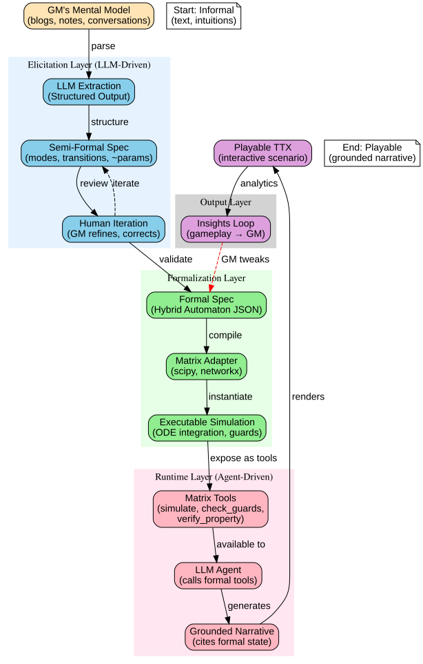

# Architecture Questions & Design Decisions

**Purpose**: Document key architectural questions, design decisions, and research challenges for Simulacra's LLM-driven formal modeling system.

**Context**: These questions emerged from discussions about how to bridge the gap between informal mental models (GM's intuitions) and formal executable specifications (Matrix simulations).

---

## Overview

Simulacra's core innovation is using **LLMs as an interface layer** between:
- **GMs** (who have informal mental models in blogs/notes)
- **Formal methods** (hybrid automata, model checking, simulation)
- **Players** (who experience the scenario as an interactive narrative)

```
GM's Mental Model
    ↓ (LLM extraction + structured output)
Semi-Formal Spec
    ↓ (Human iteration + calibration)
Formal Spec (Hybrid Automaton)
    ↓ (Matrix adapter)
Executable Simulation
    ↓ (LLM narrative generation + formal state)
Playable TTX
```

**Key questions**: Does this actually work? Where does it break? How do we make it reliable?

### Visual Overview



*Figure 1: Complete pipeline from GM's informal mental model to playable TTX*

---

## Visual Diagrams

We've created detailed diagrams to visualize key architectural concepts:

1. **[Overall Pipeline](diagrams/01_overall_pipeline.svg)** - End-to-end flow from informal to executable
2. **[Agent Architecture](diagrams/02_agent_architecture.svg)** - How LLM agents use Matrix tools
3. **[Multi-Agent Verification](diagrams/03_multi_agent_verification.svg)** - Storyteller → Fact-Checker → Editor pipeline
4. **[GM Control Panel](diagrams/04_gm_control_panel.svg)** - Runtime spec adjustment workflow
5. **[Progressive Formalization](diagrams/05_progressive_formalization.svg)** - 6-level formalization ladder
6. **[Multi-View System](diagrams/06_multi_view_system.svg)** - Same backend, multiple presentations

All diagrams are in SVG format (vector graphics, fully zoomable) and can be found in the [`diagrams/`](diagrams/) folder.

---

## Document Map

### [01_llm_elicitation_strategy.md](01_llm_elicitation_strategy.md)
**Focus**: How to extract formal specs from informal text

**Key topics**:
- Progressive refinement (multi-pass extraction)
- Structured output enforcement (Pydantic/Zod schemas)
- Uncertainty tracking (`[LLM_INFERRED]` tags)
- Interactive calibration wizards
- Validation workflows

**Open questions**:
- Q1: How to handle conflicting information in GM's documents?
- Q2: How to validate LLM extraction quality?
- Q3: How much GM time does this save vs manual modeling?
- Q4: How to incorporate tacit knowledge not in documents?

---

### [02_grounding_validation.md](02_grounding_validation.md)
**Focus**: Keeping LLM narratives consistent with formal state

**Key topics**:
- State-conditioned prompting
- Constraint enforcement (hard rules LLMs can't violate)
- Multi-agent verification (Storyteller → Fact-Checker → Editor)
- Retrieval-augmented generation from formal state
- Optional validation against reality (backtesting, expert forecasts)

**Open questions**:
- Q1: How much grounding is enough? (5 levels: none → full visibility)
- Q2: What if players want actions not in the formal model?
- Q3: How to ensure LLM explains the right stochastic outcome?

**MedhAI Note**: This is where we address "theory vs data" - GMs can optionally validate, but we don't require it. We provide tools (backtesting, sensitivity analysis) for those who want rigor.

---

### [03_runtime_dynamics.md](03_runtime_dynamics.md)
**Focus**: How GMs adjust specs during gameplay to keep scenarios stable

**Key topics**:
- Why runtime tweaking is essential (no model survives contact with players)
- Types of adjustments (parameter tuning, guard thresholds, emergency transitions)
- Design principles (version control, impact preview, magnitude limits)
- GM intervention patterns (reactive stabilization, proactive correction)
- Player transparency options (invisible, notify, full disclosure)

**Open questions**:
- Q1: How much tweaking is too much? (>3 edits/round = model broken?)
- Q2: Should tweaks be automatic or manual?
- Q3: Can players request spec changes?

**Implementation**: GM control panel with live monitoring, suggested edits, and preview-before-apply

---

### [04_agent_architecture.md](04_agent_architecture.md)
**Focus**: How LLM agents use Matrix formal methods as tools

**Key topics**:
- Agent types (Consequence, Elicitation, Analysis, Fact-Checker)
- Tool implementations (simulate, check_guards, verify_property, monte_carlo)
- Agent workflows (multi-step reasoning with tool calls)
- Grounding mechanisms (agent must call formal tools before generating narrative)
- Prompting strategies (system prompts, tool use encouragement)

**Example workflow**:
```
Player action: "Implement pause"
  ↓
Agent: "Let me simulate what happens"
  → matrix.simulate(mode="Pause", duration=6)
  ↓
Agent: "Let me check for dangerous transitions"
  → matrix.check_guards(state)
  ↓
Agent: "Trust is below threshold, 60% chance of breakdown"
  → Generates narrative grounded in formal results
```

**Note**: File was cut off during creation - needs completion of prompting strategies section

---

### [05_open_questions.md](05_open_questions.md)
**Focus**: Research questions requiring empirical testing

**Categories**:
1. **LLM Elicitation Quality** (Q1.1-Q1.3)
   - How accurate is extraction?
   - Where do LLMs fail?
   - How much time does it save?

2. **Grounding Effectiveness** (Q2.1-Q2.3)
   - Do players notice inconsistencies?
   - Does grounding improve trust?
   - How often do agents call tools?

3. **Runtime Dynamics** (Q3.1-Q3.3)
   - How often do specs need tweaking?
   - Do tweaks break player experience?
   - Can we predict when tweaks are needed?

4. **Formalism Selection** (Q4.1-Q4.2)
   - When is hybrid automaton overkill?
   - Do different formalisms give different outcomes?

5. **Computational Performance** (Q5.1-Q5.3)
   - Can we run Matrix calls in real-time?
   - How much can we pre-compute?
   - Can we compile to WebAssembly?

6. **Multi-Agent Coordination** (Q6.1-Q6.2)
   - How to prevent agent loops?
   - Single agent vs multi-agent pipeline?

7. **Scenario Library** (Q7.1-Q7.2)
   - How many scenarios to validate system?
   - Can GMs remix/fork scenarios?

8. **Validation & Calibration** (Q8.1-Q8.3)
   - How to validate "reasonable" parameters?
   - Can we calibrate to expert forecasts?
   - How to handle deep uncertainty?

9. **Player Experience** (Q9.1-Q9.3)
   - Do players learn from formal models?
   - Do they want control over specs?
   - How to explain formal notation?

10. **Long-Term Vision** (Q10.1-Q10.3)
    - General scenario exploration platform?
    - Real-time data integration?
    - Multiplayer collaborative model-building?

**Prioritization**:
- Must-answer for beta: 5 questions (Q1.1, Q2.2, Q3.1, Q5.1, Q9.2)
- Should-answer for v1.0: 5 questions
- Nice-to-answer for v2.0+: 5 questions

---

## Key Architectural Insights

### 1. LLMs as Interface, Not Replacement
**Principle**: LLMs don't replace formal methods—they make them accessible

**Anti-pattern**: "Let GPT-4 simulate everything"
**Simulacra approach**: "Let GPT-4 call scipy to simulate, then narrate results"

**Why this works**:
- Formal methods provide consistency, rigor, verification
- LLMs provide natural language I/O, world knowledge, narrative generation
- Each does what it's good at

---

### 2. Progressive Formalization
**Principle**: Start informal, gradually increase formality

**Ladder**:
```
1. GM blog post (pure text)
2. Extracted structure (modes, transitions)
3. Quantified parameters (thresholds, rates)
4. Validated spec (consistency checks)
5. Tested spec (quick simulation)
6. Calibrated spec (optional: fit to data)
```

**Benefit**: GM can stop at any level (doesn't need full rigor)

---

### 3. Formal State as Source of Truth
**Principle**: Narrative is presentation layer, formal state is reality

**Implementation**:
```python
# Wrong
def generate_consequence(player_actions):
    return llm.generate(f"What happens if {player_actions}?")

# Right
def generate_consequence(player_actions):
    new_state = matrix.step(current_state, player_actions)
    narrative = llm.generate(f"Explain this state change: {current_state} → {new_state}")
    return narrative
```

**Enforcement**: Fact-checker agent validates narrative matches formal state

---

### 4. Dynamic Specs (Not Static)
**Principle**: Specs evolve during gameplay based on GM feedback

**Why**: No model survives contact with reality

**How**:
- GM control panel monitors state health
- AI suggests adjustments when anomalies detected
- GM previews impact before applying
- All edits are versioned and logged

---

### 5. Multi-Level Grounding
**Principle**: Different players need different levels of formalism visibility

**Levels**:
- **Level 0**: Pure narrative (formal state hidden) - Casual players
- **Level 3**: Narrative cites key numbers - Default
- **Level 5**: Full formal dashboard - Analysts, researchers

**Implementation**: Configurable per-player or per-scenario

---

## Relationship to Other Research Docs

### How this connects to `research/`

**This folder** (`architecture_questions/`):
- Focuses on **implementation** questions
- How to make LLM + formal methods work in practice
- Empirical questions requiring prototyping

**`research/ai_futures/`**:
- Formal modeling **theory** (LTS, Kripke, MDP, Hybrid Automata)
- Mathematical foundations
- Tool survey (Uppaal, SpaceEx, PRISM)

**`research/matrix/`**:
- Backend **simulation engine** design
- Adapter interfaces
- View system

**`research/simulacra_integration/`**:
- How to integrate formal models into TTX game
- Evaluation framework
- Comparison matrix (SD vs ABM vs HA)

**`research/mentor_feedback/`**:
- MedhAI's critique of theory/data imbalance
- Physicist's perspective on validation
- Emphasis on experiments over theory

---

## MedhAI's Perspective (Updated)

**Initial critique**: "You have 255,000 lines of theory, 2,100 lines of code, 0 lines of data analysis - theory/data ratio is broken"

**After understanding architecture**: "OH! You're not claiming AI2027 is scientifically validated. You're building tools to help GMs formalize their scenarios. The validation is THEIR job, not yours."

**Revised assessment**:
- **Architecture**: A- (LLM + Matrix + Agents is sound)
- **Missing pieces**: Elicitation tooling, compilation pipeline, analytics loop
- **Recommendation**: Focus on engineering the meta-engine, not validating specific scenarios

**Key insight**: Simulacra is **lab equipment**, not a scientific claim. You're building the microscope, not publishing the biology paper.

**Remaining challenge**: Can you actually compile Kokotajlo's blog → playable TTX in hours instead of weeks? That's the engineering mountain to climb.

---

## What to Build Next

Based on these architectural questions, here's the critical path:

### Phase 1: Proof of Concept (4-6 weeks)
1. **LLM Elicitation**
   - Build extraction agent with structured output (Instructor/Pydantic)
   - Test on Kokotajlo's AI2027 blog posts
   - Measure: extraction accuracy, GM approval rate

2. **Agent + Matrix Integration**
   - Implement Matrix tools (simulate, check_guards, verify_property)
   - Build consequence agent that calls tools
   - Test: does narrative cite formal state?

3. **Basic Runtime Tweaking**
   - GM control panel (monitor state, suggest edits)
   - Parameter adjustment UI with preview
   - Test: does it catch spec errors?

**Success metric**: Can we take a GM's blog post → formal spec → playable TTX in <1 day?

---

### Phase 2: Validation (6-8 weeks)
4. **Answer Priority Questions**
   - Q1.1: LLM extraction accuracy (test with 5 GMs)
   - Q2.2: Does grounding improve trust? (A/B test with players)
   - Q3.1: How often do specs need tweaking? (20 game sessions)
   - Q5.1: Real-time performance (benchmark + optimize)

5. **Scenario Library**
   - Build 3-5 scenarios across domains
   - Test: does system generalize?

---

### Phase 3: Polish (8-10 weeks)
6. **Multi-Agent Pipeline**
   - Build Storyteller → Fact-Checker → Editor flow
   - Measure: does it improve consistency?

7. **Calibration Tools**
   - Parameter wizard (sliders with interpretable units)
   - Sensitivity analysis UI
   - Optional: backtesting against data

8. **Player Experience**
   - Configurable grounding levels (0-5)
   - Formal state dashboard ("analyst mode")
   - Tutorial/onboarding

---

## How to Use This Folder

**For developers**:
- Read documents in order (01 → 05) to understand full architecture
- Reference specific sections when implementing features
- Update documents as we answer questions empirically

**For researchers**:
- Start with 05_open_questions.md to see research agenda
- Pick questions to investigate
- Document findings in corresponding doc (e.g., Q1.1 findings → update 01_llm_elicitation_strategy.md)

**For GMs/users**:
- Read 01_llm_elicitation_strategy.md to understand how your scenarios will be extracted
- Read 03_runtime_dynamics.md to see how you can adjust specs during gameplay
- Read 02_grounding_validation.md if you want to understand how narrative stays consistent

---

## Living Documents

These documents should evolve as we:
1. **Build prototypes** → Update with implementation details
2. **Run experiments** → Update with empirical findings
3. **Get user feedback** → Update with real-world observations
4. **Make design decisions** → Document rationale and alternatives considered

**Version control**: All major revisions should be committed with clear messages explaining what changed and why.

---

## Related Resources

**Internal**:
- [research/ai_futures/README.md](../ai_futures/README.md) - Formal modeling theory
- [research/matrix/README.md](../matrix/README.md) - Simulation engine design
- [research/mentor_feedback/FINAL_ASSESSMENT.md](../mentor_feedback/FINAL_ASSESSMENT.md) - MedhAI's critique

**External**:
- Instructor library: https://github.com/jxnl/instructor (structured LLM outputs)
- LangChain agents: https://python.langchain.com/docs/modules/agents/
- PRISM model checker: https://www.prismmodelchecker.org/
- Epoch AI (compute data): https://epochai.org/

---

**Status**: Initial draft (2025-11-23)
**Last updated**: 2025-11-23
**Contributors**: Claude (assistant), MedhAI (architecture discussions)
**Next review**: After Phase 1 POC completion
