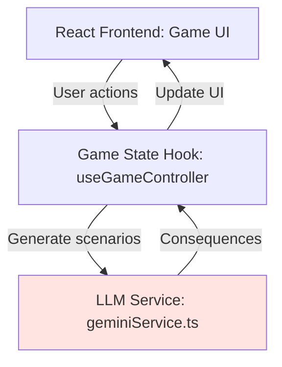
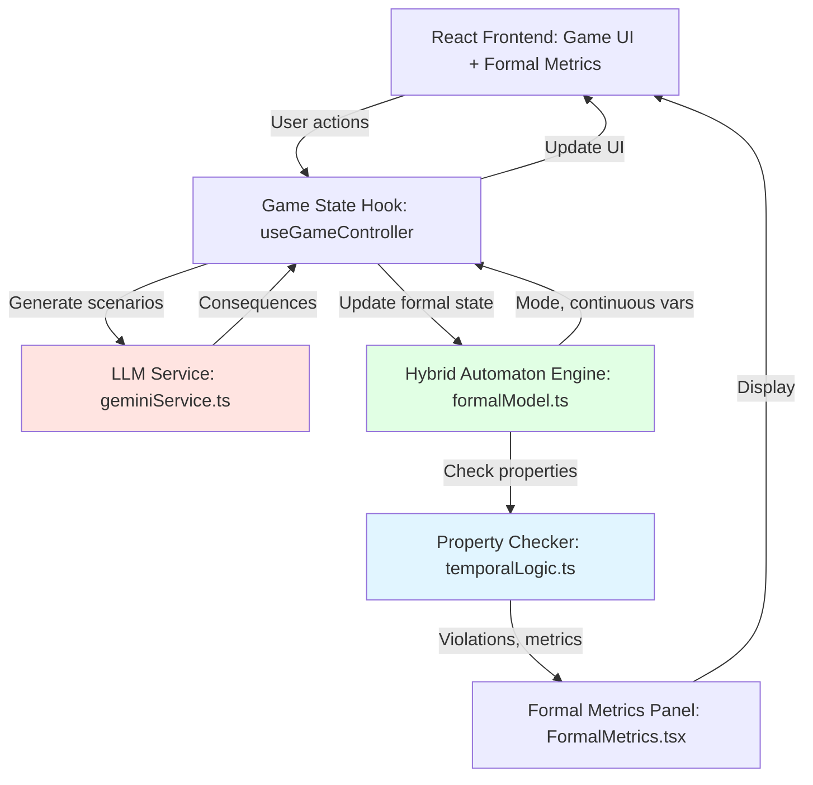

# Architecture: Formal Methods Integration

**How to add the formal layer to Simulacra's existing stack**

---

## Current Simulacra Stack

### Component Diagram



### Current Flow

1. **Player submits actions** → `useGameController`
2. **Generate LLM prompts** → `geminiService.ts`
3. **LLM returns consequences** → Parse and update `gameState`
4. **Re-render UI** → Show narrative + updated scores

**Files involved**:
- `src/hooks/useGameController.ts` - Central game state
- `src/services/geminiService.ts` - LLM API calls
- `src/types.ts` - Type definitions
- `src/screens/GameScreen.tsx` - Main UI

---

## Enhanced Stack with Formal Layer

### Component Diagram



### Enhanced Flow

1. **Player submits actions** → `useGameController`
2. **Update formal state** → `formalModel.updateState(actions)`
3. **Detect mode transitions** → `formalModel.detectTransition()`
4. **Check properties** → `temporalLogic.checkProperties()`
5. **Generate LLM prompts** (with formal guidance) → `geminiService.ts`
6. **LLM returns consequences** → Parse and update both narrative + formal state
7. **Re-render UI** → Narrative + formal metrics + property status

**New files**:
- `src/services/formalModel.ts` - Hybrid automaton engine
- `src/services/temporalLogic.ts` - Property checker
- `src/components/game/FormalMetrics.tsx` - Metrics panel
- `src/types/formal.ts` - Formal state types

---

## Integration Patterns

### Pattern 1: Parallel Tracking (Level 1-2)

**LLM and formal model run independently**:

```typescript
// In useGameController.ts
async function handleActionsSubmit(actions: PlayerAction[]) {
  // 1. Update formal state (synchronous, fast)
  const newFormalState = updateFormalState(
    gameState.formalState,
    actions
  );

  // 2. Generate LLM consequences (async, slow)
  const consequences = await generateConsequences(
    gameState,
    actions
  );

  // 3. Merge results
  setGameState({
    ...gameState,
    formalState: newFormalState,
    eventLog: [...gameState.eventLog, consequences]
  });
}
```

**Pros**: Simple, no coupling
**Cons**: LLM might diverge from formal model

---

### Pattern 2: Guided Generation (Level 3)

**Formal analysis informs LLM prompts**:

```typescript
async function handleActionsSubmit(actions: PlayerAction[]) {
  // 1. Update formal state
  const newFormalState = updateFormalState(
    gameState.formalState,
    actions
  );

  // 2. Check properties
  const propertyResults = checkProperties(
    gameState.eventLog,
    newFormalState
  );

  // 3. Build enhanced prompt
  const formalGuidance = generateFormalGuidance(
    newFormalState,
    propertyResults
  );

  // 4. Generate LLM consequences (with guidance)
  const consequences = await generateConsequences(
    gameState,
    actions,
    formalGuidance  // ← Inject formal analysis
  );

  // 5. Update state
  setGameState({ ...gameState, formalState: newFormalState });
}
```

**Pros**: Consistency between narrative and formal model
**Cons**: More complex prompts

---

### Pattern 3: Validation Loop (Level 3-4)

**LLM output validated, regenerate if inconsistent**:

```typescript
async function handleActionsSubmit(actions: PlayerAction[]) {
  let attempts = 0;
  const maxAttempts = 3;

  while (attempts < maxAttempts) {
    // Generate consequences
    const consequences = await generateConsequences(
      gameState,
      actions
    );

    // Parse implied formal state changes
    const impliedChanges = parseFormalChanges(consequences);
    const projectedState = applyChanges(
      gameState.formalState,
      impliedChanges
    );

    // Validate against hard constraints
    const violations = checkHardConstraints(projectedState);

    if (violations.length === 0) {
      // Valid! Use it
      return updateGameState(consequences, projectedState);
    }

    // Try again with violation feedback
    attempts++;
  }

  // Fallback: Use deterministic formal model
  return useDeterministicConsequences(gameState, actions);
}
```

**Pros**: Guarantees consistency
**Cons**: Multiple LLM calls, slower

---

## Data Flow

### Level 1: State Tracking

```
User Action
    ↓
Update Variables (compute +=, alignment +=, trust +=)
    ↓
Calculate Risk Score (heuristic)
    ↓
Display Metrics
```

**Data added to GameState**:
```typescript
interface GameState {
  // ... existing fields
  formalState: {
    compute: number;
    alignment: number;
    trust: number;
    security: number;
    riskScore: number;
  }
}
```

---

### Level 2: Mode Detection

```
User Action
    ↓
Update Variables
    ↓
Check Guard Conditions (if trust < 0.4 → regulation_window)
    ↓
Transition Mode (if guard fires)
    ↓
Apply Mode-Specific Parameters
    ↓
Display Mode + Metrics
```

**Data added**:
```typescript
interface FormalState {
  // ... from Level 1
  mode: GovernanceMode;
  roundsInMode: number;
  evidenceCount: number;
}
```

---

### Level 3: Property Checking

```
User Action
    ↓
Update Variables + Mode
    ↓
Check Temporal Logic Properties
    ↓
Detect Violations
    ↓
Generate Warnings
    ↓
Display Mode + Metrics + Property Status
```

**Data added**:
```typescript
interface GameState {
  // ... existing
  formalState: FormalState;
  propertyResults: PropertyCheckResult[];
}

interface PropertyCheckResult {
  property: Property;
  satisfied: boolean;
  message: string;
}
```

---

### Level 4: Probabilistic Analysis

```
User Action
    ↓
Update Variables + Mode + Properties
    ↓
Abstract to MDP State
    ↓
Compute Probabilities (P(catastrophe), P(success))
    ↓
Compute Optimal Policy
    ↓
Display Full Analysis + Counterfactuals
```

**Data added**:
```typescript
interface FormalState {
  // ... from Level 3
  mdpState: MDPState;
  pCatastrophe: number;
  pSuccess: number;
  optimalAction: string;
}
```

---

## File Organization

### Recommended Structure

```
src/
├── services/
│   ├── geminiService.ts         # (existing) LLM calls
│   ├── formalModel.ts           # (new) Hybrid automaton engine
│   ├── temporalLogic.ts         # (new) Property checker
│   └── mdpAnalysis.ts           # (new) Level 4 - probabilistic analysis
│
├── types/
│   ├── index.ts                 # (existing) Game types
│   └── formal.ts                # (new) Formal state types
│
├── components/game/
│   ├── GameStatusPanel.tsx      # (existing) Scores, timers
│   ├── FormalMetrics.tsx        # (new) Level 1 - metrics panel
│   ├── ModeIndicator.tsx        # (new) Level 2 - mode display
│   ├── PropertyMonitor.tsx      # (new) Level 3 - property status
│   └── RiskAnalysis.tsx         # (new) Level 4 - full analysis modal
│
└── hooks/
    └── useGameController.ts     # (modified) Add formal state management
```

---

## State Management

### Current State (useGameController)

```typescript
const [gameState, setGameState] = useState<GameState>({
  phase: GamePhase.LOBBY,
  round: 0,
  coreMetric: 100,
  currentEvent: null,
  eventLog: [],
  players: []
});
```

### Enhanced State (with formal layer)

```typescript
const [gameState, setGameState] = useState<GameState>({
  // ... existing fields
  formalState: {
    // Level 1
    compute: 26.0,
    alignment: 0.15,
    trust: 0.70,
    security: 0.50,
    riskScore: 2.1,

    // Level 2
    mode: GovernanceMode.BASELINE,
    roundsInMode: 0,
    evidenceCount: 0,

    // Level 3
    propertyViolations: [],

    // Level 4
    pCatastrophe: 0.05,
    pSuccess: 0.65
  }
});
```

---

## API Design

### formalModel.ts

```typescript
// Level 1: Update continuous variables
export function updateFormalState(
  currentState: FormalState,
  actions: PlayerAction[]
): FormalState;

// Level 2: Detect mode transitions
export function detectModeTransition(
  currentMode: GovernanceMode,
  state: FormalState,
  actions: PlayerAction[]
): GovernanceMode;

// Level 2: Get mode-specific parameters
export function getModeParameters(
  mode: GovernanceMode
): ModeParameters;
```

### temporalLogic.ts

```typescript
// Level 3: Check all properties
export function checkProperties(
  trace: GameLogEntry[],
  currentState: FormalState
): PropertyCheckResult[];

// Level 3: Check single property
export function checkProperty(
  property: Property,
  trace: GameLogEntry[],
  currentState: FormalState
): boolean;
```

### mdpAnalysis.ts

```typescript
// Level 4: Build MDP from game trace
export function buildMDP(
  gameTraces: GameLogEntry[][]
): MDP;

// Level 4: Compute probabilities
export function computeProbabilities(
  mdp: MDP,
  initialState: MDPState,
  targetStates: MDPState[],
  horizon: number
): number;

// Level 4: Optimal policy
export function computeOptimalPolicy(
  mdp: MDP,
  rewardFunction: (s: MDPState) => number
): Policy;
```

---

## Deployment Considerations

### Client-Side (TypeScript) Approach

**Pros**:
- No backend changes
- Fast (runs in browser)
- Works offline

**Cons**:
- Limited to simpler algorithms
- Can't use external tools (PRISM)

**Best for**: Levels 1-3

---

### Hybrid Approach (Recommended)

**Client-side**:
- Levels 1-2: Always run (fast, lightweight)
- Level 3: Run basic checks

**Server-side** (optional):
- Level 4: On-demand probabilistic analysis
- Python FastAPI service with PRISM integration

**Architecture**:
```
Browser (React)
    ↓
    ├─ Levels 1-3 (TypeScript, instant)
    └─ Level 4 (POST /api/analyze → Python → PRISM)
```

**Best for**: Production deployment with optional power features

---

## Performance Targets

| Level | Operation | Target Time | Acceptable Delay |
|-------|-----------|-------------|------------------|
| 1 | Update variables | < 10ms | Instant |
| 2 | Mode transition | < 50ms | Instant |
| 3 | Check properties | < 100ms | Barely noticeable |
| 4 | MDP analysis | < 2s | User clicks "Analyze" |

**Critical path**: Levels 1-2 must be instant (< 100ms total)
**Acceptable**: Level 3-4 can take 1-2s with loading indicator

---

## Testing Strategy

### Unit Tests
- `formalModel.test.ts`: Variable updates, mode transitions
- `temporalLogic.test.ts`: Property checkers

### Integration Tests
- Full round simulation
- Verify LLM + formal consistency

### Property-Based Tests
- Generate random action sequences
- Ensure invariants hold

---

## Rollout Plan

**Phase 1**: Internal testing
- Levels 1-2 in dev branch
- Test with small group

**Phase 2**: Beta release
- Add Level 3
- Collect feedback on UI

**Phase 3**: Full release
- Polish based on feedback
- Optionally add Level 4

**Phase 4**: Iterate
- Tune parameters based on gameplay data
- Add more properties based on player interest

---

**Next**: [Implementation Levels](levels.md) for detailed code examples
